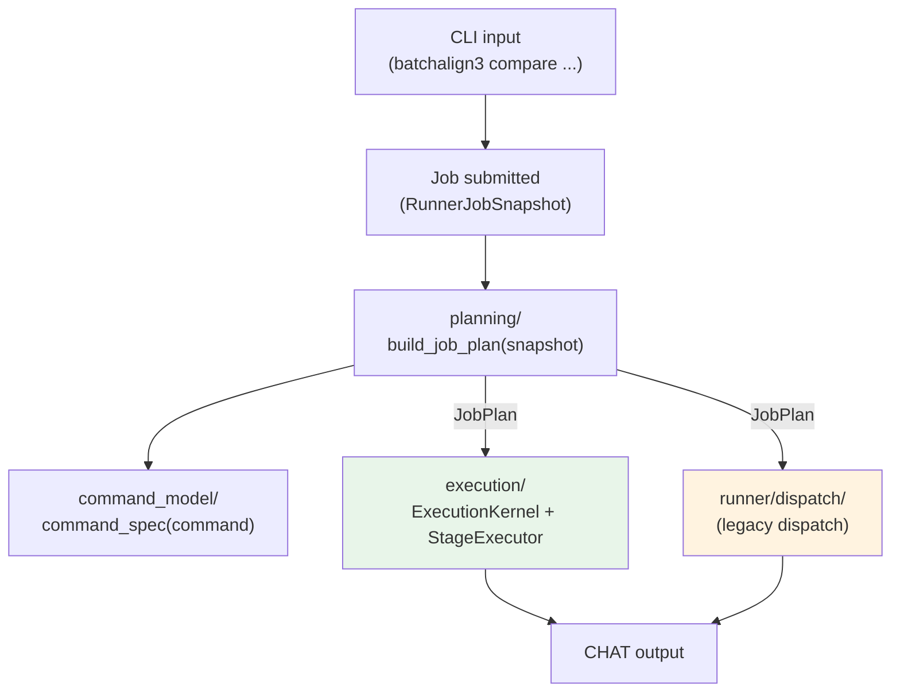

# Command Model, Planning, and Execution Kernel

**Status:** Current
**Last updated:** 2026-04-17 20:00 EDT

Three new modules centralize how commands are defined, planned, and executed.
Together they replace the old pattern where each command wired its own dispatch
function in `runner/dispatch/` with per-command constants scattered across
macro-generated files.

## Architecture overview



**Compare** is the first command migrated to the execution kernel. All other
commands still use legacy dispatch. New multi-stage commands should prefer the
execution model.

## command_model/ — authoritative command registry

**Path:** `crates/batchalign-app/src/command_model/`

Single source of truth for released command metadata. Replaces the old pattern
of per-command macro files (`commands/opensmile.rs`, etc.) that declared
duplicate constants.

### Key API

| Function | Purpose |
|----------|---------|
| `command_spec(ReleasedCommand) -> &CommandSpec` | Look up the authoritative spec for any released command |
| `command_specs() -> Vec<&CommandSpec>` | All specs, in release order |
| `legacy_command_definition(command)` | Derive a `CommandDefinition` for backward compatibility |
| `legacy_command_descriptor(command)` | Derive a `CommandWorkflowDescriptor` for backward compatibility |

### CommandSpec

```rust
pub struct CommandSpec {
    pub command: ReleasedCommand,
    pub family: CommandFamily,        // TextInfer, Audio, MediaAnalysis, Composite
    pub capabilities: CapabilitySpec, // infer_tasks, requires_audio, ...
    // ... execution shape, I/O profile derived from family
}
```

### Derived helpers in catalog.rs

| Helper | Replaces |
|--------|----------|
| `io_profile_for(command)` | Per-command `CommandIoProfile` constants |
| `execution_shape_for(family)` | Per-family dispatch routing |
| `runner_dispatch_kind_for(command)` | Runner dispatch shape selection |

## planning/ — immutable job plans

**Path:** `crates/batchalign-app/src/planning/`

Builds typed, immutable execution plans from runner snapshots. Centralizes
work-unit planning, artifact planning, and I/O mode resolution.

### Key types

| Type | Purpose |
|------|---------|
| `JobPlan` | Immutable plan: `CommandSpec` + `Vec<PlannedWorkUnit>` + `Vec<PlannedArtifactSet>` + `IoMode` |
| `IoMode` | `Paths` (shared filesystem) or `Content` (staged under job directory) |
| `PlannedWorkUnit` | One input file with its resolved paths |
| `PlannedArtifactSet` | Output artifacts for one source file |

### Entry point

```rust
pub fn build_job_plan(snapshot: RunnerJobSnapshot) -> Result<JobPlan, PlanError>
```

Calls `command_model::command_spec()` internally and delegates work-unit
enumeration to `recipe_runner::planner`.

## execution/ — recipe-driven execution kernel

**Path:** `crates/batchalign-app/src/execution/`

Replaces per-command dispatch functions with a pluggable stage executor that
walks recipe stages in order.

### Key traits and types

```rust
/// Container that drives a recipe through its stages.
pub struct ExecutionKernel<E: StageExecutor> { ... }

/// Async interface for executing one recipe stage.
pub trait StageExecutor {
    async fn run_stage(
        &self,
        stage: RecipeStageId,
        state: &mut ExecutionState,
        plan: &JobPlan,
        ctx: &ExecutionContext,
    ) -> Result<(), ExecutionError>;
}

/// Abstracts the worker pool for NLP operations.
pub trait WorkerGateway {
    async fn morphotag(...) -> Result<...>;
    async fn utseg(...) -> Result<...>;
    async fn translate(...) -> Result<...>;
    // ... one method per NLP task
}
```

### Module map

| File | Purpose |
|------|---------|
| `kernel.rs` | `ExecutionKernel` — runs stages, manages state transitions |
| `morphotag/` | Morphotag execution: input prep, window policy, progress, writeback |
| `coref.rs` | Coreference execution stage |
| `translate.rs` | Translation execution stage |
| `utseg.rs` | Utterance segmentation execution stage |
| `simple_batched_text.rs` | Shared batched-text execution for utseg/translate/coref |
| `text_io.rs` | CHAT file read/write for text-based commands |
| `worker_gateway.rs` | `WorkerGateway` trait + live implementation over the worker pool |

### Compare: first migrated command

```rust
// Entry point for Compare via the execution kernel
pub fn dispatch_compare_job(job, plan: JobPlan) -> Result<...> {
    let kernel = ExecutionKernel::new(CompareStageExecutor::new(...));
    kernel.run(plan).await
}
```

`CompareStageExecutor` handles these recipe stages:
1. `PlanWorkUnits` — enumerate input files
2. `ReadChatInputs` — parse main transcripts
3. `ReadReferenceInputs` — resolve and parse `*.gold.cha` companions
4. `Morphosyntax` — morphotag the main transcripts
5. `CompareAlign` — run gold-anchored comparison
6. `MaterializeOutputs` — write output CHAT + CSV

## Migration status

| Command | Dispatch model | Notes |
|---------|---------------|-------|
| Compare | **execution/** kernel | First migration, fully recipe-driven |
| All others | Legacy `runner/dispatch/` | Will migrate incrementally |

New commands with multi-stage workflows (stages that depend on prior stage
output) should use the execution kernel. Simple single-dispatch commands
can continue using legacy dispatch until the migration is complete.

## Sources verified

- `crates/batchalign-app/src/command_model/mod.rs`
- `crates/batchalign-app/src/command_model/catalog.rs`
- `crates/batchalign-app/src/planning/mod.rs`
- `crates/batchalign-app/src/execution/mod.rs`
- `crates/batchalign-app/src/execution/kernel.rs`
- `crates/batchalign-app/src/execution/worker_gateway.rs`
