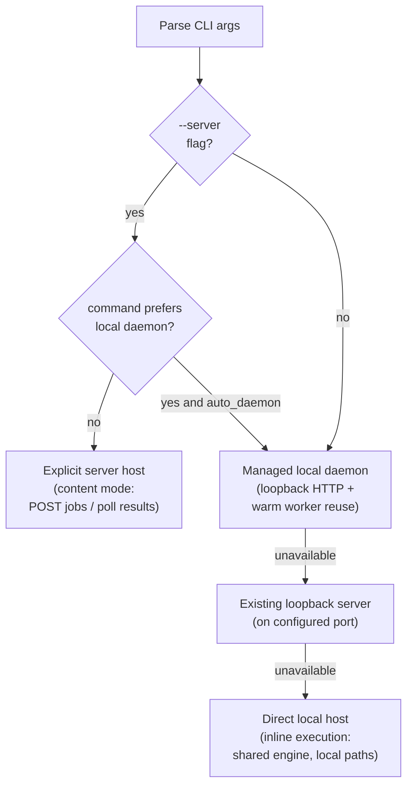

# Dispatch System

**Status:** Current
**Last modified:** 2026-04-06 12:51 EDT

The dispatch router lives in `crates/batchalign-cli/src/dispatch/mod.rs`.
The CLI never owns the ML runtime directly. It now routes processing commands
to one of four targets: explicit remote server, managed local daemon,
already-running loopback server, or the in-process direct host.

## Dispatch paths

### 1. Explicit server (`--server URL`)

When the user passes `--server` or sets `BATCHALIGN_SERVER`, the CLI uses
single-server HTTP dispatch.

- CHAT commands use content mode: file text is submitted over `POST /jobs`
- media-only commands can submit media names when the remote server can resolve
  them from `media_roots` or `media_mappings`
- multi-server fan-out is not part of the documented release surface

### 2. Managed local daemon

If `auto_daemon` is enabled, the CLI first tries to reuse or start a managed
loopback daemon. This keeps warm workers alive across commands.

This path still uses HTTP, but only over loopback. It is the important
performance path for repeated Apple CPU-only `align` / `transcribe` /
`benchmark` runs because it preserves loaded worker processes and shared models.

### 3. Loopback server reuse

If daemon startup is unavailable but a loopback server is already listening on
the configured port, the CLI reuses it before falling back to direct inline
execution.

### 4. Direct local execution

If no usable remote or loopback server exists, the CLI prepares a local
paths-mode submission and runs it inline through `DirectHost`.

In this path, the CLI and direct host stay in one process: there is no HTTP hop,
no queue, no registry discovery, and no persistent daemon requirement. The same
shared execution engine still runs the command recipe and worker orchestration.

### 5. Commands that prefer the local daemon

`transcribe`, `transcribe_s`, `benchmark`, and `avqi` require client-local media
discovery or local audio access. If `auto_daemon` is enabled and the user passes
`--server` for one of these commands, the CLI tries the local daemon first and
warns only when that reroute succeeds. If the local daemon path is unavailable,
the explicit remote URL remains the fallback.

`benchmark` is still a composite Rust-owned workflow (`transcribe` followed by
`compare`), but it now follows the same local-daemon-vs-explicit-server rules
as the other audio-dependent commands.

## Current scope

This release documents only:

- one explicit remote server URL
- one managed local daemon
- one reused loopback server
- one direct local host
- one explicit server host that owns queueing, persistence, warmup, registry
  discovery, and dashboard state

It does not document public fleet or multi-server scheduling behavior.

## Worker transport

CLI-to-server transport is HTTP.

Server-to-worker transport is stdio JSON-lines IPC. The Python worker entry
point in `batchalign/worker/_main.py` still owns the process lifetime and
read/write loop, but Rust now owns the generic stdio op validation and dispatch
envelope through the `batchalign_core` PyO3 bridge. HTTP is not used between
the Rust server and Python workers. The current slim Python console-script vs
full Rust CLI split is a packaging/build concern, not a dispatch concern, and
should not be modeled here.
