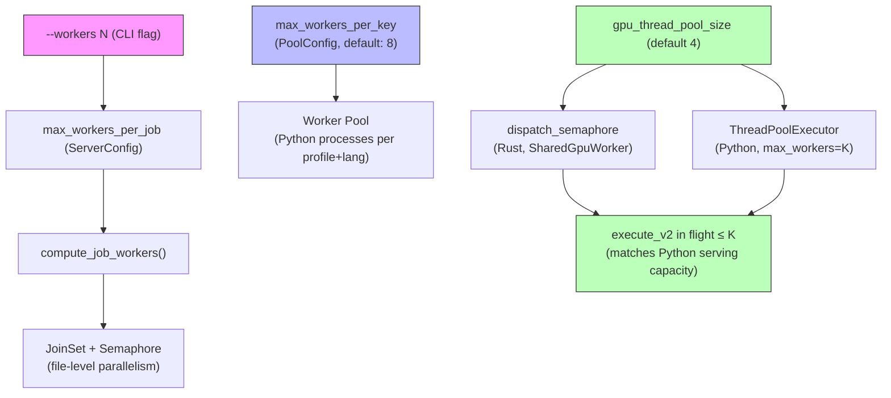
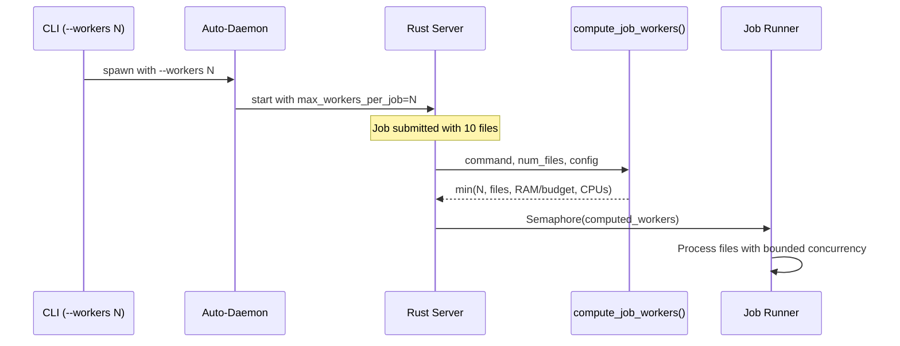
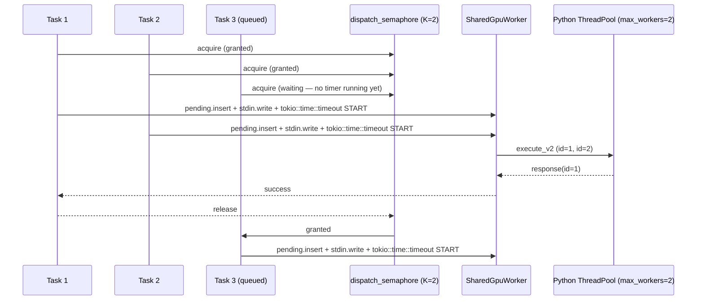

# Parallelism Architecture

**Status:** Current
**Last updated:** 2026-04-25 12:56 EDT

## Three layers of parallelism

batchalign3 has three independent parallelism controls:

Layer 3's twin nodes (`dispatch_semaphore` on the Rust side and
`ThreadPoolExecutor` on the Python side) share **one** ceiling
`K = gpu_thread_pool_size`. The Rust gate ensures a caller waiting for
an executor slot does not hold an active per-request timer; the timer
only ticks once a slot is granted and work is issued. See
`developer/worker-protocol-v2.md` § "The dispatch semaphore contract"
for the full architectural rule.

### Layer 1: File parallelism (user-facing)

**What it controls:** How many files are processed concurrently within a single job.

**User control:** `--workers N` CLI flag, or `max_workers_per_job` in `server.yaml`.

**Default behavior:**
- GPU-heavy commands (`transcribe`, `align`, `benchmark`): **1 file** (prevents OOM)
- CPU-only commands (`morphotag`, `utseg`, `translate`): auto-tuned by `compute_job_workers()` based on available RAM and CPU cores

**Implementation:** `runner/dispatch/` uses a `JoinSet` with a `Semaphore(num_workers)` to cap concurrent file processing tasks.

### Layer 2: Worker pool (operator-facing)

**What it controls:** How many Python worker processes exist per (profile, language, engine) key.

**User control:** `max_workers_per_key` in `server.yaml` (not a CLI flag -- this is an operator concern).

**Default:** 8 per key. GPU profile: 1 process (concurrent via threads). Stanza profile: auto-tuned. IO profile: 1 process.

**Implementation:** `worker/pool/mod.rs` manages worker lifecycle. Workers are spawned lazily and cached.

### Layer 3: GPU dispatch concurrency (Rust gate + Python pool)

**What it controls:** How many `execute_v2` calls are in flight at the
same time per shared GPU worker.

**User control:** `gpu_thread_pool_size` in `server.yaml` (default: 4).
This single knob sets both the Python `ThreadPoolExecutor(max_workers=K)`
*and* the Rust-side `dispatch_semaphore` permit count, so the two sides
agree on the in-flight ceiling.

**Default:** 4. On Apple Silicon (MPS excluded for batchalign3), set to
1 — there is no compute parallelism to gain, and a higher value just
means CPU-bound inferences contending for cores.

**Implementation:**
- Rust: `worker/pool/shared_gpu/stdio.rs` and
  `worker/pool/shared_gpu/tcp.rs` each carry a
  `dispatch_semaphore: Arc<Semaphore>` with `K` permits, acquired
  *before* the per-request timeout starts.
- Python: `batchalign/worker/_protocol.py::_serve_stdio_concurrent`
  hosts a `ThreadPoolExecutor(max_workers=K)` so multiple FA/ASR/Speaker
  inferences can run concurrently when the device releases the GIL.

Task 3's per-request timer only starts at the moment it acquires the
permit — never during queue-wait. This is the architectural contract
asserted by
`tests/gpu_concurrent_dispatch.rs::gpu_concurrent_dispatch_does_not_charge_queue_wait_against_per_request_timeout`.

## Why GPU commands default to 1 worker

Each GPU-heavy inference (Whisper ASR, Whisper FA, Wave2Vec) loads 2-5 GB of model weights into GPU/MPS memory. Processing multiple files concurrently means multiple inference requests running simultaneously, all sharing the same GPU memory pool.

On a 64 GB developer machine with MPS:
- 1 concurrent file: ~5 GB GPU memory -- safe
- 4 concurrent files: ~5 GB GPU x 4 threads = ~20 GB GPU pressure -- risky
- 8 concurrent files (old default): ~40 GB GPU pressure -- **kernel OOM crash**

The server's auto-tuner estimated available RAM but did not account for GPU memory pressure. Setting GPU commands to default to 1 file prevents this class of crash entirely.

Operators with dedicated GPU hardware (e.g., net with M3 Ultra 256 GB) can safely increase this via `--workers N` or `server.yaml`.
