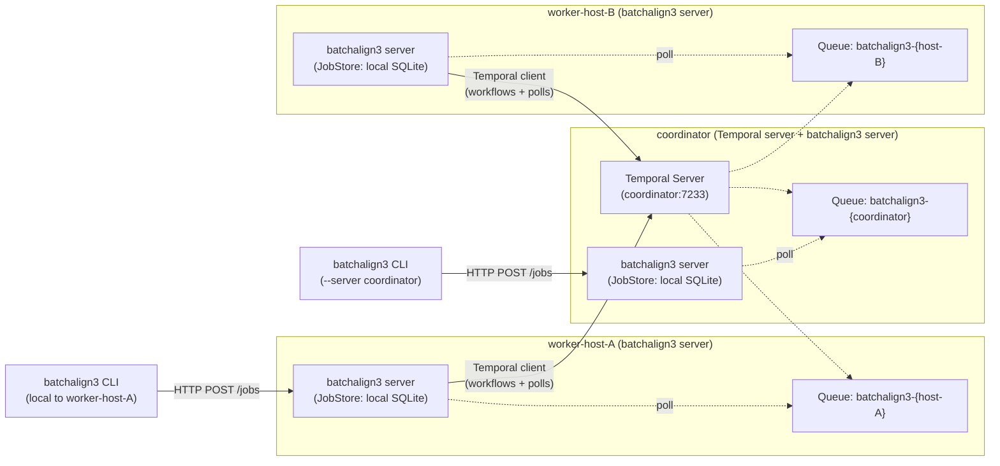
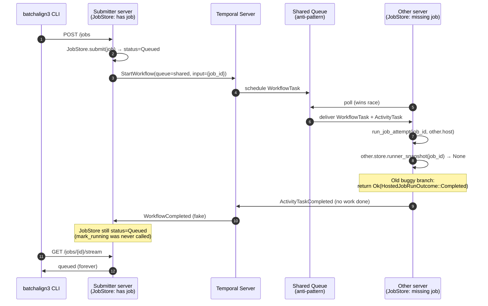

# Temporal Fleet Topology

**Status:** Current
**Last updated:** 2026-04-15 14:40 EDT

This page documents how Temporal routes batchalign3 work across the
fleet, the architectural invariant that makes that routing correct, and
what future cross-fleet distribution would require. It is the code map
for future contributors reading `temporal_backend.rs` or
`runner/execution.rs` and wondering why a workflow's activities only
ever run on the server that submitted the job.

## TL;DR

Every batchalign3 server owns its own local SQLite `JobStore`. A
Temporal workflow's activities must therefore run on the same server
that persisted the job — no other server can find it. That invariant
is realised at the Temporal layer by having each server poll a task
queue named after its own hostname (`batchalign3-{hostname}`), so a
workflow scheduled by one server is inhabited only by that server's
own worker.

A task queue **shared** across servers is wrong for this codebase:
when a non-submitter worker wins the poll race, the execution path
cannot find the job and — before this fix — silently reported a fake
completion. The per-host invariant eliminates the race by construction.

Cross-fleet distribution (offloading jobs from one server to another)
is **not implemented** today. Designing it is additive: a separate
queue with self-contained activity payloads and remote progress
reporting, layered on top of per-host queues without removing them.

## The invariant

> A Temporal workflow's activities execute on the task queue of the
> server that persisted the job in its local `JobStore`.

Two mechanisms realise this invariant together.

First, `ServerConfig.temporal_task_queue`
(`crates/batchalign-app/src/types/config/server.rs`) is the
`TemporalTaskQueue` newtype whose default is constructed at runtime
from the system hostname:

```rust
pub(crate) fn default_temporal_task_queue() -> TemporalTaskQueue {
    let hostname = sysinfo::System::host_name().expect(
        "sysinfo::System::host_name() returned None — batchalign3 cannot \
         derive a unique Temporal task queue without a hostname. Set \
         `temporal_task_queue` explicitly in server.yaml to override.",
    );
    TemporalTaskQueue::from(format!("batchalign3-{hostname}"))
}
```

Second, `ActivityOptions` in the Temporal Rust SDK has no explicit
`task_queue` field — the SDK schedules activities on the workflow's
own queue by default. Once a workflow is started on
`batchalign3-{hostname}`, every activity it launches stays on that
same queue and can only be polled by that same server's worker.

The three wiring points in the codebase are:

- `TemporalServerBackend::start_workflow` in `temporal_backend.rs`
  (lines ~384–408) — both `ResumeOrUseExisting` and `ReplaceExisting`
  paths call
  `WorkflowStartOptions::new(self.config.temporal_task_queue.clone(), ...)`.
- `TemporalWorkerRuntime` in `temporal_backend.rs` (around line ~577)
  — the `Worker` is initialised with
  `WorkerOptions::new(temporal_config.temporal_task_queue.clone())`.
- The activity handler
  `BatchalignTemporalActivities::run_job_attempt` in
  `temporal_backend.rs` (lines ~233–289) — takes
  `TemporalJobActivityInput { job_id }` and dispatches
  `job_task(job_id, self.host)` onto the local `RuntimeSupervisor`.
  `self.host` is the local `ServerExecutionHost`, whose `store` is the
  local `JobStore`. No cross-server store access is possible here by
  construction.

## Generic topology

The topology is defined by the invariant, not by any specific fleet
shape. At any scale — one server or many — each server runs exactly
one batchalign3 process, holds exactly one local `JobStore`, and polls
exactly one Temporal task queue whose name encodes its own hostname.
Exactly one server runs the Temporal server itself; the rest connect
to it as clients.



Each arrow is verified against source: SDK poller registration comes
from `WorkerOptions::new(...)` in `TemporalWorkerRuntime`; the
client-to-coordinator Temporal connection comes from
`ClientOptions::new(...)` in the same file; HTTP job submission routes
through the `POST /jobs` handler in `crates/batchalign-app/src/routes/jobs/`.

## Foreign-job anti-pattern

This is the failure mode that motivated the per-host invariant. If two
servers share a task queue, either server can win the poll race for an
activity regardless of which server persisted the job. When the
non-submitter wins, its local `JobStore` has no record of the `job_id`
carried in `TemporalJobActivityInput`, so `runner_snapshot` returns
`None` — and, pre-fix, the code silently reported success.



The silent early-return was at
`crates/batchalign-app/src/runner/execution.rs` (lines ~150–162):

```rust
let Some(job) = store.runner_snapshot(job_id).await else {
    // OLD behaviour: silently return Ok(HostedJobRunOutcome::Completed)
    // NEW behaviour: return Err(JobNotInLocalStore(job_id.clone()))
};
```

## Defense in depth

Per-host queues make the foreign-job case architecturally impossible.
As a regression guard, the execution path treats a missing job as a
typed error instead of a silent success:

```rust
let Some(job) = store.runner_snapshot(job_id).await else {
    return Err(crate::error::ServerError::JobNotInLocalStore(job_id.clone()));
};
```

The activity handler in `temporal_backend.rs` already converts `Err`
outcomes to `ActivityError::NonRetryable`. Any future regression — a
misconfigured `temporal_task_queue` in `server.yaml` pointing two
servers at the same queue, a concurrent store truncation during a
workflow — surfaces as a visible Temporal non-retryable failure whose
error message points operators at task-queue configuration. Silence
is no longer an option.

Two regression tests guard the fix:

- `runner::execution::tests::run_server_job_attempt_does_not_silently_complete_foreign_job`
  (in `crates/batchalign-app/src/runner/execution.rs`) — builds an
  empty `JobStore`, calls `run_server_job_attempt` with an unknown
  `job_id`, asserts the outcome is not `Ok(HostedJobRunOutcome::Completed)`.
- `types::config::tests::default_task_queue_is_per_hostname` (in
  `crates/batchalign-app/src/types/config/tests.rs`) — asserts the
  default queue name starts with `batchalign3-` and ends with the
  system hostname, and is neither a shared literal nor a host-agnostic
  fallback.

## Operational override

The default is binary-side on purpose: the binary computes
`batchalign3-{hostname}` at startup from
`sysinfo::System::host_name()`, so deploy tooling does not need to
know each target host's hostname and does not duplicate the derivation
logic. If an operator needs an explicit override (development machine
running multiple batchalign3 processes, host whose system hostname is
not stable), they may set `temporal_task_queue:` in
`~/.batchalign3/server.yaml` by hand. The override **must still be
unique per host**.

## Future work: cross-fleet distribution

If the project later wants to farm jobs out to other servers (e.g.,
the coordinator offloading when its worker pool is saturated), the
design is explicitly additive. Per-host queues keep working for jobs
that belong to their submitter; distribution is a new queue with
different semantics, not a replacement of the current topology.

The requirements for cross-fleet distribution are:

1. **Serializable activity payload.** `TemporalJobActivityInput`
   today carries only `{ "job_id": "..." }`. It would need to carry a
   `JobExecutionPayload` — the full job snapshot that lets any
   polling worker execute the job without a local store lookup. The
   `Job` struct in `store/job/` has non-serde fields
   (`CancellationToken`) that must be stripped or reconstituted
   worker-side.

2. **Payload-based snapshot construction.** `run_hosted_job`'s
   current path is `store.runner_snapshot(job_id)` → execute. The
   distributable path would construct the snapshot directly from the
   activity input, bypassing the store.

3. **Remote progress reporting.** Every dispatch path writes progress
   through `RunnerEventSink` → `StoreRunnerEventSink` → local
   `JobStore`. Cross-machine execution needs an alternative sink that
   forwards events (mark-running, file status, completion, error,
   lease renewal, cancellation) to the submitter's server over HTTP
   or Temporal signals. That introduces a new internal HTTP endpoint
   on the submitter; see `crates/batchalign-app/src/routes/` for the
   current route surface (no equivalent exists today).

4. **Uniform cross-machine file access.** Paths-mode jobs today may
   assume input files exist on the executing server. A distribution
   design must pick one of: require staging for all cross-machine
   jobs, require shared filesystem visibility, or reject job
   submissions whose inputs are not uniformly reachable.

5. **A separate task queue.** Call it `batchalign3-shared`. Each
   server's Temporal worker would then poll **two** queues
   simultaneously — the per-host queue (for jobs whose state lives
   locally) and the shared queue (for jobs whose payload travels with
   the activity). The Temporal Rust SDK currently needs one `Worker`
   instance per queue, so this means spawning two `Worker` instances
   in `TemporalWorkerRuntime`.

6. **Cancellation routing.** When a submitter cancels a job running
   on a remote worker, the cancel has to propagate. Temporal's
   `CancelWorkflowExecution` signal already triggers the activity's
   cancel token, so (3) likely handles this for free — but end-to-end
   cross-machine cancel needs testing once (1)–(5) are in place.

Until someone picks up that work, per-host queues are the correct
and complete topology for the current system.

## Related reading

- `crates/batchalign-app/src/temporal_backend.rs` —
  `BatchalignTemporalActivities` and `BatchalignJobWorkflow`, with an
  in-file version of the per-host invariant explanation.
- `crates/batchalign-app/src/runner/execution.rs` —
  `run_hosted_job` and the defense-in-depth early-return.
- `crates/batchalign-types/src/domain.rs` — `TemporalTaskQueue`
  newtype, documented with the same architectural invariant.
- `architecture/fleet-evolution.md` — the broader fleet-capabilities
  roadmap this topology is a first concrete step toward.
