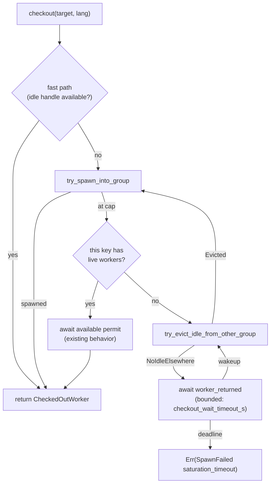

# Worker-Pool Saturation and Morphosyntax Safeguards

**Status:** Current
**Last updated:** 2026-04-14 19:20 EDT

This page explains two safeguards that together prevent silent
corruption when the worker pool hits its global cap during a multi-language
morphosyntax batch: (1) idle-eviction with bounded wait in
`WorkerPool::checkout`, and (2) typed language-group failure
propagation in the morphosyntax batch orchestrator. Both exist because an
earlier architecture could silently emit CHAT files with missing
`%mor`/`%gra` tiers on utterances in languages the pool had temporarily
"locked out."

## The failure mode these safeguards prevent

A morphotag batch processes utterances grouped by language. Each language
group needs a Stanza worker for its 3-letter language code. When the
batch spans more languages than the pool can hold concurrently, earlier
groups' workers go idle but stay counted in the global cap, and later
language groups find no slot available to spawn.

Without safeguards the failure surfaces at two layers:

1. **Pool layer** — `WorkerPool::checkout` returns `Err(SpawnFailed("...
   cannot wait (would deadlock)"))` rather than freeing a slot from an
   idle worker of a different key.
2. **Orchestrator layer** — The morphosyntax batch catches the pool error,
   logs a warning, substitutes an empty `UdResponse` for every utterance
   in the affected group, and continues to injection.

The morphosyntax injection step clears every existing `%mor`/`%gra` tier
in place before repopulating it (see
`batchalign-chat-ops::morphosyntax::clear_morphosyntax`). If no UD
response arrives for an utterance, the final sweep in
`remove_empty_morphosyntax_placeholders` strips the empty placeholder.
Net effect: the file is serialized with `rc=0` but the affected
utterances have lost the morphosyntactic annotation they started with.
Nothing in the log names the file; downstream auditors see a per-file
success.

## Safeguard 1: idle-eviction + bounded wait in `checkout`

**Code:** `crates/batchalign-app/src/worker/pool/eviction.rs`,
`crates/batchalign-app/src/worker/pool/dispatch.rs`,
`crates/batchalign-app/src/worker/pool/checkout.rs`.

When `checkout(target, lang, overrides)` finds the pool saturated and
this key has zero live workers, the loop does three things in order
before returning any error:

1. **Try eviction** — [`WorkerPool::try_evict_idle_from_other_group`]
   snapshots every group's idle count under the groups-map lock, picks
   the non-skip group with the highest idle count via the pure helper
   [`select_eviction_target`], non-blockingly acquires its `available`
   permit, pops one idle handle, decrements that group's `total`, and
   drops the handle on a detached task. One global-cap slot is now free
   and the main loop `continue`s back to the spawn path.

2. **If eviction finds nothing**, park on the pool-wide
   `worker_returned: Arc<Notify>` with a bounded deadline
   (`checkout_wait_timeout_s`, default 300 s). Every
   `CheckedOutWorker::drop` calls `notify_waiters()` so all saturated
   checkouts across all keys wake on any return and retry in parallel.
   On wakeup, the loop re-attempts eviction (now backed by the freshly
   returned idle worker) and spawn.

3. **On deadline**, return
   `Err(WorkerError::SpawnFailed("no worker available for {target}/{lang}
   within {secs}s — pool saturated with no idle workers to evict"))`.
   This is a genuine starvation case (every worker checked out and
   busy, no returns for 5 minutes) and propagates to the orchestrator
   which turns it into a per-file error — never a silent empty tier.



### Invariants preserved

- `group.total` never underflows. The decrement in eviction runs only
  after a successful `try_acquire` + `pop_front`, proving the worker
  existed and was ours to remove.
- No worker is destroyed while it has pending work. Only idle workers
  are evicted (non-blocking `try_acquire` on `available`); checked-out
  workers have no available permit.
- No new lock-ordering hazard. The groups map lock is taken together
  with each per-group idle mutex, the same order already used by
  `global_worker_count` and `try_spawn_into_group`.
- Graceful shutdown. The evicted handle is dropped on a detached task
  so `checkout` never waits on `WorkerHandle::Drop` (SIGTERM+SIGKILL).
  Runtime-shutdown races are covered by `lifecycle.rs`'s orphan reaper.

### Pure-function test coverage

`select_eviction_target` is a pure function of `HashMap<K,
GroupSnapshot>`. Five unit tests in `worker/pool/eviction.rs` cover:

- Only the skip key has idle workers → `None`
- No group has idle workers → `None`
- One other group has idle workers → picks it
- Multiple candidates → picks the one with the highest idle count
- Skip key has the highest idle count → still picks another group

RED→GREEN was verified by reverting the selector's body to a constant
`None` and watching the "picks other group" tests fail.

## Safeguard 2: typed language-group failure propagation

**Code:** `crates/batchalign-app/src/morphosyntax/outcomes.rs`,
`crates/batchalign-app/src/morphosyntax/batch.rs`.

Even with idle-eviction, a language group can still fail dispatch —
legitimate timeouts, worker crashes, the true starvation case above, or
future pool-level errors we haven't thought of. The orchestrator must
not silently continue with an empty `UdResponse`.

The fix factors outcome aggregation into a pure function and a typed
failure:

```rust
pub(super) struct LanguageGroupOutcome {
    pub lang3: String,
    pub global_indices: Vec<usize>,
    pub result: Result<Vec<UdResponse>, ServerError>,
}

pub(super) struct LanguageGroupFailure {
    pub num_failed: usize,
    pub languages: String,
    pub failed: Vec<FailedLanguageGroup>,
}

pub(super) struct AggregatedOutcomes {
    pub responses: Vec<UdResponse>,       // partial; successful groups populated
    pub failure: Option<LanguageGroupFailure>,
}

pub(super) fn aggregate_language_group_outcomes(
    outcomes: Vec<LanguageGroupOutcome>,
    total_miss_count: usize,
) -> AggregatedOutcomes;
```

The orchestrator in `run_morphosyntax_batch_impl` computes
`failure.affected_global_indices()` and marks every file whose miss range
intersects that set as `TextBatchFileResult::err` with a message naming
the failed languages. Injection is skipped for those files; the `clear`
step has already reset their tiers in place, so skipping prevents
serializing stripped output. Files whose languages all succeeded still
get injected normally.

Five unit tests in `morphosyntax/outcomes.rs` cover the corruption
regression directly:

- All groups succeed → full response vector, `failure = None`
- One group fails → partial responses preserved, `failure` names the
  language and the affected global indices
- Multiple groups fail → every failed language appears
- Empty outcomes → empty responses, no failure
- Gaps from skipped unsupported languages → filled with empty
  `UdResponse` (the existing legal case — the caller already decided
  the utterance was unprocessable)

RED→GREEN was verified by reverting `aggregate_language_group_outcomes`
to the pre-fix silent-fill behavior and watching the typed-failure
tests panic with the exact corruption signature.

## Together: the end-to-end contract

1. Idle-eviction prevents the saturation-induced "cannot wait (would
   deadlock)" error in the common case where other groups hold idle
   workers.
2. Bounded wait handles the rarer case where every worker is genuinely
   checked out by returning a typed error after 5 minutes rather than
   blocking forever.
3. The morphosyntax orchestrator converts every pool-level failure into
   per-file errors that the CLI surfaces as non-zero exit codes. No
   code path writes a file with a stripped tier.

An out-of-tree audit tool cross-checks this contract by walking
today's commits and dirty worktrees in every data repo and
flagging any `.cha` file whose diff net-removes `%mor` or `%gra`
tier lines. After a correct morphotag run the tool must report
zero net-negative deltas.

## Configuration knobs

| Key | Default | Purpose |
|-----|---------|---------|
| `max_workers_per_key` | 4 | Per-key cap; prevents one language from hogging |
| `max_total_workers` | computed from RAM (clamped 2–32) | Global cap |
| `checkout_wait_timeout_s` | 300 | Bounded wait before saturation error |

Raising `max_total_workers` or `max_workers_per_key` reduces how often
eviction fires but never changes correctness. The saturation-timeout
knob should match the orchestrator's per-language-group timeout so a
checkout stall and a language stall surface at the same timescale.
