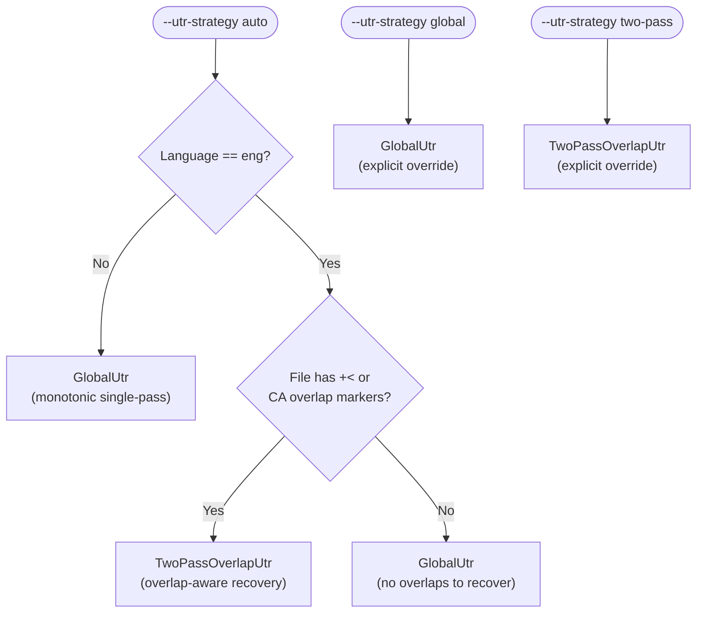

# align — Developer Reference

**Status:** Current
**Last updated:** 2026-04-09 15:40 EDT

Implementation guide for the `align` command. For user-facing documentation,
see [User Guide: align](../../user-guide/commands/align.md).

---

## Implementation map

| Layer | Location | Responsibility |
|-------|----------|----------------|
| CLI args | `crates/batchalign-cli/src/args/commands.rs` — `AlignArgs` | UTR/FA engine flags, strategy, fuzzy, buffer params |
| Options builder | `crates/batchalign-cli/src/args/options.rs` — `build_align_options()` | Maps `AlignArgs` → `CommandOptions::Align(AlignOptions)` |
| Command definition | `crates/batchalign-app/src/commands/align.rs` — `AlignCommand` | `CommandDefinition` impl, pre-validation gate |
| FA pipeline | `crates/batchalign-app/src/runner/dispatch/fa_pipeline.rs` | Per-file FA orchestration: UTR → grouping → FA → injection |
| UTR dispatch | `crates/batchalign-app/src/runner/dispatch/utr.rs` | `resolve_strategy()`, language-aware strategy gate |
| UTR library | `crates/batchalign-chat-ops/src/fa/utr.rs` | `run_utr_pass()`, `inject_utr_timing()`, partial-window logic |
| FA library | `crates/batchalign-chat-ops/src/fa/` | Grouping, extraction, DP alignment, injection, postprocessing |
| Worker IPC | `batchalign/inference/fa.py` — `batch_infer_fa()` | Loads Whisper/Wave2Vec, returns token timestamps |

---

## `@Options: NoAlign` — strict pass-through

Files containing `@Options: NoAlign` are **returned completely unchanged**.
The pipeline performs zero modifications: no timestamps are added, removed,
or adjusted, no `%wor` tier is generated or updated, and no decision tiers
(`%xalign`, `%xrev`) are written.

The rationale is that a researcher who sets `@Options: NoAlign` has explicitly
opted this file out of all alignment processing.  Batchalign must respect that
decision unconditionally — including for cleanup passes that might seem benign
(such as monotonicity enforcement).  Any existing timestamps, even backward
ones from a previous run, are the researcher's responsibility.

If a file with `@Options: NoAlign` carries validation errors from a previous
FA run, the correct fix is to repair the file manually or remove the option,
re-run align, and re-add the option if still needed.

Implementation: `run_fa_from_ast` checks `is_no_align(&chat_file)` immediately
after parsing (before media resolution, pre-validation, and all FA logic) and
returns `Ok(FaResult { chat_text: to_chat_string(&chat_file), ..empty })`.

---

## Pre-validation gate

`align` requires CHAT Level 2 (parseable + headers + valid main tiers) before
running inference. Invalid files are rejected immediately with a typed error
rather than consuming GPU time. See
[Command Contracts](../architecture/command-contracts.md) for the validity
level definitions.

Implemented in `crates/batchalign-app/src/commands/align.rs`:
```rust
validate_to_level(chat, ValidationLevel::MainTiers)?;
```

---

## Cache key structure

FA results are keyed by BLAKE3 hash over:
- word sequence (normalized)
- audio segment (file path + byte range)
- FA engine name + version
- language code

UTR ASR results are cached separately per audio segment (file path + start_ms
+ end_ms). Segment cache hits avoid re-running ASR on already-processed
windows during the partial-window optimization.

Cache implementation: `crates/batchalign-app/src/cache/` (hot: moka,
cold: SQLite). Bypass with global `--override-media-cache`.

---

## Worker IPC: FA task (V2 protocol)

```
Client → Worker: execute_v2 request
{
  "task": "fa",
  "prepared_audio": { path, start_ms, end_ms, sample_rate },
  "prepared_text":  { words: [...], language: "eng" },
  "engine": "wav2vec" | "whisper"
}

Worker → Client: execute_v2 response
{
  "tokens": [
    { "word": "hello", "start_s": 0.12, "end_s": 0.45 },
    ...
  ]
}
```

The Rust server converts seconds → milliseconds and runs Hirschberg DP
alignment (`dp_align.rs`) to map FA tokens back to CHAT transcript words.

---

## UTR strategy resolution

`resolve_strategy()` in `crates/batchalign-app/src/runner/dispatch/utr.rs`:



The language gate lives in the app layer (policy). The library
`batchalign-chat-ops/src/fa/utr.rs` is language-agnostic; strategy selection
is injected from the app layer so the library stays testable in isolation.

---

## Incremental processing (`--before`)

When `--before PATH` is provided, `process_fa_incremental()` in
`fa_pipeline.rs` diffs the old and new CHAT files, classifies each utterance
as Added/Removed/Modified/Unchanged, and only runs FA on content that changed.
Stable `%wor` entries from the old file are copied directly, skipping the FA
worker entirely for unchanged groups.

See [Incremental Processing](../architecture/incremental-processing.md).

---

## FA grouping constraints

`group_utterances()` enforces two independent split constraints. A group is
flushed when either is exceeded by adding the next utterance:

- **Time window** — configured via `AlignOptions.max_group_ms` (default 20 000 ms)
- **Character-token limit** — `WHISPER_FA_MAX_LABEL_TOKENS = 448` (constant in
  `grouping.rs`). Whisper's CTC FA counts every character of every word as one
  label token. Exceeding 448 raises a hard Python `ValueError`. Dense languages
  (Spanish, any long-word corpus) can hit this inside a normal time window.

The flush guard is skipped only when the current group is empty — if one
utterance alone exceeds 448 chars it is sent as its own group (fail gracefully
rather than drop silently).

See [Forced Alignment: FA grouping strategy](../../reference/forced-alignment.md#fa-grouping-strategy)
for the full rationale, flowchart, and edge cases.

## Compound filler splitting

CHAT underscore-joined fillers (`&-you_know`, `&-sort_of`) are split at
underscores before being sent to the FA engine because ASR models return them
as separate words. After alignment, the N timings are merged back into one span.
Only `WordCategory::Filler` words are split — regular compounds (`ice_cream`)
are unchanged.

See `crates/batchalign-chat-ops/src/fa/COMPOUND_FILLER_ALIGNMENT.md`.

---

## Testing

```bash
# Fast unit tests (no ML models)
make test

# FA-specific tests with real models (only on net, 256 GB RAM)
cargo nextest run --profile ml -E 'test(fa::)'

# Incremental processing tests
cargo nextest run -p batchalign-app --test incremental
```

Key test locations:
- `crates/batchalign-chat-ops/src/fa/` — unit tests for grouping, injection, UTR
- `crates/batchalign-app/tests/` — integration tests for the FA pipeline

---

## Related developer documentation

- [Command Flowcharts: align](../architecture/command-flowcharts.md#align) — detailed runtime flowchart with 3 diagrams
- [Forced Alignment](../reference/forced-alignment.md) — algorithm design, prerequisites
- [Dynamic Programming](../architecture/dynamic-programming.md) — Hirschberg aligner
- [Incremental Processing](../architecture/incremental-processing.md) — `--before` mechanics
- [Overlap Encoding](../architecture/overlap-encoding.md) — `+<` and CA marker handling
- [Command Contracts](../architecture/command-contracts.md) — pre/post validation gates
- [Adding Commands](adding-commands.md) — use `align` as the reference implementation for `PerFileTransform`
