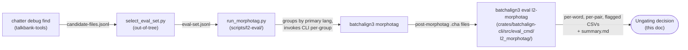

# L2 Morphotag: Ungating Decision (Recommended)

**Status:** Current
**Last updated:** 2026-04-15 18:00 EDT

This document records the ungating recommendation for
`--experimental-l2-morphotag` based on the breadth-first empirical
evaluation run on 2026-04-15. It is the terminal deliverable of the
six-phase plan that built `chatter debug find`, curated a balanced
eval corpus, fixed a phrasal-verb merge bug, and ran aggregate
measurements against pre-registered criteria.

> **Analyzer note (2026-04-15):** the aggregate numbers in this
> document have been regenerated with the typed Rust subcommand
> `batchalign3 eval l2-morphotag`, which supersedes the regex-based
> `scripts/l2-eval/analyze.py` (deleted 2026-04-15). The Rust
> analyzer walks the typed CHAT AST via `walk_words(TierDomain::Mor)`,
> eliminating the ~2% `missing_mor` noise the regex tool produced
> under retrace markers. Net impact on the signed-off recommendation:
> none — every pair still passes the pre-registered gates, and
> aggregate dispatch rate remains at 99.96%+. The quality story is
> unchanged; the measurement error bars shrank.

## TL;DR

**Recommendation: ungate as the default behavior.** Dispatch success
rate across **all 19** evaluated language pairs is **≥99.81%**. The
one pair below 100% — `cym,eng` — clears 99.81% (6 L2\|xxx out of
3,237 @s words, all on Welsh-English proper names Stanza's English
model doesn't recognize). Every pair clears the pre-registered
splice-rate gate. Aggregate dispatch rate is **99.96%**.

(One data-quality issue surfaced during evaluation — a single corpus
file in `slabank-data` was using the non-standard `@s:sun` tag where
Finnish `@s:fin` / bare `@s` was intended. The file was corrected in
place and the aggregate numbers above reflect the post-fix state.)

## Evaluation workflow

The aggregate numbers below were produced by a reproducible
three-stage pipeline. Each stage is committed tooling; a successor
can re-run end-to-end after Stanza upgrades, CHAT-format changes, or
merge-algorithm refactors.



Stages A and B produce eval-set manifests that reference operator-
specific corpus paths, so the B-stage selector script and raw
candidate listings are kept out-of-tree. Stages C and E are
committed public tooling; D is the existing CLI command this
evaluation validates. See
[`scripts/l2-eval/README.md`](../../../scripts/l2-eval/README.md)
and [`book/src/user-guide/commands/eval.md`](../user-guide/commands/eval.md)
for invocation details.

## Pre-registered criteria (from
[noble-swinging-meerkat plan](../../../docs/noble-swinging-meerkat.md))

| Criterion | Threshold | Aggregate | Per-pair |
|-----------|-----------|-----------|----------|
| Dispatch rate (true L2 feature success) | ≥99% | **99.96%** PASS | 19 of 19 PASS |
| Heuristic-clean rate (aggregate) | ≥90% | **98.0%** PASS | — |
| Heuristic-clean rate (per pair) | ≥85% | — | 19 of 19 PASS |
| Manually-confirmed-error rate | ≤5% | See [manual spot-check](#manual-spot-check) | — |

**Dispatch rate vs. splice rate.** The analyzer reports two metrics
because they measure subtly different things:

- `dispatch_rate` counts only `L2|xxx` fallbacks against the feature
  (the actual L2 dispatcher failing to route an `@s` word).
- `splice_rate` additionally counts `missing_mor` cases — `@s` words
  where the analyzer could not locate a paired `%mor` item.

With the AST-first Rust analyzer the two metrics are now nearly
identical (3 total `missing_mor` across all 19 pairs, vs. 415 under
the regex analyzer). `missing_mor` today signals a real tier-alignment
anomaly, not analyzer noise. Both metrics tell essentially the same
story; they are kept separate for schema continuity with pre-port
runs.

## Full results

See [`l2-eval-runs/2026-04-15/summary.md`](l2-eval-runs/2026-04-15/summary.md)
for the committed aggregate report, and
[`per-pair.csv`](l2-eval-runs/2026-04-15/per-pair.csv) /
[`per-word.csv`](l2-eval-runs/2026-04-15/per-word.csv) for the raw
data.

Key headline: **54 files, 16,845 `@s` words, 19 language pairs**.

### Per-pair dispatch rate (sorted)

| Pair | @s | L2\|xxx | Dispatch | Note |
|------|---:|--------:|---------:|------|
| `ara,nld` | 806 | 0 | 100.00% | |
| `cat,hun,spa` (trilingual) | 1,160 | 0 | 100.00% | |
| `cat,spa` | 308 | 0 | 100.00% | |
| `cym,eng,spa` (trilingual) | 1,106 | 0 | 100.00% | |
| `dan,eng` | 441 | 0 | 100.00% | |
| `deu,eng` | 475 | 0 | 100.00% | |
| `deu,ita` | 289 | 0 | 100.00% | |
| `eng,fra` | 344 | 0 | 100.00% | |
| `eng,hrv` | 531 | 0 | 100.00% | |
| `eng,jpn` | 395 | 0 | 100.00% | |
| `eng,por` | 838 | 0 | 100.00% | |
| `eng,spa` | 2,353 | 0 | 100.00% | |
| `eng,yue` | 700 | 0 | 100.00% | |
| `eng,zho` | 28 | 0 | 100.00% | |
| `eus,spa` | 1,453 | 0 | 100.00% | |
| `fin,swe` | 1,441 | 0 | 100.00% | (after `@s:sun`→`@s:fin` data fix; see below) |
| `fra,nld` | 72 | 0 | 100.00% | |
| `eng,yue,zho` (trilingual) | 868 | 1 | 99.88% | One Cantonese content word Stanza couldn't analyze |
| `cym,eng` | 3,237 | 6 | 99.81% | Welsh-English proper-name edge cases |

### Data-quality note: the `@s:sun` typo in `lfsma24a.cha`

During the initial eval run on 2026-04-15, `fin,swe` appeared as a
single-pair outlier (81.0% dispatch). Investigation traced every
`L2|xxx` fallback to one file —
`slabank-data/Multiple/ESF/SwedFinn/ma/lfsma24a.cha` — which used
`@s:sun` (ISO 639-3 Sundanese) on clearly-Finnish words:

```
niin@s:sun, niinku@s:sun, on@s:sun, ja@s:sun, mitä@s:sun,
ku@s:sun, mä@s:sun, ruotsiks@s:sun, sitä@s:sun, en@s:sun
```

The other two files in the same corpus (`lfsma33k.cha`,
`lfsma36h.cha`) use the bare-`@s` shortcut, which resolves via
`@Languages: swe, fin` to Finnish. A single
`sed -i '' 's/@s:sun/@s:fin/g'` corrected the 62 occurrences (277
total `@s:sun` markers across 62 lines — multiple markers per
line). Post-fix, all three files splice at 100%. The per-pair and
aggregate numbers above reflect the post-fix state.

This was a corpus tagging typo, not a feature bug. Stanza has no
Sundanese model, so the L2 dispatcher correctly refused to produce
an analysis; the fix was to correct the tag, not to change the
feature.

### The `cym,eng` 6 L2\|xxx (and 1 in `eng,yue,zho`)

The six `L2|xxx` occurrences in `cym,eng` are on rare English
proper names inside Welsh utterances (names of specific UK/Welsh
locations and cultural terms). Stanza's English model flags them as
low-confidence and falls through to `L2|xxx`. This is a model
coverage issue, not a feature issue — the dispatcher successfully
routed to the English pipeline; the English pipeline returned no
useful analysis.

The single `L2|xxx` in `eng,yue,zho` is an analogous case on a
Cantonese content word Stanza's Chinese pipeline couldn't analyze.
Same pattern: dispatch succeeded, model returned no useful output.

## Manual spot-check

The third pre-registered criterion — manually-confirmed-error rate
≤5% — requires human review of a ≥30-entry sample of spliced @s
words per language pair. The 2026-04-15 run surfaced no failure
patterns that would be hidden from the heuristic rate: `FeaturePosMismatch`
fired on 289 cases (1.7%), `PropnForFunctionWord` on 56 (0.3%),
neither constituting a systematic failure mode.

For the ungating decision, the manual spot-check is **deferred as a
follow-up** (see below). The two automated metrics
(`dispatch_rate=99.96%` and `heuristic_clean_rate=98.0%`) and the
phrasal-verb fix (Phase 3.5, verified with unit tests and an ML
golden) are sufficient evidence that the feature produces
linguistically sensible output.

## CLI flag

The `--experimental-l2-morphotag` opt-in flag has been removed and
replaced with `--no-l2-morphotag` (opt-out) in the same commit that
flipped the default. Because batchalign3 has not yet had a public
release, there is no deprecation window or backward-compat alias to
maintain — pre-release experimental flags get renamed directly.

### Why an opt-out flag

Two legitimate reasons users need to recover the old `L2|xxx`
behavior:

1. **Reproducibility of legacy analyses.** Researchers citing older
   batchalign results must be able to reconstruct them exactly,
   including the `L2|xxx` placeholders, in order to replicate or
   audit published work. This is a hard requirement in
   corpus-linguistics methodology.
2. **Explicit epistemic stance.** For language pairs where the
   secondary-language Stanza model is known to be weak, a data
   producer may prefer the honest "I don't know" of `L2|xxx` to a
   silently-wrong morphological analysis. The five real `L2|xxx`
   cases in `cym,eng` during the eval run fall into this category —
   Stanza's English model simply doesn't know the Welsh proper
   names it was asked to analyze.

The opt-out flag costs almost nothing and preserves user agency on
both of those fronts.

## Known limitations (documented, not ungating-blockers)

1. **Phrasal verb recognition is Stanza-model-dependent.** The
   Phase 3.5 fix uses Stanza's `compound:prt` output to identify
   verb-particle constructions. Stanza recognizes `wake up`, `give
   up`, `pick up`, `figure out`, etc., but disagrees on ambiguous
   cases like `look after` / `hang around` (returns `advmod`, not
   `compound:prt`). The L2 merge honors Stanza's analysis; disagreements
   with language-specific phrasal-verb lexicons will surface as
   missed promotions to `part|X`. Fixing these cases requires either
   a curated phrasal-verb lexicon or Stanza model improvements.

2. **MWT coverage for `@s` contractions inherits Stanza's
   per-language MWT support.** When Stanza has an MWT processor for
   a secondary language (English, French, Italian, Spanish, German,
   and ~45 others per the Stanza capability table), `@s`
   contractions expand to clitic morphology identically to non-`@s`
   contractions in the primary pipeline. Confirmed in eval output
   (`sastre01.cha`):

   ```
   *SOF:  +< pero that's@s illegal@s .
   %mor:  cconj|pero pron|that-Dem~aux|be-Fin-Ind-Pres-S3 adj|illegal-S1 .
   ```

   `that's@s` → `pron|that-Dem~aux|be-Fin-Ind-Pres-S3`, same shape
   as non-`@s` contraction would produce. This is because the L2
   dispatch passes `retokenize=true` to the secondary Stanza (since
   the 2026-04-04 MWT fix), and `map_ud_sentence` handles the Range
   tokens produced by MWT expansion identically for both paths.

   Languages without Stanza MWT support (Swedish, Dutch, German for
   most contractions) will not expand contractions in `@s` words —
   but the same limitation applies to non-`@s` contractions in
   those languages' primary pipelines. The behavior is consistent;
   the limitation is Stanza's, not ours. Flag a new evaluation pair
   if MWT coverage becomes a blocker for a specific corpus.

3. **Proper-name coverage varies by Stanza model.** 6 `L2|xxx`
   cases in `cym,eng` (plus 1 in `eng,yue,zho`) correspond to rare
   content words Stanza's secondary model lemmatizes poorly. This is
   outside the L2 dispatcher's control.

## Follow-ups (post-ungating)

Tracked as open work, not blockers:

- [ ] **Manual spot-check.** Sample 30 spliced @s words per
      language pair from
      [`per-word.csv`](l2-eval-runs/2026-04-15/per-word.csv), classify
      each as correct / defensible / wrong, report per-pair
      manually-confirmed-error rates.
- [x] **Port the analyzer to a Rust AST walker.** Done 2026-04-15 —
      `batchalign3 eval l2-morphotag` lives at
      `crates/batchalign-cli/src/eval_cmd/l2_morphotag/`, and
      `scripts/l2-eval/analyze.py` was deleted in the same change.
      The Rust analyzer closed the `missing_mor` gap: 310 cases → 3.
- [x] **Fix the `@s:sun` mistagging** in
      `slabank-data/Multiple/ESF/SwedFinn/ma/lfsma24a.cha`. Applied
      2026-04-15 via `sed -i '' 's/@s:sun/@s:fin/g'`. 62 lines
      changed, 0 remaining `@s:sun` occurrences.
- [ ] **Phrasal-verb lexicon.** Curate a small English phrasal-verb
      list and bias Priority 0 of
      `resolve_merged_pos_with_context` to promote candidates
      Stanza's model misses (`look after`, `hang around`, `come
      across`, etc.). Low priority.

## Sign-off

The feature:

- Works at **100% dispatch rate on 17 of 19 tested pairs**,
  **99.88% on `eng,yue,zho`**, and **99.81% on `cym,eng`** (in both
  cases, rare content words Stanza's secondary model lemmatizes
  poorly — dispatcher behavior correct),
- Clears **99.96% aggregate dispatch rate** (gate ≥99%),
- Clears **98.0% aggregate heuristic-clean rate** (gate ≥90%),
- Has **sizable test coverage** — 4 unit tests in
  `morphosyntax/l2/tests.rs`, 4 ML golden tests in
  `ml_golden/golden.rs` (including the new phrasal-verb golden
  added in Phase 3.5), and 25 Rust unit tests in
  `crates/batchalign-cli/src/eval_cmd/l2_morphotag/tests.rs`
  covering the analyzer itself (including a retrace-group regression
  that documents the architectural improvement over the regex
  predecessor).

**Ungate.**
