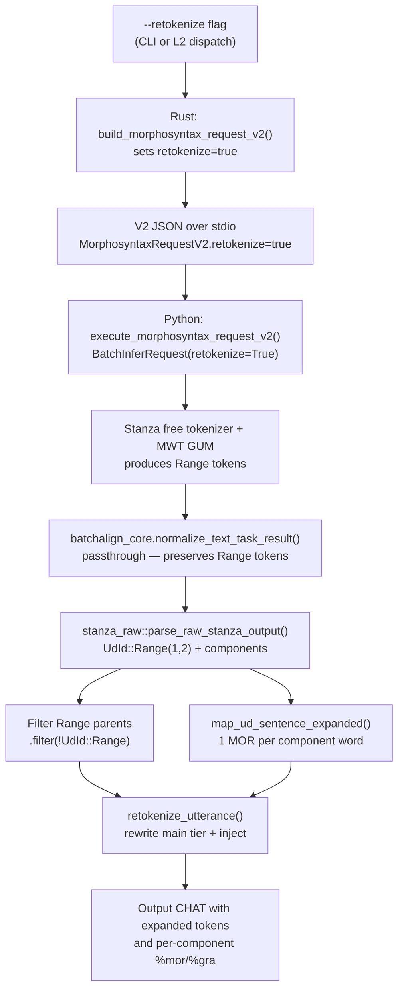

# Retokenize: BA2 vs BA3 Analysis

**Status:** Current — root cause found and fixed
**Last updated:** 2026-04-21 09:01 EDT

## What Retokenize Does

The `--retokenize` flag tells morphotag to let Stanza re-tokenize the
utterance (splitting/merging words) instead of preserving the original
CHAT word boundaries. This enables:

- **Contraction expansion:** `it's` → `it` + `'s` → `pron|it~aux|be`
- **Compound splitting:** `gonna` → `going` + `to` → `verb|go~part|to`
- **CJK word segmentation:** `你好吗` → `你好` + `吗` (Mandarin)

## BA2-Jan9 Behavior

BA2 used Stanza's **free tokenizer for ALL languages** by default.
There was no `tokenize_pretokenized=True` in the Stanza config.

```python
# BA2: ~/batchalign2-jan9/batchalign/pipelines/morphosyntax/ud.py:736
config = {"processors": {"tokenize": "default", ...},
          "tokenize_no_ssplit": True}
# No tokenize_pretokenized → Stanza tokenizes freely
```

When `--retokenize` was False, a `tokenize_postprocessor` callback
realigned Stanza's free tokenization back to the original CHAT words.
When `--retokenize` was True, the postprocessor was simplified,
allowing Stanza's tokenization to modify the main tier words.

**Result:** English contractions were expanded in both modes (the
contraction expansion happens during Stanza's tokenization, not during
the postprocessor). The difference between `--retokenize` and
`--keeptokens` was whether the CHAT main tier words were updated.

**MWT handling:** BA2 included MWT processor for English (GUM package)
and other languages that support it. Stanza's internal MWT expansion
produced proper Range tokens which were mapped to clitics.

## BA3 Current Behavior

BA3 switched to **pretokenized mode** for non-CJK languages:

```python
# BA3: batchalign/worker/_stanza_loading.py:122
nlp = stanza.Pipeline(
    lang=alpha2,
    processors=processors,
    download_method=DownloadMethod.REUSE_RESOURCES,
    tokenize_no_ssplit=True,
    tokenize_pretokenized=True,  # ← BA3 addition
)
```

The `--retokenize` flag only affects CJK (Mandarin/Cantonese) via a
separate "retok" pipeline with `tokenize_pretokenized=False`. For all
other languages, `--retokenize` is silently ignored.

**Result:** English contractions are NEVER expanded. `it's` stays as
one token → `pron|its` or `adv|its` (wrong). `gonna` stays as one
token → `adv|gonna` (no compound splitting).

**Why BA3 changed:** The pretokenized approach avoids the fragile
`tokenize_postprocessor` realignment that BA2 used. BA2's postprocessor
was string-based and error-prone (it produced alignment mismatches for
some CHAT constructs). BA3 replaced it with a Rust-based retokenization
system (`batchalign-chat-ops/src/retokenize/`) that uses character-level
DP alignment. However, this Rust retokenization is only wired for the
`StanzaRetokenize` tokenization mode, and the Python worker only
produces free-tokenize output for CJK.

## What BA3 Should Do

### For `--keeptokens` (default, no retokenize):

**Both BA2 and BA3 agree:** Preserve CHAT word boundaries. Stanza
annotates existing words without splitting or merging. Contractions
stay as single tokens with single-token morphology.

### For `--retokenize`:

**BA3 should match BA2:** Stanza's free tokenizer should run for ALL
languages (not just CJK), with MWT expansion for contractions. The
Rust retokenization module handles realigning the expanded tokens
back to CHAT words.

**Current gap:** The Python worker only creates a free-tokenize pipeline
for CJK. The generalized `load_stanza_retokenize_model` (written during
L2 MWT work) CAN create free-tokenize pipelines for any language, but
enabling it for the primary `--retokenize` path causes test failures
because the primary path's Rust injection code may not handle the
free-tokenize output correctly.

### For L2 secondary dispatch (default-on; opt-out via `--no-l2-morphotag`):

**Free tokenize should be used for the secondary language.** The L2
dispatch doesn't modify the main tier — it only generates %mor items
for @s words. Free tokenize allows contraction expansion, and
`map_ud_sentence` handles Range tokens correctly.

**Current state:** L2 dispatch sends `retokenize=true` and the worker
uses free tokenize when `lang_code != req.lang` (secondary language
differs from job language). This works for L2 but doesn't affect the
primary `--retokenize` path.

## Gap Analysis

| Feature | BA2-Jan9 | BA3 current | BA3 target |
|---------|:--------:|:-----------:|:----------:|
| English `--keeptokens` | Pretokenized (via postprocessor) | Pretokenized | Pretokenized |
| English `--retokenize` contractions | **Free tokenize** → expanded | **No-op** (pretokenized) | Free tokenize → expanded |
| English `--retokenize` compounds | Free tokenize → split | No-op | Free tokenize → split |
| CJK `--retokenize` | Free tokenize | Free tokenize | Free tokenize |
| L2 @s contractions | N/A (L2 not in BA2) | **Free tokenize** (new) | Free tokenize |
| L2 @s simple words | N/A | Pretokenized → free tokenize | Free tokenize |

## Root Cause (found 2026-04-04)

The bug was in the Rust injection path, **not** the Python V2 protocol.
The Python side correctly passes `retokenize=True` through the entire
V2 handler chain — confirmed by Q6 tests.

### Fixed Retokenize Data Flow



### The Two Bugs in `inject.rs`

**Bug 1: Range parent tokens included in token vector** (line 135-145).
When Stanza returns MWT Range tokens (e.g., "gonna" → Range(1,2) parent
+ "gon" component + "na" component), the code collected ALL `ud_sentence.words`
into the token vector, including the Range parent. This produced 6 tokens
(`["gonna", "gon", "na", "eat", "cookies", "."]`) when only 5 were
expected (the components without the parent).

**Bug 2: `map_ud_sentence()` merges Range components into clitics**.
`map_ud_sentence()` was designed for the `Preserve` path where 1 CHAT
word = 1 MOR item. For Range tokens, it merges components into 1 clitic
MOR (e.g., `verb|go~part|to`). This is correct for Preserve mode but
wrong for the Retokenize path, where the main tier will be rewritten
with expanded tokens and each component needs its own MOR item.

Combined: 6 tokens but only 4 MOR items → `retokenize_utterance()` fails
with `MOR count mismatch`, and the utterance gets no %mor tier.

### The Fix

1. **Filter Range parent tokens** from the token vector (`.filter(|w| !matches!(&w.id, UdId::Range(_, _)))`).

2. **New `map_ud_sentence_expanded()`** function that produces
   per-component MOR items instead of merged clitics. The Retokenize
   path calls this; the Preserve path continues using `map_ud_sentence()`.

The GRA relations are unchanged — they were already per-component in
both modes.

**Test:** `inject_results_retokenize_mwt_range_tokens_no_failure` in
`morphosyntax/tests.rs` reproduces the exact bug with a synthetic
Range(1,2) sentence and verifies the fix.

**Python Q6 tests:** `TestV2ExecuteHandlerRetokenize` in
`test_retokenize_mwt.py` confirms the Python V2 handler correctly
passes `retokenize=True` through artifact loading, inference, and
normalization.

## All Items Fixed (2026-04-04)

1. **Golden test snapshot updated:** `golden_morphotag_retokenize_eng`
   now shows expanded output: `gon na eat cookies .` with per-component
   MOR matching BA2.

2. **L2 MWT contractions enabled:** L2 secondary dispatch now passes
   `retokenize=true`. Golden test `golden_l2_morphotag_eng_contractions`
   verifies `it's@s:eng` → `pron|it~aux|be`.

3. **`"en"` added to `MWT_LANGS`:** English pipeline now loads with MWT
   GUM package. The English-specific branch in `_stanza_loading.py` is
   no longer dead code.

## 2026-04-14 follow-up: Python MWT hint preservation

The `golden_morphotag_retokenize_eng` test remained green through this
follow-up, but a separate Preserve-mode MWT regression landed between
the 2026-04-04 Rust fix and the 2026-04-13 Stanza/Python investigation.
The symptom was identical in shape — no `~` joins on `%mor` for English
contractions — but the mechanism was on the Python side of the
Stanza postprocessor boundary, not in `inject.rs`.

### Root cause

Stanza's tokenizer natively emits `(text, True)` tuples as MWT hints
(see [Stanza Limitations — Defect 2](stanza-limitations.md)).
`batchalign/inference/_tokenizer_realign.py::_realign_sentence` called a
`_conform(tok)` helper that flattened each token to a plain string before
passing it to the Rust char-DP aligner. When the aligner returned a 1:1
mapping (the common case where no compound-merge was needed), the `True`
hint was gone. Stanza's MWT processor saw only bare strings and never
expanded contractions to Range tokens — so the Rust side received no
Range tokens to filter or expand, and every subsequent fix (including
the 2026-04-04 `map_ud_sentence_expanded()`) had nothing to work with.

### Fix

`_realign_sentence` / `_conform` now overlay Stanza's original tuples
onto aligner output where lengths match and no merging happened. The
hint survives realignment and reaches Stanza's MWT processor intact.
The fix applies to every language in `MWT_LANGS`
(`batchalign/worker/_stanza_loading.py`), not just English.

### Evidence

Four L2 ML-golden tests are GREEN on 2026-04-14
(`golden_l2_morphotag_eng_contractions`, `golden_l2_morphotag_eng_spa`,
`golden_l2_morphotag_deu_eng`, `golden_l2_morphotag_off_produces_l2_xxx`),
confirming Range expansion reaches the L2 splicer.

## Related

- [L2 Morphotag](l2-morphotag.md)
- [Stanza Limitations — Defect 2](stanza-limitations.md)
- [BA2 Morphotag Retrospective](ba2-morphotag-retrospective.md) — correction
  notice traces the same regression
