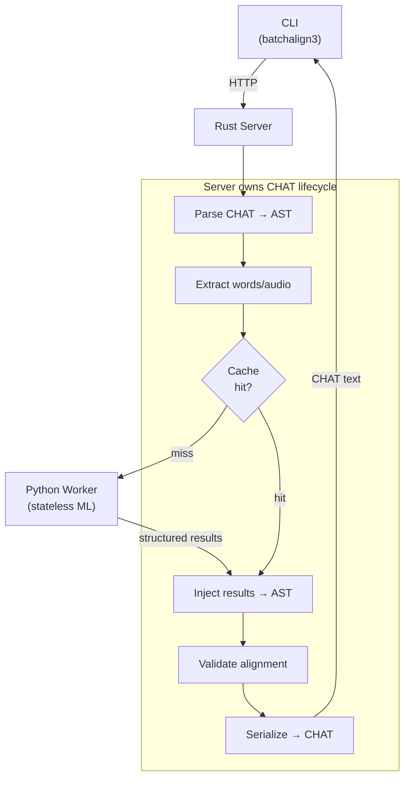
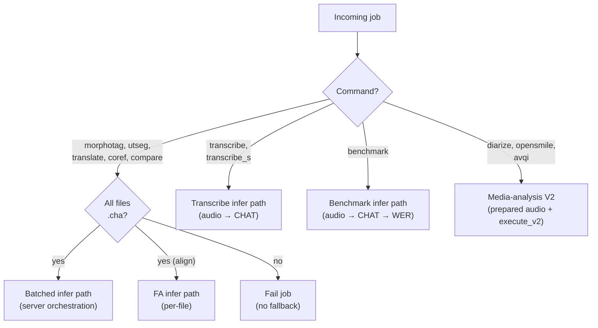
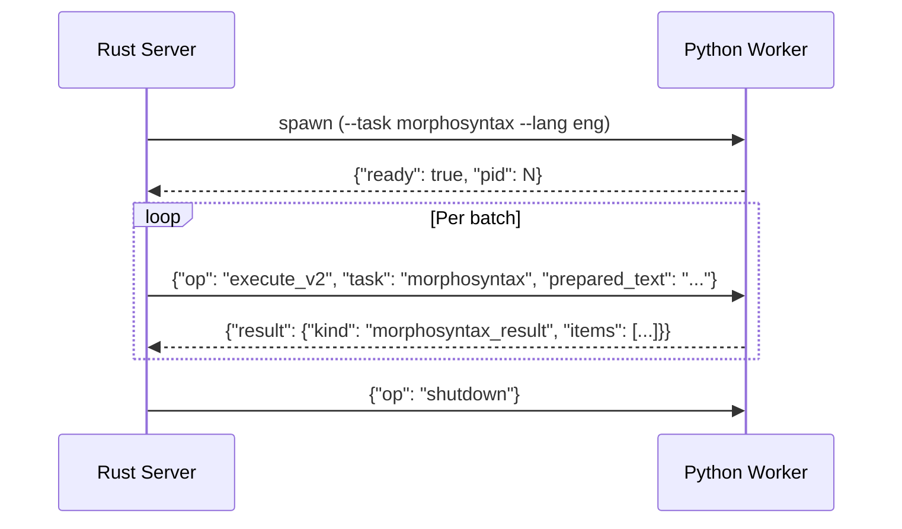

# Python-Rust Boundary

**Status:** Current
**Last updated:** 2026-09-16 04:34 EDT

The talkbank-tools workspace has two architectural layers: the **CHAT
core** (entirely Rust, no Python) and the **Batchalign runtime** (Rust
server + Python ML workers). This page describes the one and only
seam: the CHAT-ownership boundary between the Batchalign Rust server
and its Python workers.

The CHAT core has no Python in it at all. References to Python below
apply only to the Batchalign runtime layer.

## Why the Runtime Is Deliberately Hybrid

Batchalign3 is not a wholesale Python-to-Rust conversion made to follow an
industry trend. The language boundary follows ownership and correctness:

- Rust owns typed CHAT data, typestate-constrained orchestration, validation,
  cache and provenance policy, concurrency, and deterministic transcript
  transformation.
- Python owns thin adapters around the ML ecosystem where PyTorch, Stanza,
  Whisper, Pyannote, and provider SDK support is strongest.

Performance and memory efficiency are benefits of the Rust control plane, but
the primary reason for the split is to make invalid transcript and pipeline
states difficult or impossible to represent. The boundary may move when a
Rust implementation provides a clearer typed design, but replacing working ML
bindings solely to eliminate Python is not a goal.

## Server Owns the CHAT Lifecycle

```text
Server → parses CHAT → extracts payloads → checks cache →
         worker.execute_v2(task, prepared_batch) → Python runs model only →
         Server injects results → validates → serializes → CHAT text
```

Python workers never see CHAT text. They receive structured payloads
(words, audio chunks, prepared text) and return raw model output (UD
annotations, word timings, ASR tokens, parse trees). The Rust server
owns the full CHAT lifecycle.



This architecture eliminates duplicated logic between Python and Rust,
enables unified caching at the server level, and makes workers
interchangeable, any worker with the right model can serve any
request.

## Dispatch Decision

Text-only commands **require** the infer path. If a worker lacks the
required task in its `infer_tasks` capability list, the job fails with
an "upgrade required" error, there is no Python `process` fallback.



Per-command dispatch family detail is on the
[Dispatch and Execution](../runtime/dispatch.md) page (will
move under `architecture/runtime/` during the M6 merge).

## Wire Protocol

Workers communicate via stdio JSON-lines. The bootstrap handshake plus
per-job dispatch:



### Operations

| Op | Handler | Description |
|---|---|---|
| `health` | Python | Worker health status |
| `capabilities` | Python | Available infer tasks + engine versions |
| `execute_v2` | Rust dispatcher → Python model | Typed V2 execution with prepared artifacts |
| `infer` / `batch_infer` | Python | Legacy inference path (still supported) |
| `shutdown` | Protocol | Clean worker shutdown |

`dispatch_protocol_message()` validates the JSON envelope in Rust, then
calls the appropriate Python handler.

### `execute_v2` request

```json
{
  "op": "execute_v2",
  "request": {
    "request_id": "req-mor-0004",
    "task": "morphosyntax",
    "payload": {
      "kind": "morphosyntax",
      "data": { "lang": "eng", "payload_ref_id": "text-ref-0004", "item_count": 2 }
    },
    "attachments": [
      { "kind": "prepared_text", "id": "text-ref-0004", "path": "/tmp/text-ref-0004.json" }
    ]
  }
}
```

Prepared artifacts (text, audio) are owned by Rust and read by the
worker via path references in `attachments`: they do not cross IPC
inline.

### `execute_v2` response

```json
{
  "op": "execute_v2",
  "response": {
    "request_id": "req-mor-0004",
    "outcome": { "kind": "success" },
    "result": {
      "kind": "morphosyntax_result",
      "data": { "items": [ ... ] }
    }
  }
}
```

Prepared-text batch items and response items are positionally matched
(`items[i]` corresponds to batch element `i`).

## Three-Layer Split: Internal Only

The Batchalign worker side is internally split into three layers. The
split exists for maintainability, none of these layers is a public
extension surface for third-party plugins.

### 1. Core primitives (Rust)

The Rust core (`crates/batchalign/`) owns CHAT parsing and
serialization, AST-safe mutation, extraction and injection helpers,
alignment, and validation invariants. This is the only layer that
directly owns low-level CHAT mutation rules.

### 2. Inference providers (Python, internal)

`batchalign/inference/` modules, pure Python task adapters around
third-party ML libraries (Stanza, Whisper, pyannote, FunASR, Tencent,
Aliyun, etc.). They receive typed task payloads from the Rust dispatch
layer and return typed task results. They do not parse `.cha` files
and do not mutate CHAT directly. Long-term intent: push as much of
this layer into Rust as Rust gains coverage of the underlying ML
pieces (a Rust-native Whisper path, `whisper_rs`, exists behind the opt-in
`whisper-rs-backend` Cargo feature; the default build still routes Whisper
through the Python worker).

### 3. Pipeline operations (Rust)

The CHAT-aware orchestration layers in Rust, choose extraction
strategy, batch requests, call providers via worker IPC, read/write
cache, inject results, apply task-specific validation and recovery.
Pipeline operations compose core primitives instead of editing raw
CHAT text themselves.

**Why the split is load-bearing.** If providers were forced to
understand CHAT, simple SDK wrappers would become more complex than
necessary, inference adapters would couple to AST details, and
language-agnostic providers would be harder to support. If CHAT-aware
pipeline work were forced into a provider-only interface, pipelines
could not safely reuse extraction/injection logic, would end up
reimplementing CHAT logic in Python, and caching/validation policy
would drift from the core.

### Boundary rules per layer

- **Provider layer**: typed worker-IPC payloads only. No `.cha`
  parsing, no direct tier editing. Implementations are Python today;
  long-term they migrate into Rust.
- **Pipeline layer**: operates on `ChatFile` in Rust. Uses core
  extraction and injection primitives. May depend on providers, but
  does not expose provider internals.
- **Core layer**: owns structural CHAT invariants. Exposes safe
  primitives upward. Does not depend on provider-specific SDK logic.

## No Public Python API

There is no supported way to plug new providers or new pipeline
operations into Batchalign from outside the source tree. New ASR
backends, FA backends, or pipeline operations are added in-tree. See
[Adding Inference Providers](../../batchalign/developer/adding-engines.md).

The internal Python re-export module `batchalign.providers` exists to
give worker-side inference modules a stable import path for worker-IPC
payload types (`BatchInferRequest`, `BatchInferResponse`, `InferTask`,
…). It is not a public API.

The `batchalign_core` PyO3 extension module is the Rust → Python
bridge for worker processes. Its symbols change with the Rust runtime
and are not part of any compatibility surface.

For the API stability stance see
[API Stability](../../batchalign/developer/api-stability.md).

### What stays Python

| Surface | Why |
|---|---|
| `batchalign/worker/` | Thin worker host for Python-native ML runtimes |
| `batchalign/inference/` | Direct model or SDK invocation (Stanza, Whisper, pyannote, …) |
| `batchalign/inference/languages/cantonese/` | Python-only Cantonese SDK and model boundaries |
| `batchalign/models/` | Training code depending on Python ML libraries |

### What was removed

| Surface | Why removed |
|---|---|
| `ParsedChat` class + callback methods | Rust server uses `ChatFile` directly |
| `batchalign.pipeline_api` | Rust server owns pipeline orchestration |
| `batchalign.compat` | Deprecated BA2 shim, no longer needed |
| `batchalign.inference.benchmark` | WER scoring available via `batchalign3 compare` |
| Standalone `#[pyfunction]` exports (build_chat, WER, extraction, …) | Server calls `batchalign` directly |

Number expansion lives entirely in Rust (see
[Number Expansion](../../batchalign/architecture/number-expansion.md));
the Python `_number_expansion.py` and `_expand_numbers_v2.py` modules
and the `expand_numbers` V2 IPC are not used.

## `batchalign_core` Module Layout

`crates/batchalign-pyo3/src/` (~3,250 lines):

```text
lib.rs                  module registration (~80 lines)
worker_protocol.rs      IPC message dispatch
worker_asr_exec.rs      ASR execution (Whisper, Cantonese providers)
worker_fa_exec.rs       forced-alignment execution
worker_media_exec.rs    speaker diarization, OpenSMILE, AVQI
worker_text_results.rs  text task normalization + align_tokens
worker_artifacts.rs     prepared-artifact loading from IPC
cantonese_asr_bridge.rs Cantonese provider projection + field admission
py_json_bridge.rs       Python → JSON conversion, dispatched on exact type
```

`py_json_bridge.rs` is the gate every worker response and provider payload
passes through, so what it accepts is the real wire contract. It dispatches on
EXACT Python type, in this order: `None`, `bool` (before `int`, because Python's
`bool` is an `int` subclass), `str`, anything with `model_dump`, `dict`,
`list`/`tuple`, exact `int` (refused outside the 64-bit range rather than
wrapped), exact `float` (a non-finite value is refused naming its path, for
example `$.monologues[0].elements[1].start_s`), and anything else refused by
type name. It previously tried numeric extraction FIRST, and PyO3's numeric
extraction honours `__int__` / `__float__` / `__index__`, so any number-like
object silently became a JSON number: the conversion was deciding what a value
meant rather than reading what it was.

### Worker V2 executors

Each executor loads Rust-prepared artifacts from the IPC message,
calls the Python ML model, and returns raw results:

| Executor | Task | What Rust prepares | What Python does |
|---|---|---|---|
| `execute_asr_request_v2` | ASR | PCM audio bytes | Run Whisper / Cantonese provider |
| `execute_forced_alignment_request_v2` | FA | PCM audio + word JSON | Run Whisper / Wave2Vec FA |
| `execute_speaker_request_v2` | Speaker | PCM audio bytes | Run pyannote / NeMo |
| `execute_opensmile_request_v2` | OpenSMILE | PCM audio bytes | Extract acoustic features |
| `execute_avqi_request_v2` | AVQI | Paired audio bytes | Calculate voice quality |
| `normalize_*_result` (`worker_text_results.rs`) | Text tasks | n/a | Parse each host item into its tagged V2 result; an item that does not parse becomes that item's failure |

### Cantonese provider bridges

Python Cantonese ASR engines call back into Rust for output projection
(common `monologues + timed_words` shape):

| Function | Purpose |
|---|---|
| `funaudio_segments_to_asr` | FunASR segments → monologues + timed words |
| `tencent_result_detail_to_asr` | Tencent output → monologues + timed words |
| `aliyun_sentences_to_asr` | Aliyun output → monologues + timed words (with per-character tokenization when Aliyun sends a sentence without per-word timing) |

Cantonese normalization is NOT on this boundary. `normalize_cantonese` and
`cantonese_char_tokens` were exported here until 2026-09-16, for Python callers
that production no longer had; normalization now has one owner in
`batchalign-transform` and runs in the server.

They also own SPEAKER ADMISSION. A provider adapter reports
`{"kind": "attributed", "label": ...}` or `{"kind": "undiarized"}` rather than a
bare speaker number, and the bridge admits that against what the REQUEST asked
for (`ProviderDiarizationV2`): an absent speaker is `Undiarized` when no
separation was requested, and a refusal when it was. No adapter writes a track
number it was not given.

The request's half of that question crosses the boundary as the same tagged
value: `AsrBatchItem.diarization` is a `ProviderDiarizationV2`, parsed once by
Pydantic and carrying no default, so every caller says what it asked the
provider for. The one adapter that uses it, Tencent, matches on the two states
to set that service's own two parameters. It used to receive an integer whose
zero meant "do not separate" beside a Python default of 1, a count that means
"separate this into one speaker" and is refused at submission.

These bridges also own FIELD ADMISSION for the cloud providers. Tencent and
Aliyun document every result field as nullable and their SDKs leave absent
attributes as `None`, so the Python adapters forward the payload unchanged and
Rust decides what each absence means: an absent time produces an untimed word
with a named cause, never a zero, and a wrong-typed or inadmissible value
refuses the file naming the provider, the position and the fault. The rules and
the one interval owner are on the
[ASR Token Pipeline](../../batchalign/architecture/asr-token-pipeline.md#provider-adapters-absent-fields-and-the-one-interval-owner)
page.

### Rev.AI HTTP client

`crates/batchalign/src/revai/` provides Rev.AI HTTP calls. The Rust
server uses this crate directly for all Rev.AI operations (transcribe,
UTR, pre-submission). No Rev.AI functions are exposed to Python, the
PyO3 wrappers were removed as dead code.

### GIL strategy

All pure-Rust functions use `py.detach()` (PyO3 0.29) to release the
GIL during computation. Worker executors hold the GIL only during
Python model invocation.

## Python Worker Modules

`batchalign/worker/`:

| Module | Purpose |
|---|---|
| `_main.py` | Worker CLI entry point and stdio startup |
| `_model_loading/` | Task-level model-loading package (`bootstrap`, `translation`, `forced_alignment`, `asr`) |
| `_stanza_loading.py` | Stanza configuration and ISO-code mapping |
| `_execute_v2.py` | Typed V2 execute router for prepared-audio and prepared-text tasks |
| `_text_v2.py` | Thin batched text-task V2 host; Rust owns text-task batch-result shaping |
| `_artifact_inputs_v2.py` | Thin Python wrapper over Rust-owned prepared-artifact lookup, descriptor validation, file-slice reads |
| `_asr_v2.py` / `_fa_v2.py` / `_speaker_v2.py` / `_opensmile_v2.py` / `_avqi_v2.py` | Thin Python wrappers over Rust-owned executor control planes |
| `_types_v2.py` | Pydantic models mirroring V2 wire format |
| `_protocol.py` | Stdio JSON-lines serving loop |
| `_protocol_ops.py` | Thin Python wrapper over Rust-owned stdio op dispatch |
| `_handlers.py` | Health, capabilities, preflight handlers |
| `_infer_hosts.py` | Bootstrap-owned batch-infer runtime hosts |
| `_infer.py` | Thin request-time batch inference router |
| `_types.py` | Pydantic models mirroring Rust wire format |

`batchalign/inference/`:

| Module | Input → Output |
|---|---|
| `morphosyntax.py` | words+lang → raw Stanza UD annotations |
| `utseg.py` | words+lang → raw constituency parse tree |
| `translate.py` | text+lang → translated text |
| `coref.py` | sentences → coreference chains |
| `fa.py` | audio+words → raw word-level timings |
| `asr.py` | audio path / prepared waveform → raw ASR payloads |
| `speaker.py` | prepared waveform → backend-specific raw speaker evidence (completed pyannoteAI job or local segments) |
| `opensmile.py` | prepared waveform → raw acoustic feature rows |
| `avqi.py` | paired prepared waveforms → raw voice quality metrics |

Each is a pure inference function, no CHAT parsing, no text
processing, no domain logic.

## Capability Discovery

Capabilities are detected **lazily** from the first real worker spawn,
no dedicated probe worker at startup. When the first worker for any
profile starts up, the Rust server queries it and:

1. **Infer tasks**: which inference backends are available
   (`_capabilities()` import probes in
   `batchalign/worker/_handlers.py`).
2. **Engine versions**: one entry per advertised infer task, keyed by task.
   Forced alignment's entry is a validated engine name (`ReportedEngineName`,
   a wrapper over `StampSafeText`: non-blank, no surrounding whitespace, none
   of `|`, `;`, `]` or a line break), or `null` before an FA model has loaded.
   Every other task's entry is `null`.

`WorkerPool::record_capabilities()` admits the report once, into
`WorkerEngineReports` (`crates/batchalign/src/engine_reports.rs`), and stores
the admitted form per worker key; nothing downstream reads the raw report. The
released command surface is derived from it by `capability::command_supported`,
the one availability rule that dispatch applies too: a command is advertised
when the worker supports the `primary_infer_task` of the command's
`CapabilityPlan` (`crates/batchalign/src/recipe_runner/command_spec.rs`,
declared per entry in `recipe_runner/catalog.rs`). Engine names are not
consulted. A plan names ONE task. A second declared list, `additional_infer_tasks`,
was deleted on 2026-09-16: a later stage does not run on the worker this plan
admitted, but goes back to the pool and derives its own key from its own
request, so the speaker stage of `transcribe_s` is served by a speaker worker
about which the admitting ASR worker's report says nothing. Server-owned commands (`transcribe`,
`transcribe_s`, `benchmark`) are synthesized there from ASR availability
rather than advertised by the worker.

### Infer-task probes

Each `InferTask` has a set of Python imports that must succeed for it
to be advertised:

| InferTask | Required imports | `engine_versions` entry |
|---|---|---|
| `morphosyntax` | `stanza` | `null` |
| `utseg` | `stanza` | `null` |
| `coref` | `stanza` | `null` |
| `translate` | `googletrans` | `null` |
| `fa` | `torch`, `torchaudio` | the loaded FA model name; `null` until FA loads |
| `asr` | `whisper` or a configured Rev.AI key | `null` |
| `opensmile` | `opensmile` | `null` |
| `avqi` | `parselmouth`, `torchaudio` | `null` |
| `speaker` | `pyannote.audio` | `null` |

Task advertisement uses import probes. The FA engine name is the opposite: it
reflects what has actually loaded, so it is `null` before that. Only
`_reported_engine()` in `batchalign/worker/_handlers.py` decides these
entries, and it names FA's engine alone; a test-echo worker reports
`"test-echo"` for FA and `null` for the rest.

Rev.AI-backed server-mode transcription and Rev-backed UTR are
synthesized on the Rust side. The infer-task table represents "can the
system satisfy this infer task at all?", not only "can Python import a
local model package?".

> **Design note:** Probes use **import probes** (can the dependency be
> imported?), not loaded model state (is a model warmed up?). This is
> critical because the worker that reports capabilities may only load
> models for one command, but Rust still needs enough information to
> derive the released command surface. All dependencies in the table
> are part of the base `batchalign3` package, so any standard
> install gives you every built-in engine family. The import probes exist as a safety net for environments
> where a dependency failed to install or was removed.

`speaker` is a low-level worker infer task, not a CLI command named
`speaker`. Two user-facing surfaces compose it: integrated
`transcribe --diarization enabled` (internally `transcribe_s`) and standalone
`diarize`, which writes anonymous `.turns.json` evidence for later use by
`chatter rediarize`.

### Sample capabilities response

```json
{
  "commands": [],
  "infer_tasks": ["morphosyntax", "utseg", "translate", "coref", "fa",
                  "asr", "opensmile", "avqi", "speaker"],
  "engine_versions": {
    "morphosyntax": null,
    "utseg": null,
    "translate": null,
    "coref": null,
    "fa": "whisper-fa-large-v2",
    "asr": null,
    "opensmile": null,
    "avqi": null,
    "speaker": null
  }
}
```

Every advertised task has exactly one `engine_versions` entry: FA's engine
name (or `null` until an FA engine has loaded), and `null` for every other
task. A blank or separator-bearing name, or a key that is not a task, is
refused while the report is deserialized; admission
(`WorkerEngineReports::admit`) refuses a missing entry, an entry for a task
that was not advertised, or a name for any task other than forced alignment
(`EngineReportAdmissionError::EngineNamedForNonFaTask`, reported as
`{"kind": "engine_named_for_non_fa_task", "task": "<task>"}`). A refused report
is recorded as that worker key's refusal (`WorkerError::CapabilitiesRefused`
to the caller), and `/health` lists every key's latest outcome in
`worker_capability_admissions`, so an operator sees why a worker is not used.

Only forced alignment reads its engine from this map, because its cache rows
are namespaced by that engine before any worker runs: when the FA worker
reports a new engine, cached FA results for the old one miss. A worker that
supports FA but has not loaded it yet still advertises `align`; dispatch loads
FA on the selected worker (`ensure_task`), reads the report again, and
`FaCacheNamespace::from_loaded` refuses only if the engine is still `null`
after that load (or the report was taken after another task loaded).
Morphosyntax, translation and coreference name their engines on every result
item instead (see [Worker Protocol V2](../../batchalign/developer/worker-protocol-v2.md)),
so their provenance comes from the results a file applied, never from this
map. The `commands` field remains only as compatibility metadata on the older
`infer` / `batch_infer` IPC ops. The authoritative capability contract is
`infer_tasks`, which alone decides the command surface, plus FA's
`engine_versions` entry, which is read only at dispatch.

### Checking capabilities at runtime

```bash
curl http://localhost:8000/health | python3 -m json.tool
```

The `capabilities` field lists all advertised commands. If a command
you expect is missing, the corresponding infer task likely failed its
import probe, or the worker's report was refused (see
`worker_capability_admissions` in the same response). Engine names never
decide whether a command is advertised.

## See also

- [INTERFACE_MAP.md](https://github.com/FranklinChen/talkbank-tools/blob/main/INTERFACE_MAP.md)
 , unified reference for all 9+ Python/Rust interface boundaries
  (file locations, schema definitions, responsibility splits).
- Per-command engine surfaces (request/response shapes per task,
  per-command server orchestration steps): on the
  [Dispatch and Execution](../runtime/dispatch.md) page.
- [Cantonese and CJK, Architecture](../language-and-multilingual/cantonese-and-cjk.md)
  for the Cantonese-specific Python ↔ Rust seam.
