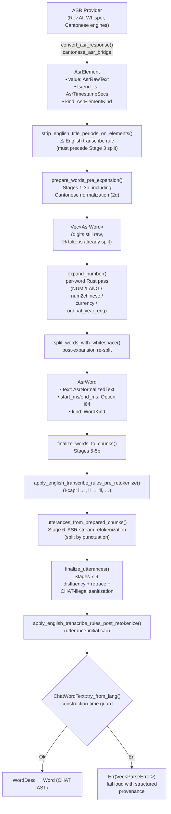
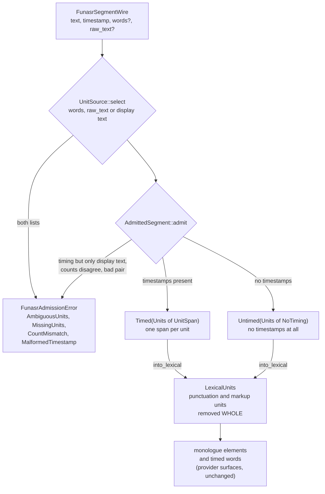
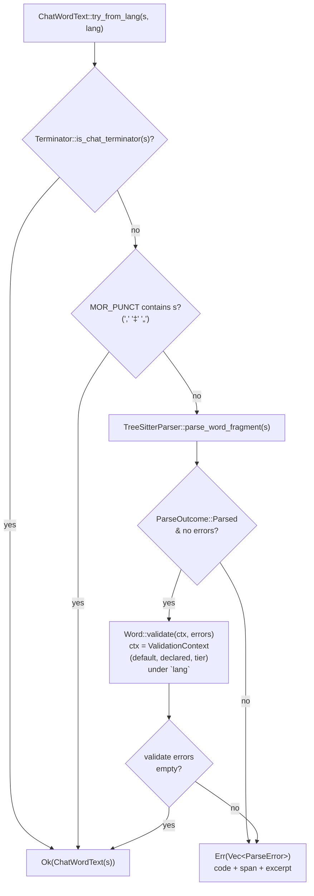
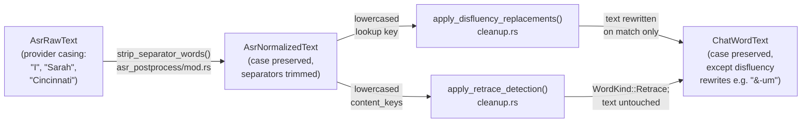
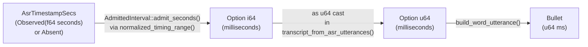
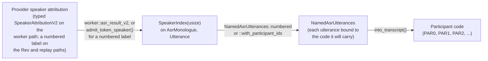
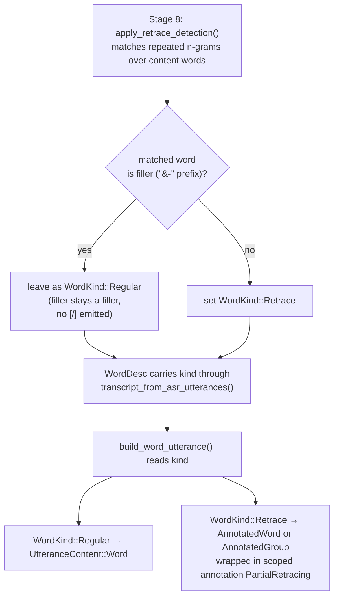

# ASR Token Pipeline

**Status:** Current
**Last updated:** 2026-09-16 22:56 EDT

This page documents the complete lifecycle of text tokens as they flow from
ASR providers through post-processing into the CHAT AST. Each stage has a
dedicated newtype that encodes what transformations the text has undergone.

> **Note on "Stage 6: retokenization" naming.** Stage 6 below is
> *ASR-stream retokenization*, splitting a raw provider token stream
> into utterances by punctuation. It is unrelated to the *morphosyntax
> retokenization* that runs at morphotag time to reshape CHAT words
> against Stanza's tokenization. For the distinction, route map, and
> per-language gap analysis, see
> [Retokenization, Overview](../reference/retokenization-overview.md).

## Segmentation admission travels with the ASR plan

`AdmittedTranscribePlan<P>` owns the ASR plan and its segmentation admission.
The constructor resolves a requested language before inference, records a
separate disabled state, or defers resolution until automatic language
detection completes. Callers cannot replace the language or fallback policy
independently of that admission.

`Recognized::admit` pairs each ASR result with its admitted route. It carries a
known route forward unchanged and refuses a different primary language. For
automatic detection it resolves the deferred route once. The recognized state
then travels through post-processing and CHAT assembly; both segmentation
stages take their language and fallback policy from that state.

HTTP request validation still rejects unsupported requests before creating a
job. Stored jobs are admitted again at dispatch against the current build;
capability proofs are runtime values and are not serialized as durable
authority. Live transcription, benchmark ASR and offline replay all construct
the same owning plan, with their existing segmentation policies.

## Type Progression



The three yellow-tinged English transcribe-rule hooks
(`strip_english_title_periods_on_elements`,
`apply_english_transcribe_rules_pre_retokenize`,
`apply_english_transcribe_rules_post_retokenize`) each fire at a
specific stage because of pipeline-interaction concerns:

- **Title-period strip BEFORE stage 3.** Stage 3's
  `normalized_split_separator` treats `.` as a word separator and
  would fragment `Dr.` into `Dr` + `.` before the allowlist could
  match. Stripping early keeps `Dr` as a single element.
- **I-cap in `finalize_words_to_chunks`.** Per-word rewrite; no
  stage-interaction concern.
- **Utterance-initial cap AFTER stage 7 retrace detection.** The
  rule needs to skip retrace-marked copies to land on the "real"
  utterance-initial word at the end of a retrace chain.

All three are English-gated. See
[English Transcribe Corrections](../reference/english-transcribe-corrections.md)
for the rule contracts and probe-verdict citations.

The `TryFrom` gate at the end is the boundary where the pipeline's
`AsrNormalizedText` becomes the CHAT domain's `ChatWordText`.
Construction runs the word-fragment parser (plus the language-aware
`Word::validate`) and returns structured `ParseError`s on failure, the
pipeline surfaces them verbatim to the user instead of producing an
invalid CHAT file. See [Construction-Time Validation](#construction-time-validation)
below.

## Provider Adapters: FunASR Unit Admission

Worker-hosted engines hand the server tokens that a provider adapter has
already shaped. For FunASR (`funaudio`, `paraformer`) that adapter is
`crates/batchalign-pyo3/src/cantonese_asr_bridge/funasr_projection.rs`, and its one job is to pair
each recognized unit with the timestamp FunASR reported for THAT unit.

FunASR returns a flat `timestamp` array with one `[start_ms, end_ms]` entry
per unit, but the units live in a checkpoint-specific list:

| Checkpoint | Unit list parallel to `timestamp` | Why `text` cannot be used |
|---|---|---|
| Paraformer (`paraformer-zh` with the `ct-punc-c` punctuation model) | `raw_text`, requested with `return_raw_text=True`: one whitespace token per timestamp (a Han character or a Latin word) | `text` is punctuated and contains no spaces at all |
| SenseVoice | `words`, built by FunASR in lockstep with `timestamp`, punctuation units included | `text` carries `<\|...\|>` markup and ITN punctuation |



Three properties are worth knowing before touching this code:

- **Display text is only ever an untimed source.** When FunASR sent no unit
  list, the display text is split the way FunASR itself tokenizes (each Han
  character a unit, other runs whole, punctuation and `<|...|>` markup as
  separators), and admission refuses it if timing arrived as well. Timed and
  untimed segments then travel the same lexical and normalization stages.
- **Positional pairing over re-tokenized text is not representable.**
  `Units` has a private field and one constructor, `admit`, which checks that
  the unit and timestamp counts agree before zipping them. Until
  2026-09-15 the adapter split `text` itself and paired the i-th token with
  the i-th timestamp. For Paraformer that paired punctuation-delimited clauses
  with per-character timestamps (a 437 s recording came out with every bullet
  inside its first 50 s); for SenseVoice, dropping punctuation from the text
  but not from the timestamps shifted every later character by one entry per
  punctuation mark.
- **Surfaces leave this adapter exactly as FunASR wrote them.** Cantonese
  normalization used to run here too, over the joined segment. That made a
  transcript's text depend on which engine produced it, because Qwen and Whisper
  never pass through this module, and it put a second owner on a transformation
  that is not idempotent. Normalization now happens once per monologue in the
  server (stage 2d below), through `AlignedNormalization`, which proves the
  character count did not change before handing each word back its own
  characters.

A refusal fails the file rather than emitting partially mistimed CHAT.

## Provider Adapters: absent fields, and the one interval owner

FunASR's admission above answers "which unit does this timestamp belong to".
The cloud providers raise a different question: what it means when a field is
not there at all.

Tencent documents every property of `SentenceDetail` and `SentenceWords` as
nullable, and its Python SDK initializes each attribute to `None` before
deserializing a response, so an absent field is the SDK's resting state rather
than an anomaly. Aliyun's per-word entries are the same. Until 2026-09-16 the
bridge read them with `.ok().and_then(...).unwrap_or(0)`, so three different
facts, "the provider did not send this", "the provider sent the wrong type",
and "the provider sent zero", arrived as one number. Zero is a legal time and a
legal speaker, so the fabrication was invisible downstream.

| Provider field | Absent used to mean | Absent now means |
|---|---|---|
| Tencent `StartMs` | the segment starts at the beginning of the recording | every word in the segment is untimed (`SegmentStartAbsent`) |
| Tencent `OffsetStartMs` / `OffsetEndMs` | the word starts at its segment's start; a missing end copied the start | the word is untimed, with the missing bound named |
| Tencent `Word` | the empty string, which the blank filter then dropped | a refusal naming the segment and word |
| Tencent `SpeakerId` | speaker 0 | undiarized when separation was not requested; a REFUSAL when it was (see below) |
| Aliyun `startTime` / `endTime` | a span beginning at 0 ms | the word is untimed, with the missing bound named |

Every field is read through `FieldRead<T>` (`Absent`, `Present`, `WrongType`),
which has no default and no `unwrap_or`, so each caller must say what an absence
means where it knows. An absent time becomes an untimed word; a value of the
wrong type refuses the file with a message naming the provider, the position
(`segment 3 word 7`) and the fault.

**One owner for rounding and range admission.**
`AdmittedInterval` (`crates/batchalign-transform/src/asr_postprocess/timing.rs`)
is the only way to turn provider numbers into milliseconds. Its fields are
private and every constructor is fallible, so holding one is a proof that the
value was rounded once, by it, and admitted:

- non-finite bounds are refused rather than saturated by an `as i64` cast;
- negative bounds are refused;
- inverted intervals are refused rather than silently reordered;
- bounds beyond `MAX_MS` (10^12 ms, about 31.7 years) are refused, which is
  what catches a provider sending an absolute epoch timestamp where a media
  offset belongs, while admitting any real recording;
- a segment start plus a word offset is added with CHECKED arithmetic, because
  a wrapped sum is a wrong time that looks exactly like a right one.

Rounding is half away from zero, the same rule the scattered
`(seconds * 1000.0).round()` expressions used, so every input those handled
correctly produces identical numbers.

`WordTiming` is the other half: a word is `Timed(AdmittedInterval)` or
`Untimed(cause)`, where the cause is a closed set (`ProviderReportedNoTiming`,
`ProviderReportedNoStart`, `ProviderReportedNoEnd`, `SegmentStartAbsent`,
`ZeroLengthSpan`, `RefusedByAdmission`). A zero-width span is admissible as an
interval but is never a timed word, because it locates nothing. Deep inside the
post-processing pipeline, which is a total transform with no error channel, an
inadmissible pair becomes `RefusedByAdmission` rather than a fabricated number.

**Speaker attribution is a tagged value, end to end.** `AsrMonologueV2.speaker`
is `SpeakerAttributionV2`: either `{"kind": "attributed", "label": "..."}`
carrying the provider's OWN label, or `{"kind": "undiarized"}`. It was a bare
string, so an engine that separates nobody had to write something, and what it
wrote was `"0"`, which no reader could tell from a provider's real first
speaker.

Aliyun performs no speaker separation, and FunASR's recognizer passes
`spk_model="cam++"` to `generate` while funasr builds its speaker model in
`AutoModel.__init__` and only consults `self.spk_model`, so that argument is
inert and no `sentence_info` speaker labels are produced (verified against the
installed funasr 1.4.12). Those monologues report `undiarized`, which is a
claim about the ENGINE rather than a guess about the recording.

**The request says whether separation was asked for.** `ProviderMediaInputV2`
carries `ProviderDiarizationV2`, `not_requested` or `integrated` with a count,
derived once from the job's speaker count by
`ProviderDiarizationV2::for_expected_speakers`, which is the only route from a
raw count into the type (one speaker is not a separation request; two or more is
a request for exactly that many, and the count is a `SeparatedSpeakersV2`, which
cannot hold less than two). The same value reaches the Python provider adapters
as `AsrBatchItem.diarization`. That is what lets the bridge tell the two
absences apart:

| Provider said | Request asked | Result |
|---|---|---|
| a label | either | `Attributed`, with the label admitted non-empty |
| no speaker | `not_requested` | `Undiarized` |
| no speaker | `integrated` | **refused**: the provider was asked to separate and named nobody |

Downstream, `worker::asr_result_v2` maps an attributed label to its speaker
number and `Undiarized` to the single track of an unseparated recording. That
is the ONE place track zero is chosen, and it is chosen because the engine said
it separates nobody, never because a label was missing. The legacy admission in
`transcribe::asr_output` (Rev's own projection and replayed
`_asr_response.json` evidence, both numeric) accepts a speaker number including
zero and no longer reads a suffix out of labels with `rsplit('_')`, which used
to merge distinct labels such as `A_0` and `B_0` onto one track.

**What crosses the boundary at all.** `py_to_json_value`
(`crates/batchalign-pyo3/src/py_json_bridge.rs`) dispatches on EXACT Python
type, in this order: `None`, `bool` (before `int`, since Python's `bool` is an
`int` subclass), `str`, anything with `model_dump`, `dict`, `list`/`tuple`,
exact `int` (refused outside the 64-bit range rather than wrapped), exact
`float` (a non-finite value is refused NAMING ITS PATH, for example
`$.monologues[0].elements[1].start_s`). Anything else is refused by type name.
It previously tried numeric extraction first, and PyO3's numeric extraction
honours `__int__`/`__float__`/`__index__`, so any number-like object became a
JSON number: the conversion decided what a value meant rather than reading what
it was.

## Pipeline Stages

The transcribe pipeline runs entirely in Rust. Stages 1-3 produce raw
`AsrWord`s, the per-word expansion pass (`expand_number`) handles
every numeric token via the per-language registry, English ordinal/
decade composer, CJK converter, currency table, and dash splitter.
Stages 5-8 run after expansion. The Python `num2words` IPC was
removed (see [Number Expansion](../reference/number-expansion.md)).

The functions involved are:
`prepare_words_pre_expansion()` (stages 1-3, Cantonese normalization included),
`expand_number()` plus `split_words_with_whitespace()` (stage 4 + 4.5), and
`finalize_words_to_chunks()` (stages 5-5b). The monolithic `process_raw_asr()`
is a sync fallback that follows the same shape. Both return a `Result`: their
one failure is a Cantonese normalization that changed a monologue's character
count.

| # | Stage | Function | What changes |
|---|-------|----------|-------------|
| 1 | Compound merging | `prepare_words_pre_expansion()` | Adjacent compound pairs joined ("air"+"plane" → "airplane") |
| 2 | Timed word extraction + separator strip | `prepare_words_pre_expansion()` | Seconds → ms, pause markers filtered, MOR_PUNCT (`,` `„` `‡`) and RTL separators trimmed from word boundaries. **Case is preserved**: see "Casing" below. |
| 2d | **Cantonese normalization** (lang=yue only) | `prepare_words_pre_expansion()` | The monologue's words are normalized as ONE run through `AlignedNormalization` (simplified → traditional plus the 31-entry domain table), and each word gets back exactly its own characters. It runs before stage 3 because that stage interpolates timestamps across a token's characters and must see final text, and because normalizing afterwards would normalize one character at a time and lose every multi-character replacement. A conversion that changed the character count refuses the file (`NormalizationChangedLength`, carrying both counts) rather than re-cutting words away from their timings. |
| 3 | Multi-word splitting | `prepare_words_pre_expansion()` | Space-containing tokens split, timestamps interpolated, hyphens joined |
| 3b | **Percent-suffix split** | `split_percent_suffix_words()` | `"80%"` → `"80"` + per-language percent word ("percent" for eng, 11 languages covered) with proportional timing. `%` is the CHAT dep-tier sigil and structurally illegal on the main tier in any language. Dormant for single-language en/es (see below); fires for languages where Rev.AI applies ITN. For code-switched text (`AsrTextLanguage::CodeSwitched`) the digit group is kept and `%` dropped, because no language is known to write the percent word in. |
| 4 | **Number expansion** | `expand_number()` per word | Single Rust pass: cardinals via per-language `NUM2LANG` (47 langs); CJK via `num2chinese`; English ordinals/decades via `ordinal_year_eng`; currency via `try_expand_currency`; percent via per-lang table; dash-ranges split and recurse; digit-leading hyphen compounds (`"17-year-old"` → `"seventeen-year-old"` in digit-rejecting languages) via `try_expand_digit_leading_hyphen`. **Skipped for code-switched text**: nothing says which language a numeral was spoken in, so digits stay digits and are reported for review rather than written out as words the speaker may not have said. |
| 4.5 | **Post-expansion re-split** | `split_words_with_whitespace()` | Expansion can produce multi-word text (`"100"` → `"one hundred"`, `"$80"` → `"eighty dollars"`). A `ChatWordText` holds one main-tier token, so whitespace-bearing entries are split into separate `AsrWord`s with proportionally distributed timing. |

### Rev.AI and the stage-3b/4/4.5 defense-in-depth

For Rev.AI in English and Spanish, BA3 sends
`skip_postprocessing=true` (see `rev_submit_options` in
`crates/batchalign/src/revai/asr.rs`, driven by the option column of
`REV_LANGUAGES`).
Per Rev.AI's docs this tells the service to skip Inverse Text
Normalization (ITN): the response comes back in **spoken form**,
`"eighty"`, `"percent"`, `"seventeen"`, `"year"`, `"old"`: rather
than written form with digits and `%`. Stage 3b and the digit-leading
hyphen branch of stage 4 therefore see no input to normalize on the
en/es production path; the raw tokens they were built to handle don't
appear.

These stages remain in the pipeline for two reasons:

1. **Other languages.** Per the Rev.AI API docs,
   `skip_postprocessing` is available only for English and Spanish.
   For every other language Rev.AI applies ITN by default and the
   request body omits the flag. The normalizer stages still fire for
   those responses. (The live API's refusal message also lists French
   and Portuguese as accepting the flag; BA3 does not send it for them.)
   Rev.AI's multilingual English/Spanish model (`en/es`) refuses the
   flag outright (HTTP 400), so a code-switched transcript arrives in
   written form; there stages 3b and 4 keep the digits, as above.
2. **Defense in depth.** A future Rev.AI behavior change, a swap to
   an ASR provider that also applies ITN, or a regression in the
   flag-setting policy would reintroduce the input class these stages
   handle. They cost nothing to keep and prevent silent regressions.

Two layers protect the downstream CHAT build. Stage 9 (oracle-driven
sanitization) is the first line, it rebuilds a CHAT-legal prefix for
any token whose interior contains characters the grammar rejects
(Whisper's bare `:` leaks, Tencent's `~`, exotic Unicode glued to ASCII
letters) and drops the token entirely only when no legal prefix
survives. The final enforcement is the `ChatWordText::try_from_lang`
gate at the end of the pipeline (see below), language-agnostic,
engine-agnostic, and failure-loud, which fires only for tokens that
sanitization cannot recover. Before stage 9 landed, a single
grammar-illegal char anywhere in the transcript would fail the entire
file at this gate; the v2 Cantonese ASR benchmark lost 6 of 18
fixtures this way.
| 5 | Long turn splitting | `finalize_words_to_chunks()` | Chunks > 300 words split |
| 5b | Pause-based splitting | `finalize_words_to_chunks()` | A gap of at least 800 ms creates a boundary only when the next word is an English sentence starter (`LONG_PAUSE_SENTENCE_STARTERS`); it never fires for non-English text |
| 6 | Retokenization | `utterances_from_prepared_chunks()` | Split into utterances by punctuation boundaries |
| 7 | Disfluency replacement | `finalize_utterances()` | Filled pauses marked ("um" → "&-um"), orthographic replacements |
| 8 | N-gram retrace detection | `finalize_utterances()` | Repeated n-grams marked with `WordKind::Retrace`. **Fillers (`&-` prefix) participate in matching but are never marked Retrace**: see [Retrace Detection](../reference/retrace-detection.md#fillers-do-not-produce-retrace-markers). |
| 9 | CHAT-illegal char sanitization | `finalize_utterances()` → `sanitize_chat_illegal_chars_in_utterances()` (`asr_postprocess/cleanup.rs`) | For each word whose interior fails `ChatWordText::try_from`, greedily rebuild a CHAT-legal prefix character by character (push, check via the oracle, pop on reject). Drop the word when the rebuilt string is empty. Engine-emitted noise (`:` from Whisper, `~` from Tencent, exotic glyphs) no longer destroys whole utterances. Runs after number expansion so monetary / numeric expansions are already in word form when the oracle sees them. |

## Text Newtypes at Each Stage

| Type | On struct | Contains | Constructor |
|------|-----------|----------|-------------|
| `AsrRawText` | `AsrElement.value` | Raw provider output: digits, spaces, provider markers | `AsrRawText::new(s)`: infallible |
| `AsrNormalizedText` | `AsrWord.text` | Compound-merged, number-expanded, disfluency-marked text | `AsrNormalizedText::new(s)`: infallible |
| `ChatWordText` | `WordDesc.text` | **A runtime-checked proof** that `s` is either a closed-set CHAT terminator / `MOR_PUNCT` separator (`.`, `?`, `!`, `+...`, `,`, `‡`, `„`), or text the tree-sitter word-fragment parser accepts as a legal main-tier word, and (for the `_lang` variants) satisfies every word-level rule `talkbank_model::Validate for Word` applies under the declared language including E220 digit policy. | **Fallible only:** `ChatWordText::try_from`, `try_from_with_parser`, `try_from_lang`, `try_from_lang_with_parser`. No infallible `new`. |

The progression is **asymmetric on purpose**: `AsrRawText` and
`AsrNormalizedText` are pipeline-internal and carry whatever the
provider returned; `ChatWordText` is the handoff boundary into CHAT
assembly, and its constructor is the enforcement point for the
invariant that every word in a `ChatFile` is CHAT-legal. Attempting
to construct a `ChatWordText` from text the CHAT grammar rejects
fails loudly at the boundary with a typed error naming the offending
utterance, speaker, language, and token, rather than producing a
`ChatFile` that fails silently at a downstream parse gate.

All three types use `#[serde(transparent)]`, `as_str()`, `Display`,
`AsRef<str>`. `AsrNormalizedText` additionally provides `map()` for
pipeline stage transformations and `push_str()` for hyphen-joining.

## Construction-Time Validation



The two short-circuits (terminator, MOR_PUNCT) exist because the ASR
pipeline emits each utterance's terminator as a regular `AsrWord` entry,
and separator tokens (`,`, `‡`, `„`) appear as standalone `AsrWord`s
after stage 2b boundary stripping. These are main-tier-legal but not
words, `parse_word_fragment` correctly rejects them; the short-circuit
lets them through.

The `try_from_with_parser` variant skips the language-validation branch
and is for callers that don't know the language. The `_with_parser`
variants take a caller-supplied `TreeSitterParser` handle; the bare
`try_from` and `try_from_lang` use a thread-local parser (the underlying
`TreeSitterParser` is `!Send + !Sync`).

Fallible construction in isolation isn't enough, the pipeline's
upstream normalizer stages must actually *produce* CHAT-legal text.
That responsibility is shared with stage 3b (percent split), stage 4
(number expansion + digit-hyphen rewrite), and stage 4.5
(post-expansion re-split). The policy is "fail loud on unknown
shapes": each new class of ASR token that trips the `TryFrom` gate
gets a normalizer rule added upstream so legitimate inputs don't
reach the gate only to fail.

## Casing

The pipeline preserves the case that the ASR provider returned. The English
pronoun `"I"`, its contractions (`"I'm"`, `"I'd"`, `"I'll"`, `"I've"`), and
proper nouns (`"Mike"`, `"Cincinnati"`, `"Sarah"`) all flow unchanged from
`AsrRawText` through every stage into the final `ChatWordText` on the main
tier. Stage 2 strips separator punctuation from word boundaries but does
not change letter case.

Two downstream stages need to compare words without regard to case. They
lowercase *only their comparison key*; the stored word text is never
rewritten to lowercase:

- Disfluency replacement (`apply_disfluency_replacements`,
  `asr_postprocess/cleanup.rs`) uses a lowercased lookup key to find
  entries like `"um"` / `"Um"` / `"UM"` in the per-language filled-pause
  table. A hit *replaces* the text with the CHAT form (`&-um`); a miss
  leaves the original text alone.
- Retrace detection (`apply_retrace_detection`,
  `asr_postprocess/cleanup.rs`) builds a lowercased `content_keys` vector
  and uses it for n-gram equality; the stored word text is left in its
  original case so CHAT output still shows `"I [/] I"` rather than
  `"i [/] i"`.



Verified against source: `strip_separator_words` in
`crates/batchalign-transform/src/asr_postprocess/mod.rs`;
`apply_disfluency_replacements` and `apply_retrace_detection` in
`crates/batchalign-transform/src/asr_postprocess/cleanup.rs`.

## Timing Flow



`AsrTimestampSecs` is the provider's endpoint on `AsrElement`, and it has two
variants rather than a raw number: `Observed(f64)` for an endpoint the provider
reported, including a real zero, and `Absent` for one it never sent. It
serializes untagged, so an observed endpoint is a number and an absent one is
`null`, never a numeric sentinel, and an absent endpoint yields an untimed word
instead of a word at time zero. The internal `AsrWord` timing (`Option i64`) is
deliberately NOT wrapped, these are pipeline-internal values that never cross a
module boundary.

The seconds-to-milliseconds step is no longer done here. `normalized_timing_range`
delegates to `AdmittedInterval`, the one owner described above, and records an
inadmissible pair as an untimed word with a named cause instead of converting it.
Absent, zero-width and inverted spans behave exactly as they did (the word
carries no timing); what changed is that a negative bound with a later end used
to reach a word as a negative millisecond time, and a value beyond `i64`
saturated into a plausible one.

## Speaker Flow



`SpeakerIndex` is a zero-based index into the recording's speaker list.
It lives on both `AsrMonologue` (raw) and `Utterance` (post-processed).

`NamedAsrUtterances` is the only route from those utterances to a transcript.
It binds each utterance to the speaker code that utterance will carry and keeps
the source list beside the naming, so a transcript is built from exactly the
utterances that were named. Both refusals are typed: explicit codes must cover
every observed speaker, and one they miss is
`TranscriptBuildError::MissingParticipantCode` carrying that speaker's index
rather than a code invented for it, while a build with no primary language is
`TranscriptBuildError::MissingPrimaryLanguage`. `transcript_from_asr_utterances`
remains as the one-call spelling of "name these utterances with these codes,
then build"; the assembly itself lives in `build_chat.rs`.

## WordKind Lifecycle

`WordKind` is set during stage 8 (retrace detection) and consumed during
CHAT assembly:



The filler gate mirrors BA2's `if j.type != TokenType.FP` check in
`NgramRetraceEngine.process()`. Fillers are included in the n-gram
match window (so `&-um I &-um I went` still detects the bigram repeat
and marks the first `I` as Retrace), but filler tokens themselves
never carry `[/]`.

Both single-word (`word [/]`) and multi-word (`<word word> [/]`) retraces
produce `UtteranceContent::Retrace`. The `Retrace` type carries the retrace
kind (`Partial`, `Full`, `Multiple`, `Reformulation`, `Uncertain`) and a
flag for whether the original was a group.

## AsrElementKind Enum

```rust,ignore
#[derive(Debug, Clone, Copy, PartialEq, Eq, Serialize, Deserialize, Default)]
#[serde(rename_all = "lowercase")]
pub enum AsrElementKind {
    #[default]
    Text,
    Punctuation,
}
```

Replaces the former `r#type: String` field. Serializes as `"text"` / `"punctuation"`
for JSON compatibility. The field is currently not read by the pipeline
(`extract_timed_words` uses content heuristics), but it preserves provider metadata
for debugging and potential future use.

## Reverse Direction: CHAT to NLP

The reverse flow (extracting words from CHAT for NLP processing) uses separate
provenance types defined in `text_types.rs`:

| Type | Source | Used for |
|------|--------|----------|
| `ChatRawText` | `Word::raw_text()` | AST preservation, display |
| `ChatCleanedText` | `Word::cleaned_text()` | NLP models, alignment, cache keys |
| `SpeakerCode` | `Utterance.speaker` | Per-speaker analysis keying |

These types are documented in
[Type-Driven Design](type-driven-design.md#2-provenance-newtypes).

## Code References

| Component | File |
|-----------|------|
| ASR types and newtypes | `crates/batchalign-transform/src/asr_postprocess/asr_types.rs` |
| Pipeline orchestrator | `crates/batchalign-transform/src/asr_postprocess/mod.rs` |
| Compound merging | `crates/batchalign-transform/src/asr_postprocess/compounds.rs` |
| Disfluency and retrace | `crates/batchalign-transform/src/asr_postprocess/cleanup.rs` |
| Number expansion | `crates/batchalign-transform/src/asr_postprocess/num2text.rs` |
| Cantonese normalization | `crates/batchalign-transform/src/asr_postprocess/cantonese.rs` |
| FunASR unit admission | `crates/batchalign-pyo3/src/cantonese_asr_bridge/funasr_projection.rs` |
| CHAT assembly | `crates/batchalign-transform/src/build_chat/` (directory) |
| CHAT-direction newtypes | `../chatter/crates/talkbank-model/src/text_types.rs` |
