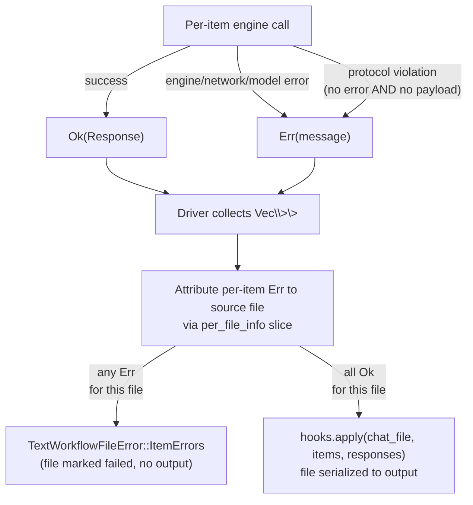

# Graceful Failure Invariant

**Status:** Current
**Last updated:** 2026-09-22 17:47 EDT

## The rule

Every per-item runtime error from a Python worker, engine failure,
network failure, model error, protocol violation, propagates to the
caller as a **typed failure**. No code path silently drops a per-item
error and emits an empty success-shaped response in its place.

This rule is system-wide. It applies to every command in batchalign3:
`align`, `transcribe`, `morphotag`, `translate`, `utseg`, `coref`,
`benchmark`, `opensmile`, `avqi`, `compare`.

## Why this rule exists

The opposite shape, log a warning, push an empty response, continue,
turns failures into invisible data loss. A user runs the job, the
job exits "successfully", the output file is shorter than it should
be, and the only signal lives in a tracing log nobody reads. We have
seen this pattern produce missing `%xtra` tiers when Google Translate
is GFW-blocked, missing `%mor` tiers when Stanza's per-item output is
malformed, missing utseg assignments when a constituency tree is
malformed, and missing `%xcoref` annotations when the coref worker
fails on one document inside a cross-file batch. Each instance looks
like a successful job to the operator until somebody manually audits
the output.

The rule is therefore: **if any item failed, the file fails.** No
partial output is written for a failed file. The user sees a typed
error message that names the failing items, not a tracing-log
forensics exercise.

## The shape



A per-file batch sees each item as either `Ok(R)` (engine succeeded
and produced a typed payload) or `Err(ItemFailure<S>)`: the engine
reported a runtime error, the worker returned neither error nor
payload, or the command itself refused what came back.
The driver, `run_text_batch_pipeline` in
`crates/batchalign/src/pipeline/text_infer.rs`: groups per-item
results back to their source file via `per_file_info` and writes one
of two outcomes per file:

- `TextBatchFileResult::ok(filename, chat_text)`: every item
  succeeded for this file; the file's `%xtra` / `%mor` / etc. tier
  is injected and the file is serialized to the output.
- `TextBatchFileResult::err(filename,
  TextWorkflowFileError::ItemErrors { command, total, samples })`
  one or more items failed; no output is written. The error carries
  the command label, total failure count, and up to
  `MAX_ITEM_ERROR_SAMPLES` (5) sample messages for diagnostics.

Other files in the same cross-file batch are unaffected, they
follow their own outcome. This matches BA2's per-file isolation
semantics (BA2 ran each file in its own future; one file failing
did not kill its neighbors).

## The typed error

`TextWorkflowFileError` (in `crates/batchalign/src/text_batch.rs`)
has two variants:

```rust,ignore
pub(crate) enum TextWorkflowFileError {
    /// A failure the control plane already classified, carried with its
    /// verdict: worker spawn, IPC, schema, pre- or post-validation,
    /// serialization. No per-item attribution.
    Categorised(FailureCategory, String),

    /// Per-item: one or more items failed. The first N samples are
    /// retained inline (rendered); the rest are counted in `total`.
    ItemErrors {
        command: &'static str,
        total: usize,
        samples: Vec<ItemErrorSample>,
    },
}
```

A per-item failure is typed, and parameterised by the command's own
failure so a command cannot represent one it does not have:

```rust,ignore
pub(crate) enum ItemFailure<S> {
    /// The engine reported this item's failure, message verbatim.
    EngineReported(String),
    /// A failure this command defines.
    Command(S),
}

/// utseg, coref and morphotag: `Infallible`, so `Command` is uninhabited.
pub(crate) type EngineItemFailure = ItemFailure<std::convert::Infallible>;
```

Translate's `S` is `EmptyTranslationFailure`: the engine answered with
nothing that can be written to `%xtra`. The file-level error keeps the
failures rendered (`ItemErrorSample`), because it outlives the
command's own type.

Every class we have is the provider's settled answer about that item,
so `ItemErrors` reports `ProviderTerminal`: an identical request gets
an identical answer, and telling the control plane otherwise would buy
another full run. A class that genuinely could differ on a retry has
to say so where the category is decided.

Engine-class typing (`NetworkError` vs `ModelError` vs
`ProtocolError` as separate variants) is deliberately not yet
modelled. The Python worker's error strings already carry the class
verbatim (`"Translation failed: ConnectionResetError(...)"`,
`"Failed to parse raw Stanza output ..."`); a typed split is a
future change with a downstream consumer.

## Where the rule applies in code

Today the rule is enforced at these seams:

| Layer | File | Function | Note |
|---|---|---|---|
| Driver (per-file) | `crates/batchalign/src/pipeline/text_infer.rs` | `run_text_pipeline` | Single-file flow; per-item Err collapses to one typed `ServerError::Validation` |
| Driver (cross-file) | `crates/batchalign/src/pipeline/text_infer.rs` | `run_text_batch_pipeline` | Cross-file flow; per-item Err attributed back to source file via `per_file_info` |
| Shared helper | `crates/batchalign/src/text_batch.rs` | `unwrap_per_item_results` | Collapses `Vec<Result<R, ItemFailure<S>>>` → `Result<Vec<R>, TextWorkflowFileError>` |
| translate worker | `crates/batchalign/src/translate/items.rs` | `translate_items` | Per-item admission; a provider answer the policy gives up on, an engine error, and a translation with nothing to apply all → `Err`, and the file stops there; a result count other than one is a protocol `Err` (`single_item`) |
| utseg worker | `crates/batchalign/src/utseg.rs` | `infer_admitted_batch` | Same shape; the projection to bare responses (`infer_batch`) is gone, so the batch keeps each prediction's evidence |
| coref worker | `crates/batchalign/src/coref.rs` | `infer_batch` | Per-document (one item per file) |
| morphotag worker | `crates/batchalign/src/morphosyntax/worker.rs` | `infer_batch_single` | Per-item; Stanza-parse-failure folded into per-item Err |
| Python worker (utseg) | `batchalign/inference/utseg.py` | `_parse_tree_indices` | Raises `AttributeError` on malformed tree (previously returned `[]`) |
| transcribe (ASR) | `crates/batchalign/src/pipeline/transcribe.rs` | `stage_asr_postprocess` | The engine recognized no words: `EmptyTranscription::Asr`. This returned `Ok(())` until 2026-09-16, and CHAT assembly then wrote a headers-only file that the job reported as a success |
| transcribe (post-processing) | `crates/batchalign/src/pipeline/transcribe.rs` | `stage_asr_postprocess` | Words came back and post-processing kept no utterance from them: `EmptyTranscription::Postprocess` |
| transcribe (CHAT assembly) | `crates/batchalign/src/pipeline/transcribe.rs` | `stage_build_chat` | Utterances reached assembly and none held content, which is what a punctuation-only monologue produces: `EmptyTranscription::ChatBuild { described }` |

The three transcribe seams share one typed error, `EmptyTranscription`, whose
variant names the stage that produced nothing: a reader of the failure does not
have to guess which of them came up empty, and an empty transcript is never
written as a completed job. It answers 422 (the request was fine and the server
worked; the media yielded no words) and classifies as
`FailureCategory::Validation`, so it is outside the retry set.

## What's NOT covered by this rule

Two patterns look superficially like silent failure but are
**intentional fallbacks** that the rule does not cover:

1. **`L2|xxx` morphotag fallback** for code-switches into Stanza-
   unsupported languages. `infer_batch_per_item` marks those items
   `Ok(UdResponse { sentences: vec![] })`, and downstream
   `inject_results` skips the empty UdResponse so the existing
   `L2|xxx` placeholder stays in `%mor`. This is BA2-parity behavior
   for languages Stanza cannot analyze, the empty response is the
   feature, not a missing result.

2. **Dummy / empty-payload files passed through unchanged.** A file
   with no eligible utterances (e.g. coref on a non-English file)
   serializes to the output unchanged. No worker call is made; the
   absence of `%xcoref` is the correct result.

Both fallbacks emit `Ok` outputs, not `Err`. The graceful-failure
invariant covers only the `Err` path.

## Capability advertisement vs runtime errors

Capability-probe failures (e.g. `worker/_handlers.py::_capabilities`
catching an exception when building `stanza_capabilities`) are
intentionally lenient: the worker advertises an empty capability
set and the controller picks an alternate worker if one exists.
Capability advertisement is not user-facing work; the runtime path
where actual job items get processed is the path this invariant
governs.
