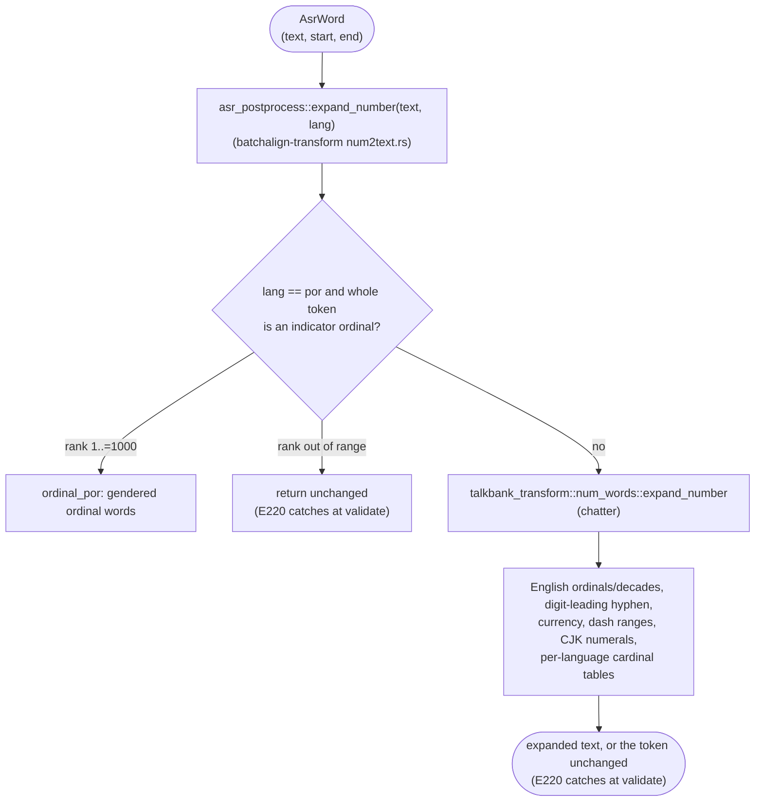

# Number Expansion in ASR Post-Processing

**Status:** Current
**Last updated:** 2026-09-24 19:15 EDT

This page is the **single source of truth** for how batchalign3 turns
ASR-emitted number tokens (`"3"`, `"$5"`, `"1950s"`, `"3rd"`,
`"80%"`, `"3-star"`) into CHAT-legal main-tier text. Both the current
implementation and the planned architectural rework live here. When
the implementation changes, this page must be updated in the same
patch, there is no other authoritative description.

## Why number expansion exists

CHAT was designed for human transcribers. Most languages forbid bare
Arabic digits in main-tier word position
(`talkbank-tools/../chatter/crates/talkbank-model/src/validation/word/language/digits.rs`
permits digits only for `zho`, `cym`, `vie`, `tha`, `nan`, `yue`,
`min`, `hak`); the validator emits **E220** when it sees them
elsewhere. Human transcribers know to write `"three"` instead of
`"3"`.

ASR engines did not get the memo. They emit number-bearing tokens in
several shapes:

| Shape | Example | Why ASR returns it |
|------|---------|---------------------|
| Bare digits | `"3"`, `"100"` | Whisper, Whisper-Hub fine-tunes (esp. Indic/Malayalam), Rev.AI for large numbers |
| Spelled words | `"three"` | Most ASR for small English numbers |
| Decade | `"1950s"` | Year-context heuristic |
| Ordinal | `"3rd"`, `"21st"` | English-specific suffixes |
| Indicator ordinal | `"54ª"`, `"1.º"`, `"54.ºs"` | Printed Portuguese ordinal abbreviation |
| Currency | `"$5"`, `"€3"` | Symbol-prefixed, locale-driven |
| Percent | `"80%"` | Symbol-suffixed |
| Digit-leading hyphen | `"3-star"`, `"17-year-old"` | Compound modifiers |
| CJK numerals | `"三"`, `"百"` | Tencent / FunASR / CJK-tuned Whisper |
| Dash range | `"5-7"`, `"5-6"` | Reading numeric ranges |

Number expansion bridges these to CHAT-legal forms per the target
language. It is **deterministic text rewriting**: no ML, no audio
context, no speaker inference. Pure function from `(token, lang)`
to `String`.

## Current architecture

### Stage placement

Number expansion lives in `stage_asr_postprocess`
(`crates/batchalign/src/pipeline/transcribe.rs`), which is
gated by `always_enabled`: it runs for **every** language on
**every** transcribe / transcribe_s job. It is not gated on Stanza
availability.

### Dispatch and ownership

Number expansion is a single per-word Rust pass with no boundary
crossings (the Python `num2words` IPC is gone). The generic generator
is **chatter's**, not Batchalign's:
`talkbank_transform::num_words::expand_number` (from the pinned chatter
release) owns the per-language cardinal tables, English short-scale
composition, CJK numerals, English suffix ordinals and decades,
currency, dash ranges and digit-leading hyphen compounds. Batchalign's
`asr_postprocess::expand_number` (`num2text.rs`) adds only what chatter
does not provide, Portuguese indicator ordinals, in front of it:



Because the generator is a dependency, a chatter pin bump can change
ASR output with no Batchalign edit. The [frozen baseline](#frozen-baseline)
is what makes such a change visible: adopting chatter 0.26.0 corrected
English scale composition (`2024` had been `two one thousand
twenty-four`) and the Chinese zero between skipped four-digit groups
(`100000001` had been `一亿零零一`), both of which Batchalign carried in
its former copy of the generator until that copy was deleted.

After per-word expansion, `split_words_with_whitespace` widens
multi-token expansions (`"100"` becomes `"one hundred"`) into separate
`AsrWord`s so each fits in a single `ChatWordText`. The percent split
(`80%` to `80` plus the language's percent word) happens earlier, in
the tokenizer, using Batchalign's `language_percent_word`.

### Portuguese indicator ordinals

Portuguese ASR output writes ordinals as printed abbreviations: digits,
an optional abbreviation period, the masculine `º` or feminine `ª`
indicator, and an optional plural `s` (`54ª`, `1.º`, `54.ºs`).
`ordinal_por.rs` owns the form end to end through a small graph of types:

- `PortugueseOrdinalSyntax` is the written shape (digit run, gender,
  number). One lexer builds it, and only when a token boundary follows
  (end of text, whitespace, or a character the tokenizer splits on), so
  `54ªabc`, `54.ª-feira` and the degree-sign lookalike `54°` are not
  ordinals.
- `PortugueseOrdinal` is a syntax whose rank is in 1..=1000, built only
  by `TryFrom<PortugueseOrdinalSyntax>`.
- `PortugueseOrdinal::to_words` composes hundreds, tens and units
  ordinal stems and inflects every component for gender and number:
  `54ª` becomes `quinquagésima quarta`, `54.ºs` becomes
  `quinquagésimos quartos`, `1000ª` becomes `milésima`.

It has two call sites:

1. **Tokenizer** (`prepare.rs::split_chunk_word`). At each token start,
   `protected_ordinal_prefix` runs *before* the generic separator split,
   so the abbreviation period in `54.ª` stays inside the token instead of
   becoming a sentence terminator. A period *after* the ordinal
   (`54.ª. então`) is outside the match and still ends the utterance.
2. **Expansion** (`expand_number`, first check). A whole-token ordinal in
   range expands to words, and the token's timing is then split across
   those words proportionally, like any multi-word expansion.

Recognition and range are separate on purpose. An out-of-range ordinal
(`0ª`, `1001.º`) is still protected as one token (its period is not a
sentence end) and is returned unchanged, the policy for every expansion
this module cannot perform, so E220 reports the digits instead of a
guessed word.

**Other ordinal and decade conventions pass through unchanged**: suffix
ordinals outside English (`13th` in `spa`), indicator ordinals outside
Portuguese (`3º` in `spa`), and non-English decades. Add a per-language
expander if a real corpus surfaces the need.

### Routing lives in `expand_number`

There is no separate per-language routing table. `expand_number` is the
router: Batchalign's Portuguese check runs first, then chatter's
generator applies its own checks in order. (A `NumberExpander` registry module was once
added as a proposed single source of routing truth, but nothing ever
consulted it, so it was deleted as dead code.) What each language actually
does today is pinned by the [frozen baseline](#frozen-baseline), not by a
declaration.

Languages whose CHAT validator permits digits are not special-cased:
`cym`, `vie` and `tha` have chatter cardinal tables and are expanded like
any table language, while `nan`, `min` and `hak` have no table and keep
their digits. Since chatter 0.26.0, E220 refuses a bare numeral word even
in those languages, so such a token is emitted verbatim and reported as
language-invalid (`AsrTranscript::language_invalid`).

### Tables

The per-language cardinal tables (`num2lang.json`, originally generated
from Python `num2words`, with hand-curated `mal`, `ell`, `eus` and `hrv`)
live in chatter, at `crates/talkbank-transform/data/num2lang.json` in the
chatter repository. Table corrections and new languages are chatter
changes; Batchalign adopts them by bumping the pin and reviewing the
baseline diff.

### Frozen baseline

`crates/batchalign-transform/data/number_expansion_baseline.json`
records 50 languages (every table language chatter had when the fixture
was built, the CJK numeral languages and the passthrough control `xxx`)
crossed with 63 representative tokens
(cardinals, large and overflowing numbers, English ordinals and decades,
currency, percent, dash ranges, digit-leading hyphen compounds,
Portuguese indicator ordinals, and lookalikes). Each row holds both the
`expand_number` output and the word texts `prepare_asr_chunks` produces
for the token as one timed element, so tokenizer changes are pinned too.

`num2text_baseline.rs::number_expansion_matches_frozen_baseline` fails
if any row changes, or if a fixture language other than `xxx` stops
expanding a single digit. Chatter does not publish its table language
set, so a language it adds is not detected; add it to the fixture's
`languages` list when adopting that chatter release. The
fixture owns its `languages` and `inputs` lists. To accept a deliberate
change, edit those lists if needed, run

```bash
BATCHALIGN_REGENERATE_NUMBER_BASELINE=1 cargo test -p batchalign-transform --lib regenerate_number_expansion_baseline -- --ignored
```

then review the one-row-per-line diff and name every changed row, with
its reason, in the commit message.

### Module map

| File | Purpose |
|------|---------|
| `crates/batchalign/src/pipeline/transcribe.rs` | `stage_asr_postprocess`, `prepare_asr_chunks` (per-word Rust expansion + whitespace split + finalize) |
| `crates/batchalign-transform/src/asr_postprocess/num2text.rs` | `expand_number(word, lang)`: Batchalign's entry; Portuguese ordinals first, then chatter's generator; `language_percent_word` |
| chatter `talkbank_transform::num_words` | The generic generator: cardinal tables, English composition, ordinals/decades, CJK numerals, currency, dash ranges, digit-leading hyphens |
| `crates/batchalign-transform/src/asr_postprocess/ordinal_por.rs` | Portuguese indicator ordinals: typed recognition (`PortugueseOrdinalSyntax`, `PortugueseOrdinal`), gendered rendering, tokenizer protection |
| `crates/batchalign-transform/src/asr_postprocess/prepare.rs` | Tokenizer (`split_chunk_word`); protects indicator ordinals before separator splitting |
| `crates/batchalign-transform/src/asr_postprocess/num2text_baseline.rs` | Frozen-baseline check and its opt-in regeneration test |
| `crates/batchalign-transform/data/number_expansion_baseline.json` | Frozen `(language, token)` outputs of `expand_number` and the prepare pipeline |

### Per-language coverage matrix

This matrix is **load-bearing**: it determines which expander any
given token routes to. Update in lock-step with code changes.

| Lang | Wire token | Expander | Source |
|------|------------|----------|--------|
| `eng` | `"3"`, `"2024"` | chatter English short-scale composition (`two thousand twenty-four`) | chatter `num_words` |
| `eng` | `"3rd"` | chatter English ordinal | chatter `num_words` |
| `eng` | `"1950s"` | chatter English decade | chatter `num_words` |
| `eng` | `"1950"` (year context) | chatter cardinal; year-form expansion only fires for the decade-suffixed shape | chatter `num_words` |
| `por` | `"54ª"`, `"1.º"`, `"54.ºs"` (rank 1..=1000) | Rust `ordinal_por` (gendered ordinal words) | `ordinal_por.rs` |
| `por` | `"0ª"`, `"1001.º"` (out of range) | Passthrough as one token, E220 fires | `ordinal_por.rs` |
| any | `"$5"` | chatter currency (English currency word) | chatter `num_words` |
| any | `"80%"` | tokenizer percent split + `language_percent_word`, then the digits expand | `prepare.rs`, `num2text.rs` |
| other table languages (fra/deu/spa/por/ita/nld/...) | `"3"` | chatter cardinal table | chatter `num2lang.json` |
| `mal`, `ell`, `eus`, `hrv` | `"3"` | chatter cardinal table (hand-curated entries) | chatter `num2lang.json` |
| `zho` / `cmn` | `"3"` | chatter Chinese numerals (simplified) | chatter `num_words` |
| `yue` / `jpn` | `"3"` | chatter Chinese numerals (traditional) | chatter `num_words` |
| Digit-permitting languages without a table (`nan`, `min`, `hak`) | `"3"` | Passthrough; E220 reports the bare numeral (chatter 0.26.0) | chatter `num_words` |
| Non-eng `"3rd"` / `"1950s"`, indicator ordinals outside `por` | passthrough | None, accepted limitation, no observed production traffic | (gap) |
| `hin`, `tam`, `mar`, `guj`, `pan`, `ori`, most African langs | `"3"` | **Nothing**: digit reaches CHAT, E220 fires | (gap) |

To add a language's cardinal table: add it to chatter's
`num2lang.json`, release chatter, then bump the pin here and add the
language to the baseline fixture.

### Currency and percent

- Currency symbols (`$ € £ ¥ ₹ ₩ ₽`) are chatter's: the digits expand in
  the target language and the **English** currency word is appended
  regardless of language, since CHAT only needs a non-digit word here.
- `PERCENT_WORD_BY_LANG` (`num2text.rs`) is Batchalign's: per-language
  percent words for the languages we actively transcribe. Anything not
  listed falls back to `"percent"`.

## Known limitations (post-Round-2)

Round 1 collapsed the dual-pass dispatch into a single Rust pass
with codegenned cardinal tables. Round 2
landed deterministic Rust ordinal/year/decade expansion for English
and removed the Python `num2words` IPC entirely. The AGENTS.md
"Python is a pure ML model server" rule no longer has an exception
for number expansion. Remaining issues:

1. **Most non-English ordinals/decades pass through.** English
   suffix ordinals and decades (chatter) and Portuguese
   indicator ordinals (`ordinal_por`) are covered. Spanish `"3º"`,
   German `"3."`, French `"1950s"` (rare) leave the digit in place;
   add a per-language ordinal/decade module if a real corpus
   surfaces the need.
2. **Scattered token detection.** Currency, percent, ordinals,
   decades, dash-ranges, digit-leading hyphens are each detected by
   their own ad-hoc function (now in chatter). No unified parse phase. Adding a new
   token shape (e.g., phone numbers `555-1234`, time `3:30`) means
   touching every dispatch site. Layer 2 of the rework addresses this.
3. **Indic + African coverage gaps.** Hindi, Tamil, Marathi,
   Gujarati, Punjabi, Oriya, and most African languages have no
   expander, so the digit reaches CHAT,
   triggering E220. Add their tables to chatter as the languages come
   online.
4. **Hand-curated quality not native-reviewed.** Greek (`ell`),
   Basque (`eus`), and Croatian (`hrv`) tables were preserved
   verbatim from the pre-codegen file and contain known typos
   (e.g., Greek `"96": "ενενήντα-sx"` with English-suffix bleed).
   Native-speaker review needed, in chatter's table.
5. **No fail-loud signal at submission.** A language with no
   expander only surfaces at validation time as E220. A
   submission-time check could reject the request with a
   clearer error ("no number expansion configured
   for language X, see book/src/batchalign/architecture/number-expansion.md").

---

## Future architecture

Round 2 (English ordinal/decade in Rust + Python IPC removal) and the
cardinal codegen **landed earlier**: the relevant content moved into
"Current architecture" above. The proposed Layer 1 typed registry was
built but never wired into dispatch, and was deleted as dead code; a
routing table only earns its place once dispatch consumes it, which is
what Layer 2's typed parser would provide. Layers 2 and 3 are still
proposed.

### Layer 2: Typed `NumberToken` parser

The generic token forms below are now chatter's, so this layer belongs
in chatter's `num_words`; Batchalign would keep only its
Portuguese-ordinal and percent-word extensions.

Replace the scattered detect/try/try cascade with a single parse
function returning a typed enum:

```rust,ignore
pub enum NumberToken<'a> {
    BareDigits(i64),
    Decade(i64),                                  // "1950s"
    Ordinal(i64, OrdinalStyle),                   // "3rd"
    DigitLeadingHyphen(i64, &'a str),             // "3-star", "17-year-old"
    Currency(CurrencySymbol, i64),                // "$5", "€3"
    Percent(i64),                                 // "80%"
    DashRange(i64, i64, DashKind),                // "5-7", "5-6"
    PassThrough(&'a str),                         // not a number
}

pub fn parse_number_token(s: &str) -> NumberToken<'_>;
```

Each `NumberExpander` then exposes a method per token variant:

```rust,ignore
trait Expand {
    fn cardinal(&self, n: i64) -> Cow<'_, str>;
    fn decade(&self, n: i64) -> Cow<'_, str>;
    fn ordinal(&self, n: i64, style: OrdinalStyle) -> Cow<'_, str>;
    fn currency(&self, sym: CurrencySymbol, n: i64) -> Cow<'_, str>;
    fn percent(&self, n: i64) -> Cow<'_, str>;
    fn dash_range(&self, lo: i64, hi: i64) -> Cow<'_, str>;
}
```

Default trait methods can fall back to `cardinal` + appended word
for currency/percent/etc., so simple languages only need to
implement `cardinal`. Languages with richer conventions (Indian
English number grouping, Japanese kanji counters, German
year-as-compound) override.

This collapses six ad-hoc detection functions into one parse and
makes the input space testable as a closed enum. Adding a new token
shape (phone numbers, time, etc.) means one new variant + one new
trait method with a sensible default, not surgery across the file.

Estimated scope: parser ~200 LOC, trait + 13 impls ~600 LOC, plus
test coverage. ~2-3 days with TDD.

### Layer 3: `LinguisticNormalizer` per language

Number expansion is one of several language-specific text transforms
ASR post-processing needs. Today they're scattered:

- `PERCENT_WORD_BY_LANG` (per-lang percent word)
- `CURRENCY_PREFIXES`/`SUFFIXES` (currency words, but English-only output)
- Compound word handling (`compounds.rs`)
- Cantonese normalization (`cantonese.rs`, separate module)
- Per-lang reconciler logic in `nlp/lang_<code>.rs` modules

The principled architecture is **one `LinguisticNormalizer` per
language** that owns every per-lang text rule. Number expansion is
one method; currency words, percent words, ordinal forms, year
conventions, decade forms, language-specific punctuation are
sibling methods.

```rust,ignore
pub trait LinguisticNormalizer: Send + Sync {
    fn lang(&self) -> LanguageCode3;
    fn expand_number(&self, token: NumberToken<'_>) -> Cow<'_, str>;
    fn currency_word(&self, sym: CurrencySymbol) -> &'static str;
    fn percent_word(&self) -> &'static str;
    fn normalize_punctuation(&self, s: &str) -> Cow<'_, str>;
    // ... extension points as needs arise
}

static NORMALIZERS: LazyLock<HashMap<LanguageCode3, Box<dyn LinguisticNormalizer>>> = ...;
```

Per-language routing collapses into one method on this trait. Layer 2's
parser becomes the input pipe. The whole post-processing path becomes
"parse token → resolve normalizer → dispatch."

Estimated scope: significant, touches every per-language code path
in `asr_postprocess/`. Right size for a multi-week project tied to
the broader summer Malayalam expansion (rupee handling, Indian-style
year forms, ordinal suffixes like ആം). Not standalone.

### Migration order (remaining)

1. **Layer 2** (typed parser). Now-or-never refactor of detection.
   Best done before Layer 3 because Layer 3's normalizer methods
   consume `NumberToken`.
2. **Layer 3** (full normalizer). Tied to the broader summer
   Malayalam expansion; do this when the additional per-lang
   transforms (rupee, ordinals, year forms) are also being added.

Each layer is independently shippable. Don't bundle.

### Out of scope for this rearch

- **Probabilistic expansion** (LLM-based for ambiguous cases like
  `"1950"` → `"nineteen fifty"` vs `"one thousand nine hundred
  fifty"`). Discussed because it's interesting, but determinism is
  a hard project value. If/when we want LLM-assisted disambiguation,
  it goes in a separate adjudication layer per
  `feedback_feedback_adjudication_long_term`.
- **CLAN compatibility checks**. CLAN doesn't do ASR; the rework
  doesn't change CHAT semantics, only how we get there from ASR.
- **Validator changes**. The E220 allowlist is correct as designed;
  the rework doesn't widen it. The principled fix is per-language
  expansion, not loosening validation.

---

## Maintenance protocol

**When the implementation changes** (any patch touching number
expansion code), update:

1. The "Current architecture" section above to reflect the new
   reality. If you migrated something out of the proposal, move it
   from "Future architecture" up.
2. The per-language coverage matrix.
3. The module map if file paths or line numbers shifted.
4. The [frozen baseline](#frozen-baseline): regenerate it and name
   every changed row in the commit message.
5. The `Last updated` header at the top.
6. Cross-references: `book/src/reference/languages/<lang>.md` for
   any per-language pages that mention numbers; the
   `book/src/batchalign/developer/adding-language-support.md` checklist
   ("Number expansion" section) if the procedure changes.

**When adding a new language** (transcribe support for a language
not already on the matrix):

1. Determine which expander applies (per the
   [Adding Language Support](../developer/adding-language-support.md)
   checklist's number-expansion section).
2. If it needs a cardinal table, add the table in chatter and adopt
   that chatter release here.
3. Add the row to this page's coverage matrix and the language to the
   baseline fixture's `languages` list, then regenerate the baseline.
5. If neither path covers the language, document it explicitly:
   add a row with "Nothing, digit reaches CHAT, E220 fires" so
   the gap is visible to future contributors.

**When bumping the chatter pin:**

1. Run `number_expansion_matches_frozen_baseline`. Any changed row is a
   behaviour change in ASR output.
2. Regenerate the baseline and name every changed row (old and new),
   with the chatter change that caused it, in the commit message.

**When changing the CHAT digit-allowlist** (rare, requires CHAT-spec
maintainer sign-off):

1. Update `talkbank-tools/.../digits.rs::DIGIT_ALLOWED_LANGS`.
2. Update the matrix's last row ("Lang allows digits") to reflect
   the new set.
3. Re-check each newly allowed language's coverage matrix row
   against its frozen baseline rows.

## Cross-references

- [Adding Language Support](../developer/adding-language-support.md)
 , checklist for new-language work; has a "Number expansion" section
  that points here.
- [Malayalam Language Support](../reference/languages/malayalam.md)
 , concrete example of a language using a cardinal table after the fix.
- `crates/batchalign/AGENTS.md`: `asr_postprocess/` module
  map; references `num2text.rs` for number expansion specifically.
- `crates/batchalign/AGENTS.md`: Python boundary policy
  ("Locked de-Pythonization target"). After Round 2, number
  expansion no longer violates this rule.
- `talkbank-tools/../chatter/crates/talkbank-model/src/validation/word/language/digits.rs`
 , the E220 validator and the `DIGIT_ALLOWED_LANGS` allowlist.
