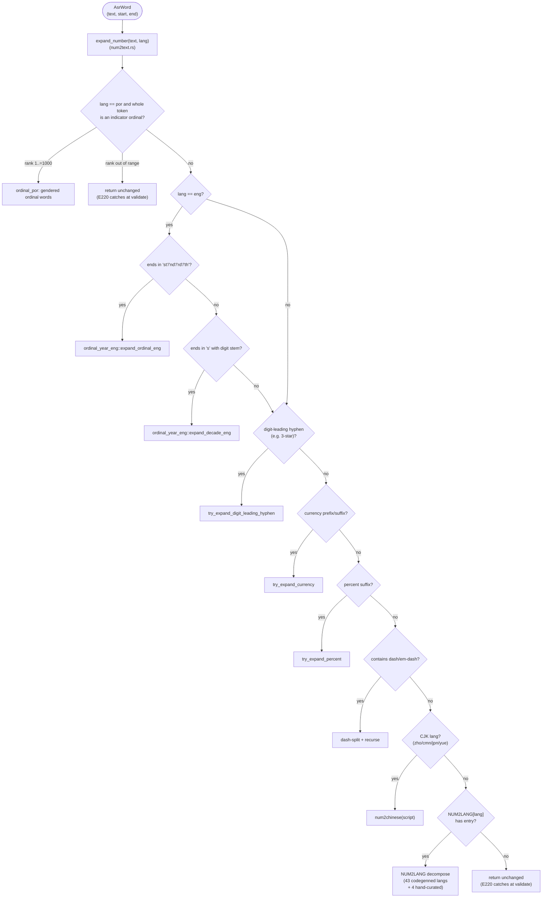
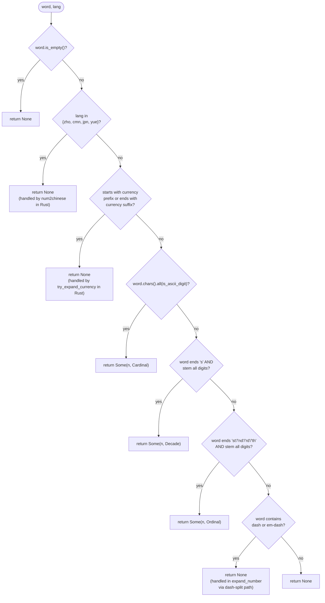

# Number Expansion in ASR Post-Processing

**Status:** Current
**Last updated:** 2026-09-15 09:35 EDT

This page is the **single source of truth** for how batchalign3 turns
ASR-emitted number tokens (`"3"`, `"$5"`, `"1950s"`, `"3rd"`,
`"80%"`, `"3-star"`) into CHAT-legal main-tier text. Both the current
implementation and the planned architectural rework live here. When
the implementation changes, this page must be updated in the same
patch, there is no other authoritative description.

## Why number expansion exists

CHAT was designed for human transcribers. Most languages forbid bare
Arabic digits in main-tier word position
(`talkbank-tools/../chatter/crates/talkbank-model/src/validation/word/language/digits.rs`
permits digits only for `zho`, `cym`, `vie`, `tha`, `nan`, `yue`,
`min`, `hak`); the validator emits **E220** when it sees them
elsewhere. Human transcribers know to write `"three"` instead of
`"3"`.

ASR engines did not get the memo. They emit number-bearing tokens in
several shapes:

| Shape | Example | Why ASR returns it |
|------|---------|---------------------|
| Bare digits | `"3"`, `"100"` | Whisper, Whisper-Hub fine-tunes (esp. Indic/Malayalam), Rev.AI for large numbers |
| Spelled words | `"three"` | Most ASR for small English numbers |
| Decade | `"1950s"` | Year-context heuristic |
| Ordinal | `"3rd"`, `"21st"` | English-specific suffixes |
| Indicator ordinal | `"54ª"`, `"1.º"`, `"54.ºs"` | Printed Portuguese ordinal abbreviation |
| Currency | `"$5"`, `"€3"` | Symbol-prefixed, locale-driven |
| Percent | `"80%"` | Symbol-suffixed |
| Digit-leading hyphen | `"3-star"`, `"17-year-old"` | Compound modifiers |
| CJK numerals | `"三"`, `"百"` | Tencent / FunASR / CJK-tuned Whisper |
| Dash range | `"5-7"`, `"5-6"` | Reading numeric ranges |

Number expansion bridges these to CHAT-legal forms per the target
language. It is **deterministic text rewriting**: no ML, no audio
context, no speaker inference. Pure function from `(token, lang)`
to `String`.

## Current architecture

### Stage placement

Number expansion lives in `stage_asr_postprocess`
(`crates/batchalign/src/pipeline/transcribe.rs`), which is
gated by `always_enabled`: it runs for **every** language on
**every** transcribe / transcribe_s job. It is not gated on Stanza
availability.

### Dispatch

Round 2 of the rework landed: **the Python `num2words` IPC is gone.**
Number expansion is now a single per-word Rust pass with no boundary
crossings:



After per-word expansion, `split_words_with_whitespace` widens
multi-token expansions (`"100"` → `"one hundred"`) into separate
`AsrWord`s so each fits in a single `ChatWordText`.

For Malayalam (the motivating case for the rework), the path is
`expand_number("3", "mal")` → `NUM2LANG["mal"]["3"]` → `"മൂന്ന്"`.
For English ordinals (`"13th"`) and decades (`"1950s"`), the
`ordinal_year_eng` module produces `"thirteenth"` and `"nineteen
fifties"` via deterministic composition rules cross-validated against
`num2words` at build time (fixture `data/eng_ordinal_year_fixtures.json`).

### Portuguese indicator ordinals

Portuguese ASR output writes ordinals as printed abbreviations: digits,
an optional abbreviation period, the masculine `º` or feminine `ª`
indicator, and an optional plural `s` (`54ª`, `1.º`, `54.ºs`).
`ordinal_por.rs` owns the form end to end through a small graph of types:

- `PortugueseOrdinalSyntax` is the written shape (digit run, gender,
  number). One lexer builds it, and only when a token boundary follows
  (end of text, whitespace, or a character the tokenizer splits on), so
  `54ªabc`, `54.ª-feira` and the degree-sign lookalike `54°` are not
  ordinals.
- `PortugueseOrdinal` is a syntax whose rank is in 1..=1000, built only
  by `TryFrom<PortugueseOrdinalSyntax>`.
- `PortugueseOrdinal::to_words` composes hundreds, tens and units
  ordinal stems and inflects every component for gender and number:
  `54ª` becomes `quinquagésima quarta`, `54.ºs` becomes
  `quinquagésimos quartos`, `1000ª` becomes `milésima`.

It has two call sites:

1. **Tokenizer** (`prepare.rs::split_chunk_word`). At each token start,
   `protected_ordinal_prefix` runs *before* the generic separator split,
   so the abbreviation period in `54.ª` stays inside the token instead of
   becoming a sentence terminator. A period *after* the ordinal
   (`54.ª. então`) is outside the match and still ends the utterance.
2. **Expansion** (`expand_number`, first check). A whole-token ordinal in
   range expands to words, and the token's timing is then split across
   those words proportionally, like any multi-word expansion.

Recognition and range are separate on purpose. An out-of-range ordinal
(`0ª`, `1001.º`) is still protected as one token (its period is not a
sentence end) and is returned unchanged, the policy for every expansion
this module cannot perform, so E220 reports the digits instead of a
guessed word.

**Other ordinal and decade conventions pass through unchanged**: suffix
ordinals outside English (`13th` in `spa`), indicator ordinals outside
Portuguese (`3º` in `spa`), and non-English decades. Add a per-language
expander if a real corpus surfaces the need.

### Routing lives in `expand_number`

There is no separate per-language routing table. `expand_number` is the
router: the checks in the diagram above run in order and the first that
applies decides the output. (A `NumberExpander` registry module was once
added as a proposed single source of routing truth, but nothing ever
consulted it, so it was deleted as dead code.) What each language actually
does today is pinned by the [frozen baseline](#frozen-baseline), not by a
declaration.

Languages whose CHAT validator permits digits are not special-cased:
`cym`, `vie` and `tha` have `NUM2LANG` tables and are expanded like any
table language, while `nan`, `min` and `hak` have no table and keep their
digits, which their validator accepts.

### Codegen

The pre-Layer-1 `data/num2lang.json` was hand-curated and contained
several typos (`"ninety-sx"` for English 96, `"diecineuve"` for
Spanish 19, `"จ็ด"` for Thai 7, etc.). The current
`crates/batchalign-transform/data/num2lang.json` was generated by
invoking Python `num2words` for every ISO 639-3 → num2words mapping
and writing the result to that path. 43 languages × 0-99 + decades +
100/1000 anchors = ~4,700 entries.

Four languages stay hand-curated (the regeneration workflow must not
overwrite them):

- `mal` (Malayalam), num2words has no `ml` backend
- `ell` (Greek), num2words has no `el` backend; hand-curated entries
  preserved verbatim from pre-codegen file (known typos flagged for
  follow-up native-speaker review)
- `eus` (Basque), num2words has no `eu` backend
- `hrv` (Croatian), num2words falls back to Serbian, lower quality
  than the existing hand-curated table

The codegen tool itself is not currently committed to the repo. When
the table needs regeneration, the workflow is: map each ISO 639-3
code to its `num2words` language code, drive `num2words` externally,
and write the result back to
`crates/batchalign-transform/data/num2lang.json`, taking care to
preserve the four hand-curated entries.

### Frozen baseline

`crates/batchalign-transform/data/number_expansion_baseline.json`
records 50 languages (every `NUM2LANG` table language, the CJK numeral
languages and one unknown code) crossed with 63 representative tokens
(cardinals, large and overflowing numbers, English ordinals and decades,
currency, percent, dash ranges, digit-leading hyphen compounds,
Portuguese indicator ordinals, and lookalikes). Each row holds both the
`expand_number` output and the word texts `prepare_asr_chunks` produces
for the token as one timed element, so tokenizer changes are pinned too.

`num2text_baseline.rs::number_expansion_matches_frozen_baseline` fails
if any row changes, or if a table language is added without rows. The
fixture owns its `languages` and `inputs` lists. To accept a deliberate
change, edit those lists if needed, run

```bash
BATCHALIGN_REGENERATE_NUMBER_BASELINE=1 cargo test -p batchalign-transform --lib regenerate_number_expansion_baseline -- --ignored
```

then review the one-row-per-line diff and name every changed row, with
its reason, in the commit message.

### Module map

| File | Purpose |
|------|---------|
| `crates/batchalign/src/pipeline/transcribe.rs` | `stage_asr_postprocess`, `prepare_asr_chunks` (per-word Rust expansion + whitespace split + finalize) |
| `crates/batchalign-transform/src/asr_postprocess/num2text.rs` | `expand_number(word, lang)`: top-level Rust entry; `detect_expansion`; currency/percent/dash helpers; `NUM2LANG` static map |
| `crates/batchalign-transform/src/asr_postprocess/ordinal_year_eng.rs` | `expand_ordinal_eng`, `expand_year_eng`, `expand_decade_eng` (English-only deterministic composition; cross-validated against `num2words` via `data/eng_ordinal_year_fixtures.json`) |
| `crates/batchalign-transform/src/asr_postprocess/num2chinese.rs` | `num2chinese(n, script)` for CJK |
| `crates/batchalign-transform/src/asr_postprocess/ordinal_por.rs` | Portuguese indicator ordinals: typed recognition (`PortugueseOrdinalSyntax`, `PortugueseOrdinal`), gendered rendering, tokenizer protection |
| `crates/batchalign-transform/src/asr_postprocess/prepare.rs` | Tokenizer (`split_chunk_word`); protects indicator ordinals before separator splitting |
| `crates/batchalign-transform/src/asr_postprocess/num2text_baseline.rs` | Frozen-baseline check and its opt-in regeneration test |
| `crates/batchalign-transform/data/num2lang.json` | Per-language Rust tables (43 codegenned + 4 hand-curated) |
| `crates/batchalign-transform/data/number_expansion_baseline.json` | Frozen `(language, token)` outputs of `expand_number` and the prepare pipeline |
| `crates/batchalign-transform/data/eng_ordinal_year_fixtures.json` | Cross-validation fixtures for `ordinal_year_eng` |

### Per-language coverage matrix

This matrix is **load-bearing**: it determines which expander any
given token routes to. Update in lock-step with code changes.

| Lang | Wire token | Expander | Source |
|------|------------|----------|--------|
| `eng` | `"3"` | Rust NUM2LANG | `data/num2lang.json:eng` |
| `eng` | `"3rd"` | Rust `expand_ordinal_eng` | `ordinal_year_eng.rs` |
| `eng` | `"1950s"` | Rust `expand_decade_eng` | `ordinal_year_eng.rs` |
| `eng` | `"1950"` (year context) | Rust NUM2LANG cardinal, year-form expansion only fires for the decade-suffixed shape; bare 4-digit numbers route as cardinals | `num2text.rs` |
| `por` | `"54ª"`, `"1.º"`, `"54.ºs"` (rank 1..=1000) | Rust `ordinal_por` (gendered ordinal words) | `ordinal_por.rs` |
| `por` | `"0ª"`, `"1001.º"` (out of range) | Passthrough as one token, E220 fires | `ordinal_por.rs` |
| any | `"$5"` | Rust `try_expand_currency` | `num2text.rs` |
| any | `"80%"` | Rust currency-style + `PERCENT_WORD_BY_LANG` | `num2text.rs` |
| 43 codegenned langs (eng/fra/deu/spa/por/ita/nld/…) | `"3"` | Rust NUM2LANG | `data/num2lang.json` |
| `mal`, `ell`, `eus`, `hrv` | `"3"` | Rust NUM2LANG (hand-curated overlay) | `scripts/codegen_num2lang.py::HAND_CURATED` |
| `zho` / `cmn` | `"3"` | Rust `num2chinese(simplified)` | `num2text.rs` |
| `yue` / `jpn` | `"3"` | Rust `num2chinese(traditional)` | `num2text.rs` |
| Digit-permitting languages without a table (`nan`, `min`, `hak`) | `"3"` | Passthrough (the validator accepts digits) | `num2text.rs` |
| Non-eng `"3rd"` / `"1950s"`, indicator ordinals outside `por` | passthrough | None, accepted limitation, no observed production traffic | (gap) |
| `hin`, `tam`, `mar`, `guj`, `pan`, `ori`, most African langs | `"3"` | **Nothing**: digit reaches CHAT, E220 fires | (gap) |

To add a `num2words`-supported language: add the ISO 639-3 → 2-char
mapping to `ISO3_TO_NUM2WORDS` in `scripts/codegen_num2lang.py` and
re-run the script. To add a hand-curated language: add to
`HAND_CURATED` in the same script (the codegen never overwrites those).

### Detection algorithm (`detect_expansion`)

`detect_expansion` classifies a token's expansion mode (`Cardinal` /
`Ordinal` / `Decade` / `Year`) for callers that need the decision
without doing the expansion. After Round 2 the dispatcher does not
use it directly, `expand_number` runs the full per-word pipeline
unconditionally, but it is kept as a public helper for testing and
future per-mode dispatch.



A `Some` result means the token will be sent to Python. `None` means
either the Rust safety pass handles it (CJK, currency, dash) or it
isn't a number at all (passes through unchanged).

### Decompose strategy for higher numbers

`decompose_with_table` at `num2text.rs:274` greedily subtracts the
largest table entry that fits. So `"234"` for German becomes
`"zweihundert" + "vierunddreißig"` if the table has `200` and `34`,
or `"zweihundert" + "dreißig" + "vier"` if it has `200`, `30`, `4`.
Recurses for hundreds-and-up multipliers (`1234` → `decompose(1)` +
`"thousand"` + `decompose(234)`).

If the table can't fully decompose (e.g., a 5-digit number when the
table only goes to 1000), `expand_number` returns the original
digit string unchanged. This is a **silent fallthrough**: the
validator E220 will catch it later, but at the call site there's no
typed signal that expansion failed.

### Currency and percent

- `CURRENCY_PREFIXES` and `CURRENCY_SUFFIXES` (`num2text.rs:53,63`)
  recognize `$ € £ ¥ ₹ ₩ ₽` and append the **English** word for the
  currency regardless of target language. Rationale (per inline
  comment): morphosyntax can re-tag in-language later; CHAT just
  needs a non-digit word here.
- `PERCENT_WORD_BY_LANG` (`num2text.rs:77`) lists per-language
  percent words for the languages we actively transcribe. Anything
  not listed falls back to `"percent"`.

These two tables are independent of the main `NUM2LANG` table, they
exist because currency/percent symbols are language-orthogonal but
the words attached to them are language-specific.

## Known limitations (post-Round-2)

Round 1 collapsed the dual-pass dispatch into a single Rust pass
with codegenned cardinal tables. Round 2
landed deterministic Rust ordinal/year/decade expansion for English
and removed the Python `num2words` IPC entirely. The CLAUDE.md
"Python is a pure ML model server" rule no longer has an exception
for number expansion. Remaining issues:

1. **Most non-English ordinals/decades pass through.** English
   suffix ordinals and decades (`ordinal_year_eng`) and Portuguese
   indicator ordinals (`ordinal_por`) are covered. Spanish `"3º"`,
   German `"3."`, French `"1950s"` (rare) leave the digit in place;
   add a per-language ordinal/decade module if a real corpus
   surfaces the need.
2. **Scattered token detection.** Currency, percent, ordinals,
   decades, dash-ranges, digit-leading hyphens are each detected by
   their own ad-hoc function. No unified parse phase. Adding a new
   token shape (e.g., phone numbers `555-1234`, time `3:30`) means
   touching every dispatch site. Layer 2 of the rework addresses this.
3. **Indic + African coverage gaps.** Hindi, Tamil, Marathi,
   Gujarati, Punjabi, Oriya, and most African languages have no
   expander, so the digit reaches CHAT,
   triggering E220. Add to `HAND_CURATED` in
   `scripts/codegen_num2lang.py` as the languages come online.
4. **Hand-curated quality not native-reviewed.** Greek (`ell`),
   Basque (`eus`), and Croatian (`hrv`) tables were preserved
   verbatim from the pre-codegen file and contain known typos
   (e.g., Greek `"96": "ενενήντα-sx"` with English-suffix bleed).
   Native-speaker review needed; flagged in the script's HAND_CURATED
   block.
5. **No fail-loud signal at submission.** A language with no
   expander only surfaces at validation time as E220. A
   submission-time check could reject the request with a
   clearer error ("no number expansion configured
   for language X, see book/src/batchalign/architecture/number-expansion.md").

---

## Future architecture

Round 2 (English ordinal/decade in Rust + Python IPC removal) and the
cardinal codegen **landed earlier**: the relevant content moved into
"Current architecture" above. The proposed Layer 1 typed registry was
built but never wired into dispatch, and was deleted as dead code; a
routing table only earns its place once dispatch consumes it, which is
what Layer 2's typed parser would provide. Layers 2 and 3 are still
proposed.

### Layer 2: Typed `NumberToken` parser

Replace the scattered detect/try/try cascade with a single parse
function returning a typed enum:

```rust,ignore
pub enum NumberToken<'a> {
    BareDigits(i64),
    Decade(i64),                                  // "1950s"
    Ordinal(i64, OrdinalStyle),                   // "3rd"
    DigitLeadingHyphen(i64, &'a str),             // "3-star", "17-year-old"
    Currency(CurrencySymbol, i64),                // "$5", "€3"
    Percent(i64),                                 // "80%"
    DashRange(i64, i64, DashKind),                // "5-7", "5-6"
    PassThrough(&'a str),                         // not a number
}

pub fn parse_number_token(s: &str) -> NumberToken<'_>;
```

Each `NumberExpander` then exposes a method per token variant:

```rust,ignore
trait Expand {
    fn cardinal(&self, n: i64) -> Cow<'_, str>;
    fn decade(&self, n: i64) -> Cow<'_, str>;
    fn ordinal(&self, n: i64, style: OrdinalStyle) -> Cow<'_, str>;
    fn currency(&self, sym: CurrencySymbol, n: i64) -> Cow<'_, str>;
    fn percent(&self, n: i64) -> Cow<'_, str>;
    fn dash_range(&self, lo: i64, hi: i64) -> Cow<'_, str>;
}
```

Default trait methods can fall back to `cardinal` + appended word
for currency/percent/etc., so simple languages only need to
implement `cardinal`. Languages with richer conventions (Indian
English number grouping, Japanese kanji counters, German
year-as-compound) override.

This collapses six ad-hoc detection functions into one parse and
makes the input space testable as a closed enum. Adding a new token
shape (phone numbers, time, etc.) means one new variant + one new
trait method with a sensible default, not surgery across the file.

Estimated scope: parser ~200 LOC, trait + 13 impls ~600 LOC, plus
test coverage. ~2-3 days with TDD.

### Layer 3: `LinguisticNormalizer` per language

Number expansion is one of several language-specific text transforms
ASR post-processing needs. Today they're scattered:

- `PERCENT_WORD_BY_LANG` (per-lang percent word)
- `CURRENCY_PREFIXES`/`SUFFIXES` (currency words, but English-only output)
- Compound word handling (`compounds.rs`)
- Cantonese normalization (`cantonese.rs`, separate module)
- Per-lang reconciler logic in `nlp/lang_<code>.rs` modules

The principled architecture is **one `LinguisticNormalizer` per
language** that owns every per-lang text rule. Number expansion is
one method; currency words, percent words, ordinal forms, year
conventions, decade forms, language-specific punctuation are
sibling methods.

```rust,ignore
pub trait LinguisticNormalizer: Send + Sync {
    fn lang(&self) -> LanguageCode3;
    fn expand_number(&self, token: NumberToken<'_>) -> Cow<'_, str>;
    fn currency_word(&self, sym: CurrencySymbol) -> &'static str;
    fn percent_word(&self) -> &'static str;
    fn normalize_punctuation(&self, s: &str) -> Cow<'_, str>;
    // ... extension points as needs arise
}

static NORMALIZERS: LazyLock<HashMap<LanguageCode3, Box<dyn LinguisticNormalizer>>> = ...;
```

Per-language routing collapses into one method on this trait. Layer 2's
parser becomes the input pipe. The whole post-processing path becomes
"parse token → resolve normalizer → dispatch."

Estimated scope: significant, touches every per-language code path
in `asr_postprocess/`. Right size for a multi-week project tied to
the broader summer Malayalam expansion (rupee handling, Indian-style
year forms, ordinal suffixes like ആം). Not standalone.

### Migration order (remaining)

1. **Layer 2** (typed parser). Now-or-never refactor of detection.
   Best done before Layer 3 because Layer 3's normalizer methods
   consume `NumberToken`.
2. **Layer 3** (full normalizer). Tied to the broader summer
   Malayalam expansion; do this when the additional per-lang
   transforms (rupee, ordinals, year forms) are also being added.

Each layer is independently shippable. Don't bundle.

### Out of scope for this rearch

- **Probabilistic expansion** (LLM-based for ambiguous cases like
  `"1950"` → `"nineteen fifty"` vs `"one thousand nine hundred
  fifty"`). Discussed because it's interesting, but determinism is
  a hard project value. If/when we want LLM-assisted disambiguation,
  it goes in a separate adjudication layer per
  `feedback_feedback_adjudication_long_term`.
- **CLAN compatibility checks**. CLAN doesn't do ASR; the rework
  doesn't change CHAT semantics, only how we get there from ASR.
- **Validator changes**. The E220 allowlist is correct as designed;
  the rework doesn't widen it. The principled fix is per-language
  expansion, not loosening validation.

---

## Maintenance protocol

**When the implementation changes** (any patch touching number
expansion code), update:

1. The "Current architecture" section above to reflect the new
   reality. If you migrated something out of the proposal, move it
   from "Future architecture" up.
2. The per-language coverage matrix.
3. The module map if file paths or line numbers shifted.
4. The [frozen baseline](#frozen-baseline): regenerate it and name
   every changed row in the commit message.
5. The `Last updated` header at the top.
6. Cross-references: `book/src/reference/languages/<lang>.md` for
   any per-language pages that mention numbers; the
   `book/src/batchalign/developer/adding-language-support.md` checklist
   ("Number expansion" section) if the procedure changes.

**When adding a new language** (transcribe support for a language
not already on the matrix):

1. Determine which expander applies (per the
   [Adding Language Support](../developer/adding-language-support.md)
   checklist's number-expansion section).
2. Either:
   - add the ISO 639-3 → 2-char mapping to `ISO3_TO_NUM2WORDS` in
     `scripts/codegen_num2lang.py` and re-run the script, OR
   - add a `HAND_CURATED` entry in the same script (one-shot codegen
     never overwrites the overlay).
3. Add the row to this page's coverage matrix.
4. Add a test in `num2text.rs::tests`.
5. If neither path covers the language, document it explicitly:
   add a row with "Nothing, digit reaches CHAT, E220 fires" so
   the gap is visible to future contributors.

**When updating `num2words` (Python lib version bump):**

The library is no longer a runtime dependency, but
`scripts/codegen_num2lang.py` invokes it to regenerate
`num2lang.json` and `eng_ordinal_year_fixtures.json`. After bumping:

1. Re-run `uv run python scripts/codegen_num2lang.py --output crates/batchalign/data/num2lang.json`.
2. Re-run the English ordinal/year fixture generator (see comments in
   `scripts/codegen_num2lang.py`).
3. Diff the generated files; any value change in a covered language
   is a behaviour change worth a callout in the commit.
4. Run `cargo test -p batchalign --lib`; the
   `ordinal_year_eng` cross-validation tests catch divergence.

**When changing the CHAT digit-allowlist** (rare, requires CHAT-spec
maintainer sign-off):

1. Update `talkbank-tools/.../digits.rs::DIGIT_ALLOWED_LANGS`.
2. Update the matrix's last row ("Lang allows digits") to reflect
   the new set.
3. Re-check each newly allowed language's coverage matrix row
   against its frozen baseline rows.

## Cross-references

- [Adding Language Support](../developer/adding-language-support.md)
 , checklist for new-language work; has a "Number expansion" section
  that points here.
- [Malayalam Language Support](../reference/languages/malayalam.md)
 , concrete example of a language using the Rust `NUM2LANG` path
  after the fix.
- `crates/batchalign/CLAUDE.md`: `asr_postprocess/` module
  map; references `num2text.rs` for number expansion specifically.
- `crates/batchalign/CLAUDE.md`: Python boundary policy
  ("Locked de-Pythonization target"). After Round 2, number
  expansion no longer violates this rule.
- `talkbank-tools/../chatter/crates/talkbank-model/src/validation/word/language/digits.rs`
 , the E220 validator and the `DIGIT_ALLOWED_LANGS` allowlist.
