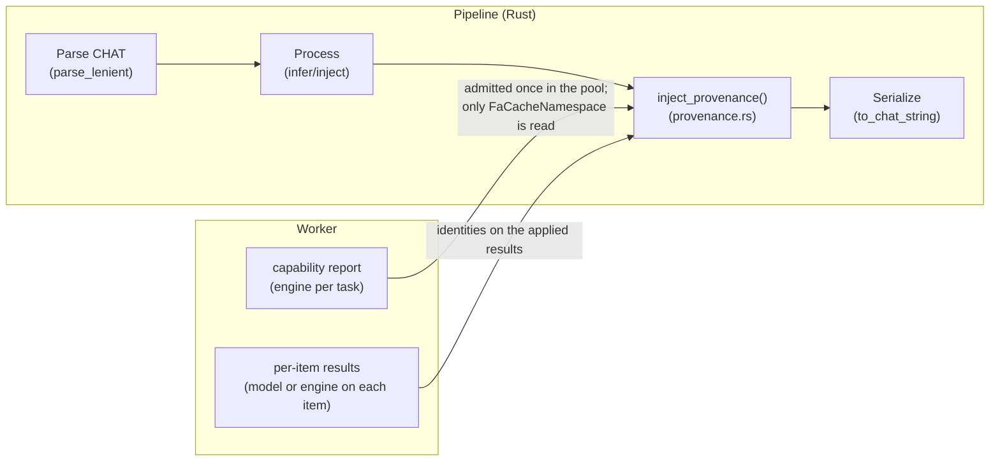

# Processing Provenance System

**Status:** Current
**Last updated:** 2026-09-16 10:19 EDT

## Overview

The provenance system injects structured `@Comment` headers into CHAT
files recording what batchalign3 did, when, and with what engines. This
enables reproducibility, auditing, and UI display of processing history.

## Architecture



### Source: `crates/batchalign/src/provenance.rs`

The module provides:

- **`ProvenanceComment`**: a typed stamp: a `ReleasedCommand` and fields keyed
  by the closed `StampField` enum, each holding a `StampFieldValue`
- **`inject_provenance(&mut ChatFile, &ProvenanceComment)`**: AST-level
  injection that adds/replaces `@Comment` headers
- **`inject_provenance_into_text(&str, &ProvenanceComment) -> Result<String, ParseErrors>`**: strictly parses serialized output before adding a comment; parser recovery errors return diagnostics instead of a rewritten document
- **Per-command builders**: `morphotag_provenance()`, `align_provenance()`,
  `transcribe_provenance()` and `result_named_provenance()` (one builder for
  translate and coref, chosen by `ResultNamedCommand`) cannot fail, because
  every value they write is already stamp-safe text. Two builders can fail,
  each for its own reason: `utseg_provenance()` admits a boundary model's id
  and revision, which come from worker evidence, when it builds the stamp
  (`InvalidStampSafeText`), and `incremental_morphotag_provenance()` reads the
  `--before` document's stamp back (`IncrementalMorphotagStampError`, see
  [Engine identity sources](#engine-identity-sources))
- **`extract_provenance(&str) -> Result<Vec<ProvenanceEntry>, UnparseableStamp>`**:
  reads stamps back for the job results API, which returns each file's
  outcome as a `FileProvenance` state
- **`is_provenance_only_difference(old, new, command)`**: decides whether a
  re-run of a `command` job would change nothing meaningful, so the writer
  (`write_chat_output_artifact_with_provenance_gate` in
  `recipe_runner/runtime.rs`) can skip the write

### Comment Format

```text
[fc-ba3 <command> | key=val ; key=val | ISO-8601-timestamp]
```

The `[fc-ba3 ` opening is the machine-parseable discriminator. The
bracketed format is visually distinct from user-authored comments and
greppable with `grep -E '\[(fc-)?ba3 '`. A stamp with no fields is
`[fc-ba3 <command> | <timestamp>]`.

### Grammar owner: `StampCodec`

One codec, `StampCodec`, writes the grammar for `ProvenanceComment::format` and
reads it back for `extract_provenance` and the no-op write gate, from shared
separator constants: ` | ` between sections, ` ; ` between fields, `=` between
key and value, and `]` to close.

- The command is a `ReleasedCommand`, so no caller can stamp a command that
  does not exist.
- Keys are the closed `StampField` enum (`asr`, `asr_model`, `diarize`,
  `engine`, `fa`, `incremental`, `lang`, `retokenize`, `utr`, `wor`). Its
  `Ord` compares the key as written, so a stamp's fields come out in
  alphabetical key order whatever order the variants are declared in.
- A value is a `StampFieldValue`, a wrapper over `StampSafeText`
  (`crates/batchalign-types/src/domain.rs`), the one type for text that cannot
  change a stamp's structure. It refuses blank text, surrounding whitespace
  (exactly the Unicode `White_Space` characters, `StampSafeText::WHITESPACE`),
  and `|`, `;`, `]`, newline and carriage return
  (`StampSafeText::STAMP_STRUCTURE`); the error is `InvalidStampSafeText`.
  `ReportedEngineName` wraps the same type, so a reported engine name becomes a
  field value with no second check.
- `StampSafeText` has three routes in, and each keeps the invariant: `TryFrom`
  (also used by deserialization) checks runtime text; `const fn from_static`
  checks a literal at compile time (callers write it inside `const { }`); and
  `join(first, rest, StampJoiner)` composes values that are already safe with
  a safe joiner (`Concat`, `Plus` for `+`, `Colon` for `:`, `At` for `@`).
  Every conversion into `StampFieldValue` is therefore total: each source is a
  reported engine name, a language code, a literal or a join.
- Text that could be unsafe is admitted where it enters, not when the stamp is
  built. A FunAudio checkpoint selected through `funaudio_model` is admitted by
  `AsrBackend::admit_checkpoint` (`transcribe/types.rs`) at submission
  (`JobSubmission::validate`, so the job is refused before it is queued) and
  again when the transcribe plan is admitted
  (`TranscribeAsrPlanError::InvalidCheckpoint { key, reason }`). Such a
  checkpoint used to fail the job only when the stamp was built, after ASR had
  run. That admission still stands, but it is no longer what `asr_model=`
  renders: the models a run actually loaded are, and they are stamp-safe by
  construction because every id and revision was admitted as `StampSafeText`
  when the plan pinned it.
- The JSON Schemas of `StampSafeText` and `ReportedEngineName` carry a
  `pattern` generated from the same two character lists
  (`StampSafeText::json_schema_pattern`). The Python producer,
  `reported_engine_name` in `batchalign/worker/_types.py`, uses an explicit
  `White_Space` set rather than Python's own idea of whitespace. Rust's
  `stamp_safe_text_tests` and
  `batchalign/tests/test_stamp_safe_text_conformance.py` both read
  `tests/fixtures/stamp_safe_text_cases.json`, and the Python test also checks
  the generated schema pattern.
- A comment that opens as one of our stamps but does not parse is an
  `UnparseableStamp` naming the comment and its `StampDefect` (no closing `]`,
  missing command or timestamp, a field that is not `key=value`, a repeated
  key). `extract_provenance` returns it instead of silently leaving the stamp
  out. The job results endpoints (`GET /jobs/{id}/results` and
  `GET /jobs/{id}/results/{filename}`) report each file's provenance as a typed
  `FileProvenance`: `parsed` with its entries, `unparseable` with the reason,
  or `not_read` for non-CHAT output and failed files. An unparseable stamp is
  that one file's state; the rest of the job's results are still served.

### Recognizing our own comments: two steps, four answers

One recognizer answers "did this build write this comment?", in the private
`recognize` module beside the codec, and it answers in two steps because its
readers need different amounts of it.

| Step | Function | Answers |
|---|---|---|
| One | `RecognizedComment::classify(body)` | Whether the comment is ours and, for a stamp, WHICH command wrote it, from the opening and the command alone |
| Two | `NamedStamp::parse()` | The fields and the timestamp of a stamp whose command step one has already read |

Step one has four answers, not two:

| Answer | Meaning |
|---|---|
| `Stamp(NamedStamp)` | Ours, recording the command the stamp names |
| `Unnamed(UnnamedStamp)` | Ours, but too damaged to say which command wrote it: nothing precedes the first ` \|` that ends a command |
| `UncheckedAsrWarning { engine }` | Our unchecked-ASR warning, naming that engine |
| `Foreign` | Written by something else |

The split is what keeps the no-op write gate safe. The gate must know WHOSE
stamp it is looking at before a damaged one means anything, because a damaged
stamp belonging to a command the job does not run is not the gate's business. A
recognizer that could only answer "parsed" or "did not parse" would collapse
"damaged" together with "not ours", and the gate would rewrite files it should
leave alone. So `extract_provenance` and the offline replays take both steps,
because they report a whole entry, while the gate, the replacement predicate
and the incremental morphotag reader take step one and make their own
comparison.

A command must be followed by the exact separator. Stray text after it, as in
`[fc-ba3 align |x junk | <timestamp>]`, is reported as a defect; the codec's own
section split used to swallow that text into the command and report a stamp
whose command was `align |x junk`.

A stamp's command therefore lives in exactly one place: `NamedStamp` owns it and
the parsed body carries only fields and a timestamp. The types are minted only
inside that module, so no caller can pair one stamp's command with another
stamp's body.

### Stamp names: written and recognized

Builds before 2026-09-15 wrote the same grammar under the name `ba3`
(`[ba3 <command> | ...]`), and a file keeps whichever name wrote it. The
private closed set `StampName` owns both names:

| Operation | Names |
|---|---|
| Writing (`ProvenanceComment::format`) | `fc-ba3` only (`StampName::WRITTEN`) |
| Replacement on re-run (`inject_provenance`) | `fc-ba3` and `ba3` |
| No-op write detection (`is_provenance_only_difference`) | `fc-ba3` and `ba3` |
| Extraction (`extract_provenance`, job-detail API) | `fc-ba3` and `ba3` |

A legacy writer has no constructor, so no code path can produce a new `ba3`
stamp. `ProvenanceEntry` does not record which name wrote a stamp, so the API
shape is unchanged. The literal names are written once, as macros shared by
the stamp openings and the unchecked-ASR warning.

Recognition matches our openings and nothing else. Another Batchalign
distribution writes lines such as `batchalign3 <sha> | <stage>: <engine> |
<timestamp>` and a bare `Unchecked output of ASR model`; neither is treated as
ours, so a re-run never deletes them.

### What counts as a meaningful difference

`is_provenance_only_difference(old, new, command)` lets the writer skip a
re-run that changed nothing that matters. A `command` job can write more
stamps than its own, because its recipe composes stages and each stamping
stage writes its own command's stamp. `commands_stamped_by(command)`
(`command_model/catalog.rs`) derives that set from the catalog, with no
hand-written list: the command itself, plus `RecipeStageId::provenance()`
(`recipe_runner/recipe.rs`) for every stage of its recipe, following a stage
that runs another command's recipe into that recipe.

| Stage | Stamps it contributes |
|---|---|
| `BuildChat` | `transcribe` |
| `UtteranceSegmentation` | `utseg` |
| `Morphosyntax` | `morphotag` |
| `ForcedAlignment` | `align` |
| `RunTranscribeRecipe` | every stamp of the `transcribe` recipe |
| `RunCompareRecipe` | every stamp of the `compare` recipe |
| every other stage | none |

So `transcribe` sets aside `transcribe`, `utseg` and `morphotag` stamps,
`benchmark` sets aside `benchmark`, `transcribe`, `utseg`, `morphotag` and
`compare`, and `align` sets aside only `align`.

The gate walks both texts line by line in lockstep, sets aside those stamps and
our unchecked-ASR warnings on each side (so a stamp that only moved position is
not a difference by itself), and compares what it set aside once both walks
finish:

- Set-aside stamps are compared per command, by their fields. Two stamps
  count as the same only when they differ in the stamp **name** (`fc-ba3` or
  `ba3`) and the **timestamp**. Any other field difference, an engine, a
  language or a flag, is meaningful, and the file is written.
- A set-aside stamp present on one side only is meaningful.
- Our warnings are compared by the ASR engine they name. Their shape (current
  or legacy) and the build identity they name are ignored.
- A set-aside stamp that does not parse is meaningful, so the write goes
  through and replaces it with one that does.
- A damaged stamp the job does NOT write is not meaningful by itself. A stamp
  for another command, and one too damaged to name any command, are compared as
  ordinary content: identical on both sides they provoke no rewrite, and a
  rewrite would not repair them anyway, because replacement matches a stamp by
  its command.
- Anything else that differs (the stamp of a command the job does not compose,
  `%mor`, `%gra`, `%wor`, main tiers) is meaningful, as before.

Setting aside only the job's own stamp made every `transcribe` re-run on a new
build a write, because the `utseg` and `morphotag` stamps it also writes carry
new timestamps. A `transcribe` re-run over identical content now leaves the
file untouched.

Corpus consequence, stated plainly: re-running a command over files whose
stamps spell a field differently from what this build writes rewrites those
files, even when their tiers are unchanged. Morphotag is the common case:
files stamped with an older `engine=` spelling (`engine=stanza-1.11.1`, or
`engine=stanza-1.11.1:eng`) are rewritten with
`engine=stanza-<version>:<lang>:<pipeline>` on the next morphotag run. A file
whose stamp differs only in its name and timestamp is still not rewritten, so
the `ba3` to `fc-ba3` rename alone never churns a corpus.

### AST Manipulation (not string hacking)

Provenance is injected into the CHAT AST, not the serialized text:

1. Any existing `@Comment` holding a stamp for the same command, under either
   name, is removed from `ChatFile.lines`
2. A new `Line::Header { Header::Comment { BulletContent } }` is inserted
   after the last constant participant header (`@ID`, `@Birth of`,
   `@Birthplace of`, or `@L1 of`)
3. The file is then serialized normally via `to_chat_string()`

This ensures provenance comments participate in proper CHAT serialization
(bullet handling, encoding).

A stamp is never wrapped, however long it is. `inject_provenance` builds the
comment's content with `BulletContent::from_text` as one text segment, the
Chatter serializer writes a `@Comment` header's bullet content on one line and
breaks a line only at an explicit continuation segment, and stamp-safe text
cannot contain a line break. So a stamp of any length stays one line and reads
back unchanged. `a_long_stamp_is_written_on_one_line_and_reads_back` proves it
through injection, re-parse, a second injection and `extract_provenance`.

### Re-export chain

The provenance module needs `Header`, `BulletContent`, and `Span` from
`talkbank-model`. Since `batchalign` doesn't depend on
`talkbank-model` directly, these types are re-exported through
`batchalign`:

```rust,ignore
talkbank-model::header::Header      →  batchalign::Header
talkbank-model::model::BulletContent →  batchalign::BulletContent
talkbank-model::Span                →  batchalign::Span
```

## Injection Points

Each pipeline injects provenance right before serialization:

| Command | File | Injection site |
|---------|------|---------------|
| morphotag | `pipeline/morphosyntax/states.rs` | `Analysis::<Applied>::postcheck()`: before the post-validation gate |
| morphotag (incremental, `--before`) | `morphosyntax/mod.rs` | `process_morphosyntax_incremental()`: before its gate, only on the path where utterances were reanalyzed |
| utseg | `pipeline/text_infer.rs` | `run_text_batch_pipeline()` per file, and `run_text_pipeline()` for the per-file pipeline transcribe uses: after `apply()`, before the gate |
| translate | `pipeline/text_infer.rs` | Same as utseg (shared generic pipeline) |
| coref | `coref.rs` | `run_coref_batch_impl()`: per file, after the annotations are applied and before that file's gate |
| align | `runner/dispatch/fa_pipeline.rs` | `AlignAudioTask::finalize_success()`: `PostValidated::with_provenance_injected()` on the gated proof |
| transcribe | `pipeline/transcribe.rs` | serialization stage: injects structured provenance and the unchecked-ASR warning through the production AST helpers |

The shared text pipeline takes its stamp from a `TextProvenance<Response>`
function of the applied responses, so a text command can only stamp identities
its responses named. Both halves of that pipeline take the same hook, so a
file processed in a cross-file batch records what produced it exactly as a
per-file run does.

A stamp source returns a `TextStamp`: either the comment to write, or
`NotStamped` carrying a `NoStampReason`. There is no bare "no stamp" any more,
so a run that applied nothing states why, and the pipelines match it
exhaustively. Two reasons exist: `NothingApplied` (every item was blank,
unresolved, or produced nothing that was applied) and `SourceNotNamed` (utseg
applied boundaries whose source the worker did not name). A file whose items
all FAILED is a different outcome again: it is reported as a per-item failure
and never written, so there is nothing to stamp.

The decision is recorded, not only logged. It travels with the file's result to
the writer, which stores it on the file's own status as a `FileStampOutcome`
(`stamped`, `not_stamped` with the reason, or `unrecorded`), and the job detail
serves it beside that file's status. `unrecorded` is the honest answer for a
command that writes no per-file stamp and for a status rebuilt from the job
database after a restart, because the decision is not persisted.

## Engine identity sources

There is no pipeline-wide engine version. `PipelineServices` carries only the
worker pool and the cache; it used to carry one engine version for the whole
pipeline, which inside `transcribe` belonged to the ASR engine and was stamped
onto the morphotag and utseg stages too (`engine=stanza-rev`). Files written
then keep that text. Each stage now names its own engine:

| Command | Field | Source |
|---|---|---|
| morphotag | `engine=`, `ud_repairs=` | The model identity every analyzed morphosyntax item carries (`MorphosyntaxModelIdentityV2`: Stanza version, the language whose pipeline ran, and the pipeline variant), collected over the responses the file applied, secondary-language re-analysis included (`AppliedAnalyses`). Rendered `stanza-<version>:<lang>:<pipeline>`, where the pipeline is its wire name (`MorphosyntaxPipelineV2::wire_name`): `standard`, `mandarin_retokenize` or `cantonese_pycantonese_pos`. Distinct identities are joined with `+` in text (byte) order by `EngineNames`, for example `stanza-1.11.1:cmn:mandarin_retokenize+stanza-1.11.1:cmn:standard`. Absent when no model analyzed anything: a wordless item (`no_words`) and an unsupported-language placeholder carry no identity. `ud_repairs=` counts every Universal Dependencies relation the workers rewrote inside those responses (`UdRelationRepairV2`, carried per analyzed item and collected by `AppliedAnalyses` beside the models). Stanza does not guarantee UD-conformant labels, so a relation can arrive as padding (`<PAD>`), in the wrong case, under a known non-UD spelling (`iob` for `iobj`), or as no relation at all; each rewrite is reported by the worker that made it, and the count is what the file records. The field is ABSENT when nothing was repaired: absence is how the grammar states "none", so `ud_repairs=0` has no representation. A file stamped by a build older than the field states nothing about repairs and is indistinguishable from one that repaired nothing. |
| morphotag (incremental) | `engine=`, `incremental=true` | Built by `incremental_morphotag_provenance(&before_file, lang, &engines, retokenize)` in `morphosyntax/mod.rs`. When no model ran (nothing needed reanalysis, or every reanalyzed utterance was wordless or in an unsupported language), no stamp is written and the document keeps the stamp it already carries. Otherwise the output holds tiers from both runs, so `engine=` names the models the `--before` document's morphotag stamps name (read back through `StampCodec` and split on `+`) together with the models that ran now, distinct and in text order. The job fails with `IncrementalMorphotagStampError` when the prior stamp does not parse (`UnparseablePriorStamp`), a prior engine name is not stamp-safe text (`UnwritablePriorEngine`), or a model that ran now has a name containing `+` (`SeparatorInModelName`), because such a list could not be read back. `ud_repairs=` is likewise the sum of the `--before` document's count and this run's, because the output holds tiers from both runs; a prior stamp whose `ud_repairs=` is not a count fails the job with `UnreadablePriorRepairCount` rather than being read as none, which would undercount the written file. |
| utseg | `engine=` | The inference sources behind the predictions it applied (`UtsegEngineIdentities`): a boundary model as `model_id@revision`, or `stanza-constituency`; distinct names joined with `+` in text order (`EngineNames`), for example `stanza-constituency+talkbank/CHATUtterance-en@764ec3f762c2e24df2def8df98b5fe34940085c6`. A boundary model is ALWAYS written with its revision: it is loaded from a pinned snapshot whose commit is read off the directory on disk, so the revision is a required part of its identity and the id-only form has no representation to render. A source that names nothing contributes no name, and a file with no named source gets no stamp and a recorded `SourceNotNamed`: there is no `unobserved-worker` or `@unrecorded-revision` placeholder. |
| translate | `engine=` | The engine each `translated` item named (`AdmittedTranslation`), distinct names joined with `+` in text order. No stamp when nothing was translated. |
| coref | `engine=` | The engine the `resolved` result named (`ResolvedCoref`). No stamp when nothing was resolved. |
| align | `fa=`, `utr=` | `fa=` is `FaCacheNamespace`, the FA engine the worker reported (also the FA cache namespace). `utr=` names the timing-recovery engine when a recovery pass ran (`UtrContribution`). |
| transcribe | `asr=`, `asr_model=` | Direct backend enum matching, plus `asr_model=` naming every model the run LOADED, each at the revision it was observed at (`AsrModelIdentityV2::stamp_value`, carried on the ASR response). The primary model is written `<id>@<revision>`, and each auxiliary is appended as `+<role>:<id>@<revision>`, so a Qwen run records its forced aligner beside its recognizer and a Paraformer run records its voice-activity and punctuation models. Where a hub exposed no revision the id is written alone. Every engine records one now, including a default SenseVoice run, which previously recorded nothing because it selected no checkpoint through an override key. A replayed legacy projection reports no models and so still records no `asr_model`. |

### Capability reports: task support plus the FA identity

A worker's capability response carries `infer_tasks` and `engine_versions`,
keyed by task: one entry per advertised task. Forced alignment's entry is a
`ReportedEngineName`, or `null` until an FA model has loaded; every other
task's entry is `null`, because those stages name their engines on the results
they return. The worker never sends a guessed name or `"unknown"` (a test-echo
worker reports `"test-echo"` for FA and `null` for the rest). A blank or
separator-bearing name, or a key that is not a task, fails deserialization.
The pool admits a report exactly once, in `WorkerPool::record_capabilities`
(`WorkerEngineReports::admit` in `engine_reports.rs`), refusing an advertised
task with no entry (`MissingEngineReport`), an entry for a task nobody
advertised (`UnadvertisedEngineReport`), or a name for any task other than
forced alignment (`EngineNamedForNonFaTask`), and stores the outcome per
worker key.

Only forced alignment reads its identity from a report, because FA cache rows
are namespaced by it before any worker runs. Supporting FA and naming the FA
engine are separate facts: a lazily loading worker supports FA before it has
loaded a model, and names the engine only after. So `align` is advertised and
accepted whenever FA is supported (`capability::command_supported`, which
reads only the command's primary infer task). At dispatch
(`runner/routing.rs`), `WorkerPool::ensure_command_capabilities` loads the
command's task on the selected worker and returns `LoadedCapabilities`: the
task it loaded and the report taken after that load. Routing checks
`command_supported` again against that report, and the forced-alignment
dispatch arm then calls `FaCacheNamespace::from_loaded`, the only route to the
name. It refuses a report taken after a different task loaded
(`LoadedAnotherTask`), an engine still unnamed after the load
(`UnreportedAfterLoad`) and a worker that does not support FA
(`NotSupported`), so an align job fails in those cases instead of writing a
placeholder. `FaCacheNamespace` is a plain newtype over `ReportedEngineName`,
and the dispatch arm that reads it is the only place that says a command needs
an identity before dispatch; no catalog field declares it. Translate, coref
and morphotag do not read the report at all, so none of them is refused for an
unnamed engine.

Example report from a worker that has loaded an FA model:

```json
{
  "infer_tasks": ["morphosyntax", "fa", "asr", "translate"],
  "engine_versions": {
    "morphosyntax": null,
    "fa": "whisper-fa-large-v2",
    "asr": null,
    "translate": null
  }
}
```

The batch text path (`run_text_batch_pipeline`, which standalone `utseg`,
`translate` and `coref` jobs use) stamps each file from the results that file
applied. It wrote no stamp at all before 2026-09-15, so a corpus processed
through a standalone `utseg`, `translate` or `coref` job recorded nothing about
what produced it; those files are stamped on the next run over them.

## Replacement Semantics

When the same command is run again on the same file:

1. `inject_provenance()` scans all `Line::Header` entries
2. Any `Header::Comment` holding a stamp for that command, under either
   stamp name, is removed
3. The new comment is inserted after the last constant participant header

This means re-running morphotag replaces the morphotag comment but
preserves any align or transcribe comments. The processing history
accumulates across different commands but doesn't duplicate within
one command.

## Human-readable unchecked-ASR warning

Transcribe writes two comments for different audiences:

- `[fc-ba3 transcribe | ...]` is machine-readable processing provenance; and
- the warning below is a human-visible safety statement.

```text
@Comment:	fc-ba3 <build identity>, ASR engine rev. Unchecked output of ASR model, DO NOT USE.
```

`inject_unchecked_warning()` owns this production path. The typed
`UncheckedAsrWarning` renders the build identity (`crate::build_hash()`, the
one reader of `BUILD_HASH` from `build.rs`, never the semver, because freshness
is judged by build identity) and the `AsrIdentity`.

The parenthetical names the models that RAN, in the same text `asr_model=`
carries, for example
`ASR engine qwen (Qwen/Qwen3-ASR-1.7B-hf@<commit>+aligner:Qwen/Qwen3-ForcedAligner-0.6B-hf@<commit>)`.
The shape is unchanged, `<engine> (<models>)`, so anything reading these fields
as opaque text is unaffected.

Both lines come from ONE accessor, `AsrIdentity::asr_model`, which
`Display` delegates to rather than formatting a second time. That is the point:
a warning and a stamp describing the same run must not be able to disagree, and
two independent formatters is exactly how they would.

Where no run reported its models, which today means replaying legacy evidence,
the parenthetical is OMITTED and the warning reads `ASR engine <engine>.` It is
never filled in from the request. A warning that printed a requested checkpoint
as though it had been observed would be the same substitution the ASR bridge
refuses when a worker reports an identity that disagrees with its plan.

Re-transcribing replaces a previous warning of ours in either shape, as listed
in `OUR_WARNING_SHAPES` (built from the same literal macros the writer uses):

| Shape | Text |
|---|---|
| Current | `fc-ba3 <build>, ASR engine <engine>. Unchecked output of ASR model, DO NOT USE.` |
| Legacy | `Batchalign <version>, ASR Engine <engine>. Unchecked output of ASR model.`, optionally ending `, DO NOT USE.` |

Each shape must open with its product token and name an engine, so a comment
that is exactly `Unchecked output of ASR model` is left in place. The
recognizer returns the engine text, which is what the no-op write gate
compares. The warning uses the same constant-header-aware AST insertion point
as structured provenance.

## Regression coverage

Tests beside `provenance.rs` cover deterministic formatting, the codec reading
back what it writes, stamp recognition under both names, replacement of a
legacy stamp and of a current one, cross-command preservation, constant-header
ordering, extraction under both names, typed errors for each unparseable stamp
defect, and the no-op write gate: timestamp-only and name-only differences
suppressed; a changed engine, another command's stamp, a tier change and an
unparseable stamp all written; our warning compared by engine; and every stamp
a `transcribe` job writes set aside. Two tests pin the recognizer itself:
`classification_names_a_command_before_the_body_is_parsed` pins step one's four
answers, including a command named from a stamp whose body does not parse, and
`provenance_only_diff_leaves_a_damaged_stamp_of_another_command_alone` pins that
the gate rewrites a file over a damaged stamp of its own command but leaves a
damaged stamp of another command, and one naming no command, where they are.
Builder tests pin that morphotag names the models and pipeline variants it
applied, that translate and coref name the
engines on their results (and stamp nothing without one), that incremental
morphotag leaves the existing stamp when no model ran, names the prior and the
new models together, and refuses what it cannot read back, that a checkpoint
containing a stamp character is refused at plan admission, that align records
`utr=` only when recovery ran, and that a long stamp is written on one line and
reads back. `stamp_safe_text_tests` in `batchalign-types` pin the
`StampSafeText` refusals against the fixture shared with Python.
`engine_reports.rs` pins admission (reported, unreported, missing,
unadvertised, duplicated, and a name for any task but FA), the tagged JSON of a
refusal, that the FA namespace is the reported string byte for byte, and that
a report taken after another task loaded is refused; `capability.rs` pins the
lazy-daemon case: a report that supports FA without naming its engine still
advertises `align`, a post-load report that names it resolves the namespace,
and one still unnamed after the load refuses. Malformed main tiers and generated
morphosyntax tiers are refused at the serialized-output boundary. The
dispatcher preserves these diagnostics as `ServerError::OutputParse`, a system
failure rather than a successful file or a bad-input response. The ASR backend
matrix in `transcribe/mod.rs` proves that Rev, Whisper variants, Tencent,
Aliyun, Funaudio, and Qwen retain distinct provenance names. There is no
test-only comment implementation: tests exercise the production builder and
AST injection path. The batch text pipeline's own tests pin that a file
processed in a cross-file batch carries the stamp of what it applied
(`pipeline/text_infer.rs`), which no batch file carried before 2026-09-15.
In the ML golden suite, snapshots keep each stamp with its
timestamp pinned, and BA2 parity comparisons drop stamp lines; both read stamps
through `extract_provenance` (see [Testing](../developer/testing.md)).
