# Server Dispatch Architecture

**Status:** Current
**Last updated:** 2026-10-06 19:57 EDT

This page describes the implemented `batchalign3` runtime:

- `batchalign` handles CLI parsing, file discovery, dispatch, daemon
  lifecycle, and local output writing.
- `batchalign` provides the HTTP server, job store, worker pool, OpenAPI,
  and server-side CHAT orchestration.
- Python workers in `batchalign/worker/` load ML dependencies and execute
  inference over stdio JSON-lines IPC.

The Rust control plane never loads ML models directly.

## Design rationale

The current split exists to keep the control plane separate from the ML runtime:

1. The CLI and server share one Rust workspace and one typed contract surface.
2. Remote-only clients can use the CLI without local ML dependencies.
3. Local processing still relies on Python workers, but model loading is pushed
   out of the Rust process and managed through the worker pool.
4. Rust owns CHAT parsing, validation, cache lookup, injection, and
   serialization for the server-side command paths.

## Locked de-Pythonization boundary

The current repository finish line is **not** "remove Python completely." The
boundary is intentionally narrower and should be treated as the target for
future cleanup work:

- keep the worker subprocess model;
- keep Python only at direct model/SDK boundaries plus the thinnest bootstrap
  and dispatch code needed to host those calls;
- move everything practical that is provider-independent, config ownership,
  payload preparation, cache policy, post-processing, validation, CHAT
  mutation, and orchestration, into Rust;
- keep already-landed BA2 compatibility shims out of scope for this wave.

| Bucket | Current surfaces | Direction |
|---|---|---|
| Stays Python (for now) | `batchalign/worker/`, `batchalign/inference/`, `batchalign/models/` | host for ML model calls until Rust gains the equivalent coverage |
| Thin worker-side glue | `batchalign/providers/` (re-exports worker IPC types), schema mirrors at the worker boundary | keep minimal; Rust owns all document semantics |
| Already moved to Rust | config/runtime policy, payload preparation, post-processing, CHAT mutation, validation, orchestration, WER scoring | done; no backsliding |
| Already removed | `batchalign.compat`, `batchalign.pipeline_api`, `batchalign.inference.benchmark`, `ParsedChat` | gone, no Python public API exists |

The detailed module inventory lives in
[Python-Rust Boundary](../../architecture/python-rust-boundary/python-rust-boundary.md#what-stays-python).

## Runtime layout

```text
+------------------+     HTTP      +------------------+   stdio JSON   +----------------------+
|   Rust CLI       | ----------->  |   Rust Server    | -------------> | Python worker        |
| (batchalign) |   /jobs       | (batchalign) |   IPC          | (batchalign/worker)  |
+------------------+               +------------------+                +----------------------+
                                           |                                     |
                                           v                                     v
                                      +----------+                         +-------------+
                                      | jobs.db  |                         | ML models   |
                                      | SQLite   |                         | Stanza/ASR  |
                                      +----------+                         +-------------+
```

## Runtime ownership boundaries

The server runtime is organized around three owned subsystems plus one shallow
route-state aggregate:

- `JobStore` owns in-memory job state plus SQLite write-through
- `RuntimeSupervisor` owns the queue-dispatch loop and tracked per-job tasks
- `WorkerPool` owns Python worker process lifecycle and serializes per-key
  bootstrap so bursty demand does not launch multiple heavy workers for the
  same bucket at once
- `AppState` groups route-visible handles as control plane, worker subsystem,
  environment, and build identity

The prepared-worker app constructors receive directory overrides as one named
`AppStorageOverrides` value. Each absent override retains the existing layout
or platform-cache resolution. These options are configuration, not filesystem
admission: the app still opens and checks its storage at construction. Prepared
workers and the injected clock remain separate, explicit inputs.

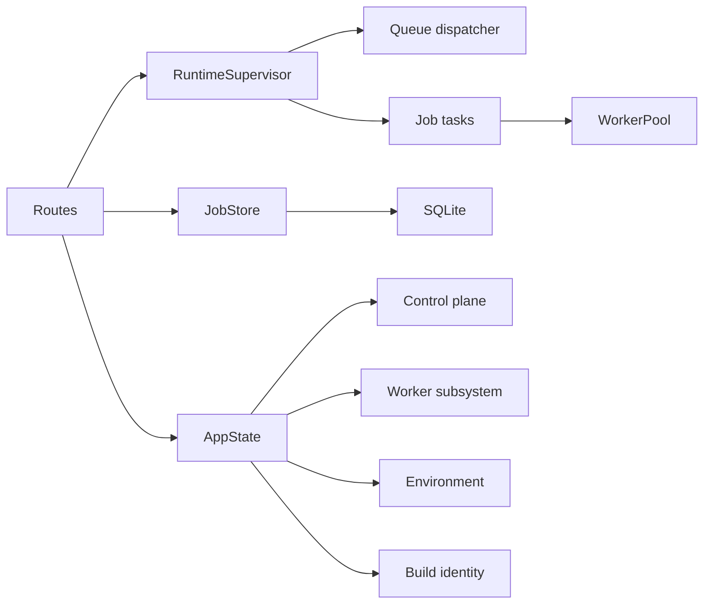

## Shared-state ownership rule

The control-plane rule is:

- state that coordinates multiple routes, jobs, or background tasks gets an
  owned task or actor boundary
- mutexes stay private to a subsystem when they only protect tiny local cells

`JobRegistry` actorization completed that rule for the main in-memory jobs map.
Routes, query modules, and runner code now call named `JobStore`/`JobRegistry`
methods instead of borrowing a shared lock.

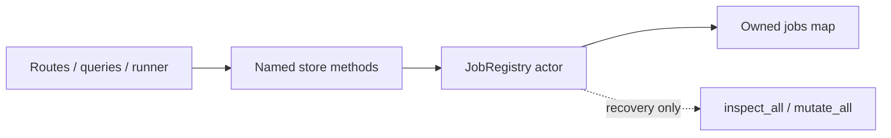

`inspect_all()` / `mutate_all()` remain deliberate escape hatches for crash
recovery and other rare collection-wide reconciliation. New feature work should
prefer per-job projections and transitions. Local mutexes still exist inside
subsystems such as `OperationalCounterStore` and `WorkerPool`, but those are
owner-private implementation details rather than architectural coordination
seams.

## Route state boundary

HTTP handlers share one `Arc<AppState>`, but the root state is intentionally
shallow:

- `AppControlPlane` for job store, queue wakeups, runtime supervision, and WS
  broadcast
- `WorkerSubsystem` for worker-pool access and command capability data
- `AppEnvironment` for config, media resolution, and filesystem roots
- `AppBuildInfo` for version/build identity reported to clients

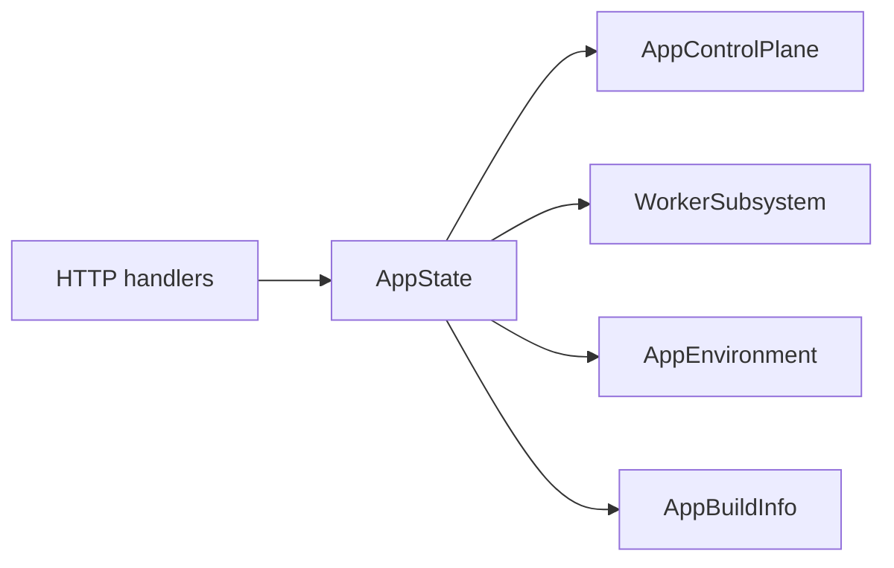

That keeps route code from depending on a flat catch-all server struct and
keeps runner-only dependencies such as cache and infer metadata out of shared
handler state entirely.

## Job shape

`JobStore` still owns a shared jobs registry, but it now does so through an
explicit `JobRegistry` component with named operations for submission,
listing, cancellation, queue claiming, and runner snapshots, plus narrower
per-job helpers for the remaining local transitions. `OperationalCounters`
also live in their own `OperationalCounterStore` component instead of another
interior `Arc<Mutex<_>>`. The registry's shared map now lives inside one owned
actor task: `JobStore` and the surrounding query/runner helpers send `Inspect`
or `Mutate` commands over an unbounded channel and await `oneshot` replies, so
access is serialized at a message boundary rather than through a shared mutex
field. Each `Job` is also no longer a flat field bag. The current runtime shape
is grouped as:

- `JobIdentity`
- `JobDispatchConfig`
- `JobSourceContext`
- `JobFilesystemConfig`
- `JobExecutionState`
- `JobScheduleState`
- `JobRuntimeControl`

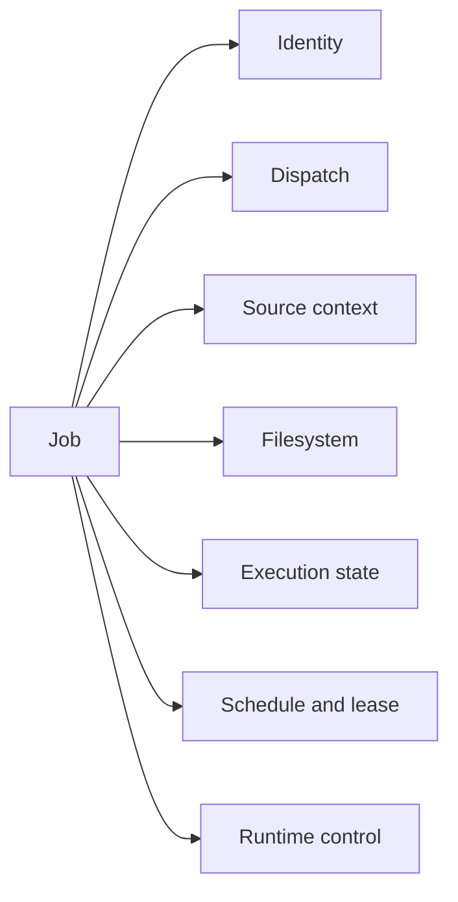

That split matters because routes, queueing, and runner code no longer need one
30+ field interior runtime record just to touch one concern.

### A file's phase

Each file's state is one `FilePhase` (see the type-driven-design page): every
transition builds the whole phase it moves to, so nothing from the previous
phase can survive by being forgotten. A file awaiting a retry is
`RetryPending`: still `processing` on the API, with its deadline and the
failure that caused it, and with no finish time or duration, since it has not
finished. A file whose own producer generated output that failed admission is
`Diagnosed`: terminal like `Done`, its output written and downloadable, its
admission findings (and any skipped stages) carried as
`FileOutputDiagnostics`; it is never retried, never requeued by a restart and
never counted as failed, so a job of done and diagnosed files completes. The
runner reaches `Done` and `Diagnosed` through one transition,
`mark_file_done(FileCompletion)`, whose `Clean` and `Diagnosed` arms the writer
decides from the proof it wrote. Progress (`FileProgress`) is separate,
ephemeral display state.

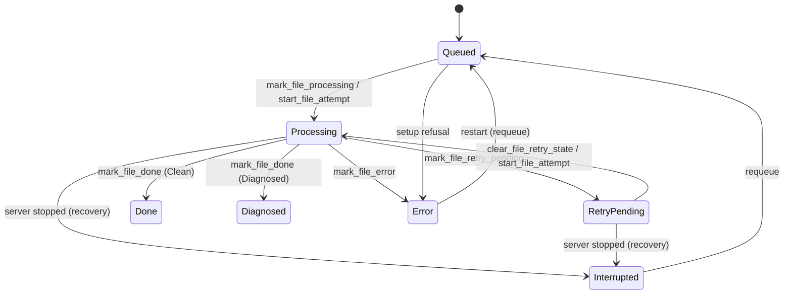

A phase and its `file_statuses` row are converted by one pair of functions.
`FilePhase::columns` is the column image of a phase (`status`, `error`,
`error_category`, `diagnostics`, `started_at`, `finished_at`,
`next_eligible_at`), with `None` written as NULL; `JobDB::update_file_status`
takes the phase and writes that whole image, so every file transition replaces
all seven columns and none survives from an earlier phase. `diagnostics` holds a
diagnosed file's findings as JSON, decoded at the database boundary
(`recover_file_phase`); unreadable JSON makes the row foreign rather than being
guessed at. A pending retry stores its failed attempt's end
in `finished_at` beside its deadline. At startup, each file of an interrupted
job is read as its phase and moved through `FilePhase::interrupted`; a row the
move changes (an in-flight phase) is written from the interrupted phase's image
(start time and last failure kept, `finished_at` and `next_eligible_at`
cleared), one row at a time.
`FilePhase::from_row` is the inverse: it rebuilds the phase a row describes at
load (a `processing` row with a `next_eligible_at` is a pending retry) and
reports, for every phase by the same rule, each column that held a value the
phase does not own. `content_type` (the result's type, written when a file
finishes with output) is not a phase column.

### Who submitted a job

`JobSourceContext::submitter` is an `Option<Submitter>`: the client's address
and, when it resolved to one, a name. `None` means no submitter was recorded;
the empty string stands for that only in the database columns. `Submitter`'s
fields are private and each route in is named:

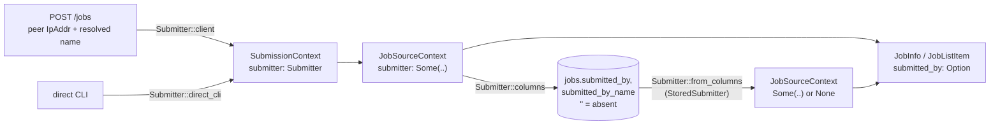

A resolution that names nothing records no name, never an empty one. The
direct CLI has no network peer and is recorded as a loopback client named
`direct-cli`. The columns are `TEXT NOT NULL DEFAULT ''`, so `''` is the
database's spelling of absence, decided in `Submitter::columns` and
`Submitter::from_columns` and nowhere else. `from_columns` returns a
`StoredSubmitter`: `Recorded`, `Absent`, or `NameWithoutAddress { name }` for
a row naming a submitter with no address, which this build never writes;
recovery records that as no submitter, logs the name it drops, and rewrites
the row's submitter columns once, so the next startup has nothing to report.
File rows are read as a `RecoveredFilePhase`: `Exact` (the phase's own
image), `Repairable` (it held columns its phase does not own, which is logged,
and the row is rewritten once from the phase), or `Foreign` (a status or
failure category this build cannot read, such as a newer build's after a
rollback: read as an error with a `[recovery]` note, logged at each startup,
and never rewritten, so the other build's row survives). A job status, a
language or a command this build cannot read is likewise read with a fallback
and never rewritten. A repair write that fails is logged and startup goes on.
Conflict
detection keys on `(Option<address>, path)`, so jobs with no recorded
submitter conflict with each other.

## Runner boundary

The runner now has a sharper read/write split:

- dispatchers receive immutable `RunnerJobSnapshot` values for static job
  configuration
- `JobStore` owns named execution mutations, and `JobRegistry` owns the
  in-memory projection/transition API, but the actual job-level state
  transitions for re-queue, running, failure, and finalization now live on
  `Job`
- registry methods now return typed summary/file projections for WebSocket
  publication, so query modules no longer borrow raw `Job` values just to
  publish live updates
- queue dispatch now uses typed `QueuePoll` snapshots and
  `LeaseRenewalOutcome` instead of raw strings, timestamps, and booleans
- file-level status transitions now reconcile through `Job` methods and then
  flow through runner utility helpers, instead of open-coded store-lock blocks
  in every dispatcher

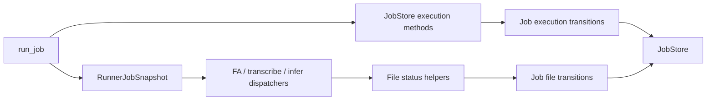

That still leaves a shared logical job registry, but callers now cross the
registry actor boundary instead of reaching for a shared lock or open-coded
store-wide collection helpers. The remaining bulk escape hatches stay inside
`JobRegistry` for recovery-style operations that genuinely need collection-wide
ownership.

## Queue and lease boundary

The local queue backend now crosses the store boundary with typed values:

- `QueuePoll` for claimed ready jobs plus the next wake deadline
- `LeaseRenewalOutcome` for the heartbeat loop
- `Job` methods for local-dispatch readiness, claim, release, and renewal

That keeps queue wakeups and lease renewal from depending on `Vec<String>`,
`Option<f64>`, bare booleans, and open-coded lease field mutation.

A job's lease is one value, `Option<LeaseRecord>` (owner, heartbeat, expiry),
not three fields that must agree. A lease always expires strictly after its
heartbeat, and the type holds that: its fields are private, `taken` and
`renew` (which renews the held lease in place) are the only places an expiry
is computed, from a positive `LeaseTtl`, and `LeaseRecord::new` refuses an
expiry that is not after the heartbeat. Deserialization goes through `new`
too (`serde(try_from)`), so neither the wire nor a test fixture can build an
inverted lease. The database writes all three lease columns or none
(`update_job_lease(job, Option<&LeaseRecord>)`), and the store writes them
through one method, `db_persist_lease(job, lease, LeaseWrite)`, for every
transition (claim, runner claim, renew, release, restart), and `read_lease` refuses a
row that holds part of a lease or an inverted one with a typed
`StoredLeaseError` (`Partial` or `Unordered`, naming the job), reported as
`ServerError::StoredLease`.

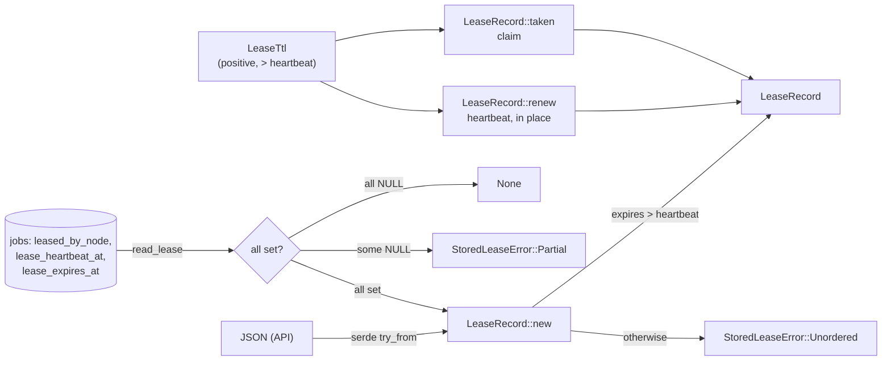
 A lease's lifetime is a `LeaseTtl`
(config `local_lease_ttl_s`, default 300), refused at config load unless it is
longer than the 60 s heartbeat (`LEASE_HEARTBEAT`), so a healthy runner's
lease can never lapse between renewals. `begin_runner` returns the lease it
took, and that value is what the store persists.

## Time

Every time the store and its runners record comes from one clock. `JobStore`
owns an injected `Clock` (`crate::clock`), and `JobStore::new` requires it:
there is no default for a store to fall back to. It is created once where the
program is composed, `SystemClock` in `serve_with_runtime` and the direct
CLI, and passed down (the `create_app*` entry points and `DirectHost::new`
take it as a parameter); startup recovery and retention read the same one.
Tests pass a `ManualClock` where they pin or advance time.

An event is recorded at an `EventTime` (`crate::store::EventTime`), a
`MachineTime` that only the store's clock produces (`JobStore::event_time`;
its constructor is private to the store). `RunnerEventSink::now()` returns
one, and every sink event method (file processing, done, error, attempt start
and finish, retry pending, job finalize and fail) and the store's own event
methods and records take one, as does a submission (`SubmissionContext`). So
a pipeline cannot record an event at a time it chose: there is no
`EventTime` it could build from `MachineTime::now()`. A deadline derived from
an event (a file's retry, a job's memory-gate requeue) is
`EventTime::deadline_after(backoff)`, the one place one is computed.

`FileRunTracker` stamps every file event from the sink, and an event that
writes two records (the file and its attempt) writes one instant to both. The
free helpers that used to forward one sink call each, taking a time from
their caller, are gone; supervision's fallback paths stamp from the sink too.

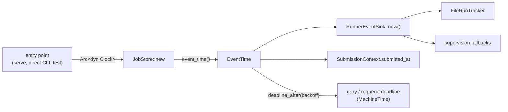

All of these times are `MachineTime` (see the type-driven-design page): a
`REAL` column of Unix seconds in SQLite, decoded through
`MachineTime::from_unix_seconds` so a stored time that names no instant fails
to load, and RFC 3339 UTC with three fractional digits on the wire. Durations
on the wire (`duration_s` on jobs and files) are `NonNegativeSeconds`,
computed by the server through `NonNegativeSeconds::between(start, end)`,
never negative; a job's comes from one `Job::duration`, shared by `to_info`
and `to_list_item`.

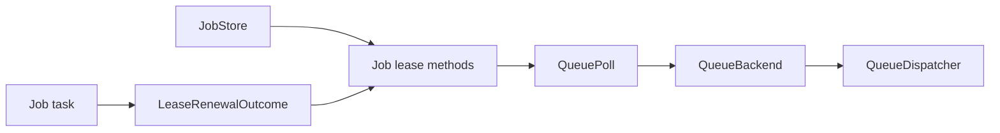

## Current crate and package map

| Component | Current location | Role |
|-----------|------------------|------|
| CLI | `crates/batchalign` | clap CLI, dispatch router, daemon lifecycle, output writing |
| Server | `crates/batchalign` | axum routes, job store, worker pool, OpenAPI, server-side orchestration |
| CHAT ops | `crates/batchalign` | CHAT extraction, injection, validation, FA/morphosyntax helpers |
| Python worker | `batchalign/worker/` | worker entry point, model loading, capabilities, infer/execute dispatch |
| Python inference | `batchalign/inference/` | engine-specific inference backends |

Older names such as the nested Rust workspace and `batchalign-server` are
historical. `batchalign-types` is an active crate that holds shared domain
newtypes and worker protocol types (see the workspace `Cargo.toml`).

## Dispatch resolution

The CLI router in `crates/batchalign/src/cli/dispatch/mod.rs` resolves targets
in this order:

1. explicit `--server` for command classes that can target a remote server
   directly
2. local daemon if `auto_daemon` is enabled
3. already-running loopback server on the configured local port
4. direct local execution

Special cases:

- `transcribe`, `transcribe_s`, `benchmark`, and `avqi` prefer local-daemon
  dispatch when `auto_daemon` is enabled; if that daemon path is unavailable,
  the router still falls back to the explicit `--server`
- explicit `--server` always stays on content mode, even for `localhost`
- local daemons and auto-detected loopback servers use shared-filesystem
  `paths_mode` for local-audio commands
- multi-server `--server URL1,URL2` is rejected in the current release
- `daemon.rs` still contains sidecar lifecycle helpers, but the current
  dispatch path does not auto-select a sidecar yet

## Server endpoints in use

The current server exposes these job/control endpoints:

- `GET /health`
- `POST /jobs`
- `GET /jobs`
- `GET /jobs/{job_id}`
- `GET /jobs/{job_id}/results`
- `GET /jobs/{job_id}/results/{filename}`
- `POST /jobs/{job_id}/cancel`
- `DELETE /jobs/{job_id}`
- `POST /jobs/{job_id}/restart`
- `GET /jobs/{job_id}/stream`
- `GET /media/list`
- `GET /ws`

Dashboard routes are also present, but the list above is the core processing
surface.

## Concurrency mapping

| Legacy Python implementation | Rust rewrite equivalent |
|---|---|
| `ProcessPoolExecutor` for CPU-heavy commands | Stanza/IO profile: persistent Python subprocesses, exclusive checkout |
| `ThreadPoolExecutor` for GPU/ASR paths | GPU profile: `SharedGpuWorker` with Python `ThreadPoolExecutor` inside one process |
| Global pool size logic in Python server | Job-level semaphore (`max_concurrent_jobs`) + per-profile pool limits in Rust server |

Additional safeguards:
- Memory gate before job start (skipped when idle workers for the job's `(command, lang)` already exist in the pool).
- Auto-concurrency defaults use 12 GB/slot and hard-cap at 8 slots.

## Command routing

| Command class | Routing behavior |
|---|---|
| `morphotag`, `align`, `translate`, `utseg`, `coref`, `compare` | Explicit single `--server`, local daemon, auto-detected loopback server, or direct local fallback |
| `transcribe`, `transcribe_s`, `benchmark`, `avqi` | Prefer local daemon when `auto_daemon` is enabled; if it is unavailable, fall back to explicit single `--server`, then loopback server, then direct local |

The current mixed-runtime sidecar idea remains only partially wired: the daemon
lifecycle helpers still exist, but dispatch does not yet auto-select a sidecar
server for transcribe-related commands.

## Server-side inference

For text-only commands, the server owns the full CHAT lifecycle, no CHAT text crosses IPC to Python workers:

1. **Parse**: read `.cha` files, parse into ChatFile AST
2. **Extract**: collect payloads (words, text) from the AST
3. **Cache check**: look up each utterance in the server-side UtteranceCache
4. **Infer**: send cache misses to Python workers via typed `execute_v2`
   requests (cross-file batching per language for text tasks)
5. **Inject**: insert model results back into the AST
6. **Serialize**: validate and write output `.cha` files

| Command | Dispatch Path | Worker Role |
|---------|--------------|-------------|
| morphotag, utseg, coref | infer (cross-file) | Stateless model inference only |
| translate | infer (per-file, one request per utterance) | Stateless model inference only; the server paces requests and waits out transient provider answers |
| align | infer (per-file, per-group) | Stateless audio/text alignment inference |
| transcribe, transcribe_s | infer (per-file audio) | Raw ASR inference feeding a Rust-owned pipeline |
| benchmark | infer (per-file audio + compare) | Raw ASR inference feeding Rust transcribe + compare |
| diarize, opensmile, avqi | infer (per-file media V2) | Rust-owned prepared-audio media analysis over typed worker requests |

There is no CLI command literally named `speaker`; speaker is the low-level
worker capability. It supports integrated `transcribe_s` and the standalone
`diarize` command, whose product is anonymous turns JSON rather than CHAT.

## SSE job streaming

For lightweight real-time progress monitoring (alternative to WebSocket):

```text
GET /jobs/{job_id}/stream
```

Returns Server-Sent Events:
- `snapshot`: initial file statuses on connect
- `file_update`: per-file status changes
- `job_update`: overall job status changes
- `complete`: job finished (stream closes)

## Worker protocol

Workers are spawned by the server pool and communicate over stdio JSON-lines.
The key operations are:

- `health`
- `capabilities`: reports infer tasks and engine versions; Rust derives commands
- `process`
- `batch_infer` (shrinking compatibility path)
- `execute_v2` (live typed infer path)
- `shutdown`

A stdio worker keeps its protocol stream to itself: at startup
(`claim_protocol_stdout` in `batchalign/worker/_protocol.py`) it moves the
pipe the server reads onto a private descriptor that only protocol lines are
written to, and points descriptor 1 and `sys.stdout` at stderr, so a library
banner or a C extension's print is logged, not read as a reply. Every Rust
reader (sequential stdio, sequential TCP, shared GPU) classifies a line by
one rule (`WireLine`): a JSON object is a message, a blank line is nothing,
and anything else is noise. A message the protocol refuses is a hard framing
error (`Protocol`), so the request fails loudly. Up to
`MAX_RESPONSE_STDOUT_NOISE_LINES` consecutive noise lines are skipped; the
next one makes the stream untrusted, and the waiters receive the retryable
`OutputNoise` while the worker is retired.

For live `execute_v2` requests, the worker/result contract is also split on
purpose: malformed request payloads and unreadable prepared artifacts stay in
`invalid_payload` / attachment error buckets, while malformed model-host output
is reported as `runtime_failure`. That keeps bad Python/SDK result shapes from
masquerading as caller input mistakes.

### How a worker serves requests: one owner

Whether one worker process serves several requests at once is decided once, in
Rust, by `WorkerServing::decide` (`worker/serving.rs`), from the same runtime
inputs the worker is launched with. The pool routes by that value and passes it
to Python as `--serving concurrent|sequential`; the worker obeys it and does not
derive its own.

| Serving | When | How the pool dispatches |
|---|---|---|
| `SharedConcurrent { in_flight }` | GPU profile, not `force_cpu`, `gpu_thread_pool_size` above 1; Stanza on free-threaded Python | One process per key (`gpu_workers` / `SharedGpuWorker`), up to `in_flight` requests multiplexed into it |
| `OneRequestPerProcess` | GPU profile with `force_cpu` or a pool size of 1; Stanza on GIL Python; IO | Exclusive checkout from up to `max_workers_per_key` processes per key |

The two halves used to have separate owners. The pool treated every
GPU-profile worker as shared and kept one per key; the worker probed CUDA and,
on a CPU-only host, served its requests one after another. On such a host every
request for a key queued on one process while `max_workers_per_key` went
unused, and concurrent Whisper UTR requests ran strictly one at a time.
Forced-CPU work is one request per process because
each CPU PyTorch request already uses every core; threads in one process only
oversubscribe them, while separate processes let the configured capacity and
the memory gate decide how many run.

### Concurrent dispatch for shared workers

A `SharedConcurrent` worker supports concurrent V2 requests via request_id
multiplexing:

- Rust sends multiple `execute_v2` requests to one worker without waiting for responses
- Python's `_serve_stdio_concurrent()` dispatches to a `ThreadPoolExecutor` of `in_flight` threads
- Responses carry `request_id` fields, Rust's background reader routes them to pending oneshot channels
- Non-V2 ops (health, capabilities, shutdown) use a separate sequential control channel

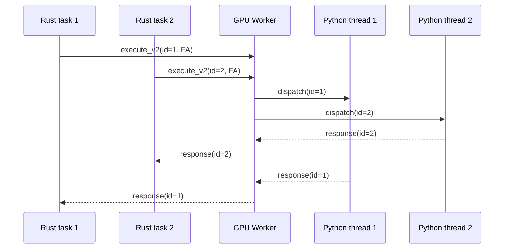

### How a shared GPU worker gets created

Two different serializations govern worker creation, and conflating them leads to
wrong conclusions about where a stall came from.

| Level | Mechanism | What it serializes |
|---|---|---|
| Process | `memory_guard`'s `SPAWN_SEMAPHORE`, one permit, held until the worker signals ready | **Every** spawn in the process, so a second model load never checks free RAM before the first one's models are resident |
| Key | the `GpuWorkerSlot` in each `gpu_workers` entry (`worker/pool/gpu_slot.rs`) | The callers of ONE key, so they share a single spawn instead of racing to start several worker processes |

The map's own lock is held only long enough to hand out a slot. It used to be
held across the whole spawn, which did prevent duplicate spawns but also made
every other user of the map wait for an unrelated key's model load: dispatches
whose worker was already warm, and `/health`, which walks the same map. On a
busy host that is tens of seconds of unrelated stalling per cold key.

Two consequences worth knowing:

- **Per-key coordination does not make spawns parallel.** The process-level
  semaphore still admits one at a time, deliberately. What it removes is work
  that needs no spawn queuing behind one.
- **A spawn can now finish after `shutdown()` has drained the map.** `shutdown()`
  cancels its token before draining, and the spawning task retires its own worker
  when it sees that token set, rather than returning a worker nothing would reap.
  Callers get `WorkerError::PoolShuttingDown`.

`execute_v2` is the main path for live server-owned inference:

- Rust prepares text/audio artifacts
- Python workers run inference on those prepared inputs
- Rust injects results back into the AST and serializes output

`batch_infer` remains only as a shrinking compatibility surface:

- Rust extracts payloads from CHAT
- Python workers run inference on those payloads
- Rust injects results back into the AST and serializes output

This path is intentionally **not** the target boundary for new work. New
control-plane logic should land either in Rust or on the typed `execute_v2`
surface, not by widening `process` or `batch_infer`.

Rev.AI submission is no longer a worker IPC operation. The Rust server owns
Rev.AI-backed raw-ASR evidence lookup, language identification, submission,
polling, validation, and durable commit through `batchalign::revai`
(`crates/batchalign/src/revai/`), so the Python boundary stays inference-only.
Only a typed cache miss can authorize a paid request, and a per-key lease makes
concurrent identical requests converge on one service crossing. The same
server-owned boundary handles Rev-backed timed-word recovery for `align` UTR.

The normalized UTR ASR cache has the same single flight, for every UTR engine
(`runner/dispatch/utr.rs`). A pinned-plan lookup takes an `InferenceLease` on
the cache key before reading, and the miss it returns holds that lease through
inference and commit (`UtrAsrCacheMiss` then `UtrAsrInferred`). A concurrent
identical request, keyed exactly as the cache row is (the key names engine,
audio identity and language, which fix the namespace), waits and then replays
the stored row. Two jobs over the same recordings used to run the same
long Whisper pass once each. If the leader is cancelled or fails, its
lease drops and the next waiter finds no row and becomes the leader.

The legacy batch preflight upload path is deliberately disabled: it submitted
before evidence lookup and could not enforce the typed miss authorization
boundary. Cold Rev.AI batches therefore run through the normal per-file
concurrency today. A future parallel preflight replacement must plan each file
as either a validated evidence hit or an authorized miss before submitting any
provider work.

### Capability detection

Capabilities are detected lazily from the first real worker spawn rather than
from a dedicated probe worker at startup. When the first worker for any profile
starts, it reports which infer tasks the Python environment supports via import
probes (`importlib` checks whether each task's dependencies are installed) and
returns a non-empty engine version for every advertised task, it does not load
full models beyond what the spawned command requires. Rust then derives the
released command surface from that infer-task set and gates job submission on
the derived commands only.

See [Capability Discovery](../../architecture/python-rust-boundary/python-rust-boundary.md#capability-discovery)
for the full flow, the import probe table, and troubleshooting tips.

## Local daemon state

The local daemon uses the same configured port from `~/.batchalign3/server.yaml`
(default `8000`). It records state in `daemon.json` and can start a separate
sidecar profile for transcribe workloads.

`serve start` writes `server.log` for manually started servers, and the server
itself writes `server.pid`: a handshake naming its PID and the port it actually
bound. Callers read the port from there rather than from `server.yaml`, whose
`port` is a request (`0` asks the OS to choose).
Auto-daemon state is tracked separately from manual `serve start`.

The state file, the handshake and the worker registry are all written through
`atomic_file::write_atomically`, the one atomic writer: a uniquely named
temporary file beside the target, flushed, renamed over it, and the directory
synced on Unix. The comparison reports
and the debug and evaluation artifacts use the same writer (`Existing::Keep`
where an existing artifact must not be replaced).

Each daemon profile (main, sidecar) has a start lock, a file lock held as a
`DaemonStartLock` value in `crates/batchalign/src/cli/daemon.rs` (over the
shared `file_lock::HeldFileLock`, the one cross-process lock primitive). Checking,
starting, replacing and stopping a daemon all take it, and writing or
removing the profile's state file needs it (the functions take the lock, not
a profile), so a `serve stop` cannot race another process's start. Reading
the state file or the handshake takes no lock and never deletes
(`DaemonStartLock::read_state` and `read_handshake` are the reads the ensure
and stop paths share).

A state file or handshake that exists but cannot be read is an
`UnreadableRecord` (the path and the reason), never "no daemon": it may name
a live process. The ensure path refuses with it (exit code 6, naming the file
and what to check) instead of starting a daemon and writing a new record over
it; `serve start` refuses the same way over an unreadable handshake; `serve
stop` leaves it in place, says so, and fails after stopping everything else.
A stop reports a `StopOutcome` per record: `Stopped`, `AlreadyDead` (the
record named an exited process and was removed), `NotRunning` or
`Unreadable`.

The daemon path reads `server.yaml` once, where the CLI loads it, and is
handed that `ServerConfig` with a `DaemonRequest` (the device switches,
`--workers` as a `NumWorkers`, `--timeout` as a `PositiveSeconds`): the port
request, the verbosity and the device settings all come from it.

The handshake is the running server's own record, and only it removes it
while it runs: `ServerHandshake::publish_listening` writes this process's
PID and returns a `PublishedHandshake`, whose `retire` removes the file only
while the record still names this process. The CLI removes a handshake only
for a process it stopped or found dead, and only while the record names that
PID (`remove_if_names`). The removal's read and delete, and every publish,
run under the slot's own `HandshakeLock` (an OS lock on `server.pid.lock` or
`sidecar-server.pid.lock`), so a replacement cannot publish between a stopping
server's read of its own record and its delete: a server that is shutting down
cannot delete the handshake a replacement has published. That lock is held for
one file operation and never across a wait. It is deliberately not the CLI's
per-profile `DaemonStartLock`, which the CLI holds while it waits for a spawned
server to publish and for a stopped one to exit; a server taking it to publish
or retire would deadlock against that wait.

```mermaid
flowchart LR
    yaml["server.yaml"] -->|"load_config_from_layout (once)"| cfg["ServerConfig"]
    cli["CLI flags"] --> req["DaemonRequest"]
    cfg --> ensure["ensure_daemon"]
    req --> ensure
    ensure -->|"read_state()"| state{"daemon.json"}
    state -->|"absent"| start["start_daemon"]
    state -->|"recorded"| reuse["reuse / restart"]
    state -->|"unreadable"| refuse["UnreadableRecord<br/>refused, file kept"]
    start --> child["child server"]
    child -->|"publish_listening"| hs["server.pid<br/>(PublishedHandshake)"]
    child -->|"retire: only if it names us"| hs
``` `started_at` in the state file is
a `MachineTime`; a state file from an older build, which wrote Unix seconds
there, still reads, so the stale-build check can find and replace that
daemon rather than orphan it.

## Startup recovery

Server startup now treats crash recovery as an explicit typed transition rather
than ad hoc map mutation.

1. SQLite marks previously active jobs as `Interrupted` (returning their
   `JobId`s), and deletes jobs past `job_ttl_days`, returning each as a
   `PrunedJob` (its `JobId` and the `ServerPath` of its staging directory, one
   value rather than two parallel string lists) for startup to remove from
   disk. The jobs directory stays a `PathBuf` from the layout
   onward, never re-encoded through `to_string_lossy`.
2. `JobStore::load_from_db()` rebuilds each `Job` value from persisted rows.
3. `Job::reconcile_recovered_runtime_state()` decides the canonical next state:
   requeue unfinished work or promote all-terminal jobs to `Completed` /
   `Failed`.
4. The reconciled status and cleared lease metadata are written back to SQLite
   before normal queue dispatch resumes.

That keeps the in-memory control plane and the persisted recovery snapshot in
sync after every restart.

## Job lifecycle and cancellation

Jobs progress through a small state machine. The transitions are explicit
methods on `Job` (`store/job/lifecycle.rs`); routes, runners, and reconcilers
never mutate `JobStatus` ad-hoc.

```mermaid
stateDiagram-v2
    [*] --> Queued
    Queued --> Running: dispatched
    Queued --> Cancelled: user cancel
    Running --> Completed: all files done
    Running --> Failed: any file errored
    Running --> Cancelled: user cancel
    Running --> Interrupted: server shutdown
    Interrupted --> Queued: recovery (resumable files)
    Interrupted --> Completed: recovery (all files done)
    Interrupted --> Failed: recovery (any file errored)
```

Two things distinguish this from a flat "every terminal looks the same"
model:

- **`Cancelled` is reserved for user gestures.** TUI cancel and HTTP
  `POST /jobs/{id}/cancel` reach this state. Cancelled is permanent, a
  Cancelled job is never auto-resumed. The user said stop; the server
  honors that.
- **`Interrupted` is the system-initiated counterpart.** Graceful server
  shutdown and crash recovery (`db.recover_interrupted`, through the typed
  status image)
  both write `JobStatus::Interrupted`. Although `JobStatus::is_terminal()`
  returns `true` for it, the recovery sequence above is special-cased to
  transition resumable Interrupted rows back to `Queued` so the next local
  runner attempt picks up where the previous server left off.

Writing `Cancelled` for a system event would conflate "user said stop" with
"server bounced", and the two require opposite responses. The 2026-04-27
investigation found long-running fleet jobs perpetually labeled `cancelled`
even though no user had pressed cancel, because the shutdown handler used
the user-cancel transition. The fix routed shutdown through `Interrupted`
so the recovery sequence can act on it.

### Cancel-provenance audit

Every cancel attempt, user or system, appends one row to the
`cancellations` audit table with a typed source, host, pid, reason, and
in-flight filename. Multiple rows per job are normal (two cancel clicks an
hour apart, one user cancel followed by a system cancel at shutdown,
etc.).

| `CancelSource` value | Origin |
|---|---|
| `Tui` | TUI cancel keystroke |
| `Api` | HTTP `POST /jobs/{id}/cancel` |
| `Cli` / `Dashboard` / `Staging` | other user-facing entry points |
| `Signal` | system-initiated: server-shutdown handler |

`CancelReason` is a free-form string. `CancelReason::server_cancel_all()`
is the stable reason emitted by the shutdown path so audit readers can tell a
system interrupt from a user cancel without parsing ad hoc strings.

### Migration-hash drift (deploy hardening)

Sqlx records SHA-384 of each migration's SQL bytes in
`_sqlx_migrations.checksum` at apply time and refuses to start a binary
whose embedded migration content hashes don't match, even comment-only
edits change the hash. Without intervention, a privacy scrub or
documentation fix on a shipped migration wedges every fleet host into a
startup crash loop on the next deploy. `KeepAlive=true` masks the
failure as a tight crash loop, which launchctl reports as
"spawn scheduled, active count = 0", easy to misdiagnose as a
launchctl issue.

The deploy runtime self-heals this. At deploy build time,
`automation/pyinfra/deploys/deploy_batchalign3.py::_compute_migration_hashes`
hashes every `crates/batchalign/migrations/*.sql` and embeds the
list as `expected_migrations` in the per-host JSON config. Before
bootstrapping the new daemon,
`LocalBatchalignServiceSystem.reconcile_migration_hashes` reads
`_sqlx_migrations`, compares each row's stored hash against the
expected hash, and `UPDATE`s any drifted row with a `WARN` log line.

The trust model: the developer who pushed the migration content change
is asserting (by deploying) that the change is semantically benign. The
runtime codifies that assertion against the fleet. Operational
runbook: the deploy procedure's migration-hash drift (self-healing) section.

## Key files

| File | Role |
|------|------|
| `crates/batchalign/src/cli/dispatch/mod.rs` | top-level dispatch router |
| `crates/batchalign/src/cli/dispatch/single.rs` | explicit remote single-server dispatch |
| `crates/batchalign/src/cli/dispatch/paths.rs` | local-daemon paths-mode dispatch |
| `crates/batchalign/src/cli/daemon.rs` | daemon lifecycle, start locks, state files, sidecar handling |
| `crates/batchalign/src/routes/mod.rs` | axum router composition and middleware |
| `crates/batchalign/src/routes/jobs/mod.rs` | job submission/list/detail routes |
| `crates/batchalign/src/routes/health.rs` | `/health` payload and capability reporting |
| `crates/batchalign/src/types/config/` | `ServerConfig`, defaults, validation, state dir (split: `layout.rs`, `load.rs`, `resolve.rs`, `server.rs`, `tests.rs`) |
| `crates/batchalign/src/runner/` | job runner, dispatch shape selection |
| `crates/batchalign/src/runner/dispatch/` | batched infer, FA, transcribe pipelines |
| `crates/batchalign/src/morphosyntax/` | morphosyntax orchestrator (parse→cache→infer→inject) |
| `crates/batchalign/src/fa/` | forced alignment orchestrator |
| `crates/batchalign/src/runner/dispatch/transcribe_pipeline.rs` | transcribe orchestrator (ASR→postprocess→CHAT assembly) |
| `crates/batchalign/src/utseg.rs` | utseg orchestrator |
| `crates/batchalign/src/translate/` | translation orchestrator (`mod.rs`), per-utterance loop (`items.rs`), provider policy (`provider.rs`) |
| `crates/batchalign/src/coref.rs` | coreference orchestrator |
| `crates/batchalign/src/cache/` | Tiered utterance cache (moka hot + SQLite cold), BLAKE3 keys |
| `crates/batchalign/src/worker/pool/` | worker spawn, checkout, health loop, idle timeout |
| `crates/batchalign/src/db/` | SQLite persistence (WAL), schema, recovery, TTL pruning |
| `batchalign/worker/_main.py` | Python worker entry point |
| `batchalign/worker/_model_loading/` | Python worker model-loading package |
| `batchalign/worker/_stanza_loading.py` | Stanza configuration and ISO-code mapping |
