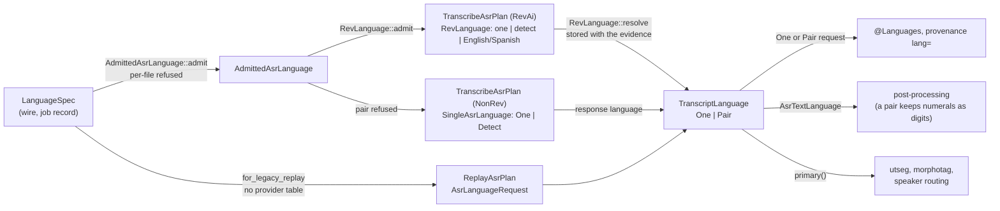
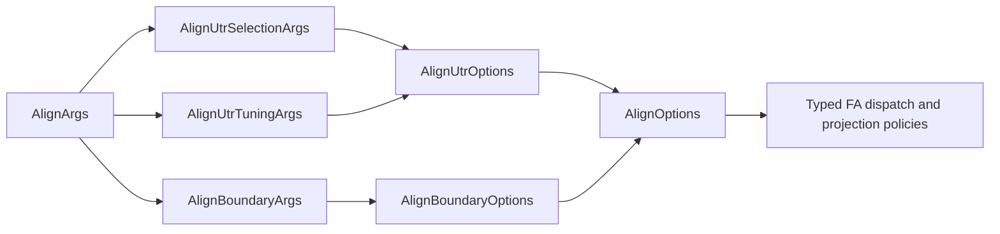

# Type-Driven Design

**Status:** Current
**Last updated:** 2026-10-06 11:44 EDT

Batchalign uses Rust's type system to encode domain invariants at compile time. This document catalogs the patterns in use, explains when to reach for each one, and records the serde techniques that keep the wire format stable while the internal types evolve.

## Patterns

### Source-bound timed-CHAT diarization

`DiarizeOutputMode` separates media-to-turns evidence from mapped CHAT rewrite.
Its `SpeakerTrackMapping` has one syntax-checked CLI/serde constructor, but is
not yet participant identity admission. `MappedDiarizeSource` requires immutable
`ValidChatFile`, checks every mapping target against its declarations and retains
Chatter's borrowed `WordSpeakerSource` capabilities before inference. The source
cannot change while these capabilities are held. Model labels use the same
deterministic coordinates as retained turns; the shared Chatter partition owner
admits every structural boundary and derives child bullets from actual `%wor`.

Application consumes these source-bound capabilities. Missing/tied acoustic
ownership cannot yield a writable partial document. Headers remain unchanged;
analysis invalidation receipts become a typed `@Comment`, preserving contributor
annotations. `PostValidated::gate_owned` then establishes complete construction
admission. The shared audio-output writer takes that proof, not raw CHAT bytes.
The source-aware output policy selects filename and content type together for
planning, recovery and writing; no separate diarization writer exception exists.

### 1. Domain Identifier Newtypes (`string_id!` / `numeric_id!`)

**Problem:** Functions with signatures like `fn submit(job_id: &str, command: &str, lang: &str, filename: &str)` are impossible to read at a glance, every parameter is `&str`. Swapping arguments compiles silently.

**Solution:** Zero-cost newtypes generated by two macros in
``crates/batchalign-types/src/macros.rs``.

```text
// crates/batchalign-types/src/domain.rs
string_id!(
    /// Server-assigned UUID (v4) for a job.
    pub JobId
);

numeric_id!(
    /// Duration measured in milliseconds.
    pub DurationMs(u64) [Eq]
);
```

**`string_id!`** generates: `Debug`, `Clone`, `PartialEq`, `Eq`, `Hash`, `Serialize`, `Deserialize`, `ToSchema`, `Display`, `From<String>`, `From<&str>`, `Into<String>`, `Deref<Target=str>`, `AsRef<str>`, `PartialEq<&str>`, `Borrow<str>`, `Default`. The `Deref<Target=str>` impl enables gradual migration, callers that need `&str` auto-coerce.

**`numeric_id!`** generates the same set adapted for numeric inner types. Append `[Eq]` for integer types that need `Eq + Hash`.

All generated types use `#[serde(transparent)]`: the wire format stays as bare strings or numbers.

**`validated_numeric!`** declares a numeric newtype whose value is proven at
construction: a private field, `TryFrom<inner>` (which serde deserializes
through) and `get()`. Its `schema(type, "format", minimum .., [maximum ..,]
description "..")` clause generates BOTH the JSON Schema (schemars, read by
the worker IPC schema and the Python conformance check) and the OpenAPI schema
(utoipa) from one place, so the bound the constructor enforces appears in both
and the two cannot disagree.

**Complete inventory:**

| Type | Inner | Defined in | Domain |
|------|-------|------------|--------|
| `JobId` | `String` | `crates/batchalign-types/src/domain.rs` | Job identity |
| `CommandName` | `String` | `crates/batchalign-types/src/domain.rs` | Batchalign command (`"morphotag"`, `"align"`) |
| `ReleasedCommand` | enum | `crates/batchalign-types/src/domain.rs` | Closed released command vocabulary |
| `LanguageCode3` | `String` | `crates/batchalign-types/src/domain.rs` | Validated ISO 639-3 code (3 ASCII alpha, lowercased) |
| `LanguageSpec` | enum | `crates/batchalign-types/src/domain.rs` | `Auto`, `Resolved(LanguageCode3)`, `Pair(LanguagePair)` or `PerFile`: language at job boundary |
| `LanguagePair` | struct | `crates/batchalign-types/src/domain.rs` | Two different codes of one code-switched recording, primary first; `LanguagePair::new` and `parse` refuse the same language twice |
| `AsrLanguageRequest` | enum | `crates/batchalign-types/src/domain.rs` | What recognition is asked for: `One`, `Detect` or `Pair`; no per-file state |
| `TranscriptLanguage` | enum | `crates/batchalign-types/src/domain.rs` | What a transcript resolved to: `One` or `Pair`; `primary()` and `declared()` |
| `DisplayPath` | `String` | `crates/batchalign-types/src/domain.rs` | Display-oriented file path within a job (`"sample.cha"`, `"subdir/sample.cha"`) |
| `NodeId` | `String` | `crates/batchalign-types/src/domain.rs` | Server/fleet node identity |
| `BuildOwnedNamespace` | `Cow<'static, str>` | `crates/batchalign/src/cache/mod.rs` | The one representation behind the cache namespace and revisions this build owns: `UtrAsrCacheNamespace`, `RevAsrModelRevision`, `SpeakerEvidenceModelRevision` and `SpeakerNormalizationRevision`. Built as a literal (`const fn literal`) or derived from literals and files compiled into the binary (`derived`). Each wrapper keeps its own newtype, so a cache task constant still refuses one where another belongs. It replaced `EngineVersion`, a worker-version type deleted from `batchalign-types` once nothing used it |
| `StampSafeText` | `Cow<'static, str>` | `crates/batchalign-types/src/domain.rs` | Text that cannot change a provenance stamp's structure. Refuses blank text, surrounding whitespace (`StampSafeText::WHITESPACE`, the Unicode `White_Space` set) and the stamp structure characters (`StampSafeText::STAMP_STRUCTURE`: vertical bar, semicolon, closing bracket, newline, carriage return), with `InvalidStampSafeText`. Routes in: `TryFrom` (also serde), `const fn from_static` (a literal checked at compile time inside `const { }`) and `join` with a `StampJoiner` (`Concat`, `Plus`, `Colon`, `At`, `Comma`). Its JSON Schema `pattern` is generated from the same two lists. Provenance's `StampFieldValue` wraps it |
| `ReportedEngineName` | `StampSafeText` | `crates/batchalign-types/src/domain.rs` | An engine identity a worker reported, in a capability report or on a result. A wrapper over `StampSafeText`; the only constructor is `TryFrom`, shared by deserialization, which applies the `StampSafeText` check; there is no infallible `From` |
| `CorrelationId` | `String` | `crates/batchalign-types/src/domain.rs` | Cross-service tracing ID |
| `LeaseRecord` | struct (private) | `crates/batchalign/src/types/scheduling.rs` | A job lease: owner, heartbeat, expiry, with the expiry strictly after the heartbeat. Built by `taken`/`renew` (expiry from a positive `LeaseTtl`) or `new`, which refuses the inverted order with `LeaseExpiryNotAfterHeartbeat` and which serde and the database read both go through; read with accessors. A stored lease that is partial or inverted fails to load as `StoredLeaseError` |
| `EventTime` | `MachineTime` (private) | `crates/batchalign/src/store/event_time.rs` | The instant an event is recorded at, produced only by the store's clock (`JobStore::event_time`). Required by every `RunnerEventSink` event method, the store's event methods and records, and `SubmissionContext`, so a pipeline cannot hand in `MachineTime::now()` or any time it chose. `deadline_after` derives a retry or requeue deadline. A compile-fail doctest shows it cannot be built outside the store |
| `FilePhase` | enum | `crates/batchalign/src/store/mod.rs` | Where a file is: `Queued`, `Processing { started_at }`, `RetryPending { started_at, failed_at, retry_at, failure }`, `Done { started_at, finished_at }`, `Error { started_at, finished_at, failure }`, `Interrupted { started_at, last_failure }`. A finish time exists only on `Done` and `Error`, a retry deadline only on `RetryPending`, a failure only where one happened, and always on `RetryPending` and `Error`. `FileFailure` has a private shape: this build makes only `recorded(message, category)`; the database boundary reads a stored row's message alone, category alone, or (for a failed row that named neither) an unrecorded failure (`of_failed_row`), and `from_columns` gives `None` for an interrupted row's columns that held neither. `kind()` gives the API status; `interrupted()` is the startup transition of an in-flight phase. `FilePhase::columns` (its `FilePhaseColumns` row image, NULLs included) is the one writer, used by the insert, every transition, startup interruption and the recovery requeue, and `FilePhase::from_row(FilePhaseColumns)` the one reader; a roundtrip test holds them inverse |
| `JobStatusColumns` | struct | `crates/batchalign/src/store/job/projections.rs` | A job's status columns (`status`, `error`, `completed_at`, `num_workers`, `next_eligible_at`) as one image, built only by its owners: `Job::status_columns`, the stop transition `JobStatusColumns::stopped`, and `JobStatusColumns::read_stored` at the database boundary (fields visible to the job module only, read elsewhere through accessors; a live stop adopts the image whole). `JobDB::write_job_status` writes it whole, NULLs included, and every status write reads it from the job after the transition (`JobStore::db_persist_job_status`), so a row describes the status the job reached, never the one a caller asked for |
| `Submitter` | struct (private) | `crates/batchalign/src/store/job/types.rs` | Who submitted a job: the client's address and, when it resolved to one, a name, neither ever empty. Held as `Option<Submitter>` on `JobSourceContext`, so absence is `None` from submission to the database; built by `client`, `direct_cli` or, at the database boundary, `from_columns`, the one place `''` means absent. |
| `NumSpeakers` | `u32` | `crates/batchalign-types/src/domain.rs` | Speaker count for diarization |
| `PositiveSeconds` | `NonZeroU64` (private) | `crates/batchalign-types/src/domain.rs` | A timeout or interval an operator sets, in whole seconds, never zero. "Not set" is `Option<PositiveSeconds>::None`. Routes in: `TryFrom<u64>` and `FromStr` (the `--timeout` flag, which refuses `0` with an instruction), `literal::<N>()` (checked non-zero at compile time) and serde, which refuses `0`. The value travels typed from `server.yaml` to its timer: `PoolConfig.health_check_interval_s` and `ready_timeout_s`, `WorkerConfig.ready_timeout_s`, `WorkerError::ReadyTimeout`, every `ensure_task` (`timeout: PositiveSeconds`), `PoolConfig::effective_ensure_task_timeout`, `ServerConfig.memory_gate_timeout_s`, each request's transport ceiling (`TaskRequestV2::transport_timeout`, with `batched_items_timeout` for batched requests, built on `PositiveSeconds::at_least`) and the limit a `WorkerError::Timeout` names, and each becomes a `Duration` only at the timer through `duration()`, so no consumer re-checks for zero. `server.yaml` files that still write `0` are read by `zero_as_no_override` or `zero_as_default`, the only readers of the legacy spelling |
| `TaskTimeoutOverrides` | struct | `crates/batchalign-types/src/worker_v2/requests.rs` | The operator's audio and analysis transport-ceiling overrides as one value, each `Option<PositiveSeconds>`; `TaskRequestV2::transport_timeout` takes it and returns the ceiling as a `PositiveSeconds`. |
| `NonNegativeSeconds` | `f64` (private) | `crates/batchalign-types/src/domain.rs` | A LENGTH of time in seconds, finite and non-negative: elapsed and uptime readings, cooldowns, job durations. Built with `validated_numeric!`, so `TryFrom<f64>` (also serde) is the checked route in, plus `From<std::time::Duration>` and `ZERO`. `InferResponse.elapsed_s` is the `ItemElapsed` type below |
| `ItemElapsed` | enum | `crates/batchalign-types/src/worker.rs` | One batch-inference item's `elapsed_s`: `Measured(NonNegativeSeconds)`, or `NotExecuted` for an item no work ran for (payload never parsed, provider not loaded, nothing to analyze, its language group failed first). On the wire a number or `null`; the key itself is required, so a response without it is malformed rather than "not executed". The Python side builds items through `InferResponse.timed(work)`, which times the call it runs, or `InferResponse.unexecuted(outcome)`; the field has no default |
| `ItemOutcome` | enum | `crates/batchalign-types/src/worker.rs` | One batch-inference item's result or its failure, one of the two by type: `Produced { result }` or `Failed { error }`, on the wire `{"kind": "produced" \| "failed", ...}` inside `InferResponse.outcome`. A response holding both is refused by the tag, one holding neither by the result's type (`ItemPayload`, any JSON value but `null`), and a field neither names by `deny_unknown_fields` on the outcome and the response. Python mirrors it with the `ItemProduced` / `ItemFailed` models (a discriminated union, extra fields refused, a `null` result refused) and an `InferResponse` that refuses extra fields; `InferResponse.result` and `.error` are read-only views of the outcome. Every text task's item (morphosyntax, utseg, translation, coreference) is parsed from the result through its V2 union (`normalize_item`), so a result that does not parse is that item's failure |
| `AudioPositionSeconds` | `f64` (private) | `crates/batchalign-types/src/domain.rs` | A POINT in the audio, in seconds from the start of the audio its producer was given (the recording for ASR, the alignment window for forced alignment). Finite and non-negative by `TryFrom<f64>`, which serde shares; `from_millis` is the infallible route from whole milliseconds. No `Default` and no zero constant. `order` is a total order (never NaN); `whole_millis` truncates and `nearest_millis` rounds, the two conversions the FA onset and UTR paths each already used. Carried by `AsrElementV2`, `WhisperChunkSpanV2`, `WhisperTokenTimingV2`, `AsrToken`, `FaRawToken`, Rev.AI's `Element` and the in-process whisper.cpp segments, so no consumer re-checks finiteness or sign; only the order checks a single value cannot carry remain, and those are `AdmittedInterval`'s |
| `MachineTime` | `jiff::Timestamp` (milliseconds) | `crates/batchalign-types/src/machine_time.rs` | Every instant the job store, the API and the daemon state file hold. Private field; routes in are `now()`, `from_timestamp`, parsing RFC 3339, and `from_unix_seconds`, which refuses a value that names no instant (`NotAnInstant`). It is a SQLite `REAL` column of Unix seconds (feature `sqlx`), so a stored time that names no instant fails to decode, naming its column, instead of becoming a time; on the wire it is RFC 3339 UTC with three fractional digits, so string order is time order. Arithmetic is `plus`/`minus` (saturating) with `std::time::Duration` and `saturating_duration_since`. |
| `DurationMs` | `u64` | `crates/batchalign-types/src/domain.rs` | Duration in milliseconds |
| `MemoryMb` | `u64` | `crates/batchalign-types/src/domain.rs` | Memory amount in megabytes |
| `WorkerPid` | `u32` | `crates/batchalign-types/src/worker.rs` | OS process ID |
| `Option<AudioPositionSeconds>` on `AsrElement` | field type | `crates/batchalign-transform/src/asr_postprocess/mod.rs` | An ASR provider's endpoint: a proven position, including a real zero, or `None` when the provider sent none. A number or `null` on the wire, refused at deserialization when negative or non-finite; an absent endpoint becomes an untimed word rather than time zero. The dashboard's `AsrTokenTrace` carries it unconverted. Replaced the crate-local `AsrTimestampSecs { Observed(f64), Absent }` on 2026-10-01: that enum was a copy of `Option` with an unproven payload, kept only because `batchalign-transform` did not yet depend on `batchalign-types`, which the layering permits |
| `SpeakerIndex` | `usize` | `crates/batchalign-transform/src/asr_postprocess/asr_types.rs` | Zero-based speaker index in a recording |

**When to use:** Any `String` or number that identifies a domain concept. If a parameter name is needed to understand what the type represents, it should be a newtype.

### 2. Validated Newtypes and Sentinel Enums

**Problem:** `LanguageCode3` was a `string_id!` newtype that accepted any string, including `"auto"`, `""`, `"lol"`. When the CLI passed `--lang auto`, the sentinel leaked through the entire pipeline and produced `@Languages: auto` in the CHAT header (job `696870c7-02b`).

**Solution:** Two complementary types that make the sentinel impossible to confuse with a real value.

**`LanguageCode3`**: a validated newtype (not `string_id!`). Construction rejects anything that isn't exactly 3 ASCII letters:

```rust,ignore
impl LanguageCode3 {
    pub fn try_new(s: &str) -> Result<Self, InvalidLanguageCode> {
        if s.len() == 3 && s.bytes().all(|b| b.is_ascii_alphabetic()) {
            Ok(Self(s.to_ascii_lowercase()))
        } else {
            Err(InvalidLanguageCode(s.to_string()))
        }
    }
}
```

`From<&str>` keeps a `debug_assert!` for test-time safety. `Deserialize` validates and rejects bad codes.

**`LanguageSpec`**: a sentinel enum at the CLI/job boundary:

```rust,ignore
pub enum LanguageSpec {
    Auto,
    Resolved(LanguageCode3),
    Pair(LanguagePair),
    PerFile,
}
```

Serde and text: `"auto"` → `Auto` (case-insensitive), `"per-file"` → `PerFile`, text with a comma such as `"eng,spa"` → `Pair`, any valid 3-letter code → `Resolved`. Invalid strings, including a pair naming one language twice, are rejected at deserialization.

**Transcription's language graph.** Planning admits the language for its engine. The ASR transition then owns the resolved language alongside the response and observed identity; downstream stages consume that state:



- Live options own a `TranscribeAsrPlan`, built by `from_request`; replay options own a separate `ReplayAsrPlan`, built by `for_legacy_replay`. The live entry point cannot accept replay options. `TranscribeOptions::language()` reads the plan's language rather than a duplicate field.
- The consuming sequence is `PendingAsr` to `Recognized` to `Postprocessed` to `ChatReady`. `Recognized` owns the response, resolved language and observed identity. Required stage inputs are present in their state type. Optional CHAT refinements operate on `ChatReady` through the existing stage observer.
- `AdmittedAsrLanguage::admit` is the one admission of a language against an engine; plan construction and submission validation both call it, so they refuse with one message.
- `RevLanguage`'s representation is private too, built only by `admit`, `detect` and `identified`, over one table (`REV_LANGUAGES`) read in both directions. It replaced a conversion that sent an unmapped language to Rev.AI as `auto` with a logged warning, and two hand-kept tables that had to agree.
- A Rev.AI transcript's language comes from its evidence. Both fresh commit and cached replay admit it against the request with `check_stored_resolution`. Only admitted evidence becomes `CompletedRevAsrEvidence`; raw deserialization cannot construct that type.
- `AsrLanguageRequest`, `TranscriptLanguage` and `RevLanguage` write their text through `LanguageSpec`'s (`eng`, `auto`, `eng,spa`), by construction, because Rev evidence cache keys are built from that text; existing keys did not move. `TranscriptLanguage` reads through `LanguageSpec`'s one parser, so Rev evidence stored before pairs existed still replays.
- Under detection, `@Languages` is not the resolved language alone: per-utterance detection adds any second language it finds in enough utterances.
- `AsrTextLanguage` (in `batchalign-transform`) is what post-processing takes: structural rules run under its primary, and the two steps that write words in a language (number expansion, the percent split) do nothing for code-switched text.
- `LanguageSpec::to_worker_language` maps a pair to its primary language: workers load models per language, and a code-switched transcript's worker stages run under its primary.

**Where each type lives:**

| Type | Used by | Not used by |
|------|---------|-------------|
| `LanguageSpec` | `JobSubmission.lang`, `JobDispatchConfig.lang`, `RunnerDispatchConfig.lang`, `JobInfo.lang`, `JobListItem.lang` | Worker IPC, cache keys, `MorphosyntaxParams`, `TranscribeOptions` |
| `LanguageCode3` | Worker IPC, cache keys, `MorphosyntaxParams`, FA params, all domain-internal language references |, |

**Resolution:** a job-level command's language is resolved once by `DispatchLanguage::resolve`, which refuses `Auto`, `Pair` and `PerFile` for commands that need one code. Transcription resolves `Detect` after ASR, from `AsrResponse.lang` (the engine's detected language) or offline detection over the transcript, and never defaults to English.

**When to use this pattern:** Any domain identifier that has a sentinel/wildcard value (`"auto"`, `"all"`, `"*"`) that must not leak into output. Split the sentinel into an enum variant and validate the concrete type on construction.

### 3. Provenance Newtypes

**Problem:** Bare `String` fields don't say where a value came from or what transformations it underwent. Swapping "cleaned text" for "raw text" compiles silently and corrupts output.

**Solution:** Wrap each provenance in a zero-cost newtype.

```rust,ignore
#[derive(Debug, Clone, PartialEq, Eq, Hash, Serialize, Deserialize)]
#[serde(transparent)]
#[repr(transparent)]
pub struct ChatCleanedText(String);
```

| Type | Source | Lives in |
|------|--------|----------|
| `ChatRawText` | `Word::raw_text()` | `../chatter/crates/talkbank-model/src/text_types.rs` (CHAT direction) |
| `ChatCleanedText` | `Word::cleaned_text()` | `../chatter/crates/talkbank-model/src/text_types.rs` (CHAT direction) |
| `SpeakerCode` | `Utterance.speaker` | `../chatter/crates/talkbank-model/src/model/header/codes/speaker.rs` (CHAT direction) |
| `AsrRawText` | ASR provider output | `crates/batchalign-transform/src/asr_postprocess/asr_types.rs` (ASR direction) |
| `AsrNormalizedText` | After 8-stage pipeline | `crates/batchalign-transform/src/asr_postprocess/asr_types.rs` (ASR direction) |
| `ChatWordText` | ASR-to-CHAT boundary | `crates/batchalign-transform/src/asr_postprocess/asr_types.rs` (ASR direction) |

**Attributes:**
- `#[repr(transparent)]`: zero runtime cost, identical layout to inner `String`.
- `#[serde(transparent)]`: serializes as a plain JSON string, invisible at the wire boundary.
- Simple newtypes, not phantom-type generics.

**When to use:** Any `String` field where two values of different provenance could be confused.

**Path provenance:** The path newtypes (`ClientPath`, `ServerPath`, `RepoRelativePath`, `MediaMappingKey`) extend this pattern to encode machine boundaries -- which side of the client/server divide a value lives on. `ClientPath` deliberately omits `AsRef<Path>` to prevent accidental I/O. See the [typed path provenance page](path-provenance.md) for the full design.

### 4. Flattened Struct Composition

**Problem:** Command option structs tend to accumulate duplicated common fields,
which makes request types noisy and encourages copy/paste drift between command
families.

**Solution:** Factor the shared fields into a dedicated struct and flatten it at
the wire boundary so JSON stays ergonomic while Rust keeps explicit grouping.

```rust,ignore
pub struct MorphotagOptions {
    #[serde(flatten)]
    pub common: CommonOptions,
    pub retokenize: bool,
    pub skipmultilang: bool,
    pub merge_abbrev: bool,
}
```

Serialized JSON stays flat even though the Rust model is grouped:

```json
{"command":"morphotag","clean":false,"verbose":false,"retokenize":false}
```

This pattern now shows up across command option structs in
`crates/batchalign/src/types/options.rs`, where one `CommonOptions` payload
is reused by multiple command-specific types.

`align` applies the same pattern at two boundaries. The CLI groups UTR
selection/compatibility flags separately from UTR algorithm tuning and groups
word-boundary policies separately from unrelated command flags. Lowering then
produces persisted `AlignUtrOptions` and `AlignBoundaryOptions` values. Serde
flattening preserves the existing flat job JSON, so the internal type model can
be made harder to misuse without breaking stored jobs or clients.



This is more than cosmetic organization: constructors must supply each policy
group explicitly, while compatibility tests verify that CLI spelling and the
serialized wire shape remain unchanged.

**When to use:** Shared wire fields that belong together semantically but should
not introduce extra nesting in request/response JSON.

### 5. State Machine Enums

**Problem:** Job and file status are strings with implicit transition rules. Typos like `"compelted"` or illegal transitions (cancelled → running) are only caught by downstream code.

**Solution:** A closed enum with predicate methods that encode the state machine.

```rust,ignore
#[derive(Debug, Clone, Copy, Serialize, Deserialize, PartialEq, Eq)]
#[serde(rename_all = "lowercase")]
pub enum JobStatus {
    Queued,
    Running,
    Completed,
    Failed,
    Cancelled,
    Interrupted,
}

impl JobStatus {
    pub fn is_terminal(self) -> bool {
        matches!(self, Self::Completed | Self::Failed | Self::Cancelled)
    }
    pub fn is_active(self) -> bool {
        matches!(self, Self::Queued | Self::Running)
    }
    pub fn can_cancel(self) -> bool {
        self.is_active()
    }
    pub fn can_restart(self) -> bool {
        matches!(self, Self::Failed | Self::Cancelled | Self::Interrupted)
    }
}
```

`FileStatusKind` follows the same pattern with `Queued`, `Processing`, `Done`, `Error`, `Interrupted`.

**Serde note:** `#[serde(rename_all = "lowercase")]` maps `Completed` → `"completed"` for Python compatibility. `Display` and `FromStr` impls mirror this for logs and CLI output.

**When to use:** Any status/phase field with a finite set of legal values and transition rules.

### 6. Configuration Enums

**Problem:** A boolean flag like `force_cpu: bool` cannot express a third
state, and every knob that starts as two values tends to grow a third.

**Solution:** A small enum with serde rename.

```rust,ignore
#[derive(Debug, Clone, Copy, PartialEq, Eq, Serialize, Deserialize)]
#[serde(rename_all = "lowercase")]
pub enum MemoryTierKind {
    Small,
    Medium,
    Large,
    Fleet,
}
```

Each variant names a real host class and carries its own bootstrap decision, so
adding a fifth tier forces every `match` over it to state an answer. A boolean
`constrained: bool` would have collapsed Small and Medium, which differ in
exactly the way that matters (task bootstrap versus lazy-profile bootstrap).

**When to use:** Any configuration knob with more than two values, or where the two-value case may grow.

## Macro Boundaries

Macros are part of the type story, but they are not the architecture.

The current policy is:

- keep macros only for stable mechanical boilerplate
- keep one canonical macro definition for shared domain newtypes in
  ``batchalign-types/src/macros.rs``
- do not duplicate macro layers in app crates just because it is convenient
- do not use macros to hide validation, sentinel semantics, or workflow policy

This is why:

- `string_id!` / `numeric_id!` are appropriate for transparent newtype
  boilerplate
- `LanguageCode3` is **not** a `string_id!` because it needs real validation
- `LanguageSpec` and `WorkerLanguage` are enums, not macro-generated string
  wrappers, because they encode sentinel semantics

The broader rule is simple: macros should compress repetition after the domain
shape is already correct. They should not be used as a substitute for deciding
what the correct domain shape is.

## Boundary Conversion Patterns

Newtypes are enforced in domain code. At system boundaries where external types are required, explicit conversion happens once.

### Route Handlers (HTTP → Domain)

Axum path extractors produce `String`. Convert immediately at the handler entry point:

```rust,ignore
pub(crate) async fn get_job(
    State(state): State<Arc<AppState>>,
    Path(job_id): Path<String>,          // axum gives String
) -> Result<Json<JobInfo>, ServerError> {
    let job_id = JobId::from(job_id);    // convert once
    state.store.get(&job_id).await       // domain code uses &JobId
        .map(Json)
        .ok_or_else(|| ServerError::JobNotFound(job_id))
}
```

### Database Boundary (Domain → SQL)

SQLite bindings need `&str`. The `Deref<Target=str>` impl on `string_id!` types makes this transparent, pass `&job_id` and deref coercion handles it:

```rust,ignore
sqlx::query("UPDATE jobs SET status = ? WHERE job_id = ?")
    .bind(&status_str)
    .bind(&*job_id)  // JobId → &str via Deref
    .execute(pool).await
```

### IPC / JSON Serialization (Domain → Python Worker)

Python workers communicate via JSON-lines. File paths use `Path::to_string_lossy()` at the serialization boundary:

```rust,ignore
let audio_path_str = audio_path.to_string_lossy();  // &Path → Cow<str>
let item = serde_json::json!({
    "audio_path": &*audio_path_str,
    "lang": &*lang,  // LanguageCode3 → &str via Deref
});
```

### File Paths (`Path` / `PathBuf` vs `String`)

Audio paths use `std::path::Path`/`PathBuf` in Rust domain code. Since `Path` derefs to `OsStr` (not `str`), conversion to strings requires explicit `.to_string_lossy()` or `.display()` at boundaries:

| Context | Pattern |
|---------|---------|
| JSON/IPC serialization | `path.to_string_lossy().into_owned()` |
| Tracing/logging | `audio_path = %path.display()` |
| Format strings | `format!("{}", path.display())` |
| Passing to `&str` functions | `path.to_str().unwrap_or("")` |

### HashMap Key Lookups

`string_id!` generates `Borrow<str>`, so `HashMap<JobId, Job>::get(job_id)` works directly when `job_id: &JobId`. For maps keyed by `String` that receive a newtype, use deref: `map.get(&*filename)` or `map.get::<str>(&filename)`.

### CLI Flags → Enums (`From<bool>`)

Boolean CLI flags convert to domain enums once at the dispatch layer:

```rust,ignore
// dispatch layer
let cache_policy = CachePolicy::from(opts.override_media_cache);  // bool → enum
let wor_tier = WorTierPolicy::from(opts.write_wor);

// orchestrator: never sees booleans
run_fa_from_ast(document, audio, lang, services, &FaParams {
    cache_policy,
    wor_tier,
    ..
})
```

## Serde Techniques Reference

| Goal | Attribute | Example |
|------|-----------|---------|
| Newtype as plain value | `#[serde(transparent)]` | `ChatCleanedText` → `"hello"` |
| Flatten inner struct/enum | `#[serde(flatten)]` on field | `MorphotagOptions.common` |
| Skip `None` | `#[serde(skip_serializing_if = "Option::is_none")]` | Optional fields |
| Lowercase variants | `#[serde(rename_all = "lowercase")]` | `JobStatus` |
| Default on missing | `#[serde(default)]` or `#[serde(default = "fn")]` | worker/timing fields |

**Key constraint:** All IPC types in `crates/batchalign-types/src/worker.rs` and
the `crates/batchalign-types/src/worker_v2/` module (re-exported via
`crates/batchalign/src/types/worker.rs` and `crates/batchalign/src/types/worker_v2.rs`)
must produce JSON identical to the Python Pydantic models. Snapshot tests in
`crates/batchalign/tests/json_compat.rs` (with fixtures under
`crates/batchalign/tests/snapshots/json_compat__*.snap`) enforce this, if a
serde attribute changes the wire format, the snapshot diff will catch it.

## Decision Record

| Date | Change | Pattern | Rationale |
|------|--------|---------|-----------|
| 2026-02 | Text provenance newtypes | Provenance | Bugs from mixing raw/cleaned text; CHAT-direction types now in `../chatter/crates/talkbank-model/src/text_types.rs`, ASR-direction types in `crates/batchalign-transform/src/asr_postprocess/asr_types.rs` |
| 2026-02 | `JobStatus` / `FileStatusKind` enums | State machine | Replaced stringly-typed status fields; commit `cbe0f873` |
| 2026-02 | Flattened command option groups | Struct composition | Reduced duplication while keeping flat JSON across command request types |
| 2026-03 | `string_id!` / `numeric_id!` macros | Domain identifier | Eliminated primitive obsession across server codebase; 13 newtypes |
| 2026-03 | `CachePolicy`, `WorTierPolicy` enums | Boolean blindness | Replaced ambiguous `override_media_cache: bool`, `write_wor: bool` |
| 2026-03 | `MorphosyntaxParams`, `FaParams`, `AudioContext`, `PipelineServices` | Parameter grouping | Reduced orchestrator signatures from 14-16 params to 3-6 |
| 2026-03 | `&Path`/`PathBuf` for audio paths | Path types | Replaced `&str`/`String` for file paths; explicit conversion at IPC boundaries |
| 2026-03 | Boundary conversion patterns | All | Codified convert-once-at-boundary: HTTP→`JobId`, DB→deref, IPC→`to_string_lossy`, CLI→`From<bool>` |
| 2026-03 | `LanguageSpec` enum + validated `LanguageCode3` | Sentinel enum | `"auto"` sentinel leaked into `@Languages` header (job 696870c7); split into `Auto`/`Resolved` enum with validated construction |
| 2026-03 | `ClientPath`, `ServerPath`, `RepoRelativePath`, `MediaMappingKey` | Path provenance | Untyped paths allowed mixing client/server filesystems; `ClientPath` omits `AsRef<Path>` to prevent accidental I/O; [details](path-provenance.md) |
| 2026-09 | `LanguagePair`, `AsrLanguageRequest`, `AdmittedAsrLanguage`, `RevLanguage`, `SingleAsrLanguage`, `TranscriptLanguage`, `AsrTextLanguage` | Typestate graph | Code-switched transcription: a pair can reach only Rev.AI, per-file cannot reach transcription, Rev.AI's unmapped-language `auto` fallback and its second table were deleted, and a pair's numerals are never written out in a guessed language |
| 2026-10 | `FeatName`, `UdFeats`, `FeatValue`, `Suffix`, `Slot`, `LexicalMark`, `MorPos`, `MappedItem` | Provenance graph | Every `%mor` suffix says where its value came from; replaced 13 scattered `unwrap_or` defaults, three sentinel defaults, string feature keys, a `_ =>` catch-all over UPOS, an unreachable Japanese branch and the per-word `HashMap` |
| 2026-10 | `WordFeatures`, `FeatSource`, `CuratedFeats`, `UdWordAnalysis` | Provenance graph | A feature value carries its source, the analysis or a curated table, as a field; FEATS is private to `UdWord`, admitted from the analysis only through `UdWordAnalysis` and written from a table only by `UdWord::apply_curated`; a table's FEATS string is checked by a `const fn`. Replaced the MISC-column provenance codec, `Suffix::Observed`/`Suffix::Curated`, and three FEATS splitters ([POS Mapping](../reference/morphosyntax.md)) |
| 2026-10 | `UdHead`, `UdWordId` | Sentinel becomes a node | A UD word's head is `UdHead::Root` or `UdHead::Word(UdWordId)`, converted from the analysis's `HEAD = 0` once where the analysis is admitted; nothing downstream compares a head with 0. The contraction expansion and the copula-progressive rescue move heads as typed ids. A synthesized word is built at its real id (`UdWord::synthetic` takes it), and a table's reading of an existing word (`UdWord::curated_reading`) takes that word's id, head and relation, so no word carries the id 0 |
| 2026-10 | `LegacyFill` retired | Unrepresentable invention | The eleven values written without evidence were removed with authorization: `Suffix::Filled`, `Slot::Filled`, `LegacyFill`, `LegacyFills`, `FillTally`, `InjectionResult::legacy_fills`, `MappedWord`, `MappedSentence`, the `map_ud_sentence*_mapped` variants and `map_ud_word_to_mor` are gone, so a suffix can only be a feature value, derived or lexical. Proved on an 80-file harness sample: the only `%mor` changes were the removed fills, matching the old tally exactly ([POS Mapping](../reference/morphosyntax.md)) |

## Typestate Ledger

Open type-driven work, recorded when it is seen so the next reader does not
have to find it again. A row leaves this table when it is done (it then
belongs in the Decision Record) or is decided against (with the reason).

| Seam | Today | The type | Why not yet |
|------|-------|----------|-------------|
| FEATS admission | `WordFeatures::parse`, run once where the analysis is admitted (`From<UdWordAnalysis>`), logs a pair without `=` and drops it | a fallible admission (`TryFrom<UdWordAnalysis>`, serde `try_from`) whose malformed pair is a boundary error naming the word | the error would fail the whole response the word arrived in; decide first whether a malformed pair fails the utterance or only its word |
| `UdWord.deprel` | `String`, parsed by `dep_rel()` at each use | a `DepRel` field, parsed at the same admission as FEATS | the rewrites (`english_contractions`, the copula-progressive rescue) write relations as strings; about 130 fixtures build `UdWordAnalysis` with string relations, which stays the wire form |
| `UdWord.misc` | `Option<String>`; the English rescue reads `VerbReadingLemma=` through `ud_pair_value`, a key spelled in both Rust and Python | a typed optional field on the worker's UD word | the same admission as `deprel`, plus the worker wire schema |
| Worker feature-name repair | `UD_FEATURE_NAME_ALIASES`, a string table in `batchalign/inference/morphosyntax.py` (`Verbform`) | the typed parse above, admitting known misspellings explicitly | folds into the FEATS admission row |
| `UdId` | `Single(usize)`, `Range(usize, usize)`: raw ids; a range row's head is the root because the worker fills `HEAD = 0` on range rows (`stanza_raw::normalize_word_dict`) | `UdId::Single(UdWordId)`, and range rows as their own row kind with no head | every UD fixture builds `UdId` from integers; the contraction expansion renumbers ids arithmetically |
| Language rules in mapping | `lang2(&ctx.lang) == "en"` string comparisons across the mapper | a closed enum of the languages with rules, resolved once into `MappingContext` | touches every `lang_*` module; no defect is known to come from it |

## Guidelines

1. **Default to newtypes** for any `String` or number that has domain meaning beyond "some text" or "some count." Use `string_id!` or `numeric_id!`: never hand-roll the boilerplate.
2. **Use `Path`/`PathBuf`** for file system paths, never `String`/`&str`. Convert to strings only at IPC/JSON boundaries via `to_string_lossy()`.
3. **Prefer enums over booleans** when a third option is plausible or the boolean's name doesn't clearly convey both states.
4. **Convert at the boundary, once.** Raw `String` from HTTP extractors → `JobId::from()` immediately. `bool` from CLI flags → `CachePolicy::from()` in the dispatch layer. Interior code never handles raw primitives for typed values.
5. **Use `#[serde(untagged)]` + `#[serde(flatten)]`** to introduce ADTs without breaking wire format. Always verify with snapshot tests.
6. **Add predicate methods** (`is_terminal()`, `can_cancel()`) on state enums, they centralize transition logic and make `match` exhaustiveness work for you.
7. **Keep newtypes simple**: `#[serde(transparent)]` struct with a single field. No phantom types, no generics. The `string_id!` macro generates `Deref<Target=str>` for zero-friction migration.
8. **Boundary rule:** Newtypes live inside Rust. At JSON/Python boundaries, they serialize transparently (newtypes via `#[serde(transparent)]`) or structurally (enums via `#[serde(untagged)]`/`rename_all`). Python never sees the Rust type names.
9. **Function signatures must be self-documenting through types.** If you need to read the parameter name to understand what a `&str` argument represents, it should be a newtype.
