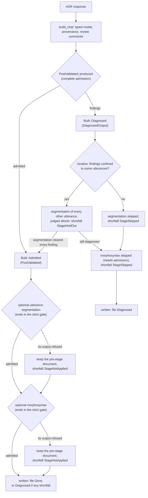

# CHAT Validation Failures

**Status:** Current
**Last updated:** 2026-10-07 00:19 EDT

The [command contract](../architecture/command-contracts.md) is the authoritative
input-admission and output policy. This page explains how validation failures
are handled, and why the handling depends on who produced the CHAT. It does not
define a competing validity policy: Chatter owns validity, and every output is
judged against exactly the same complete admission.

## Two kinds of CHAT, two kinds of failure

| CHAT came from | Example commands | A failed judgement means | Handling |
| --- | --- | --- | --- |
| A user (submitted CHAT that a command transforms) | `morphotag`, `utseg`, `align`, `translate`, `coref`, `compare` | the input is invalid, or the transform broke a valid document | the file fails; nothing is written |
| Our own code (CHAT a producer generated) | `transcribe` | a fact about the generated document: an ASR token kept verbatim for review, or a defect in our builder | the output is written, with every finding, and the file is reported **diagnosed** |

For submitted CHAT, refusal is the right answer: the user can fix their file,
and writing a transform of invalid input would publish a defect as ours. For
generated CHAT the opposite is true. The document was built by `build_chat()`
from an ASR response; if it does not pass admission, that is not bad user
input, and the generated CHAT is the most valuable diagnostic artifact anyone
has. Refusing it makes a whole transcript vanish behind a file error because of
one token. So, for internally generated CHAT:

1. **Always write the output.** The generated document is written exactly as
   built.
2. **Report every finding with it.** The file's outcome is `diagnosed`, carrying
   the complete, non-empty list of what admission found (for example
   `E220 ...` for `abc123`, digits inside a word). It is terminal, never
   retried, and not a failure: a job whose files are all done or diagnosed
   completes.
3. **Refuse a stage only where the fault is.** Utterance segmentation and
   morphosyntax work utterance by utterance: on a diagnosed document each runs
   on every utterance the findings do not belong to (`DiagnosedOutput::localize`
   finds them; see below) and records the left-out ones as `StageHeldOut`.
   Morphosyntax localizes the document afresh after segmentation, which
   renumbered its utterances. When the findings cannot be confined to
   utterances the stage is skipped (`StageSkipped`). Each is recorded with the
   file's outcome.

Validation itself is not relaxed anywhere. The generated document is judged by
the same complete Chatter construction admission, including tier alignment, plus
the same command-completion checks, as any other output.

## Input refusal

Chatter owns CHAT validity. Retained input must be admitted before inference,
including no-work, CA and `NoAlign` branches. A replacement exemption belongs to
the actual file-bound plan and only to tiers that plan discards and regenerates.
Recovery is available for diagnostics, not evidence of successful admission.
Legacy `ValidityLevel` checks are partial workflow checks, not full validity.

Invalid submitted CHAT is a client-input failure. An internal parser failure
does not establish that the submitted file is invalid; preserve that distinction
through HTTP and per-file reporting.

## Output proofs

Writers require a judged proof (`crates/batchalign/src/pipeline/post_validate.rs`),
never a bare string or mutable model. `PostValidated` always proves admission;
a generating producer's output that does not pass is a different type,
`DiagnosedOutput`, and the producer transition returns the sum of the two:

```mermaid
stateDiagram-v2
    Gated: PostValidated Gated (admitted, transformed)
    Declined: PostValidated Declined (admitted, decision tiers removed)
    PassedThrough: PostValidated PassedThrough (admitted, original bytes)
    Diagnosed: DiagnosedOutput (generated, with findings)
    [*] --> Gated: gate_owned / preserving (strict, may refuse)
    [*] --> Declined: declined_stripping_decision_tiers (strict)
    [*] --> PassedThrough: pass_through (admitted source)
    [*] --> Gated: produced, judgement passes (ProducedOutput::Admitted)
    [*] --> Diagnosed: produced, judgement finds anything (ProducedOutput::Diagnosed)
    Gated --> Gated: merge / provenance (re-judged)
    Diagnosed --> Diagnosed: merge (re-judged by produced)
    Diagnosed --> Gated: merge repairs it (re-judged by produced)
    Gated --> Written: writer, file Done (or Diagnosed with shortfalls)
    Declined --> Written: writer, file Done
    PassedThrough --> Written: writer, file Done
    Diagnosed --> Written: writer, file Diagnosed
```

- **Strict transitions** (`gate_owned`, `gate`, `preserving`,
  `declined_stripping_decision_tiers`) refuse: a failed construction or
  completion check produces `OutputAdmission`, HTTP 500 and a system-category
  file failure. It is a tool failure, not evidence of invalid client input.
  Nothing is written as successful or partial CHAT.
- **The producer transition** (`PostValidated::produced`) runs the identical
  judgement and never fails. It returns `ProducedOutput::Admitted(PostValidated)`
  or `ProducedOutput::Diagnosed(DiagnosedOutput)`; the latter holds the model it
  judged, its lazily serialized bytes and its `OutputFindings` (the bar, and a
  first finding plus the rest, so the list cannot be empty). Only generating
  producers call it: transcription, once, at CHAT assembly. Nothing that reads
  submitted CHAT may.
- **Stages cannot receive a diagnosed document whole.** Post-CHAT utterance
  segmentation (`EvidenceRetainingUtsegRequest::document`), morphosyntax over a
  constructed document (`ParsedFile::from_output`), the shared admitted text
  pipeline (`run_admitted_text_pipeline`) and compare's constructed main side
  all take a `PostValidated`, so a `DiagnosedOutput` has no route into them; the
  compiler, not a check, enforces it. The per-utterance routes take a
  `LocalizedDiagnosis` instead (`run_localized_text_pipeline` for segmentation,
  `ParsedFile::from_localized` for morphosyntax), which only `localize` builds
  and which grants no admission.
- **Morphosyntax outside held-out utterances.** The analysis phases are generic
  over an `AnalysisScope`, which pairs which utterances are analyzed with how
  the result is judged: `WholeDocument` analyzes every utterance and is judged
  by the strict gate; `OutsideHeldOut` never collects a held-out utterance for a
  worker and is judged by `PostValidated::produced_outside`. That judgement
  admits the result if it passes; otherwise it is diagnosed only if the
  document without the held-out utterances passes (every finding is still
  theirs); if not, the analysis added a finding of its own and is refused like
  an admitted document's stage output, and transcribe keeps the document from
  before the stage (`StageNotApplied`).
- **Shortfalls.** Requested work the written document does not carry is a
  `Shortfall`: `StageSkipped(stage)` when a diagnosed transcript could not enter
  a stage, `StageNotApplied { stage, refusal }` when an optional stage ran and
  its own output was refused, so the admitted document from before it was kept,
  and `TimingIncomplete` when forced alignment left required words untimed (see
  the [align developer reference](commands/align.md)).
  Shortfalls are facts about the run, carried beside the document
  (`TranscribeOutput { document, shortfalls }`, then
  `FileOutput::Chat { document, shortfalls, .. }`), and the writer reports them
  through `OutputReport::of(document, shortfalls)` whatever the document's
  standing: a file with any shortfall is never reported clean, even when its
  document is admitted or a merge repairs it.
- **Cosmetic edits on a diagnosed document.** A requested abbreviation merge is
  applied to the diagnosed model and judged afresh by the producer transition.
  It cannot be refused by the merge, because a diagnosed output is written
  whatever the judgement says. Only `align` stamps provenance through the proof
  (`PostValidated::with_provenance_injected`), and its output is never diagnosed.

Unchanged output carries original bytes bound to their exact admitted parse.
Declining analysis does not exempt the resulting document from admission.

## Transcription, stage by stage



`DiagnosedOutput::localize` judges each utterance on its own (a copy of the
header-only document holding just that utterance) and holds out the ones that
fail; it then judges the document without them, and only if that passes are the
findings confined. The result, `LocalizedDiagnosis`, grants no admission: the
stage (`run_localized_text_pipeline`) never sends a held-out utterance to the
model, edits the others, and judges the whole result with the producer
transition again, so it is written diagnosed for the held-out words (or
admitted, if the stage removed every finding's cause, in which case it continues
as an admitted document). An utterance that fails only in isolation is held out
too, which costs it the stage and never its content.

An optional stage's failure is a shortfall only when it is a refusal of the
stage's OWN output (`ServerError::OutputAdmission`): the admitted document from
before the stage is still good. Every other failure (a worker that died,
cancellation, persistence) remains the file's error, so retry and failure
policy apply to it unchanged. Every stage ends in the strict gate (or kept its
admitted predecessor), so the final document is admitted without a second
judgement.

`benchmark` transcribes and then compares; its deliverable is the comparison,
and comparing needs an admitted transcript. A diagnosed transcript therefore
refuses the benchmark file with the same `OutputAdmission` failure, naming the
findings, as it did before transcription kept such output. An admitted
transcript with a shortfall is still compared (compare morphotags the main side
itself); the shortfall is logged, since it is not part of benchmark's outputs.

## The file's outcome

A diagnosed output reaches the runner through the writer, which reports
`WrittenOutput::Diagnosed` from `OutputReport::of` over the proof it actually
wrote (after any merge) and the run's shortfalls. The runner records `FileCompletion::Diagnosed`, which the store keeps as
`FilePhase::Diagnosed { started_at, finished_at, diagnostics }`:

- On the API, `FileStatusKind::Diagnosed` (wire value `"diagnosed"`) is
  terminal, not resumable and not an error. `FileStatusEntry::diagnostics`
  (`FileOutputDiagnostics`) is present only for
  that status, following the existing `error` field pattern.
- In the job database, the `file_statuses.diagnostics` column holds the same
  record as JSON; a row restores to the same phase.
- A job whose files are all done or diagnosed completes. A diagnosed file is
  never retried, never requeued by a restart and never counted as failed, but
  a completed job with diagnosed files is not a clean success: `JobListItem`
  reports `diagnosed_files`, and the CLI exits `7` (`EXIT_DIAGNOSED`) rather
  than `0`.
- The CLI prints a diagnosed file as written with N diagnostics and lists the
  first findings, how many more there are and where, and each shortfall in its
  results summary; the dashboard renders it in its own colour
  with an expandable list, never as an error and never as a clean success.

## What a diagnosed file records

`FileOutputDiagnostics` is typed and bounded, because it is copied into every
file status entry on every poll and stream event. It has two fields:
`findings`, present only when output admission found something, and
`shortfalls`. The bar the output was judged against lives inside `findings`
(`JudgedFindingsRecord`), so a file diagnosed only for its shortfalls, whose
document was admitted, reports no bar. Records stored before the bar was
recorded (the flat shape, with `finding_count` at the top level) are still read,
as construction judgements: transcription, judged against complete
construction, was their only producer. Inside `findings`:

- `bar`: `construction` or `preservation`, the bar the judgement held the
  output to.
- `finding_count`, and `findings_by_code` (how many findings carried each CHAT
  error code, most frequent first; a finding from a command's own completion
  check carries no code).
- `first_findings`: at most `FileOutputDiagnostics::FIRST_FINDINGS` (20)
  records `{code, level, message}`, the level naming the check that made the
  finding: a gate validity level (`parseable`, `structurally_complete`,
  `main_tier_valid`) or `construction`, complete construction admission, which
  the gate levels do not grade.
- `full_findings`: `{"kind": "inline"}` when the first findings are the whole
  list, or `{"kind": "sidecar", "path": ...}` when a longer list was written
  once, in full, as JSON beside the job's staged outputs
  (`<staging>/diagnostics/<file>.findings.json`), never into the user's output
  tree, or `{"kind": "unwritten", "path": ..., "error": ...}` when that write
  failed. The writer records it (`DiagnosticsDraft::record`); a draft cannot
  reach the store. Recording cannot fail: it runs after the output is on disk,
  and an unwritable diagnostics file does not turn a written output into an
  error. A list that fits removes any sidecar an earlier attempt of the file
  left at that path.
- `shortfalls`: `{"kind": "stage_held_out", "stage", "held_out_utterances",
  "first_held_out"}` (at most 20 utterance positions, counting from 1),
  `{"kind": "stage_skipped", "stage": ...}` or
  `{"kind": "stage_not_applied", "stage": ..., "refusal": ...}`, with
  `stage` one of `utterance_segmentation` or `morphosyntax`. The refusal is
  bounded the same way (`StageRefusalRecord`): `{"kind": "judged", "bar",
  "finding_count", "findings_by_code", "first_findings"}` when the stage's
  output was judged and failed, or `{"kind": "unestablished", "reason"}` when
  the stage produced no output to judge (a malformed worker result). It is
  built from the typed refusal (`ServerError::OutputAdmission` carries an
  `OutputAdmissionRefusal`, never a rendered list), and the full refusal is
  logged once by the server. The tally per code is
  `FindingCodeCount::tally`, shared with the file's own findings.
  Or `{"kind": "timing_incomplete", "required_words", "untimed_words",
  "untimed_utterances", "first_untimed"}` from align, where `first_untimed`
  holds at most 20 `{utterance, words, untimed_words, cause}` records
  (`utterance` counts from 1; `cause` is `{"kind": "window_refused",
  "window": ...}` with the refused window grouping recorded,
  `{"kind": "not_placed"}` when grouping could place it in no request, or
  `{"kind": "no_usable_timing"}` otherwise). The complete account, every untimed word, is logged once.

The database column holds the record's own JSON (`to_column_json` is
`serde_json::to_value(self)`), so its field list is written once.

## Stage-to-stage ownership

Transcription assembles a typed document and judges it before its optional
CHAT stages. Segmentation, morphology and benchmark handoff consume that
document directly; they do not parse the pipeline's own serialization. Editing
consumes admission, and the edited document must establish a new proof. The
final writer retains the proof for the document whose bytes it writes. Optional
debug artifacts, where configured, are diagnostic observations, not command
output.

## Tests at the boundary

- `pipeline::post_validate`: a generated document with an invalid word is kept
  with its findings by the producer transition, and the same document is still
  refused by the strict gate; the producer transition is a sum of admitted and
  diagnosed; shortfalls are reported whatever the standing; a merge re-judges a
  diagnosed document.
- `pipeline::transcribe::tests`: only a refusal of an optional stage's own
  output is a shortfall; any other failure stays the file's error.
- `pipeline::transcribe::tests::rev_replay`: a whole replayed transcription with
  an unresolved numeral is written diagnosed with its `E220` finding.
- `runner::dispatch::audio_output` and `audio_task`: the real writer puts the
  diagnosed bytes on disk, and the runner shell records the file diagnosed, not
  done, not an error, and not retried.
- `store::queries` and `store::job`: the phase round-trips through the database,
  completes its job, and survives a restart without being requeued.
