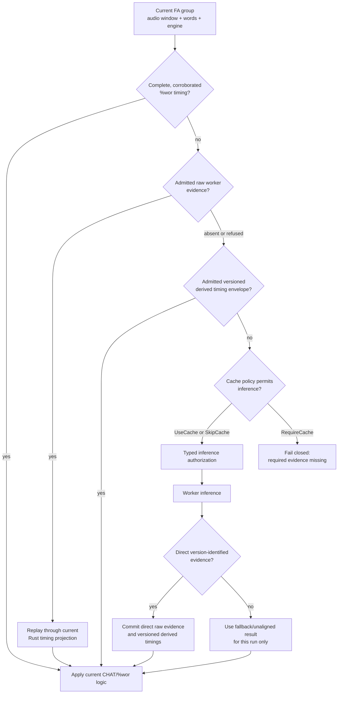

# align: Developer Reference

**Status:** Current
**Last updated:** 2026-10-07 09:56 EDT

Implementation guide for the `align` command. For user-facing documentation,
see [User Guide: align](../../user-guide/commands/align.md).

---

## Implementation map

| Layer | Location | Responsibility |
|-------|----------|----------------|
| CLI args | `crates/batchalign/src/cli/args/commands.rs`: `AlignArgs` | UTR/FA engine flags, strategy, fuzzy, buffer params |
| Options builder | `crates/batchalign/src/cli/args/options.rs`: `build_typed_options` | Maps `AlignArgs` → `CommandOptions::Align(AlignOptions)` and anchors CLI media roots |
| Command definition | `crates/batchalign/src/commands/align.rs`: `AlignCommand` | `CommandDefinition` impl, pre-validation gate |
| FA pipeline | `crates/batchalign/src/runner/dispatch/fa_pipeline.rs` | Per-file FA orchestration: UTR → grouping → FA → injection |
| UTR dispatch | `crates/batchalign/src/runner/dispatch/utr.rs` | Resolved strategy construction and per-recording grouping context |
| UTR library | `crates/batchalign/src/chat_ops/fa/utr.rs` | `run_utr_pass()`, `inject_utr_timing()`, partial-window logic |
| FA library | `crates/batchalign/src/chat_ops/fa/` | Grouping, extraction, DP alignment, injection, postprocessing |
| Worker boundary | `batchalign/worker/_fa_v2.py` + `crates/batchalign-pyo3/src/worker_fa_exec.rs` | Rust owns request validation and V2 response shaping; Python hosts model callbacks |
| Model callback | `batchalign/inference/fa.py` | Whisper token onsets or indexed Wave2Vec word intervals with optional model score |
| Durable evidence | `crates/batchalign/src/types/traces.rs`, `runner/debug_dumper.rs` | Versioned, fail-closed FA evidence sidecar when `--debug-dir` is enabled |

Whisper's processor pads short audio to a fixed encoder capacity. The model
callback binds attention to the waveform's sample count, extractor hop length
and twofold encoder stride before normalization, median filtering and DTW.
Only the admitted observed prefix may produce token times. It rejects empty
or unsupported extents and a DTW index outside that prefix; padded silence is
not recording evidence. The same private alignment-window owner validates the
tokenizer prefix and terminal label against the attention rows, excludes
conditioning rows before normalization and DTW, and pairs every retained row
with its label during timed-token projection. Prefix labels retain zero times;
the terminal label remains an acoustic end sentinel. Missing or reordered DTW
rows cannot be zipped into a plausible partial response. This follows the
[upstream conditioning exclusion](https://github.com/huggingface/transformers/blob/main/src/transformers/models/whisper/generation_whisper.py)
without adding a transcript crop or inventing a word interval.
The caller still applies normal label reconciliation,
word-interval admission and output checking. Restricting the grid is not a
proof of acoustic accuracy or permission to clamp failed timings into place.
The reported FA identity includes this callback's algorithm revision; earlier
padded-grid or conditioning-contaminated evidence remains stored but cannot hit
the `whisper-fa-large-v2-lexical-window-v2` namespace.
Postprocessing without an utterance bullet retains the admitted producer end
and its provenance, including recording clamps, rather than applying the
onset-only fallback duration a second time. A missing boundary is not new evidence.

---

## Media-root admission

`AlignOptions::media_dir` retains a `MediaRootDeclaration`, serialized as the
same optional JSON string as before. This is unadmitted request/storage metadata,
not permission to search the filesystem. Historical relative declarations remain
deserializable, so one old job cannot prevent the job database from loading.

The CLI anchors relative roots to its submission cwd and returns a typed
`InvalidCommandOptions` refusal if that cwd cannot be read. Empty roots fail;
absolute roots and absent roots need no cwd lookup. Direct API submissions must
already declare an absolute root: `JobSubmission::validate` refuses ambiguous
values before job staging creates directories or writes files.

`FaDispatchPlan::from_job` independently admits stored metadata and owns an
`AbsoluteMediaRoot`. Its checked constructors preserve Unicode, symlinks and
`..`; they do not canonicalize, normalize, replace invalid bytes lossily or
claim existence. Unadmitted historical roots produce an explicit plan refusal,
never execution against a daemon-selected cwd. `FaFileContext` and media search
accept only the admitted root, not raw strings or declarations. Search order,
recording-name policy and subsequent media/inference admission are unchanged.

## Complete timing before normal output

CHAT validity and restored media linkage are not proof of completed alignment.
Input admission captures `RequiredFaTiming` from that source's typed lexical
words. Retry attempts share immutable obligations, not independently chosen
counts. Compound filler model labels are grouped under their original CHAT word;
replacement targets and nonalignable content do not invent new obligations.

After finalization, the same source owner measures the result against the
source: `RequiredFaTiming::admit` returns `FaCompletion::Complete` when every
required word retains a positive interval, or `FaCompletion::Partial` with an
`UntimedAccount` naming each utterance with untimed words, the words, and the
cause (`WindowRefused`, carrying the refused window grouping recorded;
`NotPlaced`, a run grouping could place in no request; `NotInRecording`, an
utterance the transcript marks as not speech in the recording, such as
`[+ diary]`; or `NoUsableTiming`). It observes written `%wor` when present and the typed
main-word timing surface for a no-`%wor` projection; retained `%wor` does not
depend on a caller refreshing a second representation. `AdmittedFaResult`
keeps the completion payload alongside Chatter's immutable output admission.
Full and incremental alignment, retained `%wor` reuse and no-group paths share
this boundary. An empty lexical population has no word-timing obligation.
Declined alignment instead retains the separately admitted unchanged source,
as described below.

A partial result is written, never discarded: measured timing is kept, untimed
words stay in the transcript without bullets, and `AdmittedFaResult::shortfalls`
derives one `timing_incomplete` shortfall from the account (totals plus the
first 20 utterances), so the file is reported `diagnosed` (CLI exit code 7),
never clean. The complete account is logged once. A document in which no word
could be timed is written and diagnosed the same way.
`AlignmentCompletionFailure::SourceChanged` (the aligned document's words no
longer match the source) remains an internal producer fault (HTTP 500) that
refuses the file, and so does `OffRecordUtteranceTimed`: an utterance not in
the recording came out with a timed word, or with a bullet the policy does
not keep (see
[Utterances not in the recording](../../reference/forced-alignment.md#utterances-not-in-the-recording)). Complete timing does not prove acoustic identity or
accuracy: UTR missing/misplaced counts, FA assumptions and review decisions
remain evidence.

## `@Options: NoAlign`: strict pass-through

Files containing `@Options: NoAlign` are **returned completely unchanged**.
The pipeline performs zero modifications: no timestamps are added, removed,
or adjusted, no `%wor` tier is generated or updated, and no legacy decision
tiers (`%xalign`, `%xrev`) are stripped.

The rationale is that a researcher who sets `@Options: NoAlign` has explicitly
opted this file out of all alignment processing.  Batchalign must respect that
decision for valid inputs, including for cleanup passes that might seem benign
(such as monotonicity enforcement). Invalid retained CHAT must be refused;
the option does not authorize writing invalid input unchanged.

If a file with `@Options: NoAlign` carries validation errors from a previous
FA run, the correct fix is to repair the file manually or remove the option,
re-run align, and re-add the option if still needed.

Implementation: `read_fa_source_named` pairs the original source with its parse and
completely admits a `NoAlign` document before issuing its unchanged-output
capability. UTR and FA inference are skipped for that admitted branch.
`FaAdmission::pass_through` consumes the capability, not independent text and
model arguments. The writer retains the original bytes without serialization.
Media preparation remains a separate dispatch step; this is not a promise to
skip every media-access check. See the authoritative
[command admission contract](../../architecture/command-contracts.md).

"Zero modifications" includes the `[fc-ba3 align ...]` provenance comment. Until
this became a transition on the typed proof
(`PostValidated::with_provenance_injected`), the dispatch seam stamped that
comment onto NoAlign and dummy documents too, so the sentence above was false by
one line. A pass-through is now returned untouched by both the provenance stamp
and the abbreviation merge.

---

## Input admission

`fa/input.rs` selects a source-bound retain/reuse-versus-regenerate plan before
media preparation or inference. Chatter completely admits the original document
to retain valid `%wor`, including partially reusable timing. If that fails,
only concrete word-tier candidates may be removed. Retained structure must pass
all normal checks, except that discarding its only recorded timing may issue an
explicit pending linked-media timing obligation rather than complete validity.
That source-bound obligation travels with the working model and each retry
until UTR/FA establishes timing and full checked output admission succeeds.
It cannot authorize unchanged output, and headers are not edited to excuse it.
A source with linked `@Media` and no timing at all, the state before a first
alignment, is admitted the same way: Chatter's timing-regeneration validation
runs every rule and returns E544 as the pending obligation, under the origin
`NeverTimed`, so its messages speak of alignment rather than regeneration. A
`NoAlign` or dummy file keeps its E544 refusal, since align would write it back
unchanged. Admission also decides the `@Media` declaration of every actively
aligned source (`AlignableMedia`): absent, `missing` or `notrans` is refused as
input before any work, with the header change named, and so is a pending
obligation under `--main-bullets exact`, which could never meet it. The table
is in the [forced-alignment reference](../../reference/forced-alignment.md#what-align-accepts).
The source-admission owner also observes attempted output timing before final
construction admission: an inference request or response alone does not discharge
the obligation. If no timing survived, it reports `evidence_unavailable`; other
output defects still require complete checking and remain internal failures.
Main-tier, header, morphology,
grammar and other retained faults remain refusal grounds. Producer/internal
failures are never regeneration permission.

CA selects preservation, without a word-tier exemption. `NoAlign` requires
complete original-source admission and retains byte-exact output proof. The
working disposition owns the admitted model across retries. Only its active
payload can receive UTR, and each attempt carries the same source admission
and matching anchors. There is no free model-plus-diagnostics constructor or
generated-CHAT reparse. After mutation, all output paths still require complete
typed construction admission. See [command contracts](../../architecture/command-contracts.md).

An active incremental run admits the declared prior through `RetainedFaPrior`
before media preparation or UTR. The immutable proof survives retries, and
`process_fa_incremental` reads its admitted model without reparsing. Unreadable
or invalid priors refuse the file instead of silently falling back to a full
run. See [Command Contracts](../../architecture/command-contracts.md) for the
authoritative policy and current enforcement scope.

---

## Cache key structure

FA group keys are BLAKE3 hashes over:

- audio identity (resolved path, mtime, and size)
- file-relative audio window (`start_ms`, `end_ms`)
- normalized word sequence
- typed FA engine
- response-schema discriminator where required
- for onset-only engines, the text/healing mode that affects parsed timings

The cache backend namespaces that key by task (`forced_alignment`) and the FA
engine the selected worker reported, admitted at the capability gate and
carried as `FaCacheNamespace` byte for byte, so evidence cached by earlier
builds stays admissible. A worker that supports FA but names no engine cannot
align: the job fails naming the task rather than inventing a namespace.
Word-interval keys carry
`model_score_v1`: this intentionally retires historical interval entries that
deserialize correctly but predate score retention. Whisper has no interval
score to recover and keeps its established cache namespace.

UTR ASR results are cached separately per audio segment (file path + start_ms
+ end_ms). Segment cache hits avoid re-running ASR on already-processed
windows during the partial-window optimization. Full-file and segment entries
both live under the UTR engine's own namespace (`UtrAsrCacheNamespace`,
`utr-asr-v1:<engine wire name>:<composition>` followed by one
`|<role>=<id>@<revision>` per model), not under the FA engine's version, so
changing the FA model no longer discards UTR ASR results, and changing a
recovery model no longer silently reuses rows produced by the previous one.

The `[fc-ba3 align | ...]` stamp records `fa=` (the reported FA engine),
`main_bullets=` (`derive`, `keep` or `exact`, always written) and, when a
timing-recovery pass actually ran (the pre-pass or the retry fallback),
`utr=` with the recovery engine's name (`rev`, `whisper`, `tencent`). A file
whose utterances were all timed, so that no pass ran, records no `utr=`. The
record is a `UtrContribution` on `AlignAudioTask`, updated from each pass's
`UtrResult::ran()`.

Cache implementation: `crates/batchalign/src/cache/` (hot: moka,
cold: SQLite). Bypass with global `--override-media-cache`.

`align` has two independently resolved cache tasks. `FaParams::cache_policy`
governs `forced_alignment`; `FaDispatchPlan::utr_cache_policy` governs both
the initial and fallback `utr_asr` passes. Do not collapse the latter into
`FaParams`: selective refresh and replay experiments depend on changing one
policy without changing the other. `--require-media-cache` resolves both to
`RequireCache` and prevents either unresolved boundary from authorizing
inference.

`FaParams::projection_policy()` combines the engine-derived `WordEndPolicy`
with typed `ExistingWorBoundaryPolicy` and `EndOverlapPolicy` values. Full, incremental, all-`%wor`, and empty-group paths
consume that single `FaProjectionPolicy`, preventing execution shape from
changing the local interpretation of the same evidence. The local policies are
deliberately absent from `cache_key()`: changing any of them must replay the
same evidence, not create a new inference identity.

`MainBulletPolicy` is not part of that value: the dispatch binds it to the
input's own bullets at the single parse (`MainBulletAuthority::bind`, before
the UTR pre-pass can write bullets of its own), carries the result in
`FaInputDocument`, and each path pairs it with the projection policy in one
`FaProjection` that every projection entry point takes. See the
forced-alignment reference, "Kept main bullets", for what each phase does with
a kept bullet and the proofs that order them.

The final phase is also typed. Fresh injection produces `FaApplied`; a
no-injection path can only enter through `finalize_without_injection`. Both
must produce `FaFinalized`, which runs `BulletRepairPolicy` first and
`EndOverlapPolicy` monotonicity second. Only `FaFinalized` can enter
`FaDecisions`. This prevents the former incremental defect where monotonicity
clamped away a small overlap before optional repair could average it, and the
former reuse defect where no-injection paths silently selected the default
overlap policy.

Partial `%wor` reuse has a load-bearing phase boundary. Before grouping,
`refresh_reusable_utterances()` always uses compatibility preservation so the
input bullet continues to define the same audio window and raw cache key, and
(2026-09-01 review, item 2) it is now MECHANICAL ONLY: it never writes `%wor`
itself. It returns the utterances it touched, and `run_fa_from_ast` folds
them into the SAME `FaApplied` write phase that this run's fresh injections
use, via `FaApplied::also_touched`, so their `%wor` (when requested) is
written once, after `EndOverlapPolicy` resolves, never before. The
all-reusable fast path (no grouping, no inference) is the same: it rebuilds
directly from the existing admitted `%wor` timings via
`refresh_reusable_alignment`, then reaches the write phase through
`projection_without_injection_with_touched` rather than a bare
`finalize_without_injection` with a separate write. The explicit projection
policy applies only after evidence collection. The option does not force a
fully reusable document back through raw-cache replay. A cache-required
development experiment caught and refused an early version that rebuilt before
grouping; that refusal is the executable reason this phase separation must
remain visible in code and diagrams. `add_wor_tier` itself is `pub(crate)`.
In a PRODUCTION build it has exactly one caller: that one write phase
(`FaApplied::then_enforce_monotonicity`). The only other callers are test
code: unit tests of `%wor` generation shape itself, which do not claim the
ordering property, and the `refresh_existing_alignment` /
`refresh_existing_alignment_with_boundary_policy` convenience wrappers,
which write `%wor` directly and are `#[cfg(test)]` (2026-09-01 review, item
12) precisely because they have no production caller left -- the cheap
rerun path that used to call them now goes through
`refresh_reusable_alignment` and the write phase instead, as this page
already describes below.

```mermaid
flowchart LR
    I["Input CHAT + existing %wor"] --> R["Pre-group refresh<br/>always Preserve"]
    R --> G["Stable group windows<br/>and raw cache keys"]
    G --> E{"Evidence state"}
    E -->|raw hit| P["FaProjectionPolicy"]
    E -->|wor reuse| P
    E -->|required miss| F["EvidenceUnavailable refusal"]
    P -->|Preserve prior bounds| C["Compatibility word projection"]
    P -->|RebuildFromEvidence| H["Admitted word hull projection"]
    C --> PHASE["FaApplied or typed<br/>no-injection projection"]
    H --> PHASE
    PHASE --> B{"BulletRepairPolicy"}
    B -->|Disabled| O{"EndOverlapPolicy"}
    B -->|Enabled| RPR["Repair: same three-way resolution\non measured hulls, small overlaps only"] --> O
    O -->|"PreserveCrossSpeaker (default)"| X["Same-speaker: 3-way resolution\nfrom measured hulls;<br/>cross-speaker: untouched"]
    O -->|ClampAllAdjacent| COMP["3-way resolution for EVERY\nadjacent pair, any speakers"]
    X --> WOR["WorPlan::Pending →<br/>write %wor from RESOLVED state"]
    COMP --> WOR
```



---

## Four-state evidence resolution

Each FA group is checked for reusability in priority order before inference:

**Tier 1: Reuse from `%wor` tier**

If all utterances in a group have clean `%wor` timing from a previous run,
those word timings are used directly without re-processing. This is the fastest
path and requires no worker inference.

**Tier 2: Raw-evidence replay**

If Tier 1 doesn't apply, prefer the immutable worker-protocol response. BA3
re-admits it against the current request facts, then runs the current Rust
projection. This is the research path: local reconciliation can change without
running the model again.

**Tier 3: Versioned derived-timing fallback**

When raw evidence is absent or refused, an admitted derived timing envelope can
still satisfy the group. It must prove the requested engine, selected-worker
version, semantic key, and word cardinality. Historical bare vectors are
refused because they cannot prove direct-versus-fallback provenance, while a
new raw entry cannot be masked by an older local projection.

**Tier 4: Authorized inference**

Only a miss at all three earlier states reaches the worker. `RequireCache`
cannot construct the authorization value needed by the worker batch. A direct,
version-identified worker response is stored in both raw and derived layers;
fallback output is valid for the live run but deliberately remains uncached.



Implementation: `crates/batchalign/src/fa/mod.rs` and
`crates/batchalign/src/fa/transport.rs`.

---

## Worker IPC: FA task (V2 protocol)

```text
Client → Worker: execute_v2 request (abridged)
{
  "task": "fa",
  "request": {
    "backend": "wav2vec" | "whisper" | "wav2vec_canto",
    "audio_ref_id": "...",
    "payload_ref_id": "...",
    "text_mode": "char_joined" | "space_joined" | "char_spaced"
  },
  "attachments": ["prepared audio", "prepared text payload"]
}
```

Worker → Client is one of two typed results:

- Wave2Vec/Cantonese: one indexed optional interval per requested word,
  `{start_ms, end_ms, confidence?}`. Rust validates the count and applies the
  intervals directly; there is no DP remapping.
- Whisper: token text plus onset time. Rust uses DP alignment to reconcile
  those returned tokens with CHAT words and derives word ends because the
  engine did not measure them.

The Python Wave2Vec callback duration-weights token-span scores into a word
score before crossing the V2 boundary. Rust validates that optional score as a
finite value in `0..=1`, stores it quantized to millionths, and keeps it
separate from boundary provenance. The score is not treated as a calibrated
probability.

---

## UTR strategy resolution

### Checked timing projection

UTR learns `PositiveUtrInterval` at the timing producer. Its fields and
constructor are private to recovery; readers use `start_ms()` and `end_ms()`.
`UtrTimingProposal::Positive` owns this payload instead of unchecked scalar
fields. Serialized evidence still uses the same `status`, `start_ms` and
`end_ms` fields, with no extra nested object.

Global and local recovery share endpoint admission against the source lexical
census. `EndpointBoundUtrWordMatches` can be constructed only when both the first
and last alignable CHAT words are bounded: each has a common-to-every-optimum
correspondence, or the joint interleaving producer observed that it is matched
in every optimum (it can never be missing) and supplies `EndpointExtents`, the
extent of every token it may match. Two turns ending and beginning with the same
word across an overlap are the usual case: neither boundary word has one token
in every optimum, but each lies inside its candidates' extent, so the hull
including that extent crops none of its speech. The monotonic producers observe
common correspondences only and pass `EndpointExtents::UNOBSERVED`.
Only this payload can produce an utterance timing hull. Nonempty interior-only
evidence retains eligible FA anchors but emits no hint (`incomplete_boundary`
review decision), so grouping follows its existing unhinted recovery path rather
than cropping unresolved prefix/suffix speech to an interior token. Missing
interior words alone do not prevent endpoint-proved recovery. An endpoint word
some optimum leaves unmatched (absent from the provider stream, or written
there differently) bounds nothing, and its utterance gets no hint. Existing
bullets are preserved. This lexical proof is not proof of acoustic identity.

A region's plan pairs each searched utterance's evidence with its search
envelope (`LocalRegionPlan`, built only by `LocalRegionPlan::from_searched`
from a `PerSearched` value made by mapping that region's `SearchedCensus`), so
a plan cannot be shorter than its region, its evidence and envelopes cannot
differ in length, and `UtrAlignmentPlan::assemble` reads each plan's own span.

The matched-timing producer admits every admitted
provider token as a positive interval, then takes their temporal hull
(minimum start, maximum end). Token ordinal order does not establish time
extrema: an earlier or interior token may extend beyond the last token. Only
matched tokens contribute; unrelated ASR text inside the ordinal range cannot
widen a proposal. Coarse tokens retain their measured interval when several
lexical words share it. An invalid matched interval leaves a `non_positive`
proposal naming that token's original endpoints; surrounding valid tokens
cannot manufacture a positive span around it. The wire shape is unchanged.

Global projection preserves existing bullets and the existing marked-overlap
exemption. A non-overlap proposal may be clipped to the preceding committed
end only while a positive observed interval remains. An exhausted proposal
stays untimed with a `projection_exhausted` review decision; it cannot become
`start + 1`. Injection counts reflect applied hints, not pre-clipping matches.
The two-pass local recovery producer returns the same checked interval type,
so zero/reversed local spans cannot reach its writer either. These are still
provisional recovery hints, not recording-containment or output-validity proofs.
FA and complete construction admission remain responsible for final output.

Both writers consume the admitted interval's `into_hint()` operation. Local
overlap recovery, like global recovery, therefore writes `BulletSource::Utr`,
not an original transcript boundary. Final-word postprocessing cannot inherit
a provisional local hint's end as a measured or retained duration; FA-derived
timing and its review provenance remain responsible for the final word end.

This does not solve lexical correspondence under dense reordered overlap and
does not change strategy selection. Refusal of an unsupported interval must
not be confused with a successful timing recovery.

### Submitted strategy

`ResolvedUtrStrategy::from_options()` in
`crates/batchalign/src/runner/dispatch/options.rs` resolves the submitted policy.
The two-pass variant owns its tuning and travels through both initial and
fallback recovery. `resolve_strategy()` in `runner/dispatch/utr.rs` adds the
recording grouping limits without replacing the submitted configuration:

**Auto strategy (default):** Always returns `GlobalUtr` regardless of language or overlap markers.

The previous auto-detection logic (which selected `TwoPassOverlapUtr` for English
files with `+<` or CA overlap markers) was **disabled 2026-03-30** due to:
1. Operator-reported alignment regressions on real files
2. At the time, `enforce_monotonicity()` corrected only start regressions and
   left end overlap unexamined. Current code clamps adjacent ends, but a clamp
   that cuts retained word timing is now evidence for review rather than proof that the
   overlap-aware segmentation was wrong.
3. Two-pass algorithm was only tuned on 4 corpora, not broadly validated

**Explicit overrides:**
- `--utr-strategy global` → `GlobalUtr` (single-pass monotonic recovery)
- `--utr-strategy two-pass` → `TwoPassOverlapUtr` (experimental; overlap-aware,
  gated until its segmentation and downstream overlap policy are validated)

When both `total_audio_ms` and `max_group_ms` are available, a `GroupingContext` is
passed to `TwoPassOverlapUtr` so it can detect and avoid the wider-window regression
on non-English files. This is only consulted on explicit `--utr-strategy two-pass`;
`Auto` does not reach this code path.

---

## Incremental processing (`--before`)

When `--before PATH` is provided, `process_fa_incremental()` in
`fa_pipeline.rs` diffs the old and new CHAT files, classifies each utterance
as Added/Removed/Modified/Unchanged, and only runs FA on content that changed.
Stable `%wor` entries from the old file are copied directly, skipping the FA
worker entirely for unchanged groups.

See [Incremental Processing](../../architecture/incremental-processing.md).

---

## FA grouping constraints

`group_utterances()` enforces two independent split constraints. A group is
flushed when either is exceeded by adding the next utterance:

- **Time window**: not an option at all. It comes from the run's FA engine
  (`FaParams::max_group_ms()` reads `FaEngineName::max_group_ms()`, which is the
  `max_group` field of that engine's row in `FA_ENGINES`), so it differs between
  engines and no caller can set it independently of the engine it belongs to
- **Label-byte cap**: `MAX_GROUP_LABEL_BYTES = 448` (constant in
  `grouping.rs`, counted through the `LabelBytes` newtype). Whisper's CTC FA
  refuses more than 448 label TOKENS and raises a hard Python `ValueError`. The
  budget is counted in UTF-8 BYTES because every token covers at least one
  byte, so a byte count bounds the token count from above; a character count
  does not, and would loosen the cap on non-Latin script. The cap applies to
  every engine's groups, since grouping is not told which engine will align
  them. Dense languages (Spanish, any long-word corpus) can hit it inside a
  normal time window.

The cap is consulted only where two utterances are MERGED, so it bounds merges
rather than every group: the flush guard is skipped when the current group is
empty, and one utterance whose own labels exceed 448 bytes is sent as its own
group, unsplit (fail gracefully rather than drop silently).

The time window is also the budget for ONE utterance. An utterance whose own
window exceeds it is split at the words utterance timing recovery heard into
pieces that each fit (one group, one request per piece), or refused as
`anchor_gap` (anchors farther apart than the budget: needs review),
`anchors_unusable` (recovery matched the utterance but gave no usable cut, with
a closed cause) or `over_budget` (recovery has nothing to say about it). See [Forced Alignment: Over-budget
utterances](../../reference/forced-alignment.md#over-budget-utterances-anchored-splitting).

See [Forced Alignment: FA grouping strategy](../../reference/forced-alignment.md#fa-grouping-strategy)
for the full rationale, flowchart, and edge cases.

---

## Pre-grouping preparation steps

Before FA grouping, the AST undergoes two surgical modifications to prepare utterance
bullets for inference:

**Narrow bullet rescue** (enabled always)  
When `transcribe` writes a bullet that is too narrow to contain its words (e.g., 22
words in 380 ms = 58 wps, physically impossible), the rescue pre-pass detects and
expands that bullet into the trailing inter-utterance gap. This gives FA a wide-enough
audio window to find the actual speech. After FA finishes, `update_utterance_bullet`
overwrites the rescued range with the FA word span (tighter), so the rescue is
self-healing and auditable.

Implementation: `crates/batchalign/src/chat_ops/fa/mod.rs:247-267`. Decisions (which utterances
were rescued) are recorded in structured evidence rather than injected into CHAT.

**Edge filler expansion** (enabled always)  
UTR-assigned bullets may be too narrow to include trailing or leading fillers whose
audio lives in inter-utterance gaps. This step expands utterance bullets to cover
those edge fillers, ensuring they are included in the FA group.

Implementation: `crates/batchalign/src/chat_ops/fa/mod.rs:269-272`.

## Compound filler splitting

CHAT underscore-joined fillers (`&-you_know`, `&-sort_of`) are split at
underscores before being sent to the FA engine because ASR models return them
as separate words. After alignment, the N timings are merged back into one span.
Only `WordCategory::Filler` words are split, regular compounds (`ice_cream`)
are unchanged.

See `crates/batchalign/src/chat_ops/fa/COMPOUND_FILLER_ALIGNMENT.md`.

---

## Decision evidence and CHAT cleanup

The align pipeline records structural decisions internally. It projects them
into structured evidence and never generates `%xalign` or `%xrev`. The legacy
`review_level` values remain accepted for wire compatibility but do not change
this presentation policy.

**Decision sources** (in order):
1. **Narrow bullet rescue**: utterances whose bullets were pre-expanded before
   grouping (see "Pre-grouping preparation steps")
2. **FA word timing injection**: word boundaries, timing drops, speech gaps
3. **Experimental bullet repair**: only if `--bullet-repair` flag is enabled
4. **Monotonicity enforcement**: start-time regressions stripped, end-time overlaps clamped

All previous `%xalign`/`%xrev` tiers are stripped, including on clean re-runs
with no new decisions.

Implementation: `crates/batchalign/src/chat_ops/fa/mod.rs:506-537`. The injection layer is in
`crates/batchalign-transform/src/decisions/`.

### Durable alignment evidence

CHAT decision tiers are no longer a projection surface. With `--debug-dir`,
`FaResult::into_timeline_trace` produces the authoritative research record in
`<stem>_fa_evidence.json` through `DebugDumper::dump_fa_evidence`. The dump is
fail-closed when requested and includes:

- schema version, engine, and worker-advertised engine version;
- group windows, words, and stable word IDs;
- each group's `span` (schema 6): `single`, with the request's source
  (`wor_reuse`, `cache`, `raw_evidence_replay`, `inference`, or `unaligned`)
  and cache key, or `anchored`, with one piece per request (window, first and
  last word, source, cache key);
- pre-injection valid timings, optional model score, and exhaustive origin
  chains for both boundaries;
- the exact typed decision records retained independently of CHAT output;
- `dropped_word_timings`: every word timing the run discarded outright, one
  self-describing record each (line, utterance, speaker, tier, word position,
  measured span, and the bound it exceeded). Derived from the timing decisions
  at assembly time by `FaTimingDecisionTrace::dropped_word_timings`, so it
  cannot drift from them, and always written, empty when nothing was dropped;
- `refused_window` on each `window_refused` decision (schema 5): a
  `cause`-tagged object (`over_budget`, `empty`, `inverted`, `past_recording`,
  and from schema 6 `anchor_gap` and `anchors_unusable`) carrying that cause's own bounds and figures,
  so a refused window is data rather than prose in `reason`;
- `split_window` on each `window_split_at_anchors` decision (schema 6): the
  utterance window, the budget and the piece count;
- fallback events and post-validation violations.

Cache hits and worker replies arrive out of order and per REQUEST (dispatch
unit; `fa/units.rs`), while injection consumes timings per GROUP. The plan
holds each group's requests in the group's own shape, and the `UnitLedger`
holds each group's resolution in the same shape: a `%wor`-reused group has no
request slots, and every slot is paired with the unit it awaits, so there are
no parallel vectors to keep the same length. `UnitLedger::assemble` is the one
place resolutions become group timings, concatenated in word order, refusing a
group with a missing request or a request that answered for the wrong number
of words. Each `FaGroupEvidence` is built there from one group, its units'
sources and keys, and the pre-injection snapshot of the same timings, so a
trace cannot pair one group's timings with another's provenance.

`DebugDumper::evidence_stem` preserves the plain basename for a bare filename.
For a nested submitted identity it appends twelve hex characters from a BLAKE3
digest of the complete filename. This prevents equal basenames in different
corpus branches from sharing one evidence path.
Serialization completes before the destination is opened. The resulting bytes
are synchronized and atomically replace the destination, followed by a
directory synchronization on Unix. An interrupted write therefore cannot
leave a truncated JSON artifact or follow a pre-existing destination symlink.

Rev-backed UTR calls the same `dump_rev_evidence` boundary after raw evidence
resolution and before timed-word projection. It selects
`RevAsrProjectionRevision::UtrAsrResponseV1`; the closed revision type prevents
a caller from inventing a label or attaching transcribe's ASR revision by
string convention. `rev_utr_evidence_identity` combines the stable CHAT
filename with the raw evidence-key prefix, preventing full-file and
partial-window calls from overwriting each other while avoiding temporary
segment paths as identities.

Schema version 2 added `decisions` to retain post-inference clamping, repair,
and timing-removal outcomes. A typestate return from `retain_decision_evidence`
is consumed into the evidence trace, so the JSON cannot be assembled from a
different record set than the pipeline produced. The complete-`%wor` fast path
and a grouping-empty path retain any decisions they make as well; zero fresh
inference groups does not erase a monotonicity change or grouping refusal.
Schema version 3 adds stable current and neighbouring utterance ordinals to
every numeric monotonicity effect. The legacy `line_idx` fields name the input
`ChatFile.lines` state and are retained for debugging, but they cannot alone
address final CHAT because provenance serialization may insert an `@Comment`
header. An utterance ordinal is invariant under header-only changes. Research
consumers should corroborate both coordinates against the exact input and
resolve the ordinal against output while checking speaker and spoken-token
identity; they must not index final `ChatFile.lines` with the legacy value.
`post_injection_timings`
remains intentionally empty: the
post-processing phase still lowers final `WordTiming` values into CHAT bullets
before a group-shaped evidence record can retain them, particularly for split
compound fillers. Do not describe any current schema as a complete repair history. A later
future schema must carry a typed identity mapping across that phase rather than
re-reading bullets and falsely labeling them observations.

---

## Post-FA validation

Every FA path builds a draft, `FaResult<ChatFile>`, and hands it to
`FaAdmission::finish`, which takes it through Chatter's
`reconcile_media_timing` against the declaration admission proved usable
(`AlignableMedia::reconcile`, the only constructor of `ReconciledOutput`). The
result retains either an untimed document or a timed document with exactly one
usable, linked `@Media` declaration. Only that state can reach the
serialization boundary in `runner/dispatch/fa_pipeline.rs`. Dummy and
`NoAlign` paths use the separate `FaOutput::PassThrough` variant, preserving
their input without claiming that timing work occurred. Because admission
decided the declaration, a `MediaTimingError` here can only mean the alignment
changed the header; it is reported as an internal fault.

`FaAdmission::finish` then requires Chatter's complete checked-construction
proof, including dependent-tier alignment. There is no caller-selected output
validity level or inherited-invalidity waiver. A failed output admission is a
tool failure, not evidence that the submitted CHAT was invalid; no CHAT output
is written. See [Command Contracts](../../architecture/command-contracts.md#completion-and-publication).

The proof the gate returns is what the writer carries. It reaches
`FileOutput::Chat` as a `PostValidated`, not a `String`, so the bytes written
are the bytes the gate serialized; the writer no longer parses the text and
manufactures a second, weaker proof of its own.

Implementation: `crates/batchalign/src/types/results.rs`,
`crates/batchalign/src/fa/mod.rs`, and
`crates/batchalign/src/runner/dispatch/fa_pipeline.rs`.

---

## Testing

```bash
# Fast unit tests (no ML models)
make test

# FA-specific tests with real models (only on Fleet/Large-tier hosts, ≥ 256 GB RAM)
cargo test -p batchalign --features ml-golden --test ml_golden fa::

# Incremental processing tests
cargo test -p batchalign --lib fa::incremental::tests::
```

Key test locations:
- `crates/batchalign/src/chat_ops/fa/`: unit tests for grouping, injection, UTR
- `crates/batchalign/tests/`: integration tests for the FA pipeline

---

## Related developer documentation

- [Command Flowcharts: align](../../architecture/command-flowcharts.md#align), detailed runtime flowchart with 3 diagrams
- [Forced Alignment](../../reference/forced-alignment.md), algorithm design, prerequisites
- [Dynamic Programming](../../../architecture/parser-and-grammar/dynamic-programming.md), Hirschberg aligner
- [Incremental Processing](../../architecture/incremental-processing.md), `--before` mechanics
- [Overlap Encoding](../../architecture/overlap-encoding.md), `+<` and CA marker handling
- [Command Contracts](../../architecture/command-contracts.md), pre/post validation gates
- [Adding Commands](../adding-commands.md), use `align` as the reference implementation for `PerFileTransform`
