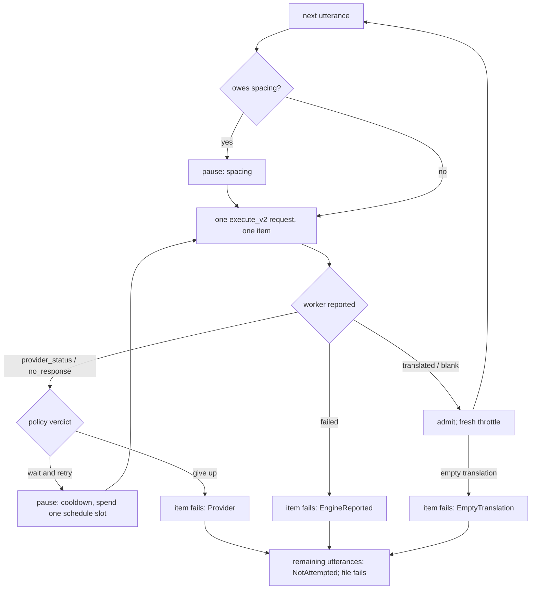

# translate: Developer Reference

**Status:** Current
**Last updated:** 2026-09-22 17:47 EDT

Implementation guide for the `translate` command. For user-facing
documentation, see [User Guide: translate](../../user-guide/commands/translate.md).

---

## Implementation map

| Layer | Location | Responsibility |
|-------|----------|----------------|
| CLI args | `crates/batchalign/src/cli/args/commands.rs`: `TranslateArgs` | `--translate-engine` flag, parsed straight into `TranslateEngineName` by `engine_selection_parser::<TranslateEngineName>()` |
| CLI → wire | `crates/batchalign/src/cli/args/options.rs`: `Commands::Translate` arm | No mapping: the flag already holds a `TranslateEngineName`. The CLI-private mirror enum and its hand-written match were removed 2026-08-06; see `SelectableEngine` in `types/engines.rs` |
| Catalog entry | `crates/batchalign/src/recipe_runner/catalog.rs` | the `CatalogEntry` for `translate` |
| Stage recipe | `crates/batchalign/src/recipe_runner/recipes.rs` | `TRANSLATE_RECIPE` |
| Translate orchestration | `crates/batchalign/src/translate/mod.rs` | The cross-file text pipeline (the only one; the per-file entry point was deleted with the workflow trait), the `WorkerTransport` that sends one request per utterance, the typed per-item failures, provenance. No result cache |
| Per-item loop | `crates/batchalign/src/translate/items.rs` | `translate_items`: one request per utterance through an `ItemTransport`, pacing and cooldowns by the engine's policy, the file stopped at the first failure, echoed translations counted |
| Provider policy | `crates/batchalign/src/translate/provider.rs` | `TranslateEngineName::provider_policy()`: request spacing, the statuses waited out, the cooldown schedule and ceiling; `Throttle`, the typestate that carries the remaining schedule |
| Source model and injection | `crates/batchalign-transform/src/translate.rs` | `TranslationSource` (what the speaker produced) and `render()`, its one renderer; `TranslationText` (a translation with something to apply) and `%xtra` injection |
| Job dispatch | `crates/batchalign/src/execution/translate.rs`: `dispatch_translate_job` | Reached from `runner::routing::dispatch_batched_text_command`; one gateway call per file, each with the source language read from that file's `@Languages:` header |
| Engine type | `crates/batchalign/src/types/engines.rs`: `TranslateEngineName` | Wire-format enum (`google` / `seamless` / `nllb` / `tencent` / `aliyun`), `EngineBackend` impl, `EngineOverrides.translate` field |
| Engine resolution (server) | `crates/batchalign/src/types/options.rs`: `TranslateOptions::effective_translate_engine` | Precedence: shared `--engine-overrides` `{"translate":"..."}` > `--translate-engine` flag > Google default |
| Engine bootstrap | `batchalign/worker/_model_loading/translation.py::load_translation_engine(bootstrap)` | Reads `bootstrap.engine_overrides["translate"]`, dispatches via exhaustive match to `_load_google_translate`, `_load_seamless_translate`, `_load_nllb_translate`, `_load_tencent_translate`, or `_load_aliyun_translate`. Unknown engine names raise `ValueError` |
| Engine resolution (worker) | `batchalign/worker/_model_loading/translation.py::resolve_translate_engine` | Pure function from `engine_overrides` dict → `TranslationBackend`; default Google |
| Worker IPC | `batchalign/inference/translate.py`: `batch_infer_translate()` | Runs each item through the loaded translation record and returns one tagged item per input: `translated` (with `raw_translation` and the record's `engine`), `blank_input`, `provider_status` or `no_response` (a `ProviderRefusal` from the Google session, reported and never retried here), or an `error` the bridge lowers to `failed`. Nothing sleeps in the worker. The text arrives already rendered by Rust (`TranslationSource::render`, which owns the Chinese-script rule); post-processing happens in Rust after. No backend strips the terminator |

Local submissions (auto-daemon or loopback `--server`) use `paths_mode=true`
as of 2026-04-14: the CLI posts source/output path lists instead of CHAT
bytes. See [Submission Modes](../../reference/command-io.md#submission-modes-paths_modetrue-vs-paths_modefalse).

---

## No result cache

Translations are not cached. The utterance cache holds audio evidence only
(forced alignment, UTR ASR, Rev.AI transcripts and speaker evidence); text NLP
caching was removed because re-running warm inference cost less than the cache
lookups. Every translate run calls the worker.

---

## Worker IPC: translate task

```text
request item (rendered from that utterance's TranslationSource; the source and
target languages travel on the request envelope, not on each item):
{ "text": "bonjour le monde." }

TranslationResultV2 items, one per request item:
{ "kind": "translated", "raw_translation": "Hello world.", "engine": "googletrans-v1" }
{ "kind": "blank_input" }
{ "kind": "provider_status", "status": 429, "retry_after_s": 7.0, "error": "Unexpected status code ..." }
{ "kind": "no_response", "error": "ConnectionResetError(...)" }
{ "kind": "failed", "error": "Translation failed: ..." }
```

The request envelope also names the engine (`TranslateRequestV2.engine`, a
`TranslateBackendV2`), exactly as an ASR or FA request names its backend:
the worker pool derives its key from the request, so a request that named no
engine keyed onto a worker with no translate override (see "Engine selection
precedence" below).

Since 2026-09-22 every request carries exactly one item. The PyO3 bridge
parses each host item through the Rust wire type; an item that does not parse
becomes that item's `failed` outcome, and a count other than one is a
protocol error that fails the file.

## One request per utterance: pacing and retries

The worker reports what a provider answered and never sleeps. The control
plane sends utterances one request at a time and decides, per engine, how far
apart to send them and which answers to wait out
(`crates/batchalign/src/translate/provider.rs`):

| Engine | Spacing | Waited out | Cooldowns | Ceiling |
|---|---|---|---|---|
| `google` | 1.5 s | 429, 502, 503, 504, and no response at all | 5 s, then 15 s (or `Retry-After` if longer) | 60 s |
| `tencent` | 0.2 s (5 QPS) | nothing: the SDK raises without a status | none | n/a |
| `aliyun` | none | nothing | none | n/a |
| `seamless`, `nllb` | none (in-process model) | nothing | none | n/a |

The loop (`crates/batchalign/src/translate/items.rs`):



Why here and not in the worker, where the sleeps used to be:

- A wait inside a worker request counted against that request's transport
  deadline (`max(5 s per item, 120 s)`), so a throttled batch could time out,
  after which Rust re-sent the whole batch, translated items included. Now a
  request carries one item and never contains a wait.
- A wait inside the worker could not observe the job's cancellation. Every
  `pause` here is a `tokio::select!` against it.
- The worker could not know that a later utterance was pointless. One bad
  utterance abandons the file (the established per-file verdict), so the
  loop stops at the first failure: a persistent 403 is paid for once, not
  once per remaining utterance with a 1.5 s sleep after each.

The throttle (`Throttle`) is one value per file, not per utterance: a
provider throttles the client, so once the schedule is spent the next
utterance does not re-spend it, and a success hands the next one a fresh
schedule. The remaining schedule is carried in the type (`&'static
[Duration]` consumed from the front), so "how many retries have been spent"
is never a counter kept beside it.

Translations that come back identical to their source text are counted and
logged at `warn` (`echoed=N total=M`), never refused: names, numbers and
loanwords match legitimately, and the one known echo path (`googletrans`
returning its input on any error) is closed at its source.

## What reaches the engine

`TranslationSource::render` is the only place source text is built, and three
closed rules decide its content, each a match with no catch-all:

| Rule | Sent | Not sent |
|---|---|---|
| Words (`TranslatableWordText::of_produced_word`) | Ordinary words and filled pauses (without the `&-` prefix); a replaced word contributes its replacement | `0`-prefixed and CA omissions, `&~` nonwords, `&+` fragments, `xxx` / `yyy` / `www` |
| Separators (`TranslatableSeparator::of_separator`) | The comma | The tag marker and vocative (`„`, `‡`), the CA prosodic marks |
| Terminator (`render_terminator`) | `.` (the ideographic full stop in Han script), `?` for every question-bearing variant including `+/?`, `+!?`, `+//?`, `+..?`, and `!` | `+...`, `+/.`, `+//.`, `+"/.`, `+".`, `+.` |

`RENDERED_TERMINATORS` lists every string the terminator rule can emit, and
`TranslationText::admit` refuses a translation equal to one of them, so an
engine echoing the punctuation batchalign3 sent cannot become a `%xtra` tier.

## Engine identity and provenance

The engine comes from the results, not from the worker's capability report.
`translate/items.rs` admits each item into `AdmittedTranslation`
(`Translated { text, engine }` or `BlankInput`), and the batch pipeline stamps
each file with `[fc-ba3 translate | engine=... ; lang=... | ...]`, naming the
distinct engines on the translations that file applied, joined with `+` in text
order (`result_named_provenance` with `ResultNamedCommand::Translate`, the
builder coref shares; it cannot fail). A file where nothing was translated
carries no stamp and the run says why (`TextStamp::NotStamped`). Because
nothing is read from the report, a translate job is never refused for a worker
that has not named its translation engine; that pre-dispatch refusal was
removed.

---

## Pre-validation gate

`translate` requires CHAT Level 1.

## Idempotency

`inject_translation` (in `talkbank-transform::translate`) calls
`replace_or_add_tier`, which **overwrites** any existing `%xtra` tier on the
utterance. Re-running `translate` on a file that already has `%xtra` tiers
re-translates and replaces them. This diverges from BA2, which guarded
with `if i.translation: continue` and preserved the first translation.

## Engine selection precedence

`TranslateOptions::effective_translate_engine` mirrors
`AlignOptions::effective_fa_engine` and
`BenchmarkOptions::effective_asr_engine`. From highest priority to
lowest:

1. `common.engine_overrides.translate`: set by
   `--engine-overrides '{"translate":"<engine>"}'`.
2. `TranslateOptions.translate_engine: TranslateEngineName`: set by
   `--translate-engine google|tencent|aliyun|nllb|seamless`. Defaults
   to Google via `default_translate_engine()`.

There is deliberately no `server.yaml` knob for engine selection.
Translation engine is a policy choice, not a host fact, and policy
belongs at the invocation site (CLI flag or shell alias), never in
a config file. See the no-config-junk principle in
`book/src/batchalign/user-guide/commands/translate.md`.

The worker pool key includes the resolved translate engine, and only that
key: `EngineSelection::derive` (`crates/batchalign/src/worker/pool/mod.rs`)
is the one derivation of a worker's identity, a pure function of the task's
own keys (ASR: `asr` plus the extras; FA: `fa`; translate: `translate`;
every other task: nothing) filled for the tasks an eager target preloads.
The capability probe reaches it from the job's options
(`WorkerKey::from_command_options`), dispatch from the request
(`execute_v2_worker_key`, reading `TranslateRequestV2.engine`). Google,
Tencent, Aliyun, Seamless, and NLLB workers are not interchangeable, so they
end up in separate pools. Until 2026-09-22 the request named no engine, so
the dispatch-time key carried none: the worker spawned for the command idled
and dispatch keyed onto a second worker with no translate override, which
loads Google whatever the job asked for. The same shape held for every
command handed an override key its request does not carry (the probe started
from the whole `--engine-overrides` map). Both are pinned by the
`*_probe_and_dispatch_keys_agree_under_crowded_overrides` tests in
`pool/execute_v2.rs`, one per keyed command, in every bootstrap mode.

## Tencent backend specifics

The Tencent loader reuses the shared `read_asr_config()` helper at
`batchalign/inference/languages/cantonese/_common.py:77`, which
prefers `BATCHALIGN_TENCENT_{ID,KEY,REGION}` environment variables
(injected by the Rust control plane at worker spawn) and falls back
to `~/.batchalign.ini` `[asr]` section:

- `engine.tencent.id` → `TencentSecretId`
- `engine.tencent.key` → `TencentSecretKey`
- `engine.tencent.region` → `TencentRegion`

These are the same CAM credentials used by the Tencent ASR backend
(the `[asr]` section name is historical; the SecretId/SecretKey pair
authorizes any product the CAM user has permission for). The user
must have `tmt:TextTranslate` policy attached (e.g.,
`QcloudTMTFullAccess`), and the TMT product must be "opened" at the
Tencent Cloud account level, both are root-account / admin actions
on the Tencent side.

Rate-limit handling: the control plane sends Tencent requests 0.2 s
apart (5 QPS standard free-tier limit on `TextTranslate`); see "One
request per utterance" above. The SDK raises without an HTTP status the
worker can report, so a `RequestLimitExceeded` is a final `failed` item.

Language-code handling: `_ISO_639_3_TO_TENCENT_LANG` (in
`batchalign/worker/_model_loading/translation.py`) maps the ISO-639-3
codes BA3 emits to Tencent's ISO-639-1 codes (`spa→es`, `cmn→zh`,
etc.). Unmapped source languages raise a clear `ValueError`
recommending `--translate-engine nllb`. Tencent does NOT list
`yue→en` in its supported pairs, Cantonese requests are rejected at
the table lookup, not at the API call.

Empty `SourceText` would be rejected by the Tencent API with a typed
`InvalidParameter` error. The loader short-circuits empty input
(returns the empty string) so a stray empty utterance doesn't surface
as a SDK exception that looks like a credentials problem.

## Aliyun backend specifics

The Aliyun loader (`_load_aliyun_translate`) uses the same shared
`read_asr_config()` helper, with credentials drawn from the
`BATCHALIGN_ALIYUN_AK_{ID,SECRET}` environment variables (injected
by the Rust control plane at worker spawn) or the
`~/.batchalign.ini` `[asr]` section:

- `engine.aliyun.ak_id` → Aliyun Access Key ID
- `engine.aliyun.ak_secret` → Aliyun Access Key Secret

These are the same access-key pair used by the Aliyun NLS ASR
backend. Aliyun MT does NOT need the `ak_appkey` field that NLS
ASR consumes, that key authorizes the WebSocket speech service,
not the REST translation service.

Region is pinned to `cn-hangzhou` (`_ALIYUN_MT_REGION` in
`translation.py`). Aliyun MT exposes a single global endpoint at
`mt.aliyuncs.com` across every supported region, so the AcsClient
region only affects request signing, there is no
`cn-hangzhou` vs `us-west-1` quality / availability split. If
region-pinning becomes a deployment concern later, promote to a
config-driven override.

SDK package: `aliyun-python-sdk-alimt` (pinned at `>=3.2.0` in
`pyproject.toml`). The loader uses the v20181012 General Translation
endpoint via `TranslateGeneralRequest` with `FormatType="text"` and
`Scene="general"` (both promoted to module-level constants
`_ALIYUN_MT_FORMAT_TYPE` / `_ALIYUN_MT_SCENE` so the wire shape is
visible without grepping for magic strings).

Language-code handling: `_ISO_639_3_TO_ALIYUN_LANG` (in
`batchalign/worker/_model_loading/translation.py`) maps the
ISO-639-3 codes BA3 emits to Aliyun's ISO-639-1-ish codes
(`spa→spa`, `cmn→zh`, `kor→ko`, **`yue→yue`**, etc.). The presence
of `yue` is the load-bearing reason this backend exists alongside
Tencent, see [User Guide: translate](../../user-guide/commands/translate.md)
for the operator-visible rationale.

Response envelope: Aliyun MT returns a JSON byte payload of the
shape `{"Code": "200", "Data": {"Translated": "...", "DetectedLanguage":
"...", "WordCount": "..."}, "RequestId": "..."}`. Non-`"200"` codes
surface as `ClientException`/`ServerException` from
`do_action_with_exception` before the loader parses; by the time
`json.loads` runs, `Code == "200"` is expected.

Empty `SourceText` short-circuits the same way Tencent does (return
empty string before any SDK call) for the same reason, Aliyun
treats empty input as an invalid request and would surface a typed
SDK exception that looks like a credentials problem.

End-to-end verification: the loader's SDK call shape is wired
against the `aliyun-python-sdk-alimt==3.2.0` source. Real-API smoke
testing happens at the operator boundary per the user-guide; CI
covers the wire shape via the mocked-SDK test in
`batchalign/tests/pipelines/translate/test_translation_model_loading.py::TestLoadAliyunTranslate`.

## BA2 → BA3 migration notes

| Concern | BA2-jan9 | BA3 |
|---------|----------|-----|
| CLI shape | `batchalign translate IN_DIR OUT_DIR` (separate dirs) | `batchalign3 translate <dir-or-file>` (in-place by default) |
| Default engine | `googletrans` (dispatch.py: `"translate": "gtrans"`) | `googletrans`, with explicit per-host opt-in to Seamless via `server.yaml` `default_translate_engine` or `--translate-engine seamless` |
| Concurrency | Sequential per utterance, with `time.sleep(1.5)` on Google | One request per utterance from the Rust control plane, which keeps the 1.5 s gap for Google and 0.2 s for Tencent and waits out transient answers; per-file dispatch with per-file language |
| Re-run behavior | Skip already-translated utterances | Overwrite existing `%xtra` |
| What is sent | `utterance.strip(join_with_spaces=False, include_retrace=True, include_fp=True)` in `gtrans.py` and `seamless.py`: words, retraces, filled pauses and punctuation including the terminator, detokenized | The same words, as a typed `TranslationSource` rendered once at the wire boundary. Which words, which punctuation and how a terminator is written are BA3's own closed rules (see below). Before 2026-09-15 BA3 sent only `%mor`-domain words, with no retraces, no filled pauses and no terminator |
| Chinese preprocessing | Inline in `gtrans.py` only (spaces removed, `.` to `。`); `seamless.py` did NOT strip spaces (BA2 bug) | A property of the language: `WritingSystem::of_language` marks the Han-script varieties (`zho`, `cmn`, `yue`, `wuu`, `nan`, `hak`), and `TranslationSource::render` applies the rule for every backend |
| Empty translation | Dropped at injection: `generator.py` wrote `%xtra` only when the text was not `""`, `"."`, `"!"` or `"?"`, leaving the utterance with no tier | Refused when the result is admitted, as a typed per-item failure naming the engine and the remedy. Terminal, not retryable: an identical request gets an identical answer |
| Per-item failure | Aborts the file (single-file CLI invocation) | Stops the file at the first failed utterance (the rest are reported not attempted) and marks it failed with a typed `TextWorkflowFileError::ItemErrors`; other files in the job continue. A transient provider answer (429, 502 to 504, no response) is waited out on the server, twice, before the utterance counts as failed; worker transport faults retry underneath that. |
| Output tier | `%xtra` | `%xtra` (identical) |

**Tier-name clarification.** Neither BA2 nor BA3 produces a `%tra` tier.
Both versions emit `%xtra`. Any other translation-tier name observed in
the wild was not written by Batchalign.

---

## Testing

```bash
make test
cargo test -p batchalign translate::
```

---

## Related developer documentation

- [Command Flowcharts: translate](../../architecture/command-flowcharts.md#translate)
