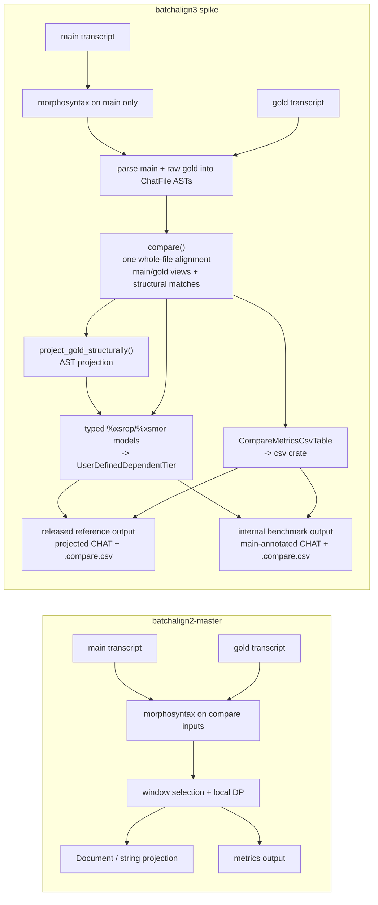

# BA2 Compare Migration

**Status:** Current
**Last updated:** 2026-09-16 22:04 EDT

This page is for contributors who know `batchalign2-master` compare and want to
judge the BA3 Rust reimplementation on its real semantics rather than on
superficial output shape.

The shortest summary is:

- BA3 keeps `batchalign2-master`'s compare outputs (`%xsrep`, `%xsmor`,
  `.compare.csv`) and its gold companion convention, and deliberately replaces
  its alignment: one alignment of the whole file instead of a local window per
  gold utterance (see "Where BA3 departs from BA2" below).
- BA3 intentionally changes *how* projection and serialization are implemented:
  the reimplementation keeps CHAT in a Rust AST, carries typed alignment
  metadata, materializes compare tiers through explicit typed content models,
  and emits `.compare.csv` from a structured table model instead of
  reconstructing structure from strings or a Python `Document` shell.

## Source map

Use these as the primary files when reviewing the rewrite:

- BA2 reference (the local `~/batchalign2-master` archive is checked out
  at the Jan 9 baseline `84ad500b...`, where `compare.py` does **not**
  yet exist; use the post-redesign commit
  `1f224df346c2ec590d45afa31136a3b878db622b` to see the file referenced
  here, e.g. `git -C ~/batchalign2-master show 1f224df:batchalign/pipelines/analysis/compare.py`):
  - `batchalign/pipelines/analysis/compare.py` (`CompareEngine` /
    `_find_best_segment`)
  - `~/batchalign2-master/batchalign/pipelines/analysis/eval.py`
  - `~/batchalign2-master/batchalign/cli/dispatch.py`
- BA3 reimplementation:
  - `crates/batchalign/src/compare.rs` (orchestration entry: the runner
    calls `compare()` and `project_gold_structurally()` from
    talkbank-transform and writes the projected CHAT and `.compare.csv`)
  - `crates/batchalign-transform/src/compare/engine.rs`
    (`compare()` and `WholeFileAlignment`: one DP alignment of the whole
    file, from which every metric and both per-utterance views are derived)
  - `crates/batchalign-transform/src/compare/materialize.rs`
    (`project_gold_structurally`, `inject_comparison`,
    `clear_comparison`)
  - `crates/batchalign-transform/src/compare/metrics.rs`
    (`CompareMetricsCsvTable`, `format_metrics_csv`)
  - `crates/batchalign/src/execution/` (recipe-driven dispatch;
    replaces old `compare_pipeline.rs`)

## BA2 compare shape vs BA3 compare shape

## Semantics intentionally carried over

These points were treated as the `batchalign2-master` compare semantics worth
preserving:

- gold companions still use the `FILE.gold.cha` convention
- compare still produces `%xsrep`, `%xsmor`, and `.compare.csv`
- deleted gold tokens stay untagged (`?`) unless the reference side already has
  tags that can be reused structurally

BA2's local window per gold utterance, and its rule that main words outside
the window are not counted, are not carried over: see "Where BA3 departs from
BA2" below.

## Semantics intentionally changed

These are the deliberate architectural differences from the Python compare path:

1. **Main is morphotagged, gold stays raw during artifact construction.**
   BA3 no longer morphotags the gold transcript just to make compare work. This
   preserves reference-side deletion semantics and avoids inventing tags that
   were never present in the gold file.

2. **Projection is AST-first and serializer-owned.**
    BA3 compare carries explicit structural word-match metadata
    (`gold_word_matches`) out of alignment and uses that to project onto the
    gold `ChatFile`. It does not infer projection by reparsing `%xsrep` or by
    patching reconstructed strings. `%xsrep` / `%xsmor` are emitted from typed
    compare-tier models, and `.compare.csv` is emitted from a structured table
    model via the standard Rust `csv` crate.

3. **Tier projection is conservative by design.**
   Exact structural matches may copy `%mor`, `%gra`, and `%wor` wholesale.
   Full gold-word coverage without exact structural identity may still project
   `%mor`. Partial `%gra` / `%wor` projection is intentionally withheld until
   there is a chunk-safe mapping, because "close enough" projection is exactly
   how BA2-style structural drift happens.

4. **Released output now follows the BA2 compare command shape.**
   The public command writes the projected reference transcript at the main
   file's output path, together with `%xsrep` / `%xsmor` and `.compare.csv`.
   The internal main-annotated materializer remains available for
   benchmark-style flows, but it is no longer the compare command contract.

5. **One explicit bug-exception policy is in force.**
   `batchalign2-master` can emit structurally lossy partial `%mor` / `%gra`
   projection on gold output. BA3 does not reproduce that when it would make the
   CHAT AST inconsistent. Unsafe partial projection stays conservative.

## Where BA3 departs from BA2: one whole-file alignment

BA2 placed each gold utterance with `_find_best_segment()`: a bag-of-words
search over every window of the remaining main transcript, ties broken toward
the latest window, followed by a cursor that only moves forward. BA3 matched it
exactly until 2026-09-16, when scoring real 30-minute bilingual recordings
showed the failure: a short gold utterance such as `yeah .` early in the file
was placed on the LAST `yeah .` of the main transcript, the cursor jumped to
the end, and every later gold utterance was left unplaced. A main transcript
identical to its gold plus one trailing `yeah .` scored 1 match out of 10.

BA3 now aligns every main token against every gold token once, and every
count, `cwer`, language attribution and both per-utterance views (`%xsrep`,
`%xsmor`) come from that alignment. Against a complete gold nothing reads main
utterance boundaries, so a recognizer that puts a boundary somewhere else
scores the same. A gold utterance is
placed on the main utterance holding most of its matched tokens only to score
utterance language agreement. There is no window and no cursor, so no early
decision can move a later one. Compare output on long files, and on any file
segmented differently from its gold, therefore differs from BA2's,
deliberately.

## BA2-to-BA3 code map

| Concern | BA2 | BA3 |
|---|---|---|
| Gold pairing | CLI / dispatch filename logic | compare planner + dispatch pairing |
| Gold utterance placement | `_find_best_segment()` window search | `WholeFileAlignment::of()`, one whole-file alignment (BA2's window search retired 2026-09-16, see above) |
| Local alignment core | `CompareEngine.process()` | `compare()` |
| Metrics output | `CompareAnalysisEngine` | `CompareMetricsCsvTable` / `format_metrics_csv()` |
| Gold-side projection | Python `Document` / serializer path | `project_gold_structurally()` |
| Output selection | command path decides output form | materializer decides output form |

## What parity work actually proved

The parity work on this branch proved **BA3 drift fixes**, not a new
courtroom-grade BA2 bug report.

Specifically, live `batchalign2-master` oracles let us fix these BA3
mismatches:

- BA3 had been counting skipped main tokens outside the chosen local window as
  insertions; `batchalign2-master` did not (reversed on 2026-07-30, when
  silently discarding those hypothesis words was found to make WER too low, and
  the window itself retired on 2026-09-16)
- BA3 had been morphotagging raw gold during compare artifact construction,
  causing deleted gold tokens to pick up invented POS tags instead of staying
  `?`
- BA3 gold-projected `%xsrep` / `%xsmor` was missing the gold utterance
  terminator as `PUNCT`

What the rewrite did **not** prove:

- a new, sharply isolated BA2 compare bug

The direct evidence here is "BA3 was wrong relative to `batchalign2-master` in
these places" plus "BA2's projection architecture is structurally lossy." That
is enough to justify the AST-first reimplementation, but not enough to claim a
fresh BA2 defect report.

## Rules for future compare work

If compare keeps evolving in BA3, the safe rules are:

1. extend `ComparisonBundle` and `project_gold_structurally()`, not the
   serialized `%xsrep` / `%xsmor` text
2. use AST walkers and dependent-tier helpers before inventing new string glue
3. extend the typed compare-tier / CSV models before widening serializer output
   strings
4. do not project partial `%gra` / `%wor` without explicit chunk-safe mapping
5. treat BA2 as a semantic reference, not a bug-for-bug target

## Acceptance checklist for the rewrite

If the question is "should we accept this Rust reimplementation instead of
starting over?", the most useful review checklist is:

- does `compare()` keep BA2's outputs while scoring every word from one
  whole-file alignment?
- does the workflow keep gold raw and main morphotagged on purpose?
- does projection stay on the CHAT AST instead of text reconstruction?
- are `%xsrep`, `%xsmor`, and `.compare.csv` all driven from the same bundle and
  lowered through typed serializer models instead of raw string assembly?
- are partial `%gra` / `%wor` projections still blocked behind explicit safety
  rules?

Those are the design commitments that matter more than byte-for-byte loyalty to
the Python implementation shell.
