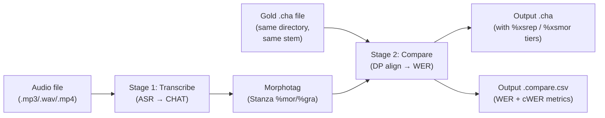

# Benchmarks

**Status:** Current
**Last updated:** 2026-09-16 22:04 EDT

Batchalign provides a `benchmark` command to evaluate ASR accuracy against
gold transcripts. It transcribes each audio file, compares the result
against the corresponding gold `.cha` transcript, and reports word error
rate (WER).

## What is WER?

Word Error Rate measures how many words the ASR system got wrong compared
to a human-verified reference transcript. Lower is better, 0% means
perfect, 100% means every word was wrong or missing.

```text
WER  = (insertions + deletions) / total_gold_words
cWER = (order-insensitive edits) / total_gold_words
Accuracy = 1.0 − WER  (clamped to [0, 1])
WER with substitutions = (substitutions + deletions + insertions) / total_gold_words
```

`wer` counts a wrong word twice: the gold word as a deletion and the word
recognized in its place as an insertion. It is kept exactly as it was, so
numbers already reported from it stay comparable. `wer_with_substitutions`
counts that word once, which is the definition most published WER figures use.

## Substitutions

Between two consecutive matches of the alignment, a deleted gold word and an
inserted main word are one wrong word, so up to `min(deletions, insertions)` of
them pair into substitutions. Pairing never crosses a match; utterance
boundaries do not split the whole-file alignment. This is the edit count for compare's own alignment, which maximizes
matches; a pure Levenshtein alignment can occasionally trade a match for
substitutions and report a slightly lower number.

## Scoring by language

Every compared word carries the language that governs it: its own `@s`, else an
enclosing `<...> [@s]` span, else its utterance (a `[- lang]` precode, else the
first `@Languages` entry). The resolution is chatter's, so `@s` means "the other
language" relative to the utterance it sits in, and a word inside a span is
scored in the span's language even though it carries no marker of its own.
From that, `.compare.csv` reports, for code-switched and multilingual gold:

| Rows | What they measure |
|---|---|
| `language:<code>:gold_words`, `matches`, `substitutions`, `deletions`, `insertions`, `wer_with_substitutions` | Error rate per gold language. A gold word's errors belong to its language; an unpaired insertion belongs to the language of the next gold word in the alignment. |
| `unattributed_insertions` | Insertions against a gold with no compared words, where there is no gold language to charge. Never charged to the main transcript's language, which is exactly the evidence under test. |
| `utterance_language:scored`, `agreeing`, `indeterminate`, `accuracy`, `gold=<g>:main=<m>`, `unplaced:<code>` | Whether each gold utterance's language matches that of the main utterance holding most of its matched words. An utterance compare could not place is counted apart, not as a disagreement. |
| `word_language:scored`, `agreeing`, `indeterminate`, `accuracy`, `gold=<g>:main=<m>` | Word language agreement over matched words. |
| `switch:both`, `gold_only`, `main_only`, `neither`, `precision`, `recall` | Code-switch marking over matched words: a word is a switch when its own `@s` or a span marks it with a language other than its utterance's, or with a language that could not be resolved. |

A language is written as CHAT writes it: a code (`spa`), a mix (`eng+spa`), an
ambiguity (`eng&spa`), or `unresolved`. Agreement has three values: the same,
different, or indeterminate when either side is unresolved or ambiguous. Two
transcripts that both fail to give a language have not agreed, so
indeterminate pairs are counted but left out of `accuracy`. A rate with
nothing to divide by prints `NA`, never `0`. Every count is printed, so a
corpus roll-up sums rows and recomputes rates rather than averaging per-file
ratios.

## WER and cWER: read them as a pair

`cwer` counts the same errors as `wer` except that a word recognised
correctly but placed in the wrong position **within its gold utterance** cancels,
instead of being charged twice, once as a deletion where it should have been
and once as an insertion where it landed. A word that lands at the boundary
between two gold utterances may cancel against either, since the alignment
cannot say which one it drifted from; a word that reappears further away is
charged in both.

| Reading | Means |
|---|---|
| `cwer` well below `wer` | The words are right and the PLACEMENT is wrong. Look at diarization and the merge stage. |
| `cwer` close to `wer` | The words themselves are wrong. Look at the ASR engine. |

Plain WER conflates those two failure modes, and for diarized output the
distinction is most of the diagnostic value. Neither rate measures
segmentation: where the main transcript puts its utterance boundaries costs
nothing in either, so segmentation quality needs a measure of its own.

> **Accuracy changed on 2026-07-30, and older numbers are not comparable.**
> Until then, compare aligned only inside a bag-of-words window chosen per gold
> utterance and silently discarded any hypothesis word outside it. Those words
> were counted in no category, so reported WER was systematically LOWER than the
> truth by an amount that varied with how ragged the transcript was. The fix
> aligned every hypothesis word, so those words are now charged as insertions.
> Expect WER on the same file to RISE relative to a pre-2026-07-30 run; the new
> number is the honest one.

> **Accuracy changed again on 2026-09-16, and older numbers are not
> comparable.** Gold utterances used to be placed by a window search that
> preferred the LATEST matching window anywhere in the remaining transcript,
> with a cursor that only moved forward. A short utterance near the start (for
> example `yeah .`) could be placed at the end of the file and leave every later
> gold utterance unplaced, charging all of its words as errors. Each main
> utterance was then aligned only against the gold placed on it, so a
> recognizer that split one reference utterance in two was charged for where it
> put the boundary. Every count, `cwer` and language attribution now come from
> one alignment of the whole file, and against a complete gold, where the main
> transcript puts its utterance boundaries changes none of them. Six 30-minute recordings
> scored 32 matches before the change and 4,074 after. Expect WER to FALL
> relative to an earlier run, dramatically on long files.

## What the gold claims to cover

Compare aligns the two transcripts word for word, and some main utterances
match no gold word at all. Whether THEIR words count as errors is not something
compare can work out from the two files, so the caller states it:

| Coverage | Meaning | Words of unmatched main utterances |
|---|---|---|
| `Complete` | The gold is a full reference for this recording | Charged as insertions |
| `Partial` | The gold covers only a slice, one timepoint, one speaker | Not scored |

There is deliberately no default. Getting this wrong moves the headline WER in a
direction nobody would notice, so the compiler makes the caller choose.

The `compare` and `benchmark` commands pass `Complete`, because a `FILE.gold.cha`
companion is a re-transcription of the same recording. A measurement built on a
sampled or single-speaker reference should pass `Partial`, and should say so
when it reports its numbers: a `Partial` WER describes the covered part only.

Word normalization is applied before comparison: compound splitting
(`airplane` → `air plane`), contraction expansion (`he's` → `he is`), filler
normalization (all fillers → `um`), abbreviation expansion (`FBI` → `F B I`),
and proper name replacement (all names → `name`). One normalization
(`WerNormalization` in `crates/batchalign-transform/src/wer_conform.rs`) is
chosen per comparison, from what the gold transcript declares, and applied to
both transcripts. A gold declaring English alone, or declaring nothing, gets
every rule. A gold declaring any other language keeps names: the name list
holds everyday Spanish words such as `linda` and `clara`, so name replacement
turned different Spanish words into the same token and scored them as matches.

It is never chosen per word or per transcript from language labels. A
recognizer that heard `linda` correctly but labeled it English would otherwise
have its word normalized differently from the gold's and be charged a
recognition error for a labeling error, which the language rows already report
on their own.

## Pipeline

`benchmark` is a **two-stage composition**, not a simple diff:



**Stage 1, Transcribe:** Runs the full ASR pipeline (`process_transcribe()`)
to produce a CHAT transcript from the audio. This includes all standard
ASR post-processing (compound merging, number expansion, disfluency
detection).

**Stage 2, Compare:** Runs morphosyntax on the transcribed CHAT (to generate
`%mor`/`%gra`), then DP-aligns the transcribed words against the gold
transcript words (Hirschberg case-insensitive alignment). Produces `%xsrep` /
`%xsmor` tiers and CSV metrics.

## Gold File Discovery

For each audio file, benchmark looks for a `.cha` file with the **same
basename in the same directory**:

| Audio file | Expected gold file |
|---|---|
| `interview.wav` | `interview.cha` |
| `sample.mp3` | `sample.cha` |
| `/data/recording.mp4` | `/data/recording.cha` |

**Important:** Benchmark resolves symlinks before looking for the gold file.
If you symlink `audio.mp3` → `/real/path/audio.mp3`, benchmark will look for
`/real/path/audio.cha`, not the symlink's directory. **Copy audio files**
into the working directory rather than symlinking them.

If no gold file is found, the file is skipped with an `InputMissing` error.

## Input Requirements

The gold `.cha` file must be parseable by batchalign3's tree-sitter grammar.
Files with parse errors (tree-sitter ERROR nodes) will fail at the
morphotag pre-validation gate with:

```text
morphotag pre-validation failed: [L0] File has N parse error(s); input may be malformed
```

Note that `chatter validate` (from talkbank-tools) and batchalign3 use the
same tree-sitter grammar, but batchalign3's pre-validation is stricter,
it rejects files with **any** parse errors at L0, whereas `chatter validate`
may report these as warnings.

## Example

```bash
batchalign3 benchmark ~/ba_data/input -o ~/ba_data/output --lang eng
```

## Options

| Option | Meaning |
| --- | --- |
| `--asr-engine NAME` | ASR engine (default: rev). `--help` prints the list, which is generated from the engine set. |
| `--asr-engine-custom NAME` | Deprecated alias for `--asr-engine`, still honoured, hidden from help |
| `--lang CODE` | 3-letter ISO language code (default: `eng`) |
| `--num-speakers N` | Number of speakers (default: `2`) |
| `--wor` / `--nowor` | Toggle `%wor` tier output |
| `--merge-abbrev` | Merge abbreviations in output |
| `--bank NAME` | Legacy remote media selector (unsupported in the current CLI; pass filesystem paths instead) |
| `--subdir PATH` | Legacy remote media selector subdirectory (unsupported in the current CLI) |

## Output

Two files are produced per input audio file:

### 1. Hypothesis CHAT file (`{stem}.cha`)

A full CHAT transcript with ASR results plus `%xsrep` / `%xsmor` comparison
tiers. Each utterance gets a `%xsrep` dependent tier showing the word
alignment and a matching `%xsmor` tier showing the POS alignment:

```text
*PAR:   hello big world today .
%xsrep: hello [+ main]big world [- gold]today .
%xsmor: INTJ  +ADJ      NOUN  -?            PUNCT
```

- Unmarked words = match (in both hypothesis and gold)
- `[+ main]` = insertion (in hypothesis but not gold)
- `[- gold]` = deletion (in gold but not hypothesis)

The `?` above is a deletion: a gold word the hypothesis does not contain, so
neither transcript tagged it. Matches and insertions carry a real tag even when
the gold companion has no `%mor` of its own; see
[compare: where the part of speech comes from](../user-guide/commands/compare.md#where-the-part-of-speech-comes-from).

### 2. Metrics CSV file (`{stem}.compare.csv`)

```csv
metric,value
wer,0.2500
accuracy,0.7500
matches,3
insertions,1
deletions,0
total_gold_words,3
total_main_words,4
```

**WER is NOT printed to stdout.** The CLI shows only success/failure per file.
To extract WER programmatically, read the `.compare.csv` from the output
directory.

## Language Considerations

The `--lang` flag affects ASR engine behavior:

- **Rev.AI:** ISO 639-3 codes are translated to Rev.AI codes. Some languages
  (e.g., Hakka `hak`) are not supported by Rev.AI, see
  [Language Code Resolution](language-code-resolution.md) for the mapping table.
- **Whisper:** Uses `pycountry` to resolve language names. Unknown codes
  raise `ValueError`.
- Benchmark does **not** run utterance segmentation or forced alignment, it
  only transcribes and compares.

## Implementation Details

| Component | File | Key function |
|---|---|---|
| Orchestrator | `crates/batchalign/src/benchmark.rs` | `process_benchmark()` (line 44) |
| Per-file dispatcher | `crates/batchalign/src/runner/dispatch/benchmark_pipeline.rs` | `process_one_benchmark_file()` (line 185) |
| Gold file resolution | `crates/batchalign/src/benchmark.rs` | `gold_chat_path_for_audio()` (line 72) |
| WER computation | `crates/batchalign-transform/src/compare/engine.rs` | `compare()` (line 173) |
| Word normalization | `crates/batchalign-transform/src/wer_conform.rs` | `conform_words()` (line 96) |
| CSV output | `crates/batchalign-transform/src/compare/metrics.rs` | `format_metrics_csv()` (line 284) |
| %xsrep / %xsmor injection | `crates/batchalign-transform/src/compare/materialize.rs` | `inject_comparison()` (line 266) |

## See also

- [Command I/O Parity](command-io.md), section 9 for full benchmark dispatch details
- [CLI Reference](../user-guide/cli-reference.md), benchmark entry in the CLI docs
- [Language Code Resolution](language-code-resolution.md), how `--lang` maps to engine codes
