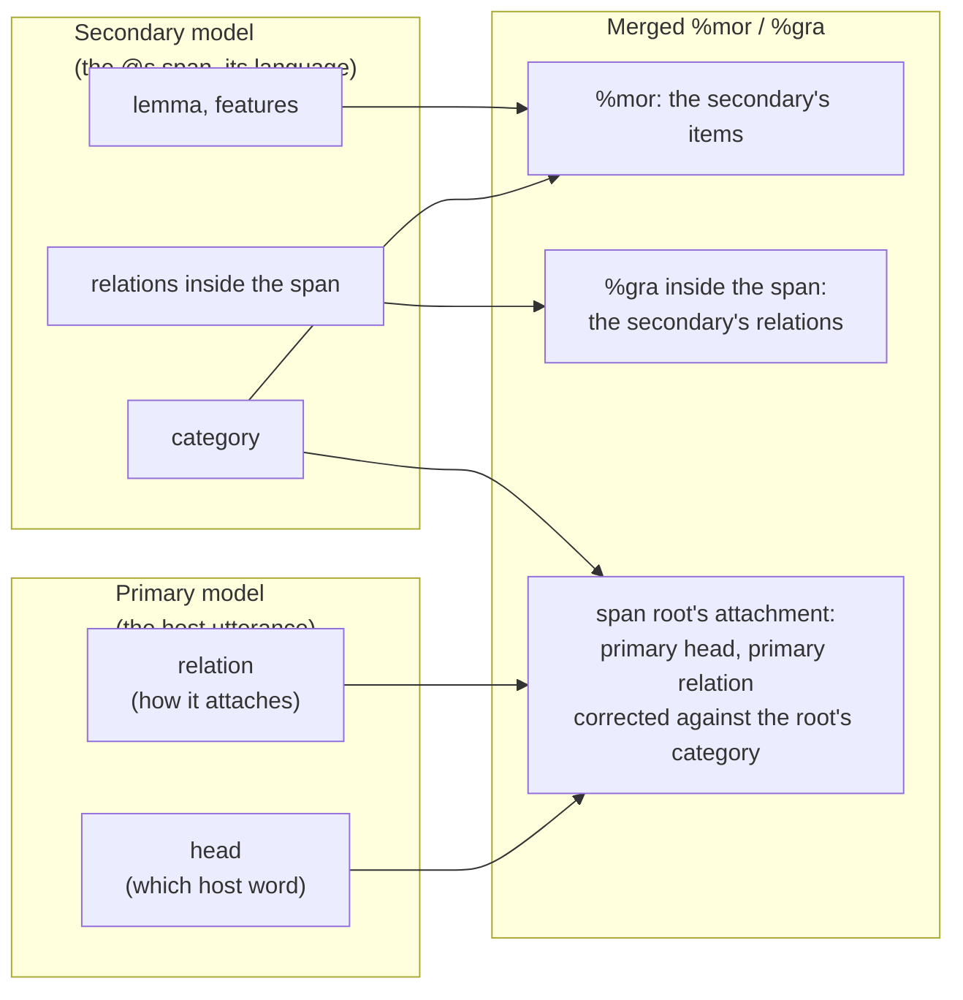
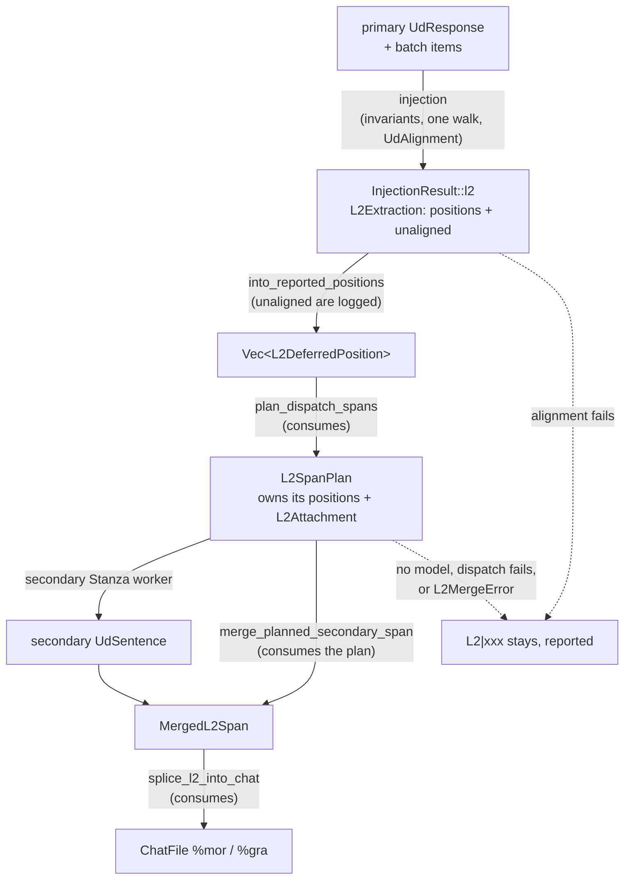
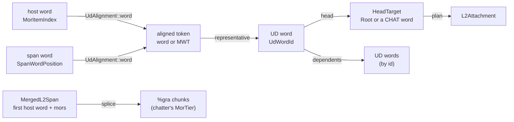

# L2 Morphotag: Per-Word Code-Switching Analysis

**Status:** Current
**Last updated:** 2026-10-02 06:50 EDT

L2 dispatch is on by default; `--no-l2-morphotag` opts out and leaves every
`@s` word as `L2|xxx`. This page is the design reference for implementers;
users should read the [user guide](../user-guide/commands/morphotag.md).
Changes to this design are recorded in the repository's `CHANGELOG.md`.

## Problem

CHAT transcripts use `@s` markers for word-level code-switching, a word
spoken in a different language than the utterance's primary language:

```chat
*EVA: was ich jetzt machen möchte ist , dass ich von der
      Linguistik ein bisschen umsattele auf (.) film@s studies@s .
```

Here `film` and `studies` are English words in a German utterance, marked
with bare `@s` (shortcut for the secondary language declared in
`@Languages`).

The primary language's Stanza model (German, here) produces wrong
morphology for foreign words, so the safe conservative answer is
`L2|xxx`, which admits ignorance:

```chat
%mor: ... adp|auf L2|xxx L2|xxx .
```

But `L2|xxx` is a loss. `studies` is a regular English plural noun; the
English Stanza model gives `noun|study-Plur`. L2 morphotag routes `@s`
words to the model of their own language and combines that analysis with
what the primary model knows about the utterance.

## Scale

Across TalkBank's 24 data repos:

- **12,450** `.cha` files contain `@s` markers
- **Top languages:** eng (32K occurrences), spa (7.5K), fra (2.5K),
  dan (1.8K), ita (1.6K), nan (1.3K), zho (1.2K), deu (1.1K)
- **Top repos:** childes-other-data (4,225 files), slabank-data (3,517),
  phon-other-data (1,005), childes-romance-germanic-data (781)

### @s Marker Variants

| Form | Meaning | Frequency | Example |
|------|---------|-----------|---------|
| `@s` | Bare shortcut, toggles to secondary language from `@Languages` | ~74% of uses | `film@s` |
| `@s:CODE` | Explicit language code (ISO 639-3) | ~25% | `tienda@s:spa` |
| `@s:CODE+CODE` | Multiple languages (code-mixing at sub-word level) | 229 files | `ripiado@s:eng+spa` |
| `@s:CODE&CODE` | Ambiguous between languages | 290 files | `wrap_o@s:eng&cym` |

### Common Code-Switching Patterns

1. **Single isolated word:** `the tienda@s:spa is close .`: one foreign
   word embedded in primary-language sentence
2. **Contiguous span:** `los@s:spa niños@s:spa`: multi-word foreign
   phrase (a noun phrase, in this case)
3. **Utterance-initial:** `time@s out@s , kenne ich nicht .`: English
   phrase at start of German utterance
4. **Mixed secondary languages:** `ok@s:eng damelo@s:spa` in a
   Tzutujil utterance, two different foreign languages
5. **Morphologically integrated:** `tagueé@s:eng+spa`: English verb
   root with Spanish past participle morphology

## Who owns what

Two models see an `@s` word, and each knows something the other cannot.

- The **secondary model** knows the word's language. It owns the word's
  lexical category, lemma and features, and every relation inside the
  `@s` span it analysed.
- The **primary model** knows the host utterance. It owns where the span
  attaches in the host tree and with which relation.

The primary's category for a foreign word is a guess: it marks such words
`X` with `Foreign=Yes`, or `INTJ`, or a category read off the position.
Its relation for the word is a guess too, but it is the only evidence of
how the word fits the host sentence, and it is structural (UD relations
mean the same in every language). So the resolved category is always one
the secondary model assigned, and where the primary's relation contradicts
that category, the relation is what gets corrected.



## Architecture

The L2 path is a chain of owned types. Each is made from the one before by
one function that consumes it, so a step cannot be skipped and no later
step refers back to an earlier one by a bare index.



`talkbank-transform` (`crates/batchalign-transform/src/morphosyntax/l2/`)
owns every step except the worker call; `batchalign`
(`crates/batchalign/src/morphosyntax/batch.rs`, `dispatch_secondary_l2`) is
the adapter that sends each planned span to a secondary worker. The
primary pass writes `L2|xxx` for every `@s` word first, so every failure
path leaves that placeholder, never a partial analysis.

### The index spaces and the alignment

Four integer spaces meet in this path, and they coincide only in an
utterance with no contraction:

| Space | Type | Base | Sequence |
|-------|------|------|----------|
| host word | `MorItemIndex` | 0 | alignable words of the utterance, one `%mor` item each |
| span word | `SpanWordPosition` | 0 | words of one dispatched secondary span |
| token position | `UdTokenIndex` | 0 | top-level tokens of the walked sentence: a word or a complete multi-word token |
| UD word id | `UdWordId` | 1 | syntactic words of a UD sentence (`ID` column) |
| UD row | private to the alignment | 0 | rows of `UdSentence::words`, where a multi-word token's range row sits beside its components |

In `avui anem al cole@s per jugar .` the Catalan model splits `al` into
`a` + `el`, so `cole` is host word 3, UD word 5 and UD row 5; row 3 is the
`a` of `al`.

`UdTokens::walk` (`morphosyntax/alignment.rs`) is the one walk of a UD
sentence: one single word or one complete multi-word token per top-level
token, empty nodes and a terminator-punctuation word skipped. It validates
what every lookup relies on: multi-word tokens followed by their components,
no repeated or zero id, every head the root or a walked word, and every
multi-word token's REPRESENTATIVE (its first component whose head lies
outside the token). The `%mor` mapper (`map_tokens`) consumes the walk, and
so does `UdAlignment<W>`, the one place a CHAT word is matched to UD words:
`UdTokens::align` adds one check, one token per CHAT word, and makes the
alignment generic over the CHAT-side space `W` (`MorItemIndex` for a host
utterance, `SpanWordPosition` for a secondary span). Because the mapper and
the alignment read one walk, the `%mor` item a word gets and the UD words
the alignment reports for it cannot disagree. After that, every lookup goes
by UD id, and a head is reported as `HeadTarget::{Root, Word(W)}`: the
sentinel `0` is a variant, and a head is always a CHAT word of the same
space.



A sentence that does not align is a typed `UdAlignmentError`. On the
primary side the utterance's `@s` words stay `L2|xxx` and the utterance is
reported in `L2Extraction::unaligned`; on the secondary side the span
fails with `L2MergeError::Alignment`, reported by the dispatcher.

### Extraction

Extraction is a step of primary injection, not a pass of its own. For each
utterance, injection rewrites the primary analysis by the grammatical
invariants once, walks it once (`UdTokens::walk`), maps that walk to
`%mor`, and aligns the same walk to the utterance's words. After the
utterance is injected, the deferral (`L2Extraction::defer_utterance`)
records, per dispatchable `@s` word, a `L2DeferredPosition`: the `%mor` item
it was written as, its target language, its text, the utterance's
terminator (an input to the secondary model), and `PrimaryStructuralInfo`
read from the word's representative: relation, head
(`HeadTarget<MorItemIndex>`), the relations of its dependents, and the head
word's UPOS. The primary's category for the word is not recorded: nothing
uses it. Both types have private fields; only the deferral builds them, from
an aligned word. So a position and the `%gra` it is spliced into come from
one analysis, after the same rewrites: an `@s` word the contraction rule
moved under `have` (`you hafta put@s:spa .`) is deferred as `have`'s `xcomp`,
as its `%gra` says, not as the root the raw analysis made it.

The item and head are named in the space of the `%mor` items injection
wrote (`ItemPlacement`). In preserve mode that is one item per CHAT word. In
retokenize mode the main tier is rebuilt from the model's tokens, one item
per model word: an `@s` word's item is the one token the text mapping that
rebuilds the main tier gives it, cross-checked against the item the
analysis gives it, and its head is the item of its head word. In
`gonna see camino@s:spa .` that makes `camino` item 3 and its head `see`
(item 2). A word that became several items, or whose two placements
disagree, is reported (`L2ExtractError::SplitWord`,
`TokenizationDisagrees`) and stays `L2|xxx`. An utterance that is not
injected (its analysis does not map, or its item count differs from its word
count) defers nothing; its decision record reports it.

### Planning

`plan_dispatch_spans` groups consecutive positions of one utterance and
one target language into an `L2SpanPlan`, which owns them. It also decides
the span's `L2Attachment` from the primary heads. The ATTACHMENT SOURCE is
the first span word whose primary head lies outside the span:

| `L2Attachment` | When | External relation |
|----------------|------|-------------------|
| `HostGovernor { source_word, source, relation }` | some word's head is a host word outside the span | the source's primary relation (corrected at merge) |
| `UtteranceRoot { source_word }` | no such word, and some word is the primary's utterance root | `root`; the variant has no field for another |
| `InternalRoot` | every head lies inside the span (only a cyclic primary analysis) | none |

A word's head inside the span means the secondary analysis governs it.

### Secondary dispatch

Each span is sent to a Stanza worker for its target language as one
sentence: its words and the utterance's terminator, with Stanza owning
tokenization (`retokenize=true`), so contractions expand into multi-word
tokens (`it's` is `it` + `'s`). In that mode the terminator comes back as
a final `PUNCT` row, which the alignment skips.

### Merge

`merge_planned_secondary_span` consumes the plan and the secondary
sentence and produces one `MergedL2Span`:

1. Align the secondary sentence to the span's words
   (`UdAlignment<SpanWordPosition>`) and map it to `%mor`/`%gra` with
   `map_ud_sentence` (a multi-word token becomes one item with clitics,
   `pron|it~aux|be`). The mapping's item count must equal the span's word
   count.
2. **Items.** Each span word's `%mor` item is the secondary's, unchanged,
   except that a phrasal-verb particle is written PART (below).
3. **Relations inside the span.** The secondary's relations, unchanged;
   their heads are 1-based within the span and `0` for the secondary root.
4. **External relation.** For a `HostGovernor` attachment, the source's
   primary relation is checked against the category of the secondary
   root, the word that will carry it. If the relation is `flat` or does
   not admit that category, it is replaced by the relation the category
   implies under the source's head (`infer_deprel_from_pos`). Where no
   relation is implied, the primary's stays.

The attachment is typed by stage: a plan's is `L2Attachment<AsPlanned>`,
whose relation is the source's primary one with no field for anything
else, and the merge returns `L2Attachment<ExternalRelation>`, which says
`Primary` or `Corrected(relation)`. The relation is held once, so a span
cannot carry a correction beside a different external relation, and a plan
cannot carry a correction at all.

The category check uses `deprel_to_pos_constraint`, which maps a UD
relation to the categories it admits (`advmod` admits ADV, `obl` NOUN and
PRON, `flat`, `conj`, `dep` and unknown relations admit anything). It only
detects a contradiction; it never chooses a category.

| Root's category | Head's category | Relation implied |
|-----------------|-----------------|------------------|
| ADV | VERB, ADJ, ADV | `advmod` |
| ADJ | NOUN, PROPN | `amod` |
| DET | NOUN, PROPN | `det` |
| NOUN, PROPN | VERB (source has a `case` dependent) | `obl` |
| NOUN, PROPN | VERB (no `case` dependent) | `obj` |
| NOUN, PROPN | NOUN, PROPN | `nmod` |

`ModelAssignedPos` is the only category the merge itself writes or reasons
with. Its constructors read the secondary analysis through the span
alignment (the word's tag, a contraction's representative's tag, or PART
for a particle), and its field is private, so no rule over the primary's
relation can build one. The `%mor` items are the `%mor` mapper's rendering
of the secondary analysis, including its language-specific overrides
(Italian's MWT repairs among them), exactly as for a primary-language
word. There is no "no secondary category" case: every span word
is an aligned, tagged UD word, and a span the secondary did not analyse
fails as a whole.

Worked example, `we talked about los@s:spa niños@s:spa .`:

| | `los` | `niños` |
|-|-------|---------|
| primary (English) | PROPN, `obl` under `talked` | PROPN, `flat` under `los` |
| secondary (Spanish) | DET, `det` under `niños` | NOUN, root |

`los` is the attachment source (its head, `talked`, is outside the span).
The secondary root `niños` carries `los`'s `obl` to `talked`; `obl` admits
NOUN, so it stands. Inside the span `los` keeps the secondary's `det`:

```chat
%mor: pron|we-Prs-Nom-P1 verb|talk-Fin-Ind-Past-P1 adp|about det|el-Masc-Def-Art-Plur noun|niño-Masc-Plur .
%gra: 1|2|NSUBJ 2|0|ROOT 3|4|CASE 4|5|DET 5|2|OBL 6|2|PUNCT
```

(`3|4|CASE`: see Limitations.)

### Phrasal verbs

Stanza attaches the particle of a verb-particle construction to the verb
with `compound:prt` (`wake up`, `give up`, `pick up`), and tags the
English particle ADP. A span word the secondary attached `compound:prt`
to a word it tagged VERB is written PART; its relation is the secondary's
`compound:prt` (`COMPOUND-PRT`). The verb keeps the secondary's VERB, as
every word keeps its category. The context is each span word's place in
the span alignment, so it is present for every word.

| Main tier | `%mor` | `%gra` of the span |
|-----------|--------|--------------------|
| `ich möchte wake@s up@s jetzt .` | `... verb\|wake-Fin-Imp part\|up ...` | `3\|2\|OBJ 4\|3\|COMPOUND-PRT` |
| `die kinder give@s up@s immer .` | `... verb\|give-Fin-Imp part\|up ...` | `3\|2\|ADVMOD 4\|3\|COMPOUND-PRT` |
| `die zeit ist time@s out@s .` | `... noun\|time adp\|out .` | `5\|4\|COMPOUND-PRT` |

`time out` is a compound noun: Stanza attaches `out` `compound:prt` to the
NOUN `time`, so `out` keeps its ADP.

### Splice

`splice_l2_into_chat` consumes merged spans through chatter's
`MorTier::splice_range_coordinated`, including one-word spans. The span's
relations are repaired together (`repair_secondary_gras`), then admitted
as a `SplicedBlock`: one ordered relation per chunk, bounded heads, exactly
one root and no cycle. `SplicedBlock::root_chunk()` supplies the admitted
root in block-relative numbering; the consumer does not rediscover it.

The caller supplies the root attachment as a `SpanRoot`. A host governor
is named by its **pre-splice** `SemanticWordIndex1`, with a checked
`AttachmentRelation` that cannot be `ROOT`; chatter owns translation into
the resulting tier's numbering. `HostRedirects::PerItem` redirects host
dependents of the primary attachment source to the block's admitted root.
Other replaced words follow their counterpart's chunk. Block-relative
`BlockChunk` values and host indices are distinct types.

The primary host tree remains canonical. If the secondary requests the
utterance root while a primary root survives outside the span, the caller
explicitly attaches the secondary root there with `DEP`. If a requested
host anchor lies in, or depends on, the replaced span, the caller may
request the utterance root instead; this succeeds only when chatter admits
that root replacement. Refused admission leaves both tiers unchanged and
retains `L2|xxx`, with a warning. An unreadable attachment source is reported
as `host_anchor_unreadable`, never converted into an absent anchor.

Every applied span is additionally validated against the generated `%gra`
invariants and rolled back if it breaks one. `gra_upgraded` counts only
planned external corrections actually written under their host governor,
not `DEP` fallback attachments or utterance-root replacements.

### LanguageResolution policy

| Variant | Dispatch target |
|---------|-----------------|
| `Single(lang)` | `lang` |
| `Multiple(langs)` | the first language named |
| `Ambiguous(langs)` | the first language named |
| `Unresolved` | none: the word stays `L2|xxx` |

### Validation and normalization policy

Per-word L2 dispatch and transcript repair are intentionally separate concerns:

- explicit `@s:LANG` still dispatches to `LANG` when possible, even if `LANG` is
  missing from `@Languages`, but validation emits warn-only E254 so the header
  drift is visible
- whole-utterance same-language all-`@s` runs are rejected as E255; the
  canonical CHAT representation is utterance-level `[- lang]`
- `chatter debug fix-s` is the normalization tool: it rewrites
  qualifying whole-utterance `@s` runs, clears the matching per-word
  shortcuts on fillers and nonwords as well as on regular words (a
  bare `@s` resolves relative to the surrounding tier language, so the
  new `[- LANG]` precode would otherwise flip filler resolution),
  appends missing explicit languages to `@Languages`, and skips
  already-correct files

### Unsupported non-primary language handling

`morphotag` requires only the **primary** `@Languages` code to be
Stanza-supported. Non-primary content targeting an unsupported language,
whether via `[- UNSUPPORTEDLANG]` precode or `@s:UNSUPPORTEDLANG`
per-word marker, is partitioned out of Stanza dispatch by
`partition_groups_by_stanza_support` in
`crates/batchalign/src/morphosyntax/worker.rs` and emitted as `L2|xxx`
rather than crashing the worker. Supported-language utterances and
spans in the same file continue to receive real morphology.

## Design Alternatives Considered

### Alternative 1: Secondary Model Only

Send @s words to the secondary model in isolation and discard the primary
model's output for them.

**Rejected:** the secondary model cannot know where the span attaches in
the host utterance. The primary's head and relation are the only evidence
of that, so the merge keeps them for the span's attachment.

### Alternative 2: Full Utterance to Secondary Model

Send the entire utterance to both models and take the secondary's results
at @s positions.

**Deferred:** the secondary model tokenizes the host-language words its
own way, so position alignment is fragile, and its analysis of host words
is as unreliable as the primary's of foreign ones.

### Alternative 3: Multilingual Model

Use a single multilingual Stanza model that handles mixed-language input.

**Rejected:** multilingual models trade language-specific accuracy for
breadth; TalkBank's morphological detail needs dedicated per-language
models.

### Alternative 4: Dictionary Lookup

Look @s words up in morphological dictionaries (UniMorph, Wiktionary).

**Deferred:** a possible fallback when no secondary Stanza model exists.

### Alternative 5: Category from the primary's relation

Choose the category the primary's relation implies, or the primary's own
tag, where it disagrees with the secondary's.

**Rejected:** it produces categories neither model assigned beside the
secondary's lemma and features (`noun|work-Part-Pres`), and it overrides
the model that knows the language, even where both models agree
(`je dis ja@s:nld` is INTJ in both). The relation is corrected instead.

## Flag surface

L2 dispatch is the default; `--no-l2-morphotag` opts out.

```bash
batchalign3 morphotag input/ -o output/                    # L2 on (default)
batchalign3 morphotag input/ -o output/ --no-l2-morphotag  # L2 off
```

Morphotag has no `--lang` flag; every file's primary language is read
from its own `@Languages:` header. The L2 dispatch path applies to
secondary-language tagged words (`@s`, `@s:fra`, etc.) inside any file
regardless of the primary.

The opt-out serves researchers reproducing older analyses exactly, and
data producers who prefer the honest `L2|xxx` where the secondary Stanza
model is known to be weak.

## MWT Contraction Expansion

The secondary dispatch lets Stanza own tokenization, so for MWT-capable
languages (English, French, Italian, etc.) contractions expand into
multi-word tokens, and `map_ud_sentence` assembles each into one item
matching the single `@s` word on the main tier:

| @s word | `%mor` |
|---------|--------|
| `it's@s:eng` | `pron\|it-Prs-Nom-S3~aux\|be-Fin-Ind-Pres-S3` |
| `don't@s:eng` | `aux\|do-Fin-Imp~part\|not` |
| `working@s:eng` | `verb\|work-Part-Pres` |

## Limitations

1. **Host words that point into a span attach to its first chunk.**
   Chatter's splice redirects a host relation whose head is a replaced
   word to the first chunk of the replacing block. Where the source's
   host dependents should go to the secondary root, the result differs:
   in `we talked about los@s niños@s .` `about` attaches to `los`
   (`3|4|CASE`), and in
   `ich glaube it's@s working@s und don't@s stop@s .` `und` attaches to
   `do` (`6|7|CC`) and `stop` to `it` (`9|3|CONJ`).
2. **A single isolated word has only the secondary's analysis of it
   alone.** The secondary model sees just the span and the terminator;
   for an ambiguous isolated word its category is the model's best
   reading of that word out of context.
3. **Memory cost.** Secondary models are loaded alongside the primary
   model; each Stanza model adds ~200-500 MB.
4. **Not all languages supported.** Stanza covers ~70 languages, but
   some `@s` targets (e.g., `@s:nan` Taiwanese, `@s:sun` Sundanese,
   possibly mistagged in some corpora) have no model. Those words stay
   `L2|xxx`; there is no silent wrong-analysis failure mode.
5. **The relation correction is a table.** It covers common
   category-under-head cases (table above); elsewhere the primary's
   relation stands even where it contradicts the category.
6. **MWT coverage inherits Stanza's per-language MWT support.** Languages
   with Stanza MWT processors expand contractions; Swedish and a few
   others don't.
7. **Phrasal-verb coverage is Stanza-model-dependent.** Stanza
   recognizes common English phrasal verbs but disagrees on borderline
   cases (`look after`, `hang around`), which come back `advmod`, so the
   merge gives `verb|look adv|after`.

## Related

- [L2 Morphotag Status](l2-morphotag-status.md), what is in place and how it is tested
- [L2 Morphotag Literature Review](l2-morphotag-literature.md), prior art survey
- [Transcriber `$POS` Hints](pos-hints.md), complementary post-pass that overrides `%mor` POS with transcriber annotations (default on; opt out via `--no-pos-hints`).
- [L2 & Language Switching](l2-handling.md), current behavior reference
- [Language Routing](../../architecture/language-and-multilingual/language-routing.md), full per-utterance + per-word routing, auto-detection, and the per-word routing gap
