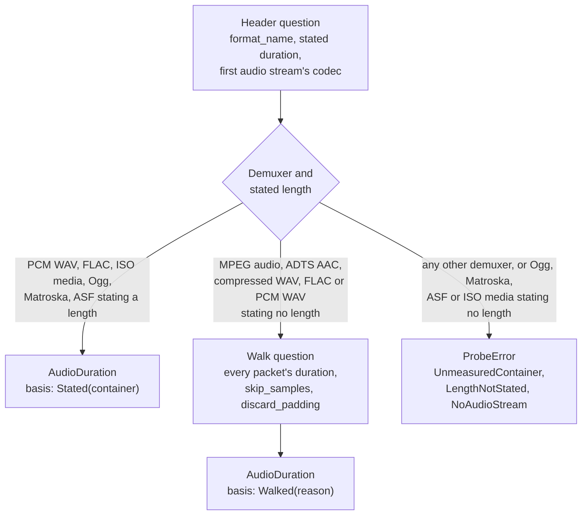

# Media Conversion

**Status:** Current
**Last updated:** 2026-09-30 10:16 EDT

## Overview

Batchalign commands that process audio (`align`, `transcribe`, `opensmile`,
`avqi`, `benchmark`) must resolve a media file for each input. Depending on the
command, Rust then either prepares typed PCM artifacts for worker-protocol V2
execution or passes through a normalized media path to a provider-specific
engine. Container formats that downstream audio libraries cannot read,
primarily **MP4**: must first be converted to WAV via ffmpeg.

This conversion is automatic, cached, and transparent to the user.

## Formats

| Extension | Can `soundfile` read? | Conversion needed? |
|-----------|:---------------------:|:------------------:|
| `.wav`    | Yes | No  |
| `.mp3`    | Yes | No  |
| `.flac`   | Yes | No  |
| `.ogg`    | Yes | No  |
| `.mp4`    | **No** | **Yes** |
| `.m4a`    | **No** | **Yes** |
| `.webm`   | **No** | **Yes** |
| `.wma`    | **No** | **Yes** |

The canonical list of forced-conversion extensions is defined in
`crates/batchalign/src/ensure_wav.rs::FORCED_CONVERSION`.

## Align Pipeline End-to-End

The `align` command has the most complex media handling. Here is the
complete pipeline, from CLI invocation to output CHAT, showing where
media resolution and conversion fit in.

```text
batchalign3 [--server http://<your-server>:8001] align input/ output/ --lang eng
  │
  ├─ CLI: discover .cha files in input/ (sorted largest-first)
  ├─ CLI: detect dispatch mode
  │     paths_mode / execution-host local: audio sits alongside .cha files
  │     content mode: .cha text POSTed, server resolves media from its own view
  │
  ├─ Server: POST /jobs/submit → create job (Queued → Running)
  │
  │  ┌──── For each .cha file (sequential, each has its own audio) ────┐
  │  │                                                                   │
  │  │  1. PARSE                                                         │
  │  │     parse_lenient() → ChatFile AST                                │
  │  │     pre-validate (MainTierValid)                                  │
  │  │                                                                   │
  │  │  2. MEDIA RESOLUTION                                              │
  │  │     paths_mode:                                                   │
  │  │       look alongside .cha for matching stem with known extensions │
  │  │     content mode / shared-fs remap:                               │
  │  │       trust server-visible local paths only                       │
  │  │       source_dir when the server shares that filesystem           │
  │  │       or local media_mappings / explicit --media-dir             │
  │  │                                                                   │
  │  │  3. MEDIA CONVERSION (ensure_wav)                ◄── THIS STEP    │
  │  │     .wav/.mp3/.flac/.ogg → pass through unchanged                │
  │  │     .mp4/.m4a/.webm/.wma → ffmpeg convert to WAV, cache result   │
  │  │       fingerprint: full-file BLAKE3 + versioned recipe    │
  │  │       cache dir: platform data_dir/batchalign3/media_cache/      │
  │  │       file lock: per-fingerprint .lock prevents concurrent ffmpeg │
  │  │       output: 16kHz mono PCM_S16LE WAV                           │
  │  │                                                                   │
  │  │  4. AUDIO IDENTITY                                                │
  │  │     compute_audio_identity(path, mtime, size)                     │
  │  │     used as cache key component for FA results                    │
  │  │                                                                   │
  │  │  5. AUDIO DURATION PROBE                                          │
  │  │     MediaProbe → AudioDuration (stated or packet-walked, never    │
  │  │     a bitrate estimate); bounds every window, token and timing    │
  │  │     and estimates untimed utterances                              │
  │  │                                                                   │
  │  │  6. GROUP UTTERANCES                                              │
  │  │     split into ~20s time windows (Whisper) or ~15s (Wave2Vec)    │
  │  │                                                                   │
  │  │  7. CACHE LOOKUP                                                  │
  │  │     BLAKE3(words + audio_identity + time_window + engine)         │
  │  │     hits → skip worker IPC                                        │
  │  │                                                                   │
  │  │  8. FA INFERENCE (cache misses only)                              │
  │  │     checkout worker from pool                                     │
  │  │     execute_v2(task="fa", prepared_audio + prepared_text)         │
  │  │     Python reads prepared artifacts → model inference             │
  │  │     returns raw timings                                           │
  │  │                                                                   │
  │  │  9. DP ALIGNMENT                                                  │
  │  │     Hirschberg align model tokens → transcript words              │
  │  │     convert chunk-relative → file-absolute milliseconds           │
  │  │                                                                   │
  │  │  10. POST-PROCESSING                                              │
  │  │      inject timings → chain word ends → update bullets            │
  │  │      generate %wor tier → monotonicity check (E362)               │
  │  │      same-speaker overlap enforcement (E704)                      │
  │  │                                                                   │
  │  │  11. SERIALIZE                                                    │
  │  │      validate → to_chat_string() → write output .cha             │
  │  │                                                                   │
  │  └───────────────────────────────────────────────────────────────────┘
  │
  └─ CLI: poll /jobs/{id}/results → write output files
```

## ensure_wav: Conversion Cache

**Module:** `crates/batchalign/src/ensure_wav.rs`

Implements content-fingerprinted WAV conversion with file-locking and atomic writes.

### Algorithm

1. **Check extension**: if `.wav`/`.mp3`/`.flac`/`.ogg`, return unchanged.
2. **Check ffmpeg**: if not on PATH, return a clear error with install hint.
3. **Fingerprint**: stream every source byte through BLAKE3 and retain its full
   digest in the `whole-pcm16-mono16k-strict-v3` recipe namespace. This reads
   the complete file with bounded memory; same-size edits in the middle of a
   recording cannot reuse the old key. Segment keys additionally bind the
   requested time window in their own strict-recipe namespace.
4. **Cache lookup**: check the media cache directory for
   `{fingerprint}.wav`. If it exists, return immediately (cache hit).
5. **Lock**: acquire exclusive `fs2` file lock on `{fingerprint}.wav.lock`
   to prevent concurrent ffmpeg invocations for the same source file. This
   is important for parallel FA processing where multiple groups reference
   the same audio.
6. **Re-check**: another task may have completed conversion while we waited.
7. **Convert**: `ffmpeg -y -nostdin -v error -i source -acodec pcm_s16le -ar 16000 -ac 1 tmp.wav`.
   The locked slot becomes a produced slot only after its own temporary path
   passes conversion admission (see Error Handling).
8. **Atomic rename**: publish the produced slot while retaining its lock;
   release the lock only after the rename succeeds.

### ffmpeg Arguments

| Flag | Purpose |
|------|---------|
| `-y` | Overwrite output without asking |
| `-nostdin` | Prevent an unattended conversion from consuming terminal input |
| `-v error` | Emit error diagnostics, which trigger the damage check |
| `-i source` | Input file (mp4, m4a, etc.) |
| `-acodec pcm_s16le` | 16-bit signed PCM (what soundfile reads natively) |
| `-ar 16000` | 16 kHz sample rate (FA/ASR model input rate) |
| `-ac 1` | Mono (models expect single channel) |

### Cache Management

```bash
# Default cache location
ls ~/Library/Application\\ Support/batchalign3/media_cache/

# Or relocate it for isolated runs
export BATCHALIGN_MEDIA_CACHE_DIR=/tmp/ba-media-cache

# Inspect or clear both analysis + media caches
batchalign3 cache stats
batchalign3 cache clear --yes
```

### Where ensure_wav Is Called

`ensure_wav` is called in four dispatch paths, always **after** media
resolution and **before** the audio path is passed to Python workers:

| Dispatch Path | File | Purpose |
|---------------|------|---------|
| FA (align) | `runner/dispatch/fa_pipeline.rs` | Before audio identity + FA inference |
| Transcribe | `runner/dispatch/transcribe_pipeline.rs` | Before ASR inference |
| Benchmark | `runner/dispatch/benchmark_pipeline.rs:process_one_benchmark_file` | Before Rust benchmark orchestration dispatches ASR |
| Media analysis | `runner/dispatch/media_analysis_v2.rs` | Before openSMILE/AVQI prepared-audio execution |

### Error Handling

Whole-file and segment conversions report decoding errors at error level
and decode through them. A decode that reported nothing is clean. A decode
that reported errors is admitted only when it lost no audio: the source's
declared length for the requested span (probed with `ffprobe`, clipped to
the source's end for a window) and the decoded length must agree within
`DAMAGE_SHORTFALL_TOLERANCE_MS` (100 ms). The source's length is the
`MediaProbe` measurement described under
[Recording Duration](#recording-duration-mediaprobe). Such a decode is admitted as
`DecodeIntegrity::ConcealedDamage`, carrying ffmpeg's diagnostics and both
lengths, and logged as a warning. A shortfall beyond the tolerance
(`DamagedAudioLost`) means ffmpeg dropped audio, which would shift every
later timing, so it is refused; so is a damaged decode whose lengths cannot
be measured (`DamageUnmeasured`). A refused conversion's partial output is
removed; it cannot be published.

Until 2026-09-24 conversions ran with `-xerror` and refused any diagnostic,
which refused recordings whose damaged AAC packets are concealed without
losing a sample. A clean decode's bytes are identical with or without
`-xerror`, so the `strict-v3` cache namespace is unchanged and its entries
stay valid. A concealed-damage conversion is warned about when it is made;
a later cache hit of it does not repeat the warning. This does not certify
preexisting cache bytes or media formats passed through without conversion.

If conversion fails, the file is marked with a clear error:

```text
Media conversion failed for ACWT01a.cha: ffmpeg not found in PATH.
Hint: install ffmpeg (https://ffmpeg.org/download.html) or convert
your input audio to .wav beforehand.
```

or:

```text
Media conversion failed for example.cha: ffmpeg conversion failed
for /path/to/media/example.mp4: [stderr]
```

The job continues processing remaining files, one conversion failure
does not abort the entire job.

## Recording Duration (MediaProbe)

**Module:** `crates/batchalign/src/media/probe/`

Every bound BA3 places on a recording comes from one value,
`media::probe::AudioDuration`, and only `MediaProbe::duration()` (or its
blocking twin) can build one. It carries the length, rounded UP to the
millisecond so the bound covers the audio's last instant, and its basis: how
the length was established. A zero length is refused where it is born
(`ProbeError::EmptyAudio`), so `Recording::of_audio` cannot fail.

### Why there are two questions

Until 2026-09-30 the probe asked ffprobe one question, `format=duration`, and
trusted the answer for every file. For some demuxers that number is not read
from the file but ESTIMATED from the file size over the declared bitrate: MPEG
audio without a Xing/Info header, and ADTS AAC always. A constant-bitrate MP3
whose frames are never padded (417 bytes each at 128 kbit/s and 44.1 kHz,
where the bitrate implies 417.96) really runs at 127.7 kbit/s, so the estimate
falls 0.23% short: about 10 s on an hour-long recording, 30 s on four hours.
Every consumer took the end of the estimate as the end of the recording, so
the true final seconds were refused as "outside the recording": their ASR
tokens discarded before UTR (`ASR tokens discarded before UTR ...
outside_window=N`), their FA timings refused (`engine reported word timings
past the end of the audio it was given`), and the final FA window cut short.



### The routing table

| Demuxer (ffprobe `format_name`) | Stated length | Route |
|---|---|---|
| `mp3` (MPEG audio, all layers and versions) | ignored | walk |
| `aac` (ADTS) | ignored | walk |
| `wav` with a compressed codec | ignored | walk |
| `wav` with PCM, `flac` | present | stated (audio stream) |
| `wav` with PCM, `flac` | absent | walk |
| `mov,mp4,m4a,3gp,3g2,mj2`, `ogg` | present | stated (audio stream) |
| `matroska,webm`, `asf` | present | stated (whole file) |
| ISO media, `ogg`, `matroska,webm`, `asf` | absent | refused (`LengthNotStated`) |
| anything else | any | refused (`UnmeasuredContainer`) |

"Audio stream" means the first audio stream's own stated length, not the
file's: an MP4 whose video runs past its audio states 10 s for the file and 6 s
for the audio, and the audio's is the one taken. Matroska and ASF state no
per-stream length (ASF's stream entry repeats the file's), so theirs is the
whole file's: exact for audio-only files, an upper bound when video runs
longer.

Every row was measured against a full ffmpeg decode (2026-09-30, ffmpeg
9.0.2). Stated lengths: WAV, FLAC and ISO media agree to the millisecond, Ogg
and Matroska within 10 ms, ASF 46 ms long; none falls short. MPEG audio is
walked even when a Xing header states a length, because that header is an
encoder's claim a truncated or concatenated file contradicts, and ffprobe does
not say whether it printed a count or an estimate. The walk is NOT a fallback
for Matroska and ASF: their packets summed 0.3 s short of the decode, so a
file of theirs that states no length is refused. A new demuxer is admitted by
repeating the measurement, never by default; the boundary test
`stated_lengths_agree_with_a_full_decode` repeats it for every stating
container on each host that runs the tests.

### The packet walk

The walk sums every audio packet's `duration` in the stream's time base and
subtracts the samples the decoder trims (`skip_samples` for encoder delay,
`discard_padding` for end padding, reported as packet side data). Summing
durations rather than multiplying a packet count by a frame size needs no
samples-per-frame table (1152 for MPEG-1 Layer III, 576 for MPEG-2 and 2.5)
and no constant-bitrate assumption. Without the trim subtraction a LAME file
with an Info header would run one frame long (29 ms at 44.1 kHz, 210 ms at
8 kHz); with it the result equals the decoded sample count. The arithmetic is
exact, checked 128-bit rational arithmetic, and a packet without a duration
refuses the walk (`PacketsWithoutDuration`) rather than returning a lower
bound. The walk measures the timeline a decoder produces: bytes the demuxer
skips while resynchronizing past garbage never become packets, so they are
missing from the walk and the decode alike, and damage admission (above)
cannot see them either.

A walk demuxes the whole file without decoding it. Measured on a 2-hour,
115 MB, 128 kbit/s MP3 on an NFS volume with its pages already cached: ffprobe
alone takes 0.36 s; in-process, including reading ffprobe's JSON (about 11 MB
for 2.5 hours), 2.6 s in a debug build. An uncached file adds one sequential
read of the file. The pipeline probes each file ONCE: `fa_pipeline` measures
`audio_path` and hands the same `AudioDuration` to the UTR pass
(`UtrPassContext::audio_duration`) and to FA (`AudioContext::audio_duration`);
only a failed first probe is retried, by `AudioContext::recording`. There is
no cross-job probe cache.

### Consumers

All of them receive the `AudioDuration`, or a `Recording` built from it by
`Recording::of_audio`:

- **Window admission.** `FaWindow::within` refuses a window ending past the
  recording (`WindowFault::PastRecording`); FA grouping extends the final group
  to the recording's end and clamps window bounds to it
  (`Recording::clamp_bound`).
- **UTR.** Partial-window UTR builds its windows against the recording, and
  every recovered ASR token is admitted only inside it (the
  `ASR tokens discarded before UTR` line counts the rest). The two-pass
  strategy's grouping comparison groups against the same recording
  (`GroupingContext::recording`).
- **FA timings.** Engine word timings past the window, and so past the
  recording, are refused rather than written.
- **Damage admission.** A decode that reported errors is compared with the
  source's probed length for the requested span (above).
- **ASR decode budget.** The request timeout is derived from the probed
  length (`DecodeBudgetSeconds::for_duration_ms`).

`Recording::of_duration` still takes raw milliseconds, for fixtures and
replay tests that state a length rather than measure one; production code
builds recordings with `Recording::of_audio`.

## Media Resolution

Before conversion can happen, the server must find the audio file.
Resolution depends on the dispatch mode:

### paths_mode / execution-host local

Audio files sit alongside the `.cha` files in the input directory. The
server looks for a file with the same stem and a known media extension:

```text
input/ACWT01a.cha  →  input/ACWT01a.mp4  (or .wav, .mp3, etc.)
```

### `--server` on this machine (loopback)

For every command, an explicit loopback `--server` submits filesystem paths
via `paths_mode`:

- `source_paths`: absolute input paths the server must be able to read
- `output_paths`: absolute output paths the server must be able to write

Media is resolved from the execution host's own view, as above.

### `--server` on another host (content mode)

Only transcript-input commands reach a remote server, and the CLI posts the
transcript text; recording-input commands are refused before anything is
sent. The server resolves media from server-visible places only, in the
order given on [Server Mode](../user-guide/server-mode.md#how-the-server-finds-a-recording);
a client's private directory layout is never dereferenced, so a recording
that exists only on the client cannot be used.

### Names are matched exactly

Every place is searched by comparing names as strings against a listing of
the directory, never by asking the filesystem whether a path exists. So
`ACWT01a` finds `ACWT01a.mp4` and does not find `acwt01a.mp4`, `ACWT01a.MP4`,
or a spelling of the name in another Unicode form. A file that differs only in
letter case or Unicode form is reported as a near miss, never used. The
reasons, the messages and how to fix them are on
[File Name Matching](file-name-matching.md).

## MP4 Media on Network Volumes

Total: **16,739 MP4 files** across all volumes.

| Volume | MP4 | MP3 | WAV |
|--------|----:|----:|----:|
| CHILDES | 7,988 | 20,924 | 11,042 |
| aphasia | 2,973 | 3,140 | 601 |
| ca | 1,801 | 4,696 | 4,139 |
| phon | 1,437 | 9,312 | 9,018 |
| fluency | 1,217 | 1,124 | 58 |
| class | 438 | 26 | 19 |
| tbi | 262 | 145 | 149 |
| rhd | 198 | 42 | 51 |
| asd | 101 | 47 | 37 |
| slabank | 83 | 5,478 | 3,649 |
| open | 82 | 0 | 0 |
| homebank | 65 | 2,320 | 22,455 |
| psychosis | 36 | 979 | 479 |
| samtale | 20 | 73 | 72 |
| dementia | 15 | 6,117 | 2,456 |
| psyling | 13 | 0 | 0 |
| biling | 0 | 315 | 228 |
| motor | 0 | 0 | 0 |

## Benchmarking Considerations

- **First run on MP4 files**: includes WAV conversion time (~seconds per
  file depending on duration)
- **Subsequent runs**: WAV is cached, no conversion overhead
- **For fair benchmarks**: either use `--override-media-cache` or ensure both
  old/new runs have the same cache state (warm or cold)
- **For %wor-only fixes**: conversion cache is irrelevant since the audio
  doesn't change. FA cache keys include audio identity, so same audio =
  same cached alignment.
- **Re-alignment scenario**: if re-aligning files that already had
  alignment, both the FA cache and the media conversion cache will be
  warm. Use `--override-media-cache` for cold-start numbers.

## Dependencies

- **ffmpeg** must be on PATH for mp4/m4a/webm/wma conversion. Without it,
  those formats fail with a clear error. WAV/MP3/FLAC/OGG work without
  ffmpeg.
- **ffprobe** (bundled with ffmpeg) establishes every recording's duration
  (see [Recording Duration](#recording-duration-mediaprobe)). `align` cannot
  bound its windows without it and fails the file with a host error when it
  is missing; the transcribe path falls back to a named decode-budget ceiling.
- **blake3** crate for content fingerprinting.
- **fs2** crate for cross-platform file locking.
