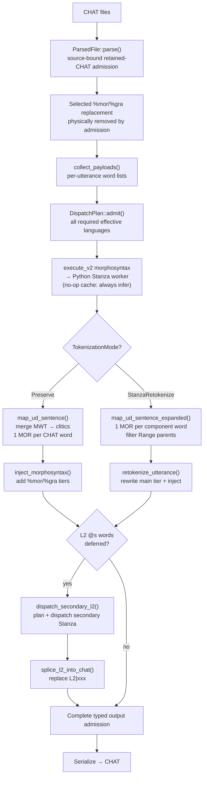
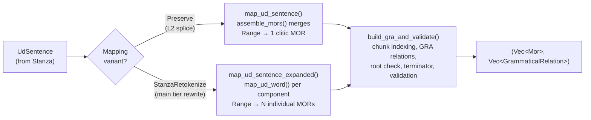

# Morphosyntax Pipeline

**Status:** Current
**Last updated:** 2026-10-04 15:23 EDT

## 1. Overview

The batchalign morphosyntax pipeline (`morphotag` command) adds %mor and %gra tiers to
CHAT transcripts.  Rust owns CHAT parsing, word extraction, UD-to-CHAT mapping, AST
injection, and serialization.  Python's only role is ML inference, calling Stanza for
POS/lemma/dependency analysis.

### Completion and refusal

A successful morphotag file must cover every utterance submitted for analysis.
Correct response cardinality alone is insufficient: an empty model response,
invalid dependency structure, failed word mapping or failed tier injection
refuses that file. Other files in the job can continue. No incomplete CHAT
output or success provenance is published for the refused file.

`MatchedMorphosyntaxResponses::inject` returns a producer-constructed
`InjectionResult` only after all requested utterances complete. Its typed
`InjectionError::Incomplete` retains the affected utterance's decision and
diagnostic. Both ordinary and incremental orchestration consume this same
completion boundary before advancing to applied analysis. Callers must discard
the partially modified in-memory destination on error.
Orchestration retains the typed failure as `ServerError::MorphosyntaxInjection`,
classified as a system/analysis failure rather than invalid submitted CHAT.
It does not automatically retry the same incomplete analysis.

Before either primary injection or secondary-language merging, the worker
boundary consumes the raw `UdResponse` into `AdmittedUdResponse`: explicitly
no sentence, or one entire sentence. Multiple sentences for one submitted
utterance or secondary span are refused, never silently reduced to the first.
Empty admission does not establish lexical completion. Special-form synthesis
and the documented optional secondary-language placeholders remain distinct
policies; secondary failure cannot introduce truncated analysis into the merge.
Malformed worker results and mismatched response counts are analysis/system
failures, not advice to repair otherwise valid CHAT.

Direct Rust clients retain the raw `UdResponse` wire representation.
`MatchedMorphosyntaxResponses::new` now returns `ResponseAdmissionError` for
either batch-count or per-item sentence-count failure; its `responses()`
accessor borrows admitted analyses, not raw mutable sentence vectors.
Producers can use `AdmittedUdResponse::try_from` and pair those proofs using
`MatchedMorphosyntaxResponses::from_admitted` without checking them again.
The injection convenience API remains unchanged. No CHAT/JSON output format
or model wire schema changes. Protocol-double tests prove these refusal
boundaries; they do not establish a real model regression or linguistic accuracy.

Utterances that legitimately have no analyzable lexical content are a distinct
case, not a model failure. Documented special-form synthesis and secondary-
language placeholder policies remain explicit; they are not fallbacks for
missing analysis of ordinary lexical words.

Placeholder identity comes from a collected word's typed role, never from its
spelling. A literal lexical word such as `xbxxx` or `xbxxxness` is ordinary
model input even when another word in the utterance is a genuine masked form.
For example, `boom@o` receives the explicit onomatopoeic category `on|boom`;
it does not authorize reinterpreting a neighboring literal word as a form.
The same rule applies to selected replacement targets and to words remaining
after retrace exclusion, in both preservation and retokenization modes.

### Transcriber part-of-speech hints

By default, `$POS` hints override the selected word's model POS category;
`--no-pos-hints` leaves the model category unchanged. Hint collection uses
Chatter's canonical morphology positions, not a separate lexical counter.
Excluded fillers, fragments and `xxx` consume no position; commas retain their
morphology slots. For replacements, the selected replacement targets supply
the hints, not the replaced surface word. Retokenization maps these typed
source positions to generated morphology items before applying the hints.
Incremental reuse compares the same selected hints, so changing a replacement
target's hint requires fresh analysis even when cleaned words are unchanged.

### Language capability admission

CHAT validity and model availability are separate judgments. An unsupported
primary `@Languages` declaration refuses analysis as `analysis_unavailable`,
not invalid CHAT; this file-level policy also applies to nonlexical input.
Do not change truthful language declarations to get a different model to run.
CA pass-through declines analysis before this boundary and remains fully
source-admitted.

The canonical payload collector selects outstanding work, including each
utterance's effective `[- LANG]` precode. `DispatchPlan` binds these exact
payloads to their worker pool and admits every language against its runtime
Stanza registry before dispatching any group. Missing registry or required
processors produces a typed, non-retryable `ServerError::AnalysisUnavailable`
(HTTP 412). A mixed file with any unavailable required analysis publishes no
partial CHAT. Unsupported utterance languages cannot obtain empty successful
responses or borrow the secondary-word placeholder policy.

Incremental compatible, complete prior `%mor`/`%gra` pairs discharge their
utterance's analysis obligation without requiring that utterance's model.
Missing or incompatible pairs still require capability admission. Per-word
and span `@s` secondary analysis retains its explicit `L2|xxx` policy below.
Prior reuse does not override the separate file-level primary-header support
policy.

### Per-file scoping via `@Options`

`morphotag` reads two CHAT-level directives, both with narrow,
command-specific semantics:

- **`@Options: CA`**: "the morphotag command is not to be run on
  this file." CA transcripts are pass-through: existing %mor /
  %gra is preserved unchanged, no Stanza inference, no provenance
  comment.
- **`@Options: NoAlign`**: scoped to the `align` command, NOT
  morphotag. NoAlign files run morphotag normally. (Pre-2026-05-07
  the pipeline incorrectly conflated NoAlign with a global skip,
  leaving NoAlign files with stale morphotag and no rerun path;
  fixed.)

Full semantics + worked examples: [`@Options` and Per-File Command
Scoping](./chat-options.md).

## 2. Architecture



The diagram shows the two injection paths that diverge based on
`TokenizationMode`. The L2 secondary dispatch runs after primary
injection by default; pass `--no-l2-morphotag` to skip it.

**Cache note:** Outstanding morphosyntax work uses a **no-op cache** and is
sent to Stanza inference. Incremental complete-pair reuse is a separate,
source-admitted operation, not an inference-cache hit. Workers stay warm
across files handled by the bounded per-file dispatcher. Audio tasks (transcribe, align)
use real caching; text tasks (morphosyntax, utseg, translate) do not.

### Data Flow

```text
Rust entry point: `crates/batchalign/src/morphosyntax/mod.rs::run_morphosyntax_impl`
  │
  ├── Source-bound retained-CHAT admission (tree-sitter, once per file)
  │     physically removes selected %mor/%gra before admitting retained CHAT
  │
  ├── collect_payloads(): extract utterance word lists globally, one
  │     CollectedUtterance each (its line, its ordinal, the item sent and
  │     the words its analysis is injected into)
  │     (talkbank-transform::morphosyntax::payload)
  │
  ├── Batch infer (all utterances pool → one Stanza call per language;
  │     the inference layer sees only the items sent, so secondary `@s`
  │     spans dispatch bare items, with no utterance position to invent)
  │     ├── Group by language, dispatch concurrently
  │     ├── Python worker (batchalign/inference/morphosyntax.py)
  │     │     • Replace special forms with "xbxxx"
  │     │     • nlp(combined_text) → Stanza UD analysis
  │     │     • Return raw UD results as JSON
  │     └── Repartition responses back by file
  │
  ├── map_ud_sentence() or map_ud_sentence_expanded()
  │     → %mor/%gra (UD→CHAT mapping, Rust)
  │     (talkbank-transform::morphosyntax::sentence_mapping)
  │
  ├── inject_results(): AST injection + validation
  │     (talkbank-transform::morphosyntax::injection)
  │
  ├── dispatch_secondary_l2() (if `@s` words and not `--no-l2-morphotag`)
  │     → transform-layer plan, secondary dispatch, merge, splice
  │     (crates/batchalign/src/morphosyntax/batch.rs)
  │
  ├── apply_pos_hint_evidence() (unless --no-pos-hints)
  │     → transcriber `$POS` annotations override POS categories
  │     (talkbank-transform::morphosyntax::pos_hints)
  │
  ├── remove_empty_morphosyntax_placeholders()
  │     → sweep serialize-time empty %mor/%gra slots
  │     (talkbank-transform::morphosyntax::pos_hints)
  │
  └── Serialize → CHAT (now with %mor/%gra, L2 morphology, POS hints)
```

### Module Inventory

**Rust:** `batchalign-transform` crate (`crates/batchalign-transform/src/`)

The core morphosyntax pipeline logic lives in `talkbank-transform`. Most files
handle CHAT-side extraction, UD→CHAT mapping, and injection. The
`batchalign` crate orchestrates; `talkbank-transform` implements.

| File | Purpose |
|------|---------|
| `parse.rs` | `parse_lenient()`: top-level CHAT parsing entry point |
| `extract.rs` | `ExtractedWord` struct + word extraction from AST for morphosyntax input |
| `inject.rs` | `inject_morphosyntax()`: primary AST injection of %mor / %gra tiers |
| `morphosyntax/injection.rs` | `inject_results()`: orchestration helper called by the batch pipeline |
| `morphosyntax/payload.rs` | `clear_morphosyntax()`, `collect_payloads()` and its `CollectedUtterance` records |
| `morphosyntax/alignment.rs` | `UdTokens::walk()` (the one walk of a sentence), `UdAlignment` |
| `morphosyntax/sentence_mapping.rs` | `map_tokens()` over the walk, `map_ud_sentence()`, `map_ud_sentence_expanded()`, shared `build_gra_and_validate()` |
| `morphosyntax/gra_validate.rs` | `validate_generated_gra()`: single-root, cycle-free, valid-heads checks |
| `morphosyntax/mapping_helpers.rs` | `assemble_mors()` (clitic merge), `is_clitic()`, `map_relation()` |
| `morphosyntax/stanza_raw.rs` | Parse raw Stanza JSON output, supply defaults for Range token annotation fields |
| `morphosyntax/pos_hints.rs` | `apply_pos_hints()` and the empty-placeholder sweep |
| `morphosyntax/l2/` | L2 code-switching: planning, extract, merge, splice @s words via secondary Stanza models |
| `morphosyntax/lang_en.rs` | English-specific rules (irregular verbs, irrealis annotations) |
| `morphosyntax/lang_fr.rs` | French-specific rules (pronoun case, APM) |
| `morphosyntax/lang_ja.rs` | Japanese-specific rules (verb form overrides) |
| `morphosyntax/lang_it.rs` | Italian-specific rules |
| `retokenize/`, `retokenize.rs` | AST retokenization (Stanza-tokens rewrite); see Section 7 |
| `dp_align/` | Hirschberg DP alignment used by retokenize |

**Rust**: `batchalign` crate (`crates/batchalign/src/`)

The batchalign crate owns command orchestration; the morphosyntax-specific
glue is:

| File | Purpose |
|------|---------|
| `morphosyntax/mod.rs` | `run_morphosyntax_impl()`: top-level orchestrator called from the `morphotag` command |
| `morphosyntax/batch.rs` | `dispatch_secondary_l2()`: async wrapper that calls into the transform-layer L2 seam for secondary @s dispatch |
| `morphosyntax/worker.rs` | Runtime-admitted, payload-bound `DispatchPlan` and Stanza-pool dispatch |
| `chat_ops/nlp/mapping/mod.rs` | Re-export shim: `pub use talkbank_transform::morphosyntax::*`: historical alias kept so existing imports keep resolving. New code should import from `talkbank_transform` directly. |
| `chat_ops/nlp/types.rs` | FA-only raw-response types (`FaRawToken`, `FaIndexedTiming`, `FaRawResponse`); the UD/NLP type set (`UdSentence`, `UdWord`, `UdId`, etc.) lives in `talkbank_transform::morphosyntax`. |

**Python** (stateless ML inference only)

| File | Purpose |
|------|---------|
| `inference/morphosyntax.py` | Calls Stanza `nlp()`, returns raw `to_dict()` output |
| `worker/_infer_hosts.py` | Worker-side host wrapper invoked by `execute_v2` |

Python does no orchestration, caching, or UD→CHAT mapping, all handled by Rust.

## 3. What Batchalign Needs from %mor

Batchalign treats %mor tiers as mostly opaque.  No pipeline decomposes POS, lemma, or
features into structured data for analysis.  The consumers and what they actually access:

| Consumer | What it accesses | Decomposes POS/lemma/features? |
|----------|-----------------|-------------------------------|
| **Cache** (`engine.py`) | Final %mor/%gra strings (BLAKE3 key) | No, stores/retrieves whole strings |
| **Coreference** (`coref`) | Token boundaries in %mor tier | No, counts tokens only |
| **WER evaluation** (`benchmark`) | Token count from %mor for word-level accuracy | No, counts only |
| **Pre-serialization validation** (`validation.py`) | Chunk count alignment (%mor chunks vs %gra relations) | No, calls `count_chunks()` in Rust |
| **CLAN commands** (talkbank-clan crate in talkbank-tools) | Full %mor structure (POS, lemma, suffixes for FREQ/MLU/MLT) | Yes, but via talkbank-model's Mor type |
| **Forced alignment** | No %mor access | N/A |
| **ASR / diarization** | No %mor access | N/A |

**Key finding:** Within batchalign itself, %mor is a cached final string.  The pipeline
generates it (via Stanza + Rust mapping), stores it, and injects it into the AST, but
never reads it back to extract linguistic information.  Downstream consumers that do
decompose %mor (CLAN commands) do so through `talkbank-model`'s typed `Mor` structure, not
through batchalign code.

**Implication for the format:** The flat `POS|lemma[-Feature]*` structure that Stanza
produces is sufficient for batchalign's needs.  Richer UD `key=value` features flow through
the pipeline without code changes, they'd be encoded as CHAT suffixes by `mapping.rs` and
round-tripped by the parser, but no batchalign consumer currently needs them.

## 4. Two MOR Traditions

%mor tiers in CHAT come from two fundamentally different sources, and understanding which
one batchalign produces is key to assessing "information loss."

### CLAN MOR Grammars (Legacy)

Hand-coded per-language grammars, maintained since the 1990s.  They produce rich
morphological structure:

- **Subcategorized POS:** `pro:sub|I`, `n:prop|John`, `v:cop|be`
- **Compounds:** `adj|+adj|big+n|bird` (structured multi-stem words)
- **Prefixes:** `trans#n|port`
- **Morpheme segmentation:** `go&PAST` (fusional) vs `cat-PL` (agglutinative)
- **Language-specific affix inventories** hand-coded per grammar

These grammars are incomplete (not all languages covered), inconsistent across languages,
and require manual maintenance.  They encode a specific morphological theory baked into
each grammar file.

### Stanza UD (What Batchalign Produces)

Automatically trained models producing Universal Dependencies analysis for 70+ languages:

- **Flat UPOS:** `pron|I`, `propn|John`, `aux|be`
- **Lemma + feature list:** `verb|go-Past`, `noun|cat-Plur`
- **MWT clitics:** `pron|I~aux|will`
- **No compounds, no prefixes, no morpheme segmentation**
- **Consistent cross-linguistic feature inventory** (UD standard)
- **Richer dependency structures** (%gra from UD is genuinely better than what CLAN produced)

### What the Model Looks Like

The shared `talkbank-model` `Mor` type:

```rust,ignore
struct Mor {
    main: MorWord,
    post_clitics: SmallVec<[MorWord; 2]>,
}

struct MorWord {
    pos: PosCategory,                      // "noun", "verb", "pron", ...
    lemma: MorStem,                        // cleaned stem text
    features: SmallVec<[MorFeature; 4]>,   // flat ordered list
}
```

Three fields per word: POS (string), lemma (string), features (ordered vector of
strings).  This maps cleanly to what Stanza produces, `UPOS` to `pos`, `lemma` to
`lemma`, UD feature values to `features`, MWT components to `post_clitics`.

### What's "Lost"

| Structure | Legacy MOR grammar | Stanza UD | Model representation |
|-----------|-------------------|-----------|---------------------|
| POS subcategories | `pro:sub\|I` | `pron\|I` | POS string, subcategories preserved if present (parser accepts `pro:sub`) |
| Compounds | `adj\|+adj\|big+n\|bird` | Not produced | Parsed by grammar if encountered; no typed compound field |
| Prefixes | `trans#n\|port` | Not produced | Parsed by grammar if encountered; stored in stem |
| Morpheme segmentation | `go&PAST` vs `go-PAST` | Not produced | Both parsed; suffix carries separator character |
| UD feature keys | N/A | `Number=Plur` | `MorFeature` has optional key field, preserved if present |
| xpos (language-specific POS) | N/A | Available in Stanza | Discarded, only UPOS used |

The structures that the model doesn't have typed fields for, compounds, prefixes,
morpheme boundaries, are structures that **Stanza never produces**.  The model was shaped
to match the producer.

### Freedom from CLAN MOR Constraints

This is mostly a good thing:

- **Cross-linguistic consistency.** CLAN MOR grammars varied wildly per language.  UD gives
  the same feature inventory everywhere.
- **No manual grammar maintenance.** Stanza models are trained automatically.  Adding a
  language means training a model, not writing a grammar by hand.
- **Better dependency analysis.** UD %gra is more accurate than what CLAN
  produced, the Rust mapper's O(N) cycle detection catches malformed-head
  structures that earlier CLAN-era pipelines silently accepted.
- **Feature transparency.** UD features like `Number=Plur` are semantically meaningful
  and machine-readable.  CLAN suffixes like `-PL` required per-grammar documentation.

### The CLAN Caveat

CLAN commands (`FREQ`, `MLU`, `MLT`) access %mor through `talkbank-model`'s `Mor` type.
For counting (MLU) and frequency (FREQ), the flat `pos + lemma + features` structure is
sufficient.  For fine-grained morphological queries on legacy corpus data, "find all
compound nouns", "count prefixed verbs", you'd currently have to pattern-match on the POS
string (e.g., `n:prop` contains `:`) or lemma, which works but isn't ideal.

Should the model grow structured compound/prefix/subcategory fields?  Not urgently.
The flat model serves all current use cases, and enriching it would be additive (no
breakage).  Now that batchalign shares `talkbank-model` via path dependencies (no more
vendored copy), any such enrichment is a shared decision visible in talkbank-tools's review
process, the right place for it to happen.

## 5. UD-to-CHAT Mapping

Absorbed from the former `mor-gra-generation.md`.  The mapping lives in
`crates/batchalign-transform/src/morphosyntax/`, with the main entry point being
`sentence_mapping.rs::map_ud_sentence`.

### Pipeline

```text
Main tier words
    ↓
Stanza NLP (Python worker, `worker/_infer_hosts.py` → `inference/morphosyntax.py`)
    ↓  produces UdSentence { words: Vec<UdWord> }
    ↓  each UdWord has: id, text, lemma, upos, feats, head, deprel
    ↓
UdTokens::walk() (Rust, talkbank-transform::morphosyntax::alignment)
    ↓  the one walk of the sentence: top-level tokens, validated
map_tokens() (talkbank-transform::morphosyntax::sentence_mapping)
    ↓  produces %mor items and their %gra relations, with each token's items
    ↓
Post-construction validation (gra_validate.rs::validate_generated_gra)
    ↓  rejects if chunk count != gra count, single-root violated, or cycle detected
    ↓
inject_morphosyntax() (talkbank-transform::inject) /
inject_results()      (talkbank-transform::morphosyntax::injection)
    ↓  writes %mor and %gra tiers into the AST
    ↓
CHAT serialization
```

### MOR Generation: Two Mapping Variants

The mapper, `map_tokens`, consumes the walked tokens (`UdTokens`) in one of
two layouts (`ItemLayout`) that differ only in how a multi-word token becomes
items; `map_ud_sentence()` and `map_ud_sentence_expanded()` are the two
layouts applied to a sentence they walk. Both share identical GRA/validation
logic via the internal `build_gra_and_validate()` helper, and the result
(`MappedTokens`) records which items each token produced, so a CHAT word
aligned to a token finds its items without counting.



**`map_ud_sentence()`**: Preserve mode and L2 splice. Produces one `Mor`
item per CHAT word. MWT Range tokens are merged into a single clitic MOR
via `assemble_mors()`:

```text
"I'll" → Range(1,2): ["I", "'ll"]
  is_clitic("I", en) → false → main_idx = 0
  Post-clitics: ["'ll"]
  Result: pron|I~aux|will (1 MOR, 2 chunks)
```

**`map_ud_sentence_expanded()`**: Retokenize mode. Produces one `Mor`
per component word. Range parent tokens are skipped; each component gets
its own MOR via `map_ud_word()`:

```text
"gonna" → Range(1,2): ["gon", "na"]
  gon → verb|go-Part-Pres-S (1 MOR)
  na  → part|to             (1 MOR)
  Result: 2 separate MORs (matched to 2 tokens on rewritten main tier)
```

The expanded variant exists because the retokenize path rewrites the
main tier with Stanza's tokens, each token needs its own MOR item.
The Preserve path keeps the original main tier, so Range components
must be merged into one clitic MOR to match the single CHAT word.

### GRA Generation

**Critical: %gra indices are per-chunk, not per-word.**

Each %mor chunk (including clitics) needs its own %gra relation.  The GRA builder:

1. **Builds a chunk-based index mapping** (`ud_to_chunk_idx`).  Each UD word ID maps
   to a sequential chunk index.  For MWT ranges, each component gets its own index:

   ```text
   Range(1,2) "I'll": ID 1 → chunk 1, ID 2 → chunk 2
   Single(3) "give":  ID 3 → chunk 3
   Single(4) "you":   ID 4 → chunk 4
   ```

2. **Emits one GRA relation per component** (not one per MWT).  Each component's
   UD head and deprel are used directly:

   ```text
   I:    head=3 (give), deprel=nsubj → 1|3|NSUBJ
   'll:  head=3 (give), deprel=aux   → 2|3|AUX
   give: head=0 (root)               → 3|0|ROOT
   you:  head=3 (give), deprel=iobj  → 4|3|IOBJ
   ```

3. **Adds terminator** PUNCT relation pointing to ROOT.

### TalkBank Conventions

The mapper applies four CHAT-specific transformations, all lossless:

| UD Convention | TalkBank Convention | Example |
|--------------|--------------------|---------|
| `head=0` for root | `head=0` (same, UD standard) | `2\|0\|ROOT` |
| Subtypes with colon | Subtypes with dash | `acl:relcl` → `ACL-RELCL` |
| Lowercase relations | Uppercase relations | `nsubj` → `NSUBJ` |
| Multi-value features with comma | Commas preserved | `PronType=Int,Rel` → `-Int,Rel` |

The first three are trivially reversible surface-syntax changes.  The comma convention
preserves the UD multi-value separator as-is.  This differs from older CLAN-produced
corpus data which used concatenation (`IntRel`, `AccNom`).  The tree-sitter grammar and
%mor parser both accept commas in suffix values.

### POS Mapping

POS categories use lowercased UPOS tags. Suffixes come from the UD features
in this order (`crates/batchalign-transform/src/morphosyntax/features.rs`,
dispatched by `mor_word.rs::compute_features`). A feature the analysis does
not contain is not written.

| UPOS | CHAT POS | Suffixes, in order |
|------|----------|--------------------|
| VERB, AUX | `verb\|`, `aux\|` | VerbForm, Aspect, Mood, Tense, Polarity, Polite, HebBinyan, HebExistential, then number and person joined (`S3`, `P1`, or either alone), English irregular past `irr` |
| PRON | `pron\|` | PronType, Case (French: from the word), `reflx`, then number and person (not for `that`, `who`) |
| DET | `det\|` | Gender, Definite, PronType, Number, possessor number and person |
| ADJ | `adj\|` | Degree unless `Pos`, Case, then number and person |
| NOUN, PROPN | `noun\|`, `propn\|` | Gender (not `Com`), Number unless `Sing`, Case, PronType, French `Apm` |
| others | `adp\|`, `intj\|`, `cconj\|`, `sconj\|`, ... | (none) |

A feature handler emits `Suffix` values, and a `Suffix` is one of: a feature
value as the word holds it (`Suffix::Feature`), a fixed rendering of one
(`reflx`, a lowercased Hebrew binyan), a mark from a curated word table
(`LexicalMark`: French pronoun case, `Apm`, irregular `irr`), or number and
person joined. Nothing else: there is no variant that could carry a value
neither the analysis nor a table contains.

A feature value carries where it came from (`FeatSource`): the analysis that
returned the word, or one of our curated tables. A UD word's features are a
private, typed `WordFeatures`, with two ways in:

- `UdWordAnalysis`, the record the worker sends (and the route deserialization
  takes), admits the FEATS column as the analysis's;
- `UdWord::apply_curated` writes a curated table's `CuratedFeats` (a FEATS
  string compiled into the binary; its `const` constructor refuses a malformed
  pair at compile time), replacing the word's features whole. It is the only
  writer of curated values. The English contraction expansions, the Italian
  reconcilers (mis-split overrides, compound imperatives and their clitics,
  component rewrites), the copula-progressive rescue and the lexicon category
  constraint all write through it.

The one exception to "replaced whole" is the finite part of an expanded
English contraction, which keeps the `Person` and `Number` Stanza read off the
subject for the whole token (`UdWord::adopt_observed`), as the analysis's
values, where the table does not fix them. UD's MISC column carries what the
worker sends beside the analysis (`VerbReadingLemma`), never provenance.
Curated and analysed values render identically. Feature names are a closed
`FeatName`, and the feature values the renderer distinguishes (`Fin`, `Pres`,
`Sing`, `Com`, `Pos`, ...) are classified in one place each.

Number joined with person is the number's initial on every category: `Sing`
is `S`, `Plur` is `P`, `Dual` is `D`.

CLAN's DSS rule files match some values BA3 does not write, for example
`aux|do*-S`, `verb|*-Ger-S` and `noun|*-Ger` in `lib/dss/engu.cut`, and
`aux|た-Inf-S` and `adj|*-Pos-S1` in `lib/dss/jpn.cut`, so DSS scores on BA3
output differ until those rules are updated. The rule files are not ours;
their change goes through CLAN's maintainers. CLAN's MLU does not depend on
these values: it counts a bound morpheme only for `-Plur`, regular `-Past`,
verb `-S3`, `-Part` with `-Pres`, `~part|s`, `~aux` and `~part|not`.

Language-specific rules live in dedicated modules under
`crates/batchalign-transform/src/morphosyntax/`: `lang_en.rs` (English
irregular-verb table and irrealis annotations), `lang_fr.rs` (French
pronoun case and APM handling), `lang_ja.rs` (Japanese verb-form
overrides), `lang_it.rs` (Italian). Add a language by mirroring the
shape of one of these modules.

## 6. Post-Construction Validation

`map_ud_sentence` validates generated output before returning:

### Structural GRA Validation

`validate_generated_gra` enforces four rules:

- **Single root**: exactly one self-referential or head=0 relation (excluding terminator)
- **No circular dependencies**: no word is its own ancestor in the head chain
- **Valid heads**: all head references point to existing word indices or 0
- **Sequential indices**: guaranteed by construction

Cycle detection uses an **O(N) White-Gray-Black DFS with memoization**: each word follows
its head chain to the root, marking nodes IN_PROGRESS (gray) on the way down and NO_CYCLE
(black) on the way back.  Encountering a gray node means a cycle.

On failure, `validate_generated_gra` (in
`crates/batchalign-transform/src/morphosyntax/gra_validate.rs`) returns
`Err(MappingError)` with a detailed error message including the full
invalid structure. The caller (morphosyntax orchestrator) logs the
error and skips the utterance, no corrupted %gra is written to disk.

The GRA builder translates UD word ids (`UdWordId`) to CHAT chunk
indices through a map built from each chunk's provenance. A head that
names no mapped word is `MappingError::InvalidHeadReference`, so a wild
UD response cannot silently produce a malformed `%gra` line.

### Chunk Count Alignment

`%mor` chunks and `%gra` relations cannot disagree in number. Every
mapped item is a `MappedItem`, built a chunk at a time
(`MappedItem::word`, then `with_post_clitic`), each chunk with its
`ChunkProvenance`; its fields are private. The builder writes one
relation per provenance entry, then the terminator's, so the counts
match by construction rather than by a check after the fact.

## 7. Module Details

### PyO3 boundary

The PyO3 surface (`crates/batchalign-pyo3/src/lib.rs`) is intentionally
narrow: it exposes only the worker-side IPC and ML-inference adapters
(`worker_protocol`, `worker_asr_exec`, `worker_fa_exec`,
`worker_media_exec`, `worker_text_results`, `worker_artifacts`,
`cantonese_asr_bridge`). All morphosyntax orchestration, extract,
map, inject, cache key derivation, secondary L2 dispatch, happens
in Rust, called directly by the `run_morphosyntax_impl` orchestrator
in the `batchalign` crate. Python participates only as a Stanza
inference endpoint behind the worker IPC.

### `extract.rs`: Word Extraction

Walks the CHAT AST using `walk_words()` (from `talkbank-model`) and collects words appropriate for a given tier domain. The walker centralizes traversal of all 24 `UtteranceContent` variants and 22 `BracketedItem` variants; `extract.rs` provides only the word-handling closures for `counts_for_tier()` filtering and `ReplacedWord` branch logic.

```rust
pub struct ExtractedWord {
    pub text: String,              // cleaned text (for NLP)
    pub raw_text: String,          // original text (with markers)
    pub special_form: Option<String>,  // @c → "c", @s → "s", etc.
}
```

**Domain-aware traversal** via `TierDomain`:

| Domain | Retraces | Replacements | Untranscribed (xxx/yyy/www) |
|--------|----------|-------------|---------------------|
| Mor | Skipped | Use replacement words | Skipped (case-insensitive) |
| Wor | Included | Use original words | Included |

**Case-insensitive untranscribed detection:** The `counts_for_tier()` gate
recognizes `xxx`, `yyy`, and `www` **case-insensitively**: uppercase variants
like `XXX` (illegal per E241 but common in legacy corpora) are also excluded
from extraction. Without this, uppercase untranscribed markers would be sent to
Stanza, which assigns them `UPOS=X`, producing a spurious `x|XXX` entry on
%mor that breaks alignment (E706). See `Word::compute_untranscribed()` in
`talkbank-model`.

### `dp_align/`: Hirschberg Alignment

`crates/batchalign-transform/src/dp_align/` provides the linear-space
sequence aligner used by retokenization. Properties:

- **Cost model:** match=0, substitution=2, gap=1
- **Space:** O(min(n,m)) via Hirschberg's linear-space trick
- **Small cutoff:** Falls back to full DP table for small n × m

### `%mor` / `%gra` parsing

`%mor` and `%gra` lines are parsed through the canonical fragment
parsers in `../chatter/crates/talkbank-parser/` into typed `Mor` and
`GrammaticalRelation` values (`../chatter/crates/talkbank-model/src/model/
dependent_tier/mor/`). Batchalign never re-parses these tiers from
serialized strings during pipeline execution; it operates on the
typed AST.

### `inject.rs`: Morphosyntax Injection

The injection path lives in two places:

- `crates/batchalign-transform/src/inject.rs::inject_morphosyntax`:
  the top-level entry point that walks the AST using the same
  traversal order as `extract.rs` and assigns `Mor` items to
  alignable `Word` nodes.
- `crates/batchalign-transform/src/morphosyntax/injection.rs::inject_results`:
  the helper called by the batched orchestrator after
  `map_ud_sentence` returns.

**Key invariant:** the traversal order used by `inject_morphosyntax`
must exactly match the one used by `extract.rs`. The shared
`walk_words()` walker in `talkbank-model` enforces this, both
modules call into the same primitive and supply only their
leaf-handling closures.

### `retokenize/`: AST Retokenization

`crates/batchalign-transform/src/retokenize.rs` declares the module;
its implementation files live alongside in
`crates/batchalign-transform/src/retokenize/`:

- `rebuild.rs`: AST rebuilding when Stanza's tokens differ from the
  original main tier
- `parse_helpers.rs`: `resolve_token_text()` and word-parsing helpers
  used during rebuild

When `retokenize=true`, Stanza uses its own UD tokenizer, which can
change word boundaries (splits, merges, different text). The algorithm:

1. **Filter Range parent tokens** from `ud_sentence.words`: only
   component words appear in the token vector. Range parents are the
   container entry (e.g., `id=[1,2] text="gonna"`) whose components
   follow immediately. Including both would overcount tokens and break
   MOR alignment.
2. Character-level DP alignment between original and Stanza token texts
3. Build mapping: original_word_idx → stanza_token_indices
4. Walk AST, rebuilding content vectors (1:1, 1:N splits, preserving
   non-word content)
5. New `Word` values created by calling the fragment parser in
   `talkbank-parser` (not `Word::new`, which would bypass parser
   validation for Stanza-supplied text that may carry CHAT-significant
   characters)
6. Inject MOR/GRA tiers (MOR items are per-component via
   `map_ud_sentence_expanded()`)

### UD-to-CHAT mapping module path

The implementation of `map_ud_sentence()` and
`map_ud_sentence_expanded()` lives in
`crates/batchalign-transform/src/morphosyntax/sentence_mapping.rs`. The
older `crates/batchalign/src/chat_ops/nlp/mapping/mod.rs` is a
re-export shim (`pub use talkbank_transform::morphosyntax::*`) kept so
existing imports continue to resolve; new consumers should import
from `talkbank_transform` directly. See [Section 5](#5-ud-to-chat-mapping)
for the algorithm details.

## 8. The Callback Pattern

### Batched Payload (Rust → Python)

The primary path is batched: Rust collects all utterance payloads in one pass and sends
them as a JSON array.  Each element:

```json
{
  "words": ["I", "eat", "cookies"],
  "terminator": ".",
  "special_forms": [[null, null], [null, null], [null, null]],
  "lang": "eng"
}
```

With a special form (e.g., `gumma@c`), the model receives the placeholder
`xbxxx` in its place, and the pair names the form type:
```json
{
  "words": ["xbxxx", "is", "yummy"],
  "terminator": ".",
  "special_forms": [["c", null], [null, null], [null, null]],
  "lang": "eng"
}
```

### Response (Python → Rust)

One item per payload item, in payload order, each a tagged union
(`MorphosyntaxItemResultV2`) with exactly three kinds. Python does NOT build
`%mor` or `%gra`: it returns Stanza's own `doc.to_dict()` sentences, and the
UD-to-CHAT mapping happens in Rust (section 5 above).

```json
{
  "kind": "analyzed",
  "raw_sentences": [[
    {"id": 1, "text": "attenzi", "lemma": "attenzare", "upos": "VERB",
     "head": 0, "deprel": "root"},
    {"id": 2, "text": "ne", "lemma": "ne", "upos": "PRON",
     "head": 1, "deprel": "iobj"}
  ]],
  "model": {"stanza_version": "1.13.0", "lang": "ita", "pipeline": "standard"},
  "repairs": [
    {"kind": "relation_alias", "word": "ne",
     "from_relation": "iob", "to_relation": "iobj"}
  ]
}
```

Two things the worker adds to Stanza's sentences, both at the worker boundary
and both documented with their defects in
[Stanza limitations](stanza-limitations.md):

- **Feature names are respelled** where Stanza misspells them
  (`UD_FEATURE_NAME_ALIASES`; Italian `Verbform` becomes `VerbForm`). Only the
  name changes, never the value, and it is not reported as a repair.
- **English `-ing` nouns carry their verb reading** in UD MISC as
  `VerbReadingLemma=<lemma>`, from Stanza's own lemmatizer asked for the VERB
  reading (`_english_verb_reading.py`). The Rust copula rescue (Defect 1) reads
  it through a parsed `VerbLemma` and refuses to promote a noun to a verb
  without one.

The other two kinds carry no analysis: `{"kind": "no_words"}` for an utterance
with no words (no model ran, so it names none), and `{"kind": "failed",
"error": "..."}` for an item whose file fails with that message. All three
fields of `analyzed` are required, with no defaults: an analysis that could not
name its model, or that left "repaired nothing" indistinguishable from "does
not report repairs", is exactly the shape that hid these facts before.

### Relation repair

Stanza does not guarantee that `deprel` is a Universal Dependencies relation.
`RepairedSentence` (in `inference/morphosyntax.py`) is the boundary that fixes
that, and it reports what it fixed instead of only logging it. Four repairs
exist, named identically on both sides of the wire
(`RelationRepairKind` / `UdRelationRepairKindV2`):

| Kind | Trigger | Applied |
|---|---|---|
| `pad_relation` | a padding label, `<PAD>` or `<UNK>` | `dep` |
| `relation_case` | a UD relation in the wrong case, `NSUBJ` | lowercased, subtype kept |
| `relation_alias` | a known non-UD spelling, `iob` | the UD relation it means, `iobj` |
| `unknown_relation` | no UD relation and no known alias | `dep` |

Only the relation HEAD is a closed set. UD defines subtypes as open and
language-specific, and the corpora legitimately use many (`nmod:poss`,
`acl:relcl`, `flat:foreign`), so a subtype is preserved verbatim and never
validated.

Two properties are worth knowing before changing any of this:

- **The repair is the constructor.** `RepairedSentence` can only be built from
  raw Stanza words, and `_analysis` takes nothing else, so the step cannot be
  skipped and no caller can produce an analysis claiming repairs it did not
  make. It replaced a validator that returned `None` and mutated its argument,
  which left no proof in any signature that it had run; the production path
  did not call it for months while `PAD` and `IOB` flowed into published
  corpora.
- **A repair cannot be a no-op or invalid.** `RelationRepair` refuses a
  rewrite whose relation did not change, and one whose result is not a UD
  relation, so a count of repairs cannot be inflated by either.

Rust collects the repairs per file (`AppliedAnalyses`, beside the models) and
writes the total into the morphotag provenance comment as `ud_repairs=`; see
[Provenance](../architecture/provenance.md).

### Worker-side batch inference (`worker/_infer_hosts.py` + `inference/morphosyntax.py`)

The worker-side morphosyntax host wraps Stanza to conform to this interface:

1. Validate each payload item (`MorphosyntaxBatchItem`); one that does not
   validate becomes that item's error and no other item is affected
2. An utterance with no words becomes `no_words` without reaching Stanza
3. Group the rest by each item's own language, so a code-switched utterance
   reaches the model for its language
4. Per group, resolve the pipeline variant and the realignment mode, install
   the CHAT word boundaries for Stanza's tokenizer, and call `nlp(text)` under
   the lock on GIL-enabled Python. The terminator is appended to the text as a
   parsing cue, never as data
5. A raise, a missing pipeline, or a sentence-count mismatch fails every item
   of that group with a typed reason; none of them gets an empty analysis
6. Per item: remove the appended terminator, apply the PyCantonese POS
   override where the variant says so, then build `RepairedSentence`, which
   validates every word and repairs its relation
7. Return one tagged item per payload item, each analysis naming its model and
   carrying its repairs

### Cache orchestration

There is no morphosyntax cache. Morphosyntax is a text-only NLP task,
and the engine deliberately does not cache its outputs, see the
"Cache note" at the end of [Section 2](#2-architecture). Every utterance
runs through Stanza inference on every invocation; warm Stanza
workers make this faster than the SQLite lookup the audio caches
require. Caching applies only to FA and UTR.

## 9. L2 Morphotag (Default)

By default, @s (code-switched) words are routed to secondary language
Stanza models. Pass `--no-l2-morphotag` to opt out and emit `L2|xxx`
stubs on the %mor tier instead.

### Dispatch Flow

```mermaid
sequenceDiagram
    participant R as Rust Server<br/>(batch.rs)
    participant P1 as Primary Stanza<br/>(e.g., German)
    participant P2 as Secondary Stanza<br/>(e.g., English)
    participant L2 as L2 Module<br/>(morphosyntax/l2/)

    R->>P1: morphotag all utterances<br/>(primary language)
    P1-->>R: UdResponse per utterance
    R->>R: inject primary results<br/>(@s words get L2|xxx; one walk per utterance)
    R->>L2: InjectionResult::l2<br/>(positions read from the same walk)
    R->>L2: plan_dispatch_spans(positions)
    L2-->>R: L2SpanPlan per span<br/>(owns its positions + L2Attachment)
    R->>P2: infer_batch(retokenize=true)<br/>one sentence per span
    P2-->>R: UdResponse with<br/>Range tokens for contractions
    R->>L2: merge_planned_secondary_span(span, sentence)
    L2-->>R: MergedL2Span
    R->>L2: splice_l2_into_chat(merged spans)<br/>replace L2|xxx, validate, roll back
```

### How It Works

1. **Extract deferred positions** before injection: each utterance with a
   dispatchable `@s` word is aligned to its primary UD sentence once
   (`UdAlignment`), and each `@s` word records its target language (from
   `@s:spa`, `@s:eng`, or bare `@s` resolved via `@Languages`) and the
   primary's relation and head for it, read by UD id. An utterance that
   does not align is reported and its `@s` words stay `L2|xxx`.
2. **Primary injection** writes `%mor`/`%gra` for the whole utterance; `@s`
   words get `L2|xxx` placeholders.
3. **Plan dispatch spans** groups contiguous same-language `@s` words into
   spans that own their positions, and decides each span's attachment from
   its attachment source, the span word whose primary head lies outside
   the span (e.g. `los@s:spa niños@s:spa` is one span attached through
   `los`).
4. **Secondary dispatch** sends each span to a Stanza worker for its
   language with `retokenize=true`. MWT contractions (`it's`, `don't`)
   come back as Range tokens, which `map_ud_sentence()` assembles into
   clitics.
5. **Merge** keeps the secondary's `%mor` items (category, lemma,
   features) and its relations inside the span, writes a phrasal-verb
   particle PART, and checks the source's primary relation against the
   category of the secondary root that carries it, correcting the
   relation (never the category) where they contradict.
6. **Splice** replaces the span's `L2|xxx` items and relations, attaches
   the span root to the host, validates the result, and rolls the span
   back to `L2|xxx` if it breaks a `%gra` invariant.

The design, index spaces and limitations are in
[L2 Morphotag](l2-morphotag.md).

### Cancellation is not a placeholder fallback

Secondary-language analysis inherits the caller's cancellation authority in
both ordinary and incremental morphotag. Cancelling the job stops the secondary
dispatch and its retry waits. The secondary transition returns a typed
`ServerError::Cancelled`, not a successful `AppliedAnalyses`; the consuming
pipeline therefore cannot post-validate or write that stopped analysis.
Unsupported languages and ordinary inference/merge failures still retain the
documented `L2|xxx` fallback. An explicitly jobless caller remains jobless;
secondary dispatch never invents a replacement cancellation token.

### Validation and repair policy

- Whole-utterance same-language all-`@s` patterns are rejected during
  pre-validation (E255). The accepted CHAT form is utterance-level `[- lang]`.
- Explicit `@s:LANG` still routes to `LANG` even if `LANG` is absent from
  `@Languages`, but validation emits warn-only E254 to surface the header drift.
- `chatter debug fix-s` is the intended normalization tool for both cases: it
  rewrites the qualifying whole-utterance `@s` pattern, appends missing
  explicit languages to `@Languages`, and skips files that already need no
  change.

The fix-s rewrite predicate verifies that **every** word-bearing item
on the main tier (words, fillers `&~`/`&-`/`&+`, nonwords, retraced
material) resolves to the same target language. Fillers and nonwords
participate in the predicate AND have their `@s` shortcuts cleared
when the rewrite fires, otherwise a bare `@s` would flip its resolved
language under the new `[- LANG]` precode. See
the `chatter` CLI `fix-s` debug command
for the full safety contract.

### Unsupported secondary-word languages

`@s:UNSUPPORTEDLANG` per-word or span markers retain `L2|xxx` when the
secondary dispatch cannot supply analysis. Host utterance analysis is
preserved; supported spans can still receive real morphology. This is an
explicit secondary-word policy, not successful analysis of those words.
Whole-utterance `[- LANG]` precodes instead select required primary analysis;
see [Language capability admission](#language-capability-admission).

### Key Files

| File | Purpose |
|------|---------|
| `morphosyntax/l2/plan.rs` | Contiguous span planning and host-attachment planning |
| `morphosyntax/l2/extract.rs` | Extract primary structural info from UD responses |
| `morphosyntax/l2/spans.rs` | Group @s positions into contiguous dispatch spans |
| `morphosyntax/l2/merge.rs` | POS resolution priority, planned structural merge |
| `morphosyntax/l2/splice.rs` | Replace L2\|xxx in ChatFile with merged MOR |
| `morphosyntax/l2/deprel.rs` | UdDeprel newtype, deprel→POS constraint mapping |
| `morphosyntax/batch.rs` | `dispatch_secondary_l2()`: thin worker adapter over the transform-layer L2 seam |

### MWT Contraction Handling

L2 dispatch sends `retokenize=true` to the secondary worker, enabling
Stanza's MWT expander for the target language. For English @s words:

- `it's@s:eng` → `pron|it~aux|be` (clitic MOR, not `L2|xxx`)
- `don't@s:eng` → `aux|do~part|not` (clitic MOR)
- `working@s:eng` → `noun|work-Part-Pres-S` (no contraction, regular MOR)

The L2 path uses `map_ud_sentence()` (merged clitics), which is correct
because L2 does NOT rewrite the main tier, the @s word stays as-is,
and its %mor slot gets the clitic form.

## 10. Gotchas

### `cleaned_text` is Derived, Not Settable

The CHAT serializer uses `Word.content` (`WordContents`), not
`raw_text` or `cleaned_text`. Simply changing
`word.cleaned_text = "new"` does not change serialized output. To
create a word with different text, parse it via the `talkbank-parser`
fragment API (`SingleItemParser::parse_word` or the
`parse_word_fragment` entry on `parser_api.rs`), which runs the full
tree-sitter parse and produces a structurally-valid `Word`.

### `Word::new()` Bypasses Validation

`Word::new(raw_text, cleaned_text)` creates a minimal `Word` with a
single `WordContent::Text` element. For retokenization where text
comes from Stanza (which may contain CHAT-significant characters),
prefer one of the fragment parser entries above instead, so that
markers, brackets, and other CHAT structure are recognized rather
than embedded raw.

### Traversal Order Must Match Between extract/inject/retokenize

All three modules walk the AST using `walk_words()` / `walk_words_mut()` from
`talkbank-model`, ensuring identical traversal order. The walker handles group recursion
and domain-aware gating centrally. If leaf-handling closures apply different filtering
between extraction and injection, morphology is assigned to wrong words.

### Separator Word Counter Sync

`extract.rs` includes tag-marker separators (comma `,`, tag `„`, vocative `‡`) as NLP
words in the Mor domain.  Any code walking the AST with a `word_counter` must also
increment for separators.  `retokenize.rs` handles this explicitly.  Forgetting causes
counter desync.

### Manual JSON Parsing

`batchalign-core` uses manual JSON field extraction instead of serde_json at runtime to
avoid the dependency in the release binary.  The parsers handle escapes but are not
general-purpose.

### Special Forms and `xbxxx`

Words with `@c`, `@s`, `@b` markers are replaced with `"xbxxx"` before Stanza analysis.
When `retokenize=true`, `retokenize.rs` restores original text via `resolve_token_text()`.

### `skipmultilang` and Language Handling

When `skipmultilang=true`, utterances with `[- lang]` override where the language differs
from the file's primary language are skipped.  Language codes: file language is ISO 639-3
(`"eng"`, `"fra"`); callback adapter converts to ISO 639-1 (`"en"`, `"fr"`) for Stanza.
This flag is only about utterance-level `[- lang]` routing. Per-word `@s`
secondary dispatch is controlled separately by `--no-l2-morphotag`.

### `BracketedItems` is a Newtype

`BracketedContent.content` is `BracketedItems(Vec<BracketedItem>)`, a newtype that does
not implement `Default`.  Use `std::mem::replace(&mut field, BracketedItems(Vec::new()))`
instead of `std::mem::take()`.

### Uppercase Untranscribed Markers (XXX, YYY, WWW)

Legacy corpora frequently contain uppercase `XXX` instead of the required
lowercase `xxx`. These are flagged as E241 by the validator, but the morphotag
pipeline must still handle them correctly. The extraction layer's
`counts_for_tier()` gate uses `Word::compute_untranscribed()`, which matches
case-insensitively. This prevents uppercase variants from being sent to Stanza,
which would produce spurious `x|XXX` entries on the %mor tier and cause E706
alignment mismatches.

### Stanza `token.id` is Always a Tuple

`(word_id,)` for regular words, `(start, end)` for MWT.  Never assume it's an int.
