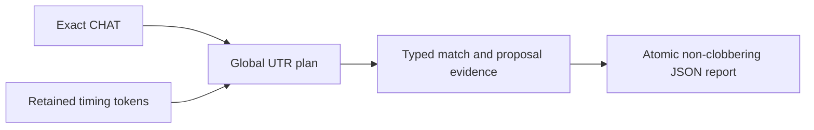
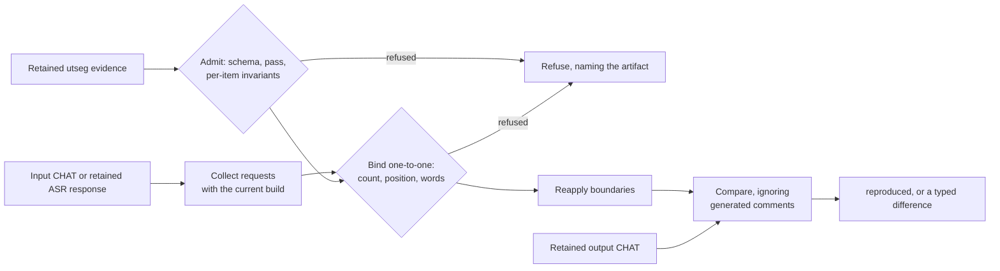
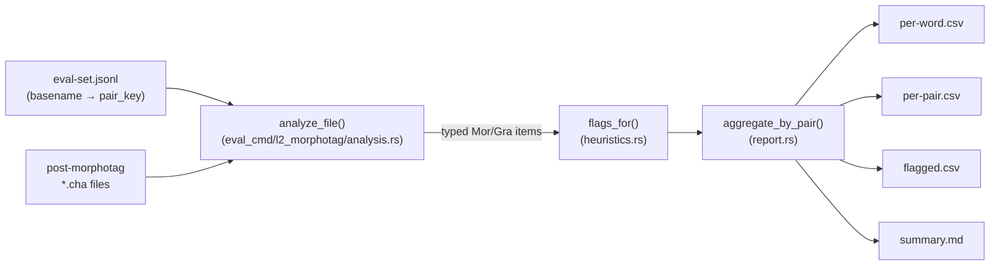

# eval

**Status:** Current
**Last updated:** 2026-09-15 21:24 EDT

`batchalign3 eval` contains offline evaluators. They consume retained artifacts
and never submit ordinary processing jobs.

## UTR alignment replay

`batchalign3 eval utr-alignment` replays global utterance-timing-recovery word
matching from an exact CHAT document and retained UTR timing tokens. It does
not invoke a model or provider and does not modify CHAT.

```bash
batchalign3 eval utr-alignment \
  --chat recording_utr_input.cha \
  --tokens recording_utr_tokens.json \
  --fuzzy-threshold 0.85 \
  --participation all-utterances \
  --output recording_utr_alignment.json
```

| Flag | Meaning |
|------|---------|
| `--chat <CHAT>` | Clean exact CHAT input used for global word alignment. |
| `--tokens <JSON>` | Retained `AsrTimingToken` JSON array, normally a debug `_utr_tokens.json` artifact. |
| `--output <JSON>` | Fresh report path. Existing paths are refused, and a complete report is atomically published. |
| `--fuzzy-threshold <0..1>` | Use fuzzy Jaro-Winkler matching at this finite threshold. Omit for case-insensitive exact matching. |
| `--participation <POLICY>` | `all-utterances` by default, or `exclude-marked-overlap` to reproduce the first pass of two-pass UTR. |

The report fingerprints both inputs, records the executable build identity,
and retains exhaustive per-utterance match or refusal states. A matched state
owns a nonempty word-to-token collection and a positive or nonpositive timing
proposal. This is research evidence, not permission to overwrite main-tier or
`%wor` timing, and it never generates `%xalign`.

Schema 2 matches words inside provider segments and records both the original
token index and its within-token word index. Each word retains its provider
segment's interval; these are coarse timing proposals, not newly measured word
timestamps. Input token JSON is unchanged, so retained older runs can be
replayed into a fresh report without inference.



## Utterance segmentation replay

`batchalign3 eval utseg-replay` reapplies the utterance-boundary evidence a run
retained and reports whether it still produces the document that run wrote. No
model loads, no worker starts, and no artifact is modified.

This answers one question: is the segmentation in a retained transcript still
what this build produces from the same evidence? A difference means the local
segmentation path changed between the two builds, which is a finding, not a
failure of the command.

### What a run has to have retained

Everything this command consumes is written only when the run passed
`--debug-dir` (see [transcribe](transcribe.md)). A run without it retained
nothing, and nothing here can be replayed. The standalone `utseg` command
writes no sidecars at all, so the post-CHAT pass replays a transcribe run.

| Artifact | Written as | Is |
|----------|-----------|-----|
| ASR response | `<stem>_asr_response.json` | The retained provider response. |
| Post-ASR CHAT | `<stem>_post_asr.cha` | The document as built, before either segmentation pass touched it. |
| Pre-utseg CHAT | `<stem>_pre_utseg.cha` | The input to the post-CHAT pass. |
| Post-utseg CHAT | `<stem>_post_utseg.cha` | The output of the post-CHAT pass. |
| Pre-CHAT evidence | `<stem>-<12 hex>_pre_chat_utseg_evidence.json` | Boundaries over timed ASR chunks. |
| Post-CHAT evidence | `<stem>-<12 hex>_post_chat_utseg_evidence.json` | Boundaries over main-tier words. |

The sidecars carry a 12-hex digest of the complete submitted identity whenever
that identity included a directory, which a transcribe run's always does, so
two corpus branches holding the same basename cannot overwrite one another in a
shared debug directory. The `.cha` dumps use the plain stem.

Pick the pair that belongs to the pass. The run's FINAL `.cha` is not the
output of either pass: it has been through the post-CHAT pass and carries the
morphology tiers, so replaying against it reports a difference that says
nothing about segmentation.

### The two passes

Transcribe segments twice, over different populations, and each pass retains
its own sidecar. Each pass is its own subcommand consuming its own artifacts,
so neither can be run against the other's evidence:

```bash
# The pass over main-tier words. Its input is the pre-utseg dump and its
# output is the post-utseg dump, not the run's final transcript.
batchalign3 eval utseg-replay post-chat \
  --input-chat recording_pre_utseg.cha \
  --evidence recording-1a2b3c4d5e6f_post_chat_utseg_evidence.json \
  --output-chat recording_post_utseg.cha

# The pass over timed ASR chunks, before the document existed. Its output is
# the post-ASR dump, which is the document as built.
batchalign3 eval utseg-replay pre-asr \
  --asr-response recording_asr_response.json \
  --evidence recording-1a2b3c4d5e6f_pre_chat_utseg_evidence.json \
  --output-chat recording_post_asr.cha \
  --media-name recording.wav
```

| Flag | Pass | Meaning |
|------|------|---------|
| `--input-chat <CHAT>` | post-chat | The document the run segmented, normally the `_pre_utseg.cha` dump. |
| `--asr-response <JSON>` | pre-asr | The run's retained `*_asr_response.json`. |
| `--evidence <JSON>` | both | The run's retained utseg evidence sidecar for that pass. |
| `--output-chat <CHAT>` | both | The document that pass wrote, to reproduce. |
| `--media-name <NAME>` | pre-asr | The media name the run recorded in `@Media`. Optional, like transcribe's own; omit it for a run that recorded none. |
| `--wor` | pre-asr | Reproduce a run that generated `%wor` tiers from ASR word timings. |

### What it admits, and what it refuses

The evidence goes through the same admission a live worker result goes through,
so an artifact is reapplied only when it still describes applicable work:

- The sidecar must be this build's evidence schema, which is **4**, and must
  record the pass the subcommand reproduces. Any other version is refused by
  name, older or newer alike, and nothing is migrated. **Every utseg sidecar
  retained before this build is schema 3, and therefore cannot be replayed at
  all.** Schema 4 exists because the boundary model's revision became a
  required part of its identity: where a schema-3 sidecar recorded a revision,
  it recorded whatever a floating load happened to resolve to that day, and
  reading that back as "the revision the plan pinned and the worker verified"
  would reinterpret an accident as a pin. Regenerate the evidence with the
  current build, which is cheap: these sidecars are `--debug-dir` research
  artifacts, not a result cache.
- Every item's assignments must be parallel to the words retained with it, and
  boundary-model evidence must be parallel to those words and consistent with
  the assignments and the adjacency policy it declares.
- The requests this build collects from the input must match the retained items
  one for one: the same count, the same transcript positions, the same words
  and text. A count or wording mismatch means the evidence belongs to a
  different input, and the replay says so rather than segmenting anyway.
- A locally rederived decision must explain itself: the receipt retained with
  it has to name the policy its evidence declares, reproduce the worker's own
  assignments under the worker's policy, and reproduce both the applicable
  assignments and the exact suppressions it claims.
- The input document is gated exactly as `utseg` gates its own input: parsed
  leniently, then judged by the same validity gate with its parse errors in
  hand. The replay therefore refuses what the run itself would have refused,
  with the message the run would have given.

Each refusal names the artifact and what was wrong with it. Nothing is
compared when an input is refused.

### What the pre-ASR pass cannot reproduce

A `--lang auto` run detects languages twice: once per file, which can put
several codes in `@Languages`, and once per utterance, which writes a
`[- code]` code-switch precode wherever an utterance differs from the primary
language. This pass does neither: it builds with the one resolved language the
evidence names and tags no utterance.

So it refuses, rather than comparing, when the retained output declares any
language set other than that one language, or carries a code-switch precode.
Comparing would report a difference and appear to blame the boundaries for
something segmentation never touched. Reproducing an `--lang auto` run is out
of scope for this command.

### What the comparison ignores

A run also writes comments recording that a run happened: its `[fc-ba3 ...]`
stamp and, for transcribe, the unchecked-ASR warning. A stamp carries a
timestamp and the warning carries a build identity, so neither can ever match
by equality. Both are recognized through the same provenance codec that writes
them, left out of the comparison on both sides, and listed in the report. Every
other line is compared for CHAT semantics, so formatting that does not change
meaning is not a difference.

Both passes compare on one basis: the AST of the CHAT text. The recomputed
document is serialized and parsed back before the comparison, because text is
what a run writes and what every later stage and every reader sees. That also
keeps a serialization-only defect visible in both passes rather than in
whichever one happened to reparse.

### Outcomes

The typed report goes to stdout whatever the result.

| Outcome | Exit code | Meaning |
|---------|-----------|---------|
| `reproduced` | 0 | Every compared line matches. |
| `differing` | 1 | The replay ran and the documents disagree. The report names the comparable line counts and where they first differ. |
| refusal | 2 | An input could not be admitted, so nothing was compared. |

A difference is printed on stderr in the CLI's usual failure form, prefixed
`error:`, because that is how the executable renders any nonzero exit. The exit
code is what tells the two apart: 1 means the replay ran and the comparison
answered "no", while a command used wrongly or a broken machine stays in the 2
to 6 range described in [the CLI reference](../cli-reference.md).



The pre-ASR pass reads speakers from the retained ASR response, which is where
they come from when no separate diarization artifact was projected onto the
chunks. A run whose speakers came from such an artifact is the subject of
`eval transcribe-replay`, which admits the turns artifact as well.

## L2 morphotag evaluation

`batchalign3 eval l2-morphotag` evaluates the output of `batchalign3
morphotag` (L2 dispatch is on by default) against a curated evaluation
corpus. It produces aggregate per-pair statistics.

### What it does

For every `@s` word in every post-morphotag CHAT file, the command:

1. Walks the CHAT AST with `talkbank-model::walk_words(TierDomain::Mor)`
   so the pairing with `%mor` / `%gra` items is domain-correct (retraces,
   fragments, untranscribed placeholders do not consume positions).
2. Classifies the splice outcome as `Spliced`, `L2Xxx` (dispatch failed
   to `L2|xxx`), or `MissingMor` (no MOR item at the expected position,
   should be near-zero with the AST walker).
3. Applies rule-based suspicious-output detectors (heuristic flags):
   `PropnForFunctionWord` and `FeaturePosMismatch`. Flags are
   candidates for manual review, not confirmed errors.
4. Writes four artifacts to `--output`:
   - `per-word.csv`: one row per `@s` word
   - `per-pair.csv`: one row per language pair, with dispatch rate,
     splice rate, heuristic-clean rate
   - `flagged.csv`: subset of `per-word.csv` where at least one flag fired
   - `summary.md`: human-readable report against the pre-registered gates



### Usage

```bash
# Step 1: run morphotag (L2 dispatch is on by default), collecting
#         outputs in one directory.
batchalign3 morphotag \
    --sequential \
    corpus/ /tmp/l2-eval-out/

# Step 2: run the evaluator against the curated eval set.
batchalign3 eval l2-morphotag \
    --eval-set <eval-set>.jsonl \
    --morphotag-output /tmp/l2-eval-out/ \
    --output /tmp/l2-eval-report/
```

### CLI options

| Flag | Meaning |
|------|---------|
| `--eval-set <JSONL>` | File listing input CHAT files with their `pair_key` labels. One JSONL object per line with at least `path` and `pair_key`. The selection script that originally produced these files lives outside this repo (private workspace under `docs/l2-eval-batchalign3/data/`); for new evaluations, hand-write or generate the JSONL with whatever process labels each input. |
| `--morphotag-output <DIR>` | Directory (flat or nested) of post-morphotag CHAT files. Matched against the eval set by filename **basename**, so the input-side path in the JSONL does not have to match. |
| `--output <DIR>` | Destination for `per-word.csv`, `per-pair.csv`, `flagged.csv`, `summary.md`. Created if missing. |

### Why this replaces the legacy Python analyzer

An earlier Python analyzer used regexes over serialized CHAT to pair
`@s` words with `%mor` items by token position. That approach
mis-counted positions under CHAT retrace markers (`[/]`, `[//]`,
`<foo bar> [//]`), producing ~2% `missing_mor` noise that had to be
disclaimed in every summary. It has been removed; the Rust analyzer
in `crates/batchalign/src/cli/eval_cmd/l2_morphotag/` replaces it,
driving off the typed AST via `walk_words(TierDomain::Mor)` with a
`counts_for_tier` gate so position counts lock-step with
`mor_tier.items` by construction, eliminating the analyzer artifact.

On a 2026-04-15 eval corpus (54 files, 19 language pairs), the
side-by-side numbers (Python analyzer vs the Rust replacement,
captured before the Python analyzer was removed) were:

| Metric | Python analyzer | Rust analyzer |
|--------|-----------------|---------------|
| `@s` words counted | 17,352 | 16,845 |
| Aggregate splice rate | 98.4% | 99.9% |
| Aggregate heuristic-clean rate | 95.0% | 98.0% |
| Pairs with zero `missing_mor` | 6 / 19 | 18 / 19 |

The 502-word delta is retraced `@s` words the regex counted but that
have no paired `%mor` item by CHAT spec. The Rust number is the true
measure; the Python number was inflated by analyzer noise.

## See also

- [L2 morphotag design](../../reference/l2-morphotag.md)
- [Content walker (`walk_words`)](../../architecture/type-driven-design.md)
